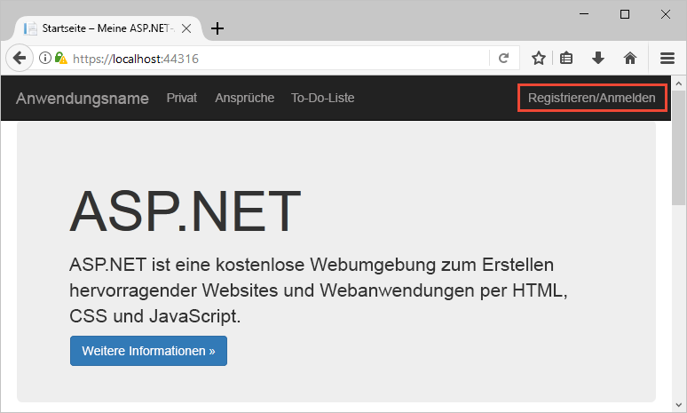
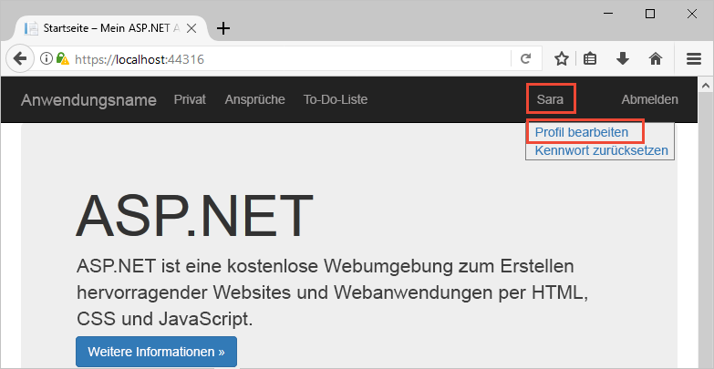
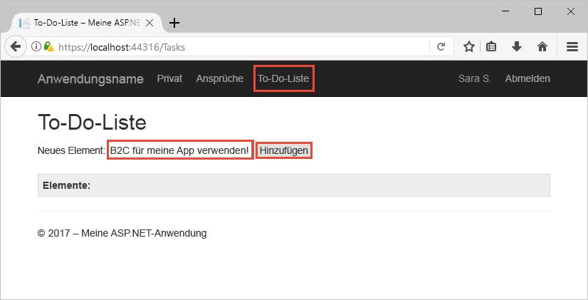

# <a name="quickstart-set-up-sign-in-for-an-aspnet-application-using-azure-active-directory-b2c"></a>Schnellstart: Einrichten der Anmeldung für eine ASP.NET-Anwendung unter Verwendung von Azure Active Directory B2C

Azure Active Directory B2C (Azure AD B2C) ermöglicht die Cloudidentitätsverwaltung zum Schützen Ihrer Anwendung, Ihres Unternehmens und Ihrer Kunden. Mit Azure AD B2C können sich Ihre Anwendungen über offene Standardprotokolle bei Konten für soziale Netzwerke und bei Unternehmenskonten authentifizieren. In dieser Schnellstartanleitung verwenden Sie eine ASP.NET-Anwendung und ein soziales Netzwerk als Identitätsanbieter, um sich anzumelden und eine durch Azure AD B2C geschützte Web-API aufzurufen.

[!INCLUDE [quickstarts-free-trial-note](../../includes/quickstarts-free-trial-note.md)]

## <a name="prerequisites"></a>Voraussetzungen

- [Visual Studio 2019](https://www.visualstudio.com/downloads/) mit der Workload **ASP.NET- und Webentwicklung**
- Ein Social Media-Konto von Facebook, Google oder Microsoft
- [Laden Sie eine ZIP-Datei herunter](https://github.com/Azure-Samples/active-directory-b2c-dotnet-webapp-and-webapi/archive/master.zip), oder klonen Sie die Beispielwebanwendung von GitHub.

    ```
    git clone https://github.com/Azure-Samples/active-directory-b2c-dotnet-webapp-and-webapi.git
    ```

    Die Beispielprojektmappe enthält zwei Projekte:

    - **TaskWebApp**: Eine Webanwendung zum Erstellen und Bearbeiten einer Aufgabenliste. Die Webanwendung verwendet den **Registrierungs- oder Anmeldebenutzerflow** für die Registrierung oder Anmeldung von Benutzern.
    - **TaskService**: Eine Web-API, die die Funktionen zum Erstellen, Lesen, Aktualisieren und Löschen der Aufgabenliste unterstützt. Die Web-API wird durch Azure AD B2C geschützt und von der Webanwendung aufgerufen.

## <a name="run-the-application-in-visual-studio"></a>Ausführen der Anwendung in Visual Studio

1. Öffnen Sie in Visual Studio die Projektmappe **B2C-WebAPI-DotNet.sln** aus dem Projektordner der Beispielanwendung.
2. Führen Sie für diese Schnellstartanleitung die Projekte **TaskWebApp** und **TaskService** gleichzeitig aus. Klicken Sie im Projektmappen-Explorer mit der rechten Maustaste auf die Projektmappe **B2C-WebAPI-DotNet**, und wählen Sie **Startprojekte festlegen** aus.
3. Wählen Sie **Mehrere Startprojekte** aus, und ändern Sie die **Aktion** für beide Projekte in **Starten**.
4. Klicken Sie auf **OK**.
5. Drücken Sie **F5**, um beide Anwendungen zu debuggen. Jede Anwendung wird in einer eigenen Browserregisterkarte geöffnet:

    - `https://localhost:44316/`: Die ASP.NET-Webanwendung. Im Rahmen des Schnellstarts interagieren Sie direkt mit dieser Anwendung.
    - `https://localhost:44332/`: Die Web-API, die von der ASP.NET-Webanwendung aufgerufen wird.

## <a name="sign-in-using-your-account"></a>Anmelden mit Ihrem Konto

1. Klicken Sie in der ASP.NET-Webanwendung auf **Registrieren/Anmelden**, um den Workflow zu starten.

    

    In der Beispielanwendung werden mehrere Registrierungsoptionen unterstützt, z.B. die Nutzung eines sozialen Netzwerks als Identitätsanbieter oder die Erstellung eines lokalen Kontos per E-Mail-Adresse. Verwenden Sie für diese Schnellstartanleitung ein Konto bei einem sozialen Netzwerk als Identitätsanbieter (etwa Facebook, Google oder Microsoft).

2. Azure AD B2C zeigt für die Beispielwebanwendung eine Anmeldeseite für ein fiktives Unternehmen namens „Fabrikam“ an. Um sich mit einem Social Media-Konto als Identitätsanbieter zu registrieren, klicken Sie auf die Schaltfläche des Identitätsanbieters, den Sie verwenden möchten.

    

    Sie authentifizieren sich mit den Anmeldeinformationen Ihres Social Media-Kontos und autorisieren die Anwendung dazu, Informationen aus Ihrem Social Media-Konto zu lesen. Wenn Sie der Anwendung Zugriff auf diese gewähren, kann die Anwendung Profilinformationen aus dem Social Media-Konto abrufen, z.B. Ihren Namen und Ihre Stadt.

3. Schließen Sie den Anmeldevorgang für den Identitätsanbieter ab.

## <a name="edit-your-profile"></a>Bearbeiten des Profils

Azure Active Directory B2C bietet Funktionen, mit denen Benutzer ihre Profile aktualisieren können. Die Beispiel-Web-App nutzt einen Azure AD B2C-Bearbeitungsprofil-Benutzerflow für den Workflow.

1. Klicken Sie auf der Menüleiste der Anwendung auf Ihren Profilnamen, und wählen Sie **Profil bearbeiten** aus, um das von Ihnen erstellte Profil zu bearbeiten.

    

2. Ändern Sie den Wert für **Anzeigename** oder **Ort**, und klicken Sie dann auf **Weiter**, um Ihr Profil zu aktualisieren.

    Die Änderung wird rechts oben auf der Startseite der Webanwendung angezeigt.

## <a name="access-a-protected-api-resource"></a>Zugreifen auf eine geschützte API-Ressource

1. Klicken Sie auf **Aufgabenliste**, um Ihre Aufgabenlistenelemente einzugeben und zu ändern.

2. Geben Sie Text in das Textfeld **Neues Element** ein. Klicken Sie auf **Hinzufügen**, um die mit Azure AD B2C geschützte Web-API aufzurufen, die ein Aufgabenlistenelement hinzufügt.

    

    Die ASP.NET-Webanwendung schließt ein Azure AD-Zugriffstoken in die Anforderung an die geschützte Web-API-Ressource ein, um Vorgänge für die Aufgabenlistenelemente des Benutzers durchzuführen.

Sie haben Ihr Azure AD B2C-Benutzerkonto verwendet, um einen autorisierten Aufruf einer geschützten Azure AD B2C-Web-API durchzuführen.

## <a name="clean-up-resources"></a>Bereinigen von Ressourcen

Sie können Ihren Azure AD B2C-Mandanten für weitere Azure AD B2C-Schnellstarts oder -Tutorials verwenden. Wenn Sie ihn nicht mehr benötigt, können Sie [Ihren Azure AD B2C-Mandanten löschen](faq.md#how-do-i-delete-my-azure-ad-b2c-tenant).

## <a name="next-steps"></a>Nächste Schritte

In dieser Schnellstartanleitung haben Sie mithilfe einer ASP.NET-Beispielanwendung folgende Aktionen durchgeführt:

* Anmelden mit einer benutzerdefinierten Anmeldeseite
* Anmelden mit einem sozialen Netzwerk als Identitätsanbieter
* Erstellen eines Azure AD B2C-Kontos
* Aufrufen einer durch Azure AD B2C geschützten Web-API

Machen Sie sich als Nächstes mit der Erstellung Ihres eigenen Azure AD B2C-Mandanten vertraut.

> [!div class="nextstepaction"]
> [Erstellen eines Azure Active Directory B2C-Mandanten im Azure-Portal](tutorial-create-tenant.md)
