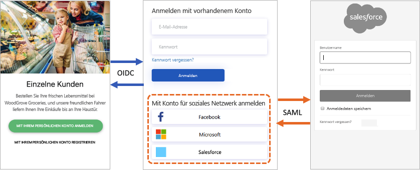
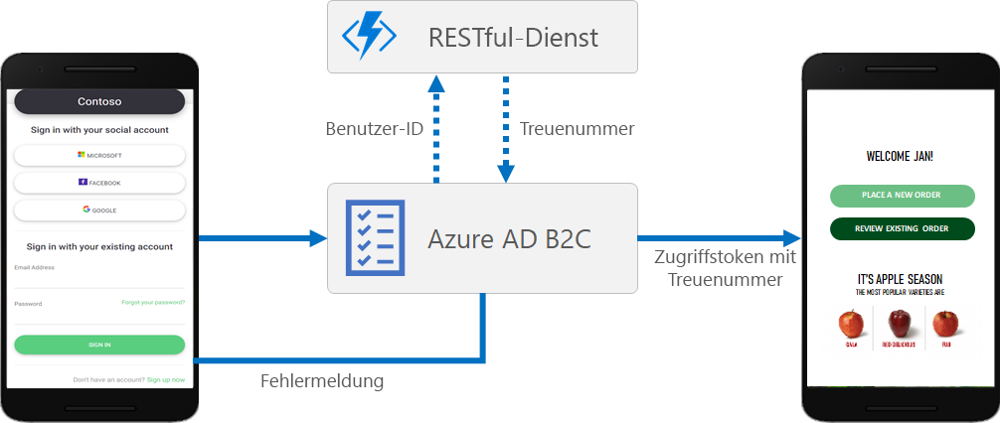
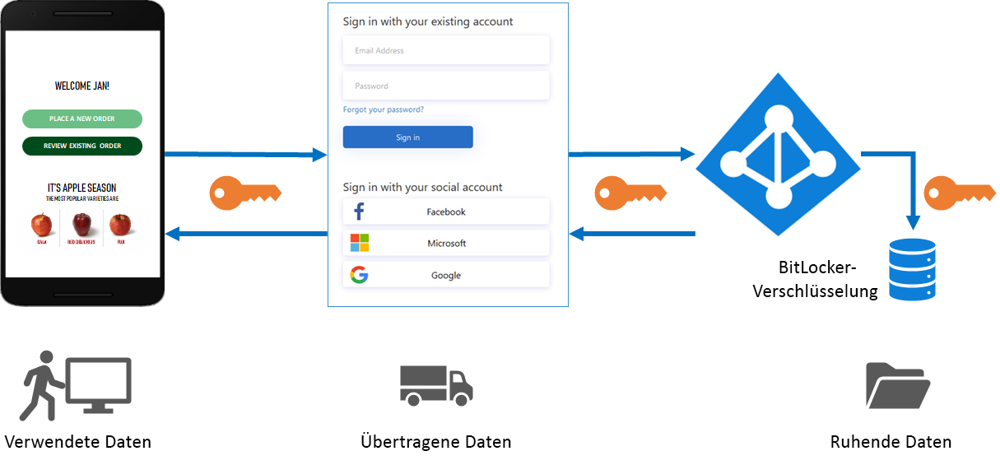
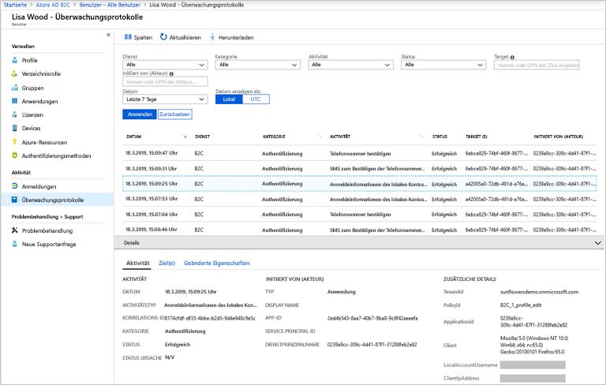

# Technische und Funktionsübersicht für Azure Active Directory B2C

Als Ergänzung zu [Was ist Azure Active Directory B2C?](overview.md) bietet Ihnen dieser Artikel eine ausführlichere Einführung in den Dienst. Erläutert werden die wichtigsten Ressourcen, mit denen Sie bei diesem Dienst arbeiten, die zugehörigen Funktionen und die Möglichkeiten, die diese bieten, um eine vollständige benutzerdefinierte Identitätsverwaltung für Kunden in Ihren Anwendungen zu ermöglichen.

## Azure AD B2C-Mandant

Ein *Mandant* in Azure Active Directory B2C (Azure AD B2C) stellt Ihre Organisation dar und ist ein Verzeichnis von Benutzern. Jeder Azure AD B2C-Mandant unterscheidet sich von anderen Azure AD B2C-Mandanten und ist von diesen getrennt. Der Azure AD B2C-Mandant unterscheidet sich von einem Azure Active Directory-Mandanten, wie Sie ihn möglicherweise bereits verwenden.

Die wichtigsten Ressourcen, mit denen Sie in einem Azure AD B2C Mandanten arbeiten, sind die folgenden:

* **Verzeichnis**: Im *Verzeichnis* werden die Anmeldeinformationen und Profildaten Ihrer Benutzer sowie die Anwendungsregistrierungen von Azure AD B2C gespeichert.
* **Anwendungsregistrierungen**: Sie registrieren Ihre Web-, Mobil- und nativen Anwendungen bei Azure AD B2C, um die Identitätsverwaltung zu ermöglichen. Außerdem registrieren Sie alle APIs, die Sie mit Azure AD B2C schützen möchten.
* **Benutzerflows** und **benutzerdefinierte Richtlinien**: Die integrierten (Benutzerflows) und vollständig anpassbaren (benutzerdefinierte Richtlinien) Identitätsfunktionen für Ihre Anwendungen.
  * Mit *Benutzerflows* konfigurieren und aktivieren Sie schnell häufige Identitätsaufgaben wie Registrierung, Anmeldung und Bearbeitung des Profils.
  * Verwenden Sie *benutzerdefinierte Richtlinien*, um die Benutzerfunktionen für häufige Identitätsaufgaben und darüber hinaus die Unterstützung für komplexe Identitätsworkflows zu ermöglichen, die individuell auf Ihre Organisation, Kunden, Mitarbeiter, Partner und Bürger zugeschnitten sind.
* **Identitätsanbieter**: Verbundeinstellungen für:
  * Identitätsanbieter für *soziale Netzwerke* wie Facebook, LinkedIn oder Twitter, die in Ihren Anwendungen unterstützt werden sollen.
  * *Externe* Identitätsanbieter, die Standardidentitätsprotokolle wie OAuth 2.0, OpenID Connect und viele mehr unterstützen.
  * *Lokale* Konten, die es Benutzern ermöglichen, sich mit einem Benutzernamen (oder einer E-Mail-Adresse oder sonstigen ID) und einem Kennwort zu registrieren und anzumelden.
* **Schlüssel**: Hinzufügen und Verwalten von Verschlüsselungsschlüsseln zum Signieren und Überprüfen von Token, geheimen Clientschlüsseln, Zertifikaten und Kennwörtern.

Ein Azure AD B2C-Mandant ist die erste Ressource, die Sie erstellen müssen, um Azure AD B2C zu verwenden. Weitere Informationen finden Sie im [Tutorial: Erstellen eines Azure Active Directory B2C-Mandanten](tutorial-create-tenant.md) ausführen.

## Konten in Azure AD B2C

Azure AD B2C definiert mehrere Typen von Benutzerkonten. In Azure Active Directory, Azure Active Directory B2B und Azure Active Directory B2C können dieselben Arten von Benutzerkonten verwendet werden.

* **Geschäftskonto**: Benutzer mit Geschäftskonten können Ressourcen in einem Mandanten verwalten und zudem Mandanten verwalten, wenn sie über eine Administratorrolle verfügen. Benutzer mit Geschäftskonten können neue Consumerkonten erstellen, Kennwörter zurücksetzen, Konten sperren/entsperren und Berechtigungen festlegen oder ein Konto einer Sicherheitsgruppe zuweisen.
* **Gastkonto**: Externe Benutzer, die Sie als Gäste zu Ihrem Mandanten einladen. Ein typisches Szenario für das Einladen von Gastbenutzern in Ihren Azure AD B2C-Mandanten ist das Teilen von Systemadministratoraufgaben.
* **Consumerkonto**: Consumerkonten sind die Konten, die in Ihrem Azure AD B2C-Verzeichnis erstellt werden, wenn Benutzer die Registrierungs-User Journey in einer Anwendung ausführen, die Sie in Ihrem Mandanten registriert haben.

 *Abbildung: Benutzerverzeichnis in einem Azure AD B2C-Mandanten im Azure-Portal*

### Consumerkonten

Mit einem *Consumerkonto* können sich Benutzer bei den mit Azure AD B2C gesicherten Anwendungen anmelden. Benutzer mit Consumerkonten können jedoch nicht auf Azure-Ressourcen zugreifen, z. B. auf das Azure-Portal.

Einem Consumerkonto kann den folgenden Identitätstypen zugeordnet werden:

* **Lokale** Identität, wobei der Benutzername und das Kennwort lokal im Azure AD B2C-Verzeichnis gespeichert werden. Diese Identitäten werden häufig als „lokale Konten“ bezeichnet.
* Identitäten für **soziale Netzwerke** oder **Unternehmen**, bei denen die Identität des Benutzers von einem Verbundidentitätsanbieter wie Facebook, Microsoft, ADFS oder Salesforce verwaltet wird.

Ein Benutzer mit einem Consumerkonto kann sich mit mehreren Identitäten anmelden, z. B. Benutzername, E-Mail-Adresse, Mitarbeiter-ID oder Ausweis. Ein einzelnes Konto kann über mehrere Identitäten verfügen. Dabei kann es sich um lokale Identitäten und Identitäten für soziale Netzwerke handeln.

 *Abbildung: Ein einzelnes Consumerkonto mit mehreren Identitäten in Azure AD B2C*

Mit Azure AD B2C können Sie allgemeine Attribute von Consumerkontoprofilen wie Anzeigename, Nachname, Vorname und Stadt verwalten. Sie können auch das Azure AD-Schema erweitern, um zusätzliche Informationen zu Ihren Benutzern zu speichern. Beispiele: Land/Region oder Wohnsitz, bevorzugte Sprache und Voreinstellungen, z. B. ob Sie einen Newsletter abonnieren oder die mehrstufige Authentifizierung aktivieren möchten.

Weitere Informationen zu den Benutzerkontotypen in Azure AD B2C finden Sie unter [Übersicht über Benutzerkonten in Azure Active Directory B2C](user-overview.md).

## Externe Identitätsanbieter

Sie können Azure AD B2C so konfigurieren, dass Benutzer sich bei Ihrer Anwendung mit Anmeldeinformationen von externen Identitätsanbietern (Identity Provider, IdP) für soziale Netzwerke oder Unternehmen anmelden können. Azure AD B2C unterstützt externe Identitätsanbieter wie Facebook, Microsoft-Konto, Google, Twitter und alle Identitätsanbieter, die OAuth 1.0, OAuth 2.0, OpenID Connect und SAML-Protokolle unterstützen.

Mit dem Verbund für externe Identitätsanbieter können Sie Ihren Kunden die Möglichkeit bieten, sich mit ihren vorhandenen Konten für soziale Netzwerke oder Unternehmen anzumelden, ohne dass sie ein neues Konto nur für Ihre Anwendung erstellen müssen.

Azure AD B2C bietet auf der Registrierungs- oder Anmeldeseite eine Liste externer Identitätsanbieter an, die der Benutzer für die Anmeldung auswählen kann. Nachdem sie einen der externen Identitätsanbieter ausgewählt haben, werden sie auf die Website des ausgewählten Anbieters weitergeleitet, um den Anmeldevorgang abzuschließen. Nachdem sich der Benutzer erfolgreich angemeldet hat, kehrt er zurück zu Azure AD B2C, um das Konto in Ihrer Anwendung zu authentifizieren.

Weitere Informationen zum Hinzufügen von Identitätsanbietern in Azure AD B2C finden Sie unter [Hinzufügen von Identitätsanbietern zu Ihren Anwendungen in Azure Active Directory B2C](add-identity-provider.md).

## Identitätsverwaltung: Benutzerflows oder benutzerdefinierte Richtlinien

Das erweiterbare Richtlinienframework ist der größte Vorteil von Azure AD B2C. Richtlinien beschreiben Benutzerfunktionen im Zusammenhang mit der Identität, z. B. Registrierung, Anmeldung oder Profilbearbeitung.

In Azure AD B2C gibt es zwei primäre Pfade, mit denen Sie diese Identitätsfunktionen bereitstellen können: Benutzerflows und benutzerdefinierte Richtlinien.

* **Benutzerflows** sind vordefinierte, integrierte und konfigurierbare Richtlinien, die zur Verfügung gestellt werden, damit Sie in wenigen Minuten Umgebungen zur Registrierung, Anmeldung und Profilbearbeitung erstellen können.

* **Benutzerdefinierte Richtlinien** ermöglichen es Ihnen, eigene User Journeys für komplexe Identitätsszenarios zu erstellen.

Sowohl Benutzerflows als auch benutzerdefinierte Richtlinien basieren auf dem *Identity Experience Framework*, der Orchestrierungs-Engine für Richtlinien in Azure AD B2C.

### Benutzerflow

Um Ihnen die schnelle Einrichtung der gängigsten Identitätsaufgaben zu erleichtern, enthält das Azure-Portal verschiedene vordefinierte und konfigurierbare Richtlinien, die als *Benutzerflows* bezeichnet werden.

Sie können Benutzerfloweinstellungen wie die folgenden konfigurieren, um das Verhalten von Identitäten in Ihren Anwendungen zu steuern:

* Kontotypen für die Anmeldung, z. B. Konten für soziale Netzwerke wie Facebook oder lokale Konten, die eine E-Mail-Adresse und ein Kennwort für die Anmeldung verwenden
* Attribute, die vom Consumer abgefragt werden, z. B. Vorname, Postleitzahl oder Land/Region des Wohnsitzes
* Azure AD Multi-Factor Authentication (MFA)
* Anpassung der Benutzeroberfläche
* Eine Reihe von Ansprüchen in einem Token, die Ihre Anwendung empfängt, nachdem der Benutzer den Benutzerflow abgeschlossen hat
* Sitzungsverwaltung
* ... und vieles mehr.

Die häufigsten Identitätsszenarien für die meisten Mobil-, Webanwendungen und Single-Page-Anwendungen können mit Benutzerflows effizient definiert und implementiert werden. Es wird empfohlen, die integrierten Benutzerflows zu verwenden, es sei denn, Sie benötigen für komplexe User Journey-Szenarien die hohe Flexibilität von benutzerdefinierten Richtlinien.

Weitere Informationen über Benutzerflows finden Sie unter [Benutzerflows in Azure Active Directory B2C](user-flow-overview.md).

### Benutzerdefinierte Richtlinie

Über benutzerdefinierte Richtlinien schöpfen Sie alle Möglichkeiten der IEF-Orchestrierungs-Engine (Identity Experience Framework) aus. Mit benutzerdefinierten Richtlinien können Sie IEF verwenden, um nahezu jede erdenkliche Funktion zur Authentifizierung, Benutzerregistrierung oder Profilbearbeitung zu erstellen.

Das Identity Experience Framework erlaubt es Ihnen, User Journeys zu entwickeln, die beliebige Schritte umfassen. Beispiel:

* Verbund mit anderen Identitätsanbietern
* Abfragen für Erst- und Drittanbieterlösungen für die mehrstufige Authentifizierung (Multi-Factor Authentication, MFA)
* Beliebige Benutzereingaben erfassen
* Integration in externe Systeme mithilfe der REST-API-Kommunikation

Jede dieser User Journeys wird durch eine Richtlinie definiert, und Sie können so viele oder wenige Richtlinien erstellen, wie Sie benötigen, um die optimale Benutzererfahrung für Ihre Organisation zu ermöglichen.

Benutzerdefinierte Richtlinien werden durch mehrere Dateien im XML-Format definiert, die in einer hierarchischen Kette aufeinander verweisen. Die XML-Elemente definieren das Anspruchsschema, Anspruchstransformationen, Inhaltsdefinitionen, Anspruchsanbieter, technische Profile, Schritte zur Orchestrierung von User Journeys und weitere Aspekte der Identitätsverwaltung.

Die leistungsstarke Flexibilität von benutzerdefinierten Richtlinien ist am besten geeignet, wenn Sie komplexe Identitätsszenarien erstellen müssen. Entwickler, die benutzerdefinierte Richtlinien konfigurieren, müssen die vertrauenswürdigen Beziehungen im Detail definieren, um Metadatenendpunkte und genaue Anspruchsaustauschdefinitionen einzuschließen und bei Bedarf zudem Geheimnisse, Schlüssel und Zertifikate durch die einzelnen Identitätsanbieter zu konfigurieren.

Weitere Informationen über benutzerdefinierte Richtlinien finden Sie unter [Benutzerdefinierte Richtlinien in Azure Active Directory B2C](custom-policy-overview.md).

## Protokolle und Token

- Für Anwendungen unterstützt Azure AD B2C die Protokolle [OAuth 2.0](protocols-overview.md), [OpenID Connect](openid-connect.md) und [SAML](connect-with-saml-service-providers.md) für User Journeys. Ihre Anwendung startet die User Journey, indem sie Authentifizierungsanforderungen an Azure AD B2C stellt. Das Ergebnis einer an Azure AD B2C gerichteten Anforderung ist ein Sicherheitstoken (z. B. ein [ID-Token, Zugriffstoken](tokens-overview.md) oder SAML-Token). Dieses Sicherheitstoken definiert die Identität des Benutzers in der Anwendung.

- Bei externen Identitäten unterstützt Azure AD B2C den Verbund mit allen OAuth 1.0-, OAuth 2.0-, OpenID Connect- und SAML-Identitätsanbietern.

Das folgende Diagramm zeigt, wie Azure AD B2C mithilfe verschiedener Protokolle innerhalb desselben Authentifizierungsablaufs kommunizieren kann:

1. Die anspruchsbasierte Anwendung initiiert eine Autorisierungsanforderung an Azure AD B2C mithilfe von OpenID Connect.
1. Wenn sich ein Benutzer der Anwendung mit einem externen Identitätsanbieter anmeldet, der das SAML-Protokoll verwendet, ruft Azure AD B2C das SAML-Protokoll für die Kommunikation mit dem Identitätsanbieter auf.
1. Nachdem der Benutzer den Anmeldevorgang mit dem externen Identitätsanbieter abgeschlossen hat, gibt Azure AD B2C das Token mithilfe von OpenID Connect an die anspruchsbasierte Anwendung zurück.

## Anwendungsintegration

Wenn sich ein Benutzer bei Ihrer Anwendung anmelden möchte, bei der es sich gleichermaßen um eine Web-, Mobil-, Desktop- oder Single-Page-Anwendung (SPA) handeln kann, initiiert die Anwendung eine Autorisierungsanforderung an einen Benutzerflow-Endpunkt oder einen von der benutzerdefinierten Richtlinie bereitgestellten Endpunkt. Der Benutzerflow oder die benutzerdefinierte Richtlinie definiert und steuert die Funktionalität für die Benutzer. Wenn Sie einen Benutzerflow ausführen, z. B. den Flow für *Registrierung oder Anmeldung*, generiert Azure AD B2C ein Token und leitet den Benutzer dann wieder zurück zur Anwendung um.

Mehrere Anwendungen können den gleichen Benutzerflow oder die gleiche benutzerdefinierte Richtlinie verwenden. Jede Anwendung kann mehrere Benutzerflows oder benutzerdefinierte Richtlinien verwenden.

Beispielsweise kann die Anwendung den Benutzerflow *Registrieren oder anmelden* für die Anmeldung bei einer Anwendung verwenden. Wenn sich der Benutzer angemeldet hat und nun sein Profil bearbeiten möchte, initiiert die Anwendung eine weitere Autorisierungsanforderung, dieses Mal unter Verwendung des Benutzerflows *Profilbearbeitung*.

## Nahtlose Benutzererfahrung

In Azure AD B2C können Sie die Identitätsfunktionen für Benutzer so gestalten, dass sich die angezeigten Seiten nahtlos in das Design Ihrer Marke einfügen. Sie hab die fast vollständige Kontrolle über HTML- und CSS-Inhalte, die Ihren Benutzern beim Durchlaufen der Identitäts-User Journeys in Ihrer Anwendung angezeigt werden. Dank dieser Flexibilität können Sie die Konsistenz von Marken und visuellen Elementen zwischen Ihrer Anwendung und Azure AD B2C sicherstellen.

Weitere Informationen über die Anpassung der Benutzeroberfläche finden Sie unter [Informationen zur Anpassung der Benutzeroberfläche (UI) in Azure Active Directory B2C](customize-ui-with-html.md).

## Lokalisierung

Die Sprachanpassung in Azure AD B2C ermöglicht es Ihnen, verschiedene Sprachen zu unterstützen, um auf die Anforderungen Ihrer Kunden einzugehen. Microsoft stellt Übersetzungen für 36 Sprachen bereit. Sie können aber auch eigene Übersetzungen für beliebige Sprachen bereitstellen. Auch wenn Ihre Benutzeroberfläche nur für eine einzelne Sprache bestimmt ist, können Sie beliebigen Text auf den Seiten anpassen.

Weitere Informationen zur Funktionsweise der Lokalisierung finden Sie unter [Sprachanpassung in Azure Active Directory B2C](language-customization.md).

## Hinzufügen Ihrer eigenen Geschäftslogik

Wenn Sie benutzerdefinierte Richtlinien verwenden, können Sie eine RESTful-API in eine User Journey integrieren, um der Journey ihre eigene Geschäftslogik hinzuzufügen. Beispielsweise können mit Azure AD B2C Daten mit einem RESTful-Dienst ausgetauscht werden, um Folgendes zu erreichen:

* Anzeigen eigener benutzerfreundlicher Fehlermeldungen.
* Überprüfen von Benutzereingabedaten, um zu verhindern, dass falsch formatierte Daten im Benutzerverzeichnis gespeichert werden. Beispielsweise können Sie die Daten ändern, die vom Benutzer eingegeben wurden, z. B. die Groß-/Kleinschreibung des Vornamens, wenn er in Kleinbuchstaben eingegeben wurde.
* Erweitern der Benutzerdaten, indem Sie sie stärker in die Branchenanwendung des Unternehmens integrieren.
* Mit RESTful-Aufrufen können Sie Pushbenachrichtigungen senden, Unternehmensdatenbanken aktualisieren, einen Benutzermigrationsprozess ausführen, Berechtigungen verwalten, Datenbanken überwachen und andere Aktionen ausführen.

Treueprogramme sind ein weiteres Szenario, das durch die Azure AD B2C-Unterstützung für Aufrufe von Rest-APIs ermöglicht wird. Ihr RESTful-Dienst kann z. B. die E-Mail-Adresse des Benutzers empfangen, die Kundendatenbank abfragen und die Treuenummer des Benutzers an Azure AD B2C zurückgeben. Die Rückgabedaten können in Azure AD B2C im Verzeichniskonto des Benutzers gespeichert werden. Anschließend werden sie in den nachfolgenden Schritten der Richtlinie weiter ausgewertet oder in das Zugriffstoken eingebunden.

Sie können einen Rest-API-Aufruf in jedem Schritt der User Journey hinzufügen, die durch eine benutzerdefinierte Richtlinie definiert ist. Beispielsweise können Sie in folgenden Schritten eine Rest-API aufrufen:

* Während der Anmeldung, kurz bevor Azure AD B2C die Anmeldeinformationen überprüft
* Unmittelbar nach der Anmeldung
* Bevor Azure AD B2C ein neues Konto im Verzeichnis erstellt
* Nachdem Azure AD B2C ein neues Konto im Verzeichnis erstellt hat
* Bevor Azure AD B2C ein Zugriffstoken ausgibt

Informationen zum Verwenden benutzerdefinierter Richtlinien für die RESTful-API-Integration in Azure AD B2C finden Sie unter [Integrieren von REST-API-Anspruchsaustauschvorgängen in Ihre benutzerdefinierte Azure AD B2C-Richtlinie](custom-policy-rest-api-intro.md).

## Schützen von Kundenidentitäten

In Azure AD B2C werden die im [Microsoft Azure Trust Center](https://www.microsoft.com/trustcenter/cloudservices/azure) beschriebenen Sicherheits-, Datenschutz- und sonstigen Anforderungen erfüllt.

Sitzungen werden als verschlüsselte Daten modelliert, wobei der Entschlüsselungsschlüssel nur dem Azure AD B2C-Sicherheitstokendienst bekannt ist. Es wird ein starker Verschlüsselungsalgorithmus (AES-192) verwendet. Alle Kommunikationspfade werden für Vertraulichkeit und Integrität durch TLS geschützt. Unser Sicherheitstokendienst verwendet ein Zertifikat für die erweiterte Validierung (Extended Validation, EV) für TLS. Im Allgemeinen verringert der Sicherheitstokendienst die Möglichkeit von XSS-Angriffen (Cross-Site-Scripting), indem nicht vertrauenswürdigen Eingaben nicht gerendert werden.

### Zugriff auf Benutzerdaten

Azure AD B2C-Mandanten weisen viele Merkmale auf, die auch Unternehmens-Azure Active Directory-Mandanten besitzen, die für Mitarbeiter und Partner verwendet werden. Zu den gemeinsamen Aspekten gehören Mechanismen zum Anzeigen von Administratorrollen, Zuweisen von Rollen und Überwachen von Aktivitäten.

Sie können Rollen zuweisen, um zu steuern, wer bestimmte administrative Aktionen in Azure AD B2C ausführen kann, einschließlich:

* Erstellen und Verwalten aller Aspekte von Benutzerflows
* Erstellen und Verwalten des Attributschemas für alle Benutzerflows
* Konfigurieren von Identitätsanbietern für die Verwendung in einem direkten Verbund
* Erstellen und Verwalten von Vertrauensframework-Richtlinien im Identity Experience Framework (benutzerdefinierte Richtlinien)
* Verwalten von Geheimnissen für Verbund und Verschlüsselung im Identity Experience Framework (benutzerdefinierte Richtlinien)

Weitere Informationen zu Azure AD-Rollen, einschließlich Unterstützung für Azure AD B2C-Administratorrollen finden Sie unter [Berechtigungen der Administratorrolle in Azure Active Directory](../active-directory/roles/permissions-reference.md).

### Multi-Factor Authentication (MFA)

Azure AD B2C Multi-Factor Authentication (MFA) trägt zum Schutz des Zugriffs auf Daten und Anwendungen bei und ist dabei für Ihre Benutzer einfach zu verwenden. Indem eine zweite Form der Authentifizierung verlangt wird, bietet das Verfahren zusätzliche Sicherheit und eine zuverlässige Authentifizierung, indem verschiedene benutzerfreundliche Authentifizierungsmethoden zur Verfügung gestellt werden. Sie als Administrator können über die Konfiguration festlegen, ob Ihre Benutzer aufgefordert werden, die MFA zu verwenden.

Weitere Informationen zum Aktivieren der MFA in Benutzerflows finden Sie unter [Aktivieren der Multi-Factor Authentication in Azure Active Directory B2C](multi-factor-authentication.md).

### Intelligente Kontosperrung

Um Brute-Force-Versuche zum Erraten von Kennwörtern zu verhindern, verwendet Azure AD B2C eine ausgereifte Strategie zum Sperren von Konten auf der Grundlage der IP-Adresse der Anforderung, der eingegebenen Kennwörter und verschiedener anderer Faktoren. Die Dauer der Sperre wird basierend auf dem Risiko und der Anzahl der Versuche automatisch ausgedehnt.

Informationen zur Verwaltung von Kennwortschutzeinstellungen finden Sie unter [Verwalten von Bedrohungen für Ressourcen und Daten in Azure Active Directory B2C](threat-management.md).

### Kennwortkomplexität

Bei der Registrierung oder dem Zurücksetzen des Kennworts müssen Ihre Benutzer ein Kennwort angeben, das die Regeln für die Komplexität erfüllt. Standardmäßig erzwingt Azure AD B2C eine Richtlinie für sichere Kennwörter. Azure AD B2C bietet auch Konfigurationsoptionen zum Angeben der Komplexitätsanforderungen an Kennwörter, die von ihren Kunden verwendet werden.

Sie können die Anforderungen an die Kennwortkomplexität sowohl in [Benutzerflows](password-complexity.md) als auch in [benutzerdefinierten Richtlinien](password-complexity.md) konfigurieren.

## Überwachung und Protokollierung

Azure AD B2C gibt Überwachungsprotokolle aus, die Aktivitätsinformationen über Ressourcen, ausgestellte Token und Administratorzugriff enthalten. Sie können diese Überwachungsprotokolle verwenden, um Plattformaktivitäten zu verfolgen und Probleme zu diagnostizieren. Überwachungsprotokolleinträge sind kurz nach Eintreten der Aktivität verfügbar, die das Ereignis generiert hat.

In einem Überwachungsprotokoll, das für Ihren Azure AD B2C-Mandanten oder für einen bestimmten Benutzer verfügbar ist, finden Sie Informationen wie die folgenden:

* Aktivitäten, die die Autorisierung eines Benutzers für den Zugriff auf B2C-Ressourcen betreffen (z.B. ein Administrator, der auf eine Liste von B2C-Richtlinien zugreift).
* Aktivitäten im Zusammenhang mit Verzeichnisattributen, die abgerufen werden, wenn sich ein Administrator über das Azure-Portal anmeldet.
* Erstellungs-, Lese-, Aktualisierungs- und Löschvorgänge (Create, Read, Update, Delete, CRUD) für B2C-Anwendungen
* CRUD-Vorgänge für in einem B2C-Schlüsselcontainer gespeicherte Schlüssel
* CRUD-Vorgänge für B2C-Ressourcen (z.B. Richtlinien und Identitätsanbieter)
* Überprüfung der Anmeldeinformationen des Benutzers und Tokenausstellung

Weitere Informationen zu Überwachungsprotokollen finden Sie unter [Zugriff auf Active Directory B2C-Überwachungsprotokolle](view-audit-logs.md).

### Nutzungsinformationen

Über Azure AD B2C können Sie ermitteln, wann Benutzer sich bei Ihrer Web-App registrieren oder anmelden, wo sie sich befinden und welche Browser und Betriebssysteme sie verwenden. Durch die Integration von Azure Application Insights in Azure AD B2C mithilfe von benutzerdefinierten Richtlinien erhalten Sie Informationen über Registrierung, Anmeldung, Zurücksetzen von Kennwörtern und Profilbearbeitung. Mit diesem Wissen können Sie datengesteuerte Entscheidungen über die zukünftigen Entwicklungszyklen treffen.

Weitere Informationen über die Nutzungsanalyse finden Sie unter [Nachverfolgen des Benutzerverhaltens in Azure Active Directory B2C mithilfe von Application Insights](analytics-with-application-insights.md).

## Nächste Schritte

Nachdem Sie sich nun ausführlicher mit den Features und technischen Aspekten von Azure Active Directory B2C befasst haben, legen Sie mit dem [Tutorial zum Erstellen eines Azure Active Directory B2C-Mandanten](tutorial-create-tenant.md) los.
