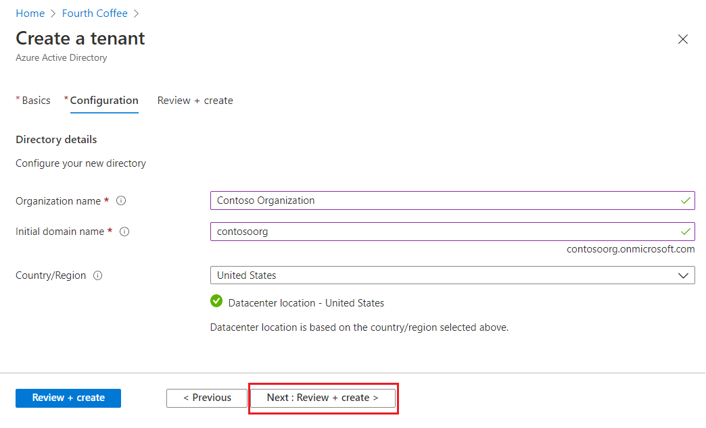

# Schnellstart: Erstellen eines neuen Mandanten in Azure Active Directory
Sie können alle Verwaltungsaufgaben über das Azure Active Directory-Portal (Azure AD-Portal) ausführen. Dazu gehört auch das Erstellen eines neuen Mandanten für Ihre Organisation. 

In diesem Schnellstart erfahren Sie, wie Sie das Azure-Portal und Azure Active Directory aufrufen, und wie Sie einen Basismandanten für Ihre Organisation erstellen.

Wenn Sie kein Azure-Abonnement besitzen, können Sie ein [kostenloses Konto](https://azure.microsoft.com/free/) erstellen, bevor Sie beginnen.

## Erstellen eines neuen Mandanten für Ihre Organisation
Nach der Anmeldung im Azure-Portal können Sie einen neuen Mandanten für Ihre Organisation erstellen. Ihr neuer Mandant stellt Ihre Organisation dar und unterstützt Sie dabei, eine bestimmte Microsoft Cloud Services-Instanz für Ihre internen und externen Benutzer zu verwalten.

### Erstellen eines neuen Mandanten

1. Melden Sie sich beim [Azure-Portal](https://portal.azure.com/) Ihrer Organisation an.

1. Wählen Sie im Menü des Azure-Portals die Option **Ressource erstellen** aus.  

    

1. Suchen Sie nach **Azure Active Directory**, und wählen Sie diese Option aus.

    Daraufhin wird die Seite **Verzeichnis erstellen** angezeigt.

    

1.  Geben Sie auf der Seite **Verzeichnis erstellen** die folgenden Informationen ein:
    
    - Geben Sie in das Feld **Organisationsname**_Contoso_ ein.

    - Geben Sie in das Feld **Name der Anfangsdomäne**_Contoso_ ein.

    - Übernehmen Sie im Feld **Land oder Region** die Option _USA_.

1. Klicken Sie auf **Erstellen**.

Ihr neuer Mandant wird mit der Domäne „contoso.onmicrosoft.com“ erstellt.

## Bereinigen von Ressourcen
Wenn Sie diese Anwendung nicht mehr verwenden möchten, können Sie den Mandanten folgendermaßen löschen:

- Vergewissern Sie sich anhand des Filters **Verzeichnis + Abonnement** im Azure-Portal, dass Sie bei dem Verzeichnis angemeldet sind, das Sie löschen möchten, und wechseln Sie ggf. zum Zielverzeichnis.
- Wählen Sie **Azure Active Directory**, die Seite **Contoso – Übersicht** und dann **Verzeichnis löschen** aus.

    Der Mandant und die dazugehörigen Informationen werden gelöscht.

    

## Nächste Schritte
- Wie Sie zusätzliche Domänennamen ändern oder hinzufügen, erfahren Sie unter [Hinzufügen eines benutzerdefinierten Domänennamens zu Azure Active Directory](add-custom-domain.md).

- Weitere Informationen zum Hinzufügen von Benutzern finden Sie unter [Hinzufügen oder Löschen eines neuen Benutzers](add-users-azure-active-directory.md).

- Der Artikel [Erstellen einer Basisgruppe und Hinzufügen von Mitgliedern](active-directory-groups-create-azure-portal.md) erläutert, wie Sie Gruppen und Mitglieder hinzufügen.

- Erfahren Sie mehr über [rollenbasierten Zugriff mit Privileged Identity Management](../../role-based-access-control/best-practices.md) und [bedingten Zugriff](../../role-based-access-control/conditional-access-azure-management.md), um den Zugriff auf die Anwendungen und Ressourcen Ihrer Organisation zu verwalten.

- Weitere Informationen zu Azure AD finden Sie unter [Was ist Azure Active Directory?](active-directory-whatis.md). Dieser Artikel enthält allgemeine Lizenzierungsinformationen sowie Details zu Terminologie und zugehörigen Features.
