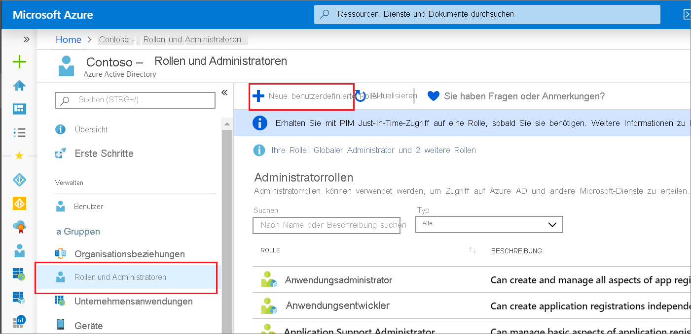
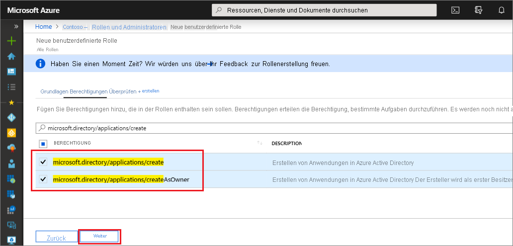

# <a name="quickstart-grant-permission-to-create-unlimited-app-registrations"></a>Schnellstart: Erteilen einer Berechtigung zum Erstellen unbegrenzter App-Registrierungen

In dieser Schnellstartanleitung wird eine benutzerdefinierte Rolle mit der Berechtigung zum Erstellen einer unbegrenzten Anzahl von App-Registrierungen erstellt und anschließend einem Benutzer zugewiesen. Der zugewiesene Benutzer kann dann das Azure AD-Portal, Azure AD PowerShell oder Microsoft Graph-API verwenden, um Anwendungsregistrierungen zu erstellen. Im Gegensatz zur integrierten Rolle „Anwendungsentwickler“ ermöglicht diese Rolle die Erstellung einer unbegrenzten Anzahl von Anwendungsregistrierungen. Die Rolle „Anwendungsentwickler“ ermöglicht zwar die Erstellung, die Gesamtanzahl erstellter Objekte ist jedoch auf 250 beschränkt, um zu verhindern, dass das [verzeichnisweite Objektkontingent](../enterprise-users/directory-service-limits-restrictions.md) erreicht wird. Die am wenigsten privilegierte Rolle zum Erstellen und Zuweisen benutzerdefinierter Azure AD-Rollen ist „Administrator für privilegierte Rollen“.

Wenn Sie kein Azure-Abonnement besitzen, können Sie ein [kostenloses Konto](https://azure.microsoft.com/free/) erstellen, bevor Sie beginnen.

## <a name="create-a-custom-role-using-the-azure-ad-portal"></a>Erstellen einer benutzerdefinierten Rolle über das Azure AD-Portal

1. Melden Sie sich beim [Azure AD Admin Center](https://aad.portal.azure.com) mit Berechtigungen vom Typ „Administrator für privilegierte Rollen“ oder „Globaler Administrator“ in der Azure AD-Organisation an.
1. Wählen Sie **Azure Active Directory** > **Rollen und Administratoren** > **Neue benutzerdefinierte Rolle** aus.

    

1. Geben Sie auf der Registerkarte **Grundlagen** den Rollennamen „Application Registration Creator“ (Anwendungsregistrierungsersteller) und die Rollenbeschreibung „Can create an unlimited number of application registrations“ (Kann eine unbegrenzte Anzahl von Anwendungsregistrierungen erstellen) ein, und wählen Sie anschließend **Weiter** aus.

    

1. Geben Sie auf der Registerkarte **Berechtigungen** die Zeichenfolge „microsoft.directory/applications/create“ in das Suchfeld ein. Aktivieren Sie die Kontrollkästchen neben den gewünschten Berechtigungen, und klicken Sie anschließend auf **Weiter**.

    

1. Überprüfen Sie die Berechtigungen auf der Registerkarte **Überprüfen + erstellen**, und wählen Sie **Erstellen** aus.

### <a name="assign-the-role-in-the-azure-ad-portal"></a>Zuweisen der Rolle im Azure AD-Portal

1. Melden Sie sich beim [Azure AD Admin Center](https://aad.portal.azure.com) mit Berechtigungen vom Typ „Administrator für privilegierte Rollen“ oder „Globaler Administrator“ in der Azure AD-Organisation an.
1. Wählen Sie **Azure Active Directory** > **Rollen und Administratoren** aus.
1. Wählen Sie die Rolle „Application Registration Creator“ (Anwendungsregistrierungsersteller) und anschließend **Zuweisung hinzufügen** aus.
1. Wählen Sie den gewünschten Benutzer aus, und klicken Sie auf **Auswählen**, um ihn der Rolle hinzuzufügen.

Das war's! In dieser Schnellstartanleitung haben Sie eine benutzerdefinierte Rolle mit der Berechtigung zum Erstellen einer unbegrenzten Anzahl von App-Registrierungen erstellt und sie anschließend einem Benutzer zugewiesen.

> [!TIP]
> Wenn Sie die Rolle einer Anwendung über das Azure AD-Portal zuweisen möchten, geben Sie den Namen der Anwendung in das Suchfeld der Zuweisungsseite ein. Anwendungen werden standardmäßig nicht in der Liste angezeigt, aber in den Suchergebnissen zurückgegeben.

### <a name="app-registration-permissions"></a>App-Registrierungsberechtigungen

Für die Erstellung von Anwendungsregistrierungen stehen zwei Berechtigungen zur Verfügung, die sich jeweils unterschiedlich verhalten.

- microsoft.directory/applications/createAsOwner: Wird diese Berechtigung zugewiesen, wird der Ersteller als erster Besitzer der erstellten App-Registrierung hinzugefügt, und die erstellte App-Registrierung zählt zum Objekterstellungskontingent des Erstellers (250 Objekte).
- microsoft.directory/applications/create: Wird diese Berechtigung zugewiesen, wird der Ersteller nicht als erster Besitzer der erstellten App-Registrierung hinzugefügt, und die erstellte App-Registrierung zählt nicht zum Kontingent von 250 erstellten Objekten des Erstellers. Verwenden Sie diese Berechtigung mit Bedacht, da der zugewiesene Benutzer in diesem Fall so viele App-Registrierungen erstellen kann, bis das Kontingent auf der Verzeichnisebene erreicht ist. Sind beide Berechtigungen zugewiesen, hat diese Berechtigung Vorrang.

## <a name="create-a-custom-role-in-azure-ad-powershell"></a>Erstellen einer benutzerdefinierten Rolle in Azure AD PowerShell

### <a name="prepare-powershell"></a>Vorbereiten von PowerShell

Installieren Sie zunächst das Azure AD PowerShell-Modul aus dem [PowerShell-Katalog](https://www.powershellgallery.com/packages/AzureADPreview/2.0.0.17). Importieren Sie anschließend das Azure AD PowerShell-Vorschaumodul mithilfe des folgenden Befehls:

```powershell
Import-Module -Name AzureADPreview
```

Gleichen Sie die Version, die durch den folgenden Befehl zurückgegeben wird, mit der hier aufgeführten Version ab, um sich zu vergewissern, dass das Modul verwendungsbereit ist:

```powershell
Get-Module -Name AzureADPreview
  ModuleType Version      Name                         ExportedCommands
  ---------- ---------    ----                         ----------------
  Binary     2.0.0.115    AzureADPreview               {Add-AzureADAdministrati...}
```

### <a name="create-the-custom-role-in-azure-ad-powershell"></a>Erstellen der benutzerdefinierten Rolle in Azure AD PowerShell

Verwenden Sie zum Erstellen einer neuen Rolle das folgende PowerShell-Skript:

```powershell

# Basic role information
$displayName = "Application Registration Creator"
$description = "Can create an unlimited number of application registrations."
$templateId = (New-Guid).Guid

# Set of permissions to grant
$allowedResourceAction =
@(
    "microsoft.directory/applications/create"
    "microsoft.directory/applications/createAsOwner"
)
$rolePermissions = @{'allowedResourceActions'= $allowedResourceAction}

# Create new custom admin role
$customRole = New-AzureAdMSRoleDefinition -RolePermissions $rolePermissions -DisplayName $displayName -Description $description -TemplateId $templateId -IsEnabled $true
```

### <a name="assign-the-role-in-azure-ad-powershell"></a>Zuweisen der Rolle in Azure AD PowerShell

Verwenden Sie zum Zuweisen der Rolle das folgende PowerShell-Skript:

```powershell
# Get the user and role definition you want to link
$user = Get-AzureADUser -Filter "userPrincipalName eq 'Adam@contoso.com'"
$roleDefinition = Get-AzureADMSRoleDefinition -Filter "displayName eq 'Application Registration Creator'"

# Get resource scope for assignment
$resourceScope = '/'

# Create a scoped role assignment
$roleAssignment = New-AzureADMSRoleAssignment -ResourceScope $resourceScope -RoleDefinitionId $roleDefinition.Id -PrincipalId $user.objectId
```

## <a name="create-a-custom-role-in-the-microsoft-graph-api"></a>Erstellen einer benutzerdefinierten Rolle in der Microsoft Graph-API

HTTP-Anforderung zum Erstellen der benutzerdefinierten Rolle:

POST

``` HTTP
https://graph.microsoft.com/beta/roleManagement/directory/roleDefinitions
```

Body

```HTTP
{
    "description":"Can create an unlimited number of application registrations.",
    "displayName":"Application Registration Creator",
    "isEnabled":true,
    "rolePermissions":
    [
        {
            "resourceActions":
            {
                "allowedResourceActions":
                [
                    "microsoft.directory/applications/create"
                    "microsoft.directory/applications/createAsOwner"
                ]
            },
            "condition":null
        }
    ],
    "templateId":"<PROVIDE NEW GUID HERE>",
    "version":"1"
}
```

### <a name="assign-the-role-in-the-microsoft-graph-api"></a>Zuweisen der Rolle in der Microsoft Graph-API

Die Rollenzuweisung kombiniert eine Sicherheitsprinzipal-ID (bei der es sich um einen Benutzer- oder um einen Dienstprinzipal handeln kann), eine Rollendefinitions-ID (Rollen-ID) und einen Azure AD-Ressourcenbereich.

HTTP-Anforderung zum Zuweisen einer benutzerdefinierten Rolle:

POST

``` HTTP
https://graph.microsoft.com/beta/roleManagement/directory/roleAssignments
```

Body

``` HTTP
{
    "principalId":"<PROVIDE OBJECTID OF USER TO ASSIGN HERE>",
    "roleDefinitionId":"<PROVIDE OBJECTID OF ROLE DEFINITION HERE>",
    "resourceScopes":["/"]
}
```

## <a name="next-steps"></a>Nächste Schritte

- Im [Forum für Azure AD-Administratorrollen](https://feedback.azure.com/forums/169401-azure-active-directory?category_id=166032) können Sie sich gerne mit uns in Verbindung setzen.
- Weitere Informationen zu Azure AD-Rollenzuweisungen finden Sie unter [Zuweisen von Administratorrollen](permissions-reference.md).
- Weitere Informationen zu Standardbenutzerberechtigungen finden Sie unter [Vergleich von Standardbenutzerberechtigungen für Gäste und Mitglieder](../fundamentals/users-default-permissions.md).
