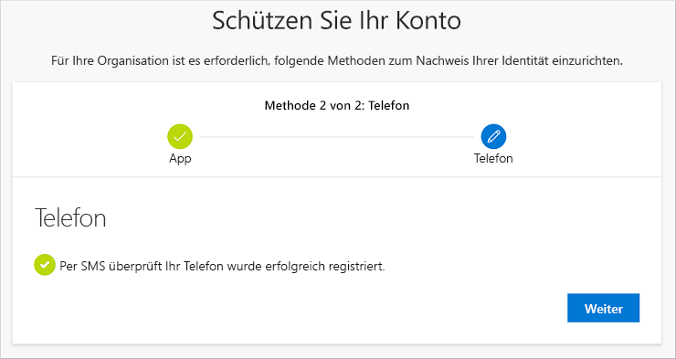
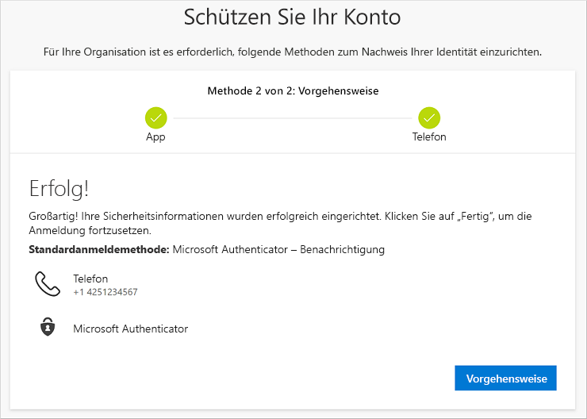

# Einrichten Ihrer Sicherheitsinformation über eine Anmeldeaufforderung

Wenn Sie direkt nach der Anmeldung bei Ihrem Geschäfts-, Schul- oder Unikonto zum Einrichten Ihrer Sicherheitsinformationen aufgefordert werden, können Sie diese Schritte ausführen.

Diese Aufforderung wird nur angezeigt, wenn Sie die von Ihrer Organisation geforderte Sicherheitsinformation noch nicht eingerichtet haben. Wenn Sie Ihre Sicherheitsinformationen bereits eingerichtet haben und Änderungen vornehmen möchten, können Sie die Schritte in den verschiedenen methodenbasierten Anleitungen ausführen. Weitere Informationen finden Sie im Artikel zum [Hinzufügen oder Aktualisieren Ihrer Sicherheitsinformationen](./security-info-setup-auth-app.md).

[!INCLUDE [preview-notice](../../../includes/active-directory-end-user-preview-notice-security-info.md)]

## Authentifizierung mit Sicherheitsüberprüfung und Kennwortzurücksetzung im Vergleich

Sicherheitsinformationsmethoden werden sowohl für die zweistufige Sicherheitsüberprüfung als auch die Kennwortzurücksetzung verwendet. Es können jedoch nicht alle Methoden für beide Verfahren verwendet werden.

| Methode | Syntaxelemente |
| ------ | -------- |
| Authenticator-App | Authentifizierung mittels zweistufiger Überprüfung und Kennwortzurücksetzung. |
| Textnachrichten | Authentifizierung mittels zweistufiger Überprüfung und Kennwortzurücksetzung. |
| Telefonanrufe | Authentifizierung mittels zweistufiger Überprüfung und Kennwortzurücksetzung. |
| Sicherheitsschlüssel | Authentifizierung mittels zweistufiger Überprüfung und Kennwortzurücksetzung. |
| E-Mail-Konto | Nur Authentifizierung mittels Kennwortzurücksetzung. Sie müssen eine andere Methode für die zweistufige Überprüfung auswählen. |
| Sicherheitsfragen | Nur Authentifizierung mittels Kennwortzurücksetzung. Sie müssen eine andere Methode für die zweistufige Überprüfung auswählen. |

## Anmelden bei Ihrem Geschäfts-, Schul- oder Unikonto

Nachdem Sie sich bei Ihrem Geschäfts-, Schul- oder Unikonto angemeldet haben, werden Sie aufgefordert, weitere Informationen anzugeben, bevor Sie auf Ihr Konto zugreifen können.

## Einrichten der Sicherheitsinformationen mithilfe des Assistenten

Führen Sie diese Schritte aus, um die Sicherheitsinformationen für Ihr Geschäfts-, Schul- oder Unikonto über die Aufforderung einzurichten.

>[!Important]
>Dies ist nur ein Beispiel für den Prozess. Je nach den Anforderungen Ihrer Organisation hat der Administrator möglicherweise unterschiedliche Überprüfungsmethoden eingerichtet, die Sie während dieses Vorgangs einrichten müssen. In diesem Beispiel sind zwei Methoden erforderlich: die Microsoft Authenticator-App und eine Mobiltelefonnummer zur Überprüfung per Telefonanruf oder SMS.

1. Nachdem Sie in der Aufforderung **Weiter** ausgewählt haben, wird ein **Assistent zum Schützen Ihres Kontos** angezeigt. Dieser zeigt die erste Methode, deren Einrichtung vom Administrator und der Organisation angefordert wird. In diesem Beispiel ist das die Microsoft Authenticator-App verwendet.

   > [!Note]
   > Wenn Sie eine andere App als die Microsoft Authenticator-App verwenden möchten, wählen Sie den Link **Ich möchte eine andere Authentifikator-App verwenden** aus.
   >
   > Wenn Ihre Organisation neben einer Authentifikator-App auch die Auswahl einer anderen Methode zulässt, können Sie den Link **Ich möchte eine andere Methode einrichten** auswählen.

    

2. Wählen Sie **Jetzt herunterladen** aus, um die Microsoft Authenticator-App herunterzuladen und auf Ihrem Mobilgerät zu installieren, und wählen Sie dann **Weiter**. Weitere Informationen zum Herunterladen und Installieren der App finden Sie unter [Herunterladen und Installieren der Microsoft Authenticator-App](user-help-auth-app-download-install.md).

    

3. Bleiben Sie auf der Seite **Konto einrichten**, während Sie die Microsoft Authenticator-App auf Ihrem Mobilgerät einrichten.

4. Öffnen Sie die Microsoft Authenticator-App, lassen Sie Benachrichtigungen zu (bei entsprechender Aufforderung), wählen Sie oben rechts das Symbol zum **Anpassen und Steuern** aus, und wählen Sie dann nacheinander **Konto hinzufügen** und **Geschäfts-, Schul- oder Unikonto** aus.

    >[!Note]
    >Wenn Sie die Microsoft Authenticator-App zum ersten Mal einrichten, werden Sie möglicherweise in einer Meldung gefragt, ob Sie der App den Zugriff auf Ihre Kamera (iOS) oder die Aufnahme von Foto- und Videodateien (Android) erlauben möchten. Sie müssen **Zulassen** auswählen, damit die Authentifikator-App im nächsten Schritt auf Ihre Kamera zugreifen und den QR-Code aufnehmen kann. Wenn Sie den Zugriff auf die Kamera nicht zulassen, können Sie die Authentifikator-App auch einrichten, müssen die Codeinformationen aber manuell hinzufügen. Informationen zum manuellen Hinzufügen des Codes finden Sie unter [Manuelles Hinzufügen eines Kontos zur App](user-help-auth-app-add-account-manual.md).

5. Wechseln Sie zurück zur Seite **Einrichten Ihres Kontos** auf Ihrem Computer, und wählen Sie dann **Weiter**.

    Die Seite **QR-Code scannen** wird angezeigt.

    

6. Scannen Sie den bereitgestellten Code mit dem QR-Codeleser der Microsoft Authenticator-App, der nach dem Erstellen Ihres Geschäfts-, Schul- oder Unikontos in Schritt 5 auf Ihrem Mobilgerät angezeigt wird.

    Die Authenticator-App sollte Ihr Geschäfts-, Schul- oder Unikonto erfolgreich hinzufügen, ohne dass Sie zusätzliche Informationen angeben müssen. Wenn der QR-Codeleser den Code jedoch nicht lesen kann, können Sie den Link **QR-Bild kann nicht gescannt werden** auswählen und den Code und die URL manuell in die Microsoft Authenticator-App eingeben. Weitere Informationen zum manuellen Hinzufügen eines Codes finden Sie unter [Manuelles Hinzufügen eines Kontos zur App](user-help-auth-app-add-account-manual.md).

7. Wählen Sie auf der Seite **QR-Code scannen** auf Ihrem Computer **Weiter** aus.

    Eine Benachrichtigung wird an die Microsoft Authenticator-App auf Ihrem Mobilgerät gesendet, um Ihr Konto zu testen.

    

8. Bestätigen Sie die Benachrichtigung in der Microsoft Authenticator-App, und klicken Sie dann auf **Weiter**.

    

    Ihre Sicherheitsinformationen werden aktualisiert, sodass bei der zweistufigen Überprüfung oder der Kennwortzurücksetzung standardmäßig die Microsoft Authenticator-App zur Überprüfung Ihrer Identität verwendet wird.

9. Wählen Sie auf der Einrichtungsseite **Telefon** aus, ob Sie eine SMS oder einen Telefonanruf erhalten möchten, und wählen Sie dann **Weiter**. In diesem Beispiel verwenden wir SMS, daher müssen Sie eine Telefonnummer für ein Gerät verwenden, das SMS empfangen kann.

    

    Eine SMS wird an Ihre Telefonnummer gesendet. Wenn Sie lieber einen Telefonanruf erhalten möchten, der Prozess ist identisch. Sie erhalten dann einen Telefonanruf mit einer Anleitung, anstatt einer SMS.

10. Geben Sie den Code aus der SMS an Ihr Mobilgerät ein, und wählen Sie dann **Weiter**.

    

11. Prüfen Sie die Erfolgsmeldung, und wählen Sie dann **Fertig**.

    

    Ihre Sicherheitsinformationen werden aktualisiert, sodass bei der zweistufigen Überprüfung oder der Kennwortzurücksetzung SMS als Ausweichmethode zur Bestätigung Ihrer Identität verwendet wird.

12. Vergewissern Sie sich auf der Seite **Erfolg**, dass Sie sowohl die Microsoft Authenticator-App als auch ein Telefon (entweder für SMS oder Anrufe) erfolgreich als Methoden für Ihre Sicherheitsinformationen festgelegt haben, und wählen Sie dann **Fertig**.

    

    >[!Note]
    >Setzt Ihre Organisation die Verwendung von App-Kennwörtern voraus, wird in diesem Assistenten unter Umständen ein weiterer Abschnitt angezeigt, in dem Sie sie einrichten können. Wird ein dritter Abschnitt namens **App-Kennwörter** angezeigt, müssen Sie ihn ausfüllen, damit Sie den Assistenten abschließen können. Die Schritte zum Hinzufügen eines App-Kennworts finden Sie in diesem Artikel im Abschnitt [Verwalten von App-Kennwörtern](#manage-your-app-passwords).

### Verwalten von App-Kennwörtern

Bestimmte Apps wie z.B. Outlook 2010 unterstützen keine zweistufige Überprüfung. Das bedeutet, dass die App nicht funktioniert, wenn in Ihrer Organisation die zweistufige Überprüfung verwendet wird. Um dieses Problem zu umgehen, können Sie ein automatisch generiertes Kennwort für die Verwendung mit jeder Nicht-Browser-App separat von Ihrem normalen Kennwort erstellen.

>[!Note]
>Wird diese Option im Assistenten nicht angezeigt, bedeutet das, dass sie vom Administrator nicht eingerichtet wurde. Wenn diese Option nicht eingerichtet wurde, Sie aber wissen, dass Sie App-Kennwörter verwenden müssen, können Sie die Schritte unter [Erstellen von App-Kennwörtern auf der Seite „Sicherheitsinformationen“ (Vorschau)](security-info-app-passwords.md) ausführen.

Wenn Sie App-Kennwörter verwenden, müssen Sie unbedingt Folgendes beachten:

- App-Kennwörter werden automatisch generiert und nur einmal pro App eingegeben.

- Pro Benutzer können maximal 40 Kennwörter festgelegt werden. Wenn Sie nach Erreichen dieses Maximalwerts versuchen, ein Kennwort zu erstellen, werden Sie aufgefordert, ein vorhandenes Kennwort zu löschen, bevor Sie ein neues erstellen dürfen.

- Verwenden Sie ein App-Kennwort pro Gerät, nicht pro App. Erstellen Sie z.B. ein einziges Kennwort für alle Apps auf Ihrem Laptop und dann ein weiteres einziges Kennwort für alle Apps auf Ihrem Desktopcomputer.

#### So fügen Sie App-Kennwörter im Anmelde-Assistenten hinzu

1. Wenn Sie die vorherigen Abschnitte des Assistenten abgeschlossen haben, wählen Sie **Weiter** aus, und fahren Sie mit dem Abschnitt **App-Kennwort** fort.

2. Geben Sie den Namen der App (etwa `Outlook 2010`) ein, für die das App-Kennwort benötigt wird, und wählen Sie dann **Weiter** aus.

    

3. Kopieren Sie auf dem Bildschirm **App-Kennwort** den Kennwortcode, und fügen Sie ihn im Bereich **Kennwort** der App ein (in diesem Beispiel Outlook 2010).

    

4. Wenn Sie das Kennwort kopiert und in die App eingefügt haben, kehren Sie zu diesem Assistenten zurück, um die Richtigkeit aller Informationen für die Anmeldemethode sicherzustellen, und wählen Sie dann **Fertig** aus.

    

## Nächste Schritte

- Informationen zum Ändern, Löschen oder Aktualisieren von Verfahren für Sicherheitsinformationen finden Sie unter:

    - [Einrichten der Sicherheitsinformationen zur Verwendung einer Authenticator-App](security-info-setup-auth-app.md)

    - [Einrichten der Sicherheitsinformationen zur Verwendung von SMS](security-info-setup-text-msg.md)

    - [Einrichten der Sicherheitsinformation zur Verwendung von Telefonanrufen](security-info-setup-phone-number.md)

    - [Einrichten der Sicherheitsinformation zur Verwendung einer E-Mail-Adresse](security-info-setup-email.md)

    - [Einrichten der Sicherheitsinformation zur Verwendung von Sicherheitsfragen](security-info-setup-questions.md)

- Informationen zur Anmeldung mit der festgelegten Methode finden Sie unter [Anmeldung](user-help-sign-in.md).

- Setzen Sie Ihr Kennwort zurück, wenn Sie es verloren oder vergessen haben. Verwenden Sie dazu das [Portal für die Kennwortzurücksetzung](https://passwordreset.microsoftonline.com/), oder führen Sie die Schritte im Artikel [Reset your work or school password](active-directory-passwords-update-your-own-password.md) (Zurücksetzen des Kennworts eines Geschäfts-, Schul- oder Unikontos) aus.

- Der Artikel [Wenn Sie sich nicht bei Ihrem Microsoft-Konto anmelden können](https://support.microsoft.com/help/12429/microsoft-account-sign-in-cant) enthält Tipps zur Problembehandlung bei Anmeldeproblemen.