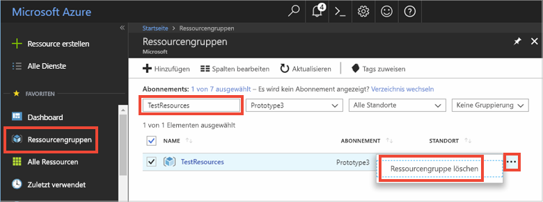

# <a name="quickstart-use-azure-cache-for-redis-in-java"></a>Schnellstart: Verwenden von Azure Cache for Redis mit Java

In dieser Schnellstartanleitung integrieren Sie Azure Cache for Redis in eine Java-App mit dem [Jedis](https://github.com/xetorthio/jedis) Redis-Client, um Zugriff auf einen sicheren, dedizierten Cache zu erhalten, der von jeder Anwendung in Azure aus zugänglich ist.

## <a name="skip-to-the-code-on-github"></a>Überspringen und mit dem Code auf GitHub fortfahren

Wenn Sie direkt mit dem Code fortfahren möchten, finden Sie im [Java-Schnellstart](https://github.com/Azure-Samples/azure-cache-redis-samples/tree/main/quickstart/java) auf GitHub weitere Informationen.

## <a name="prerequisites"></a>Voraussetzungen

- Azure-Abonnement – [Erstellen eines kostenlosen Kontos](https://azure.microsoft.com/free/)
- [Apache Maven](https://maven.apache.org/download.cgi)

## <a name="create-an-azure-cache-for-redis"></a>Erstellen einer Azure Cache for Redis-Instanz

[!INCLUDE [redis-cache-create](../../includes/redis-cache-create.md)]

[!INCLUDE [redis-cache-access-keys](../../includes/redis-cache-access-keys.md)]

## <a name="setting-up-the-working-environment"></a>Einrichten der Arbeitsumgebung 

Fügen Sie abhängig von Ihrem Betriebssystem Umgebungsvariablen für Ihren **Hostnamen** und Ihren **primären Zugriffsschlüssel** hinzu. Öffnen Sie eine Eingabeaufforderung oder ein Terminalfenster, und richten Sie die folgenden Werte ein:

```CMD 
set REDISCACHEHOSTNAME=<YOUR_HOST_NAME>.redis.cache.windows.net
set REDISCACHEKEY=<YOUR_PRIMARY_ACCESS_KEY>
```

```bash
export REDISCACHEHOSTNAME=<YOUR_HOST_NAME>.redis.cache.windows.net
export REDISCACHEKEY=<YOUR_PRIMARY_ACCESS_KEY>
```

Ersetzen Sie die Platzhalter durch die folgenden Werte:

- `<YOUR_HOST_NAME>`: Der DNS-Hostname, den Sie im Abschnitt *Eigenschaften* Ihrer Azure Cache for Redis-Ressource im Azure-Portal abgerufen haben
- `<YOUR_PRIMARY_ACCESS_KEY>`: Der primäre Zugriffsschlüssel, den Sie im Abschnitt *Zugriffsschlüssel* Ihrer Azure Cache for Redis-Ressource im Azure-Portal abgerufen haben

## <a name="create-a-new-java-app"></a>Erstellen einer neuen Java-App

Generieren Sie unter Verwendung von Maven eine neue Schnellstart-App:

```CMD
mvn archetype:generate -DarchetypeGroupId=org.apache.maven.archetypes -DarchetypeArtifactId=maven-archetype-quickstart -DarchetypeVersion=1.3 -DgroupId=example.demo -DartifactId=redistest -Dversion=1.0
```

Wechseln Sie zum neuen Projektverzeichnis *redistest*.

Öffnen Sie die Datei *pom.xml*, und fügen Sie eine Abhängigkeit für [Jedis](https://github.com/xetorthio/jedis) hinzu:

```xml
    <dependency>
        <groupId>redis.clients</groupId>
        <artifactId>jedis</artifactId>
        <version>3.2.0</version>
        <type>jar</type>
        <scope>compile</scope>
    </dependency>
```

Speichern Sie die Datei *pom.xml* .

Öffnen Sie die Datei *App.java*, und ersetzen Sie den Code durch folgenden Code:

```java
package example.demo;

import redis.clients.jedis.Jedis;
import redis.clients.jedis.JedisShardInfo;

/**
 * Redis test
 *
 */
public class App 
{
    public static void main( String[] args )
    {

        boolean useSsl = true;
        String cacheHostname = System.getenv("REDISCACHEHOSTNAME");
        String cachekey = System.getenv("REDISCACHEKEY");

        // Connect to the Azure Cache for Redis over the TLS/SSL port using the key.
        JedisShardInfo shardInfo = new JedisShardInfo(cacheHostname, 6380, useSsl);
        shardInfo.setPassword(cachekey); /* Use your access key. */
        Jedis jedis = new Jedis(shardInfo);      

        // Perform cache operations using the cache connection object...

        // Simple PING command        
        System.out.println( "\nCache Command  : Ping" );
        System.out.println( "Cache Response : " + jedis.ping());

        // Simple get and put of integral data types into the cache
        System.out.println( "\nCache Command  : GET Message" );
        System.out.println( "Cache Response : " + jedis.get("Message"));

        System.out.println( "\nCache Command  : SET Message" );
        System.out.println( "Cache Response : " + jedis.set("Message", "Hello! The cache is working from Java!"));

        // Demonstrate "SET Message" executed as expected...
        System.out.println( "\nCache Command  : GET Message" );
        System.out.println( "Cache Response : " + jedis.get("Message"));

        // Get the client list, useful to see if connection list is growing...
        System.out.println( "\nCache Command  : CLIENT LIST" );
        System.out.println( "Cache Response : " + jedis.clientList());

        jedis.close();
    }
}
```

Dieser Code zeigt, wie Sie unter Verwendung der Umgebungsvariablen für Cachehostname und Schlüssel eine Verbindung mit einer Azure Cache for Redis-Instanz herstellen. Der Code speichert auch einen Zeichenfolgenwert im Cache und ruft ihn ab. Außerdem werden die Befehle `PING` und `CLIENT LIST` ausgeführt. 

Speichern Sie *App.java*.

## <a name="build-and-run-the-app"></a>Erstellen und Ausführen der App

Führen Sie den folgenden Maven-Befehl aus, um die App zu erstellen und auszuführen:

```CMD
mvn compile
mvn exec:java -D exec.mainClass=example.demo.App
```

Im folgenden Beispiel können Sie sehen, dass der `Message`-Schlüssel zuvor einen zwischengespeicherten Wert aufgewiesen hat, der im Azure-Portal über die Redis-Konsole festgelegt wurde. Die App hat diesen zwischengespeicherten Wert aktualisiert. Außerdem hat die App die Befehle `PING` und `CLIENT LIST` ausgeführt.


## <a name="clean-up-resources"></a>Bereinigen von Ressourcen

Falls Sie mit dem nächsten Tutorial fortfahren möchten, können Sie die in dieser Schnellstartanleitung erstellten Ressourcen beibehalten und wiederverwenden.

Wenn Sie die Schnellstart-Beispielanwendung nicht mehr benötigen, können Sie die in dieser Schnellstartanleitung erstellten Azure-Ressourcen löschen, um das Anfallen von Kosten zu vermeiden. 

> [!IMPORTANT]
> Das Löschen einer Ressourcengruppe kann nicht rückgängig gemacht werden. Die Ressourcengruppe und alle darin enthaltenen Ressourcen werden also dauerhaft gelöscht. Achten Sie daher darauf, dass Sie nicht versehentlich die falsche Ressourcengruppe oder die falschen Ressourcen löschen. Falls Sie die Ressourcen zum Hosten dieses Beispiels in einer vorhandenen Ressourcengruppe erstellt haben, die beizubehaltende Ressourcen enthält, können Sie die Ressourcen einzeln über das jeweilige Blatt löschen, statt die Ressourcengruppe zu löschen.
>

1. Melden Sie sich beim [Azure-Portal](https://portal.azure.com) an, und klicken Sie auf **Ressourcengruppen**.

1. Geben Sie im Textfeld **Nach Name filtern** den Namen Ihrer Ressourcengruppe ein. In diesem Artikel wurde eine Ressourcengruppe mit dem Namen *TestResources* verwendet. Klicken Sie in der Ergebnisliste in Ihrer Ressourcengruppe auf **...** und dann auf **Ressourcengruppe löschen**.

   

1. Sie werden aufgefordert, das Löschen der Ressourcengruppe zu bestätigen. Geben Sie zur Bestätigung den Namen Ihrer Ressourcengruppe ein, und klicken Sie auf **Löschen**.

Daraufhin werden die Ressourcengruppe und alle darin enthaltenen Ressourcen gelöscht.

## <a name="next-steps"></a>Nächste Schritte

In dieser Schnellstartanleitung wurde beschrieben, wie Sie Azure Cache for Redis über eine Java-Anwendung verwenden. In der nächsten Schnellstartanleitung erfahren Sie, wie Sie Azure Cache for Redis mit einer ASP.NET-Web-App verwenden.

> [!div class="nextstepaction"]
> [Erstellen einer ASP.NET-Web-App, die eine Azure Cache for Redis-Instanz verwendet](./cache-web-app-howto.md)
