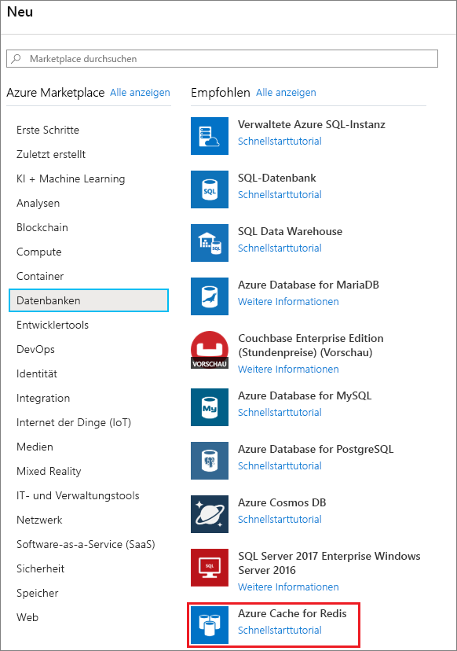
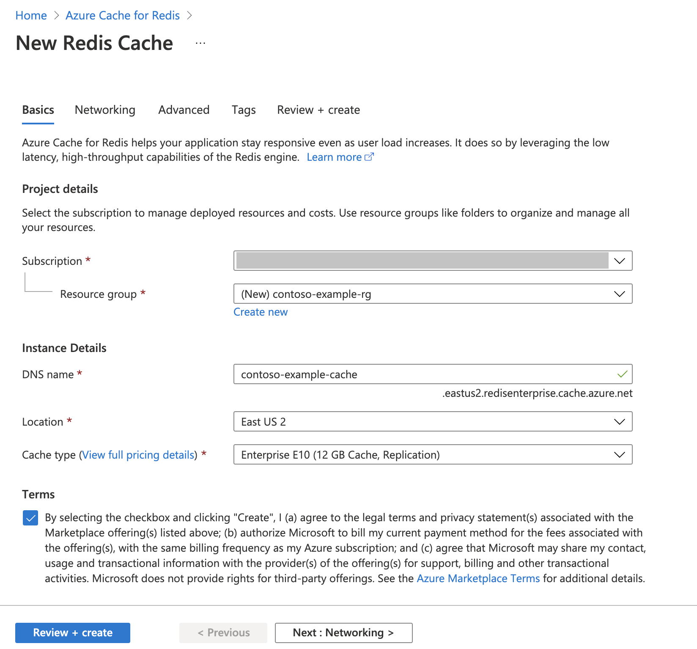
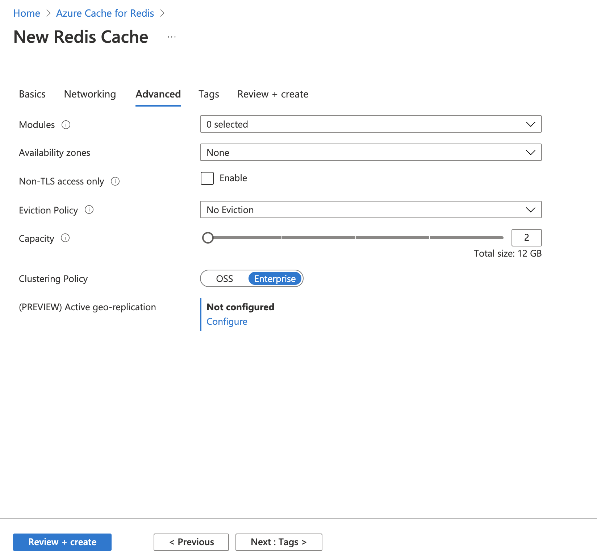
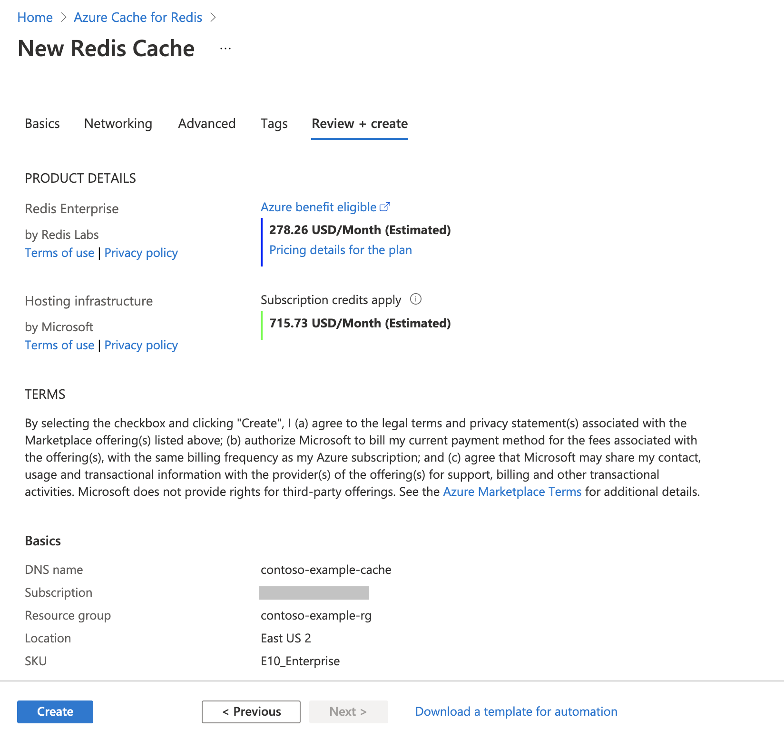

# Schnellstart: Erstellen eines Caches mit Enterprise-Tarif (Vorschau)

Enterprise-Tarife für Azure Cache for Redis bieten vollständig integrierte und verwaltete Instanzen von [Redis Enterprise](https://redislabs.com/redis-enterprise/) in Azure. Sie sind derzeit als Vorschau verfügbar. In dieser Vorschau stehen zwei neue Tarife zur Verfügung:
* Enterprise: Bei diesem Tarif wird flüchtiger Speicher (DRAM) auf einem virtuellen Computer als Datenspeicher verwendet.
* Enterprise SSD: Bei diesem Tarif wird eine Kombination aus flüchtigem und nicht flüchtigem Speicher (non-volatile memory, NVMe) als Datenspeicher verwendet.

Die Teilnahme an der Vorschau ist kostenlos. Bei Interesse können Sie sich im [Azure Marketplace](https://aka.ms/redispreviewsignup/) über **Kontakt mit mir aufnehmen** registrieren. Die Teilnehmeranzahl ist stark begrenzt, und die Teilnahme an der Vorschau kann nicht garantiert werden.

## Voraussetzungen

Sie benötigen ein Azure-Abonnement. Sollten Sie über keins verfügen, erstellen Sie zunächst ein [kostenloses Konto](https://azure.microsoft.com/free/).

## Erstellen eines Caches
1. Melden Sie sich zum Erstellen eines Caches über den Link in Ihrer Vorschaueinladung beim Azure-Portal an, und wählen Sie **Ressource erstellen** aus.

   > [!IMPORTANT] 
   > Abonnieren Sie *Azure Cache for Redis, Enterprise Tiers* nicht direkt über den Marketplace.
   > Dieser Schritt wird von der Portalbenutzeroberfläche für Azure Cache for Redis automatisch ausgeführt.
   >
   
1. Wählen Sie auf der Seite **Neu** die Option **Datenbanken** und dann **Azure Cache for Redis** aus.
   
   
   
1. Konfigurieren Sie auf der Seite **Neuer Redis Cache** die Einstellungen für den neuen Cache.
   
   | Einstellung      | Vorgeschlagener Wert  | Beschreibung |
   | ------------ |  ------- | -------------------------------------------------- |
   | **Abonnement** | Öffnen Sie die Dropdownliste, und wählen Sie Ihr Abonnement aus. | Das Abonnement, unter dem diese neue Azure Cache for Redis-Instanz erstellt wird. | 
   | **Ressourcengruppe** | Öffnen Sie die Dropdownliste, und wählen Sie eine Ressourcengruppe aus, oder wählen Sie **Neu erstellen** aus, und geben Sie einen Namen für eine neue Ressourcengruppe ein. | Der Name der Ressourcengruppe, in der Ihr Cache und weitere Ressourcen erstellt werden. Wenn Sie alle Ihre App-Ressourcen in einer Ressourcengruppe zusammenfassen, können Sie sie einfacher gemeinsam verwalten oder löschen. | 
   | **DNS-Name** | Geben Sie einen global eindeutigen Namen ein. | Der Cachename muss zwischen 1 und 63 Zeichen lang sein und darf nur Zahlen, Buchstaben und Bindestriche enthalten. Der Name muss mit einer Zahl oder einem Buchstaben beginnen und enden und darf keine aufeinanderfolgenden Bindestriche enthalten. Der *Hostname* Ihrer Cache-Instanz lautet *\<DNS name>.<Azure region>.redisenterprise.cache.azure.net*. | 
   | **Standort** | Öffnen Sie die Dropdownliste, und wählen Sie einen Standort aus. | Enterprise-Tarife stehen für „USA, Westen“, „USA, Osten 2“ und „Europa, Westen“ zur Verfügung. |
   | **Cachetarif** | Wählen Sie in der Dropdownliste einen Tarif vom Typ *Enterprise DRAM* oder *Enterprise SSD* sowie eine Größe aus. |  Der Tarif bestimmt Größe, Leistung und verfügbare Features für den Cache. |
   
    

1. Wählen Sie **Weiter: Netzwerk** aus, und überspringen Sie den Schritt.

   > [!NOTE] 
   > Die Private Link-Unterstützung kommt später.
   >

1. Wählen Sie **Weiter: Erweitert** aus.
   
   Übernehmen Sie die Standardeinstellungen, oder ändern Sie sie bei Bedarf. Wenn Sie **Nur Zugriff über TLS zulassen** aktivieren, müssen Sie TLS verwenden, um von Ihrer Anwendung aus auf den neuen Cache zuzugreifen.

    

   > [!NOTE] 
   > Redis-Module werden im Enterprise SSD-Tarif noch nicht unterstützt. Falls Sie ein Redis-Modul verwenden möchten, müssen Sie einen Cache mit Enterprise-Tarif auswählen.
   >
   
1. Wählen Sie **Weiter: Tags** aus, und überspringen Sie den Schritt.

1. Wählen Sie **Weiter: Zusammenfassung** aus.

    

1. Klicken Sie unter **Bedingungen** auf das Kontrollkästchen, überprüfen Sie die Einstellungen, und wählen Sie anschließend **Überprüfen und erstellen** aus.
   
   Die Erstellung des Caches dauert eine Weile. Sie können den Fortschritt auf der Seite **Übersicht** von Azure Cache for Redis überwachen. Wenn **Wird ausgeführt** als **Status** angezeigt wird, ist der Cache einsatzbereit.

   > [!NOTE] 
   > Nach der Erstellung des Caches mit Enterprise-Tarif erhalten Sie eine E-Mail vom Azure Marketplace, in der Sie darauf hingewiesen werden, dass eine **Aktion erforderlich** ist, um *Azure Cache for Redis, Enterprise Tiers*zu konfigurieren. Diese Aktion ist nicht erforderlich. Sie können die E-Mail gefahrlos ignorieren.
   >

## Nächste Schritte

In dieser Schnellstartanleitung wurde beschrieben, wie Sie eine Azure Cache for Redis-Instanz mit Enterprise-Tarif erstellen.

> [!div class="nextstepaction"]
> [Erstellen einer ASP.NET-Web-App, die eine Azure Cache for Redis-Instanz verwendet](./cache-web-app-howto.md)

