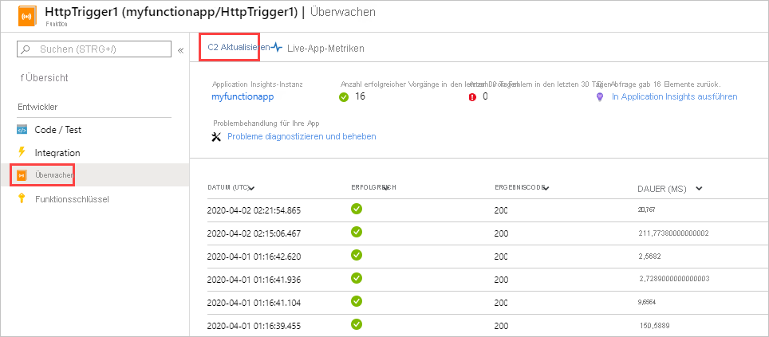
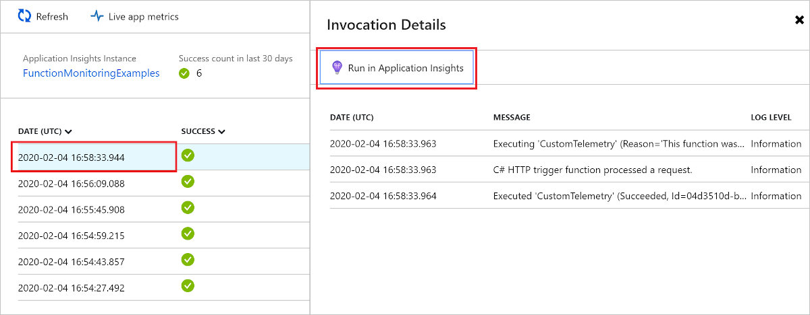
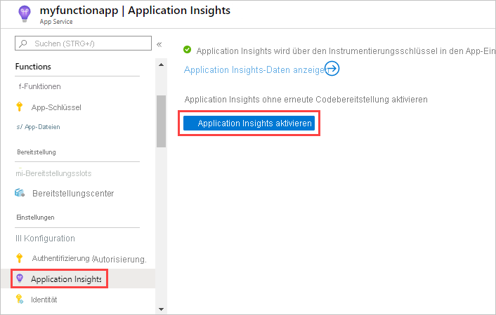

# <a name="analyze-azure-functions-telemetry-in-application-insights"></a>Analysieren von Azure Functions-Telemetriedaten in Application Insights 

Die Integration von Azure Functions mit Application Insights ermöglicht Ihnen ein besseres Überwachen Ihrer Funktions-Apps. Application Insights sammelt von Ihrer Funktions-App generierte Telemetriedaten, einschließlich Informationen, die diese App in Protokolle schreibt. Die Application Insights-Integration wird in der Regel beim Erstellen Ihrer Funktions-App aktiviert. Wenn für Ihre Funktions-App kein Instrumentierungsschlüssel festgelegt ist, müssen Sie die [Application Insights-Integration zunächst aktivieren](configure-monitoring.md#enable-application-insights-integration). 

Standardmäßig werden die von Ihrer Funktions-App gesammelten Daten in Application Insights gespeichert. Im [Azure-Portal](https://portal.azure.com) stellt Application Insights eine umfangreiche Sammlung von Visualisierungen für Ihre Telemetriedaten bereit. Sie können Drilldowns für Fehlerprotokolle, Abfrageereignisse und Metriken ausführen. Dieser Artikel enthält einfache Beispiele für das Anzeigen und Abfragen der gesammelten Daten. Weitere Informationen zum Untersuchen Ihrer Funktions-App-Daten in Application Insights finden Sie unter [Was ist Application Insights?](../azure-monitor/app/app-insights-overview.md) 

Wenn Sie mehr über Datenaufbewahrung und mögliche Speicherkosten erfahren möchten, lesen Sie den Artikel [Datenerfassung, -aufbewahrung und -speicherung in Application Insights](../azure-monitor/app/data-retention-privacy.md).   

## <a name="viewing-telemetry-in-monitor-tab"></a>Anzeigen von Telemetriedaten auf der Registerkarte „Überwachen“

Bei [aktivierter Application Insights-Integration](configure-monitoring.md#enable-application-insights-integration) können Sie Telemetriedaten auf der Registerkarte **Überwachung** einsehen.

1. Wählen Sie auf der Seite der Funktions-App eine Funktion aus, die nach der Konfiguration von Application Insights mindestens einmal ausgeführt wurde. Wählen Sie dann im linken Bereich **Überwachen** aus. Wählen Sie wiederholt die Option **Aktualisieren** aus, bis die Liste der Funktionsaufrufe angezeigt wird.

   

    > [!NOTE]
    > Es kann bis zu 5 Minuten dauern, bis die Liste angezeigt wird, während der Telemetrieclient Daten zur Übermittlung an den Server in Batches zusammenfasst. Diese Verzögerung gilt nicht für [Live Metrics Stream](../azure-monitor/app/live-stream.md). Bei diesem Dienst wird eine Verbindung mit dem Functions-Host hergestellt, wenn Sie die Seite laden, sodass Protokolle direkt an die Seite gestreamt werden.

1. Wählen Sie zum Anzeigen der Protokolle für einen bestimmten Funktionsaufruf den Link für diesen Aufruf in der Spalte **Datum (UTC)** aus. Die Protokollausgabe für diesen Aufruf wird auf einer neuen Seite angezeigt.

   

1. Wählen Sie **In Application Insights ausführen** aus, um die Quelle der Abfrage anzuzeigen, mit der die Azure Monitor-Protokolldaten in das Azure-Protokoll abgerufen werden. Wenn Sie Azure Log Analytics zum ersten Mal in Ihrem Abonnement verwenden, werden Sie aufgefordert, es zu aktivieren.

1. Nachdem Sie Log Analytics aktiviert haben, wird folgende Abfrage angezeigt. Sie können erkennen, dass die Abfrageergebnisse auf die letzten 30 Tage beschränkt sind (`where timestamp > ago(30d)`) und nicht mehr als 20 Zeilen der Ergebnisse angezeigt werden (`take 20`). Im Gegensatz dazu, zeigt die Liste der Aufrufdetails für Ihre Funktion die letzten 30 Tage ohne Beschränkung an.

   

Weitere Informationen finden Sie weiter unten in diesem Artikel unter [Abfragen von Telemetriedaten](#query-telemetry-data).

## <a name="view-telemetry-in-application-insights"></a>Anzeigen von Telemetriedaten in Application Insights

So öffnen Sie Application Insights in einer Funktions-App im [Azure-Portal](https://portal.azure.com)

1. Navigieren Sie im Portal zu Ihrer Funktions-App.

1. Klicken Sie auf der linken Seite unter **Einstellungen** auf **Application Insights**. 

1. Wenn Sie Application Insights mit Ihrem Abonnement zum ersten Mal verwenden, werden Sie aufgefordert, das Feature zu aktivieren. Klicken Sie hierzu auf **Application Insights aktivieren** und dann auf der nächsten Seite auf **Übernehmen**.



Informationen zur Verwendung von Application Insights finden Sie in der [Application Insights-Dokumentation](/azure/application-insights/). In diesem Abschnitt sind einige Beispiele für das Anzeigen von Daten in Application Insights enthalten. Falls Sie mit Application Insights bereits vertraut sind, können Sie direkt zu den [Abschnitten zur Konfiguration und Anpassung der Telemetriedaten](configure-monitoring.md#configure-log-levels) springen.


Die folgenden Bereiche von Application Insights können bei der Bewertung des Verhaltens, der Leistung und der Fehler in Ihren Funktionen hilfreich sein:

| Untersuchen | BESCHREIBUNG |
| ---- | ----------- |
| **[Fehler](../azure-monitor/app/asp-net-exceptions.md)** |  Hier können Sie Diagramme und Warnungen basierend auf Funktionsfehlern und Serverausnahmen erstellen. Der **Vorgangsname** ist der Funktionsname. Fehler in Abhängigkeiten werden nur angezeigt, wenn Sie die benutzerdefinierte Telemetrie für Abhängigkeiten implementieren. |
| **[Leistung](../azure-monitor/app/performance-counters.md)** | Hier können Sie Leistungsprobleme analysieren, indem Sie die Ressourcennutzung und den Durchsatz pro **Cloud-Rolleninstanz** anzeigen. Diese Leistungsdaten können nützlich für Debugszenarios sein, in denen Ihre zugrunde liegenden Ressourcen durch Funktionen beeinträchtigt werden. |
| **[Metriken](../azure-monitor/essentials/metrics-charts.md)** | Hier können Sie Diagramme und Warnungen auf der Grundlage von Metriken erstellen. Metriken enthalten die Anzahl der Funktionsaufrufe, die Ausführungsdauer und die Erfolgsquote. |
| **[Livemetriken](../azure-monitor/app/live-stream.md)** | Hiermit können Sie Metrikdaten während ihrer Erstellung in Quasi-Echtzeit anzeigen. |

## <a name="query-telemetry-data"></a>Abfragen von Telemetriedaten

Mit [Application Insights Analytics](../azure-monitor/logs/log-query-overview.md) haben Sie Zugriff auf alle Telemetriedaten in Form von Tabellen in einer Datenbank. Analytics stellt eine Abfragesprache zum Extrahieren, Bearbeiten und Visualisieren der Daten bereit. 

Klicken Sie auf **Protokolle**, um protokollierte Ereignisse zu durchsuchen oder abzufragen.


Diese Abfragebeispiel zeigt Verteilung von Anforderungen pro Worker in den letzten 30 Minuten.

```kusto
requests
| where timestamp > ago(30m) 
| summarize count() by cloud_RoleInstance, bin(timestamp, 1m)
| render timechart
```

Die verfügbaren Tabellen werden links auf der Registerkarte **Schema** angezeigt. Daten, die durch Funktionsaufrufe generiert wurden, sind in den folgenden Tabellen enthalten:

| Tabelle | BESCHREIBUNG |
| ----- | ----------- |
| **traces** | Von der Runtime und dem Skalierungscontroller erstellte Protokolle und Ablaufverfolgungen für Ihren Funktionscode |
| **requests** | Jeweils eine Anforderung pro Funktionsaufruf. |
| **exceptions** | Alle Ausnahmen, die von der Laufzeit ausgelöst werden. |
| **customMetrics** | Die Anzahl von erfolgreichen und nicht erfolgreichen Aufrufen, Erfolgsrate und Dauer. |
| **customEvents** | Ereignisse, die von der Runtime verfolgt werden, z. B.: HTTP-Anforderungen, die eine Funktion auslösen. |
| **performanceCounters** | Informationen zur Leistung der Server, auf denen die Funktionen ausgeführt werden. |

Die anderen Tabellen sind für Verfügbarkeitstests und Client/Browser-Telemetrie bestimmt. Sie können die benutzerdefinierte Telemetrie implementieren, um Daten hinzuzufügen.

In jeder Tabelle befinden sich einige der Functions-spezifischen Daten im Feld `customDimensions`.  Mit der folgenden Abfrage werden beispielsweise alle Ablaufverfolgungen mit der Protokollebene `Error` abgerufen.

```kusto
traces 
| where customDimensions.LogLevel == "Error"
```

Die Runtime stellt die Felder `customDimensions.LogLevel` und `customDimensions.Category` zur Verfügung. Sie können zusätzliche Felder in Protokollen angeben, die Sie in Ihren Funktionscode schreiben. Ein Beispiel in C# finden Sie unter [Strukturierte Protokollierung](functions-dotnet-class-library.md#structured-logging) im Entwicklerleitfaden für .NET-Klassenbibliotheken.

## <a name="query-scale-controller-logs"></a>Abfragen von Skalierungscontrollerprotokollen

_Dieses Feature befindet sich in der Vorschauphase._

Nachdem Sie sowohl die [Protokollierung des Skalierungscontrollers](configure-monitoring.md#configure-scale-controller-logs) als auch die [Application Insights-Integration](configure-monitoring.md#enable-application-insights-integration) aktiviert haben, können Sie mithilfe der Protokollsuche von Application Insights die ausgegebenen Skalierungscontrollerprotokolle abfragen. Die Skalierungscontrollerprotokolle werden in der Sammlung `traces` unter der Kategorie **ScaleControllerLogs** gespeichert.

Mit der folgenden Abfrage können Sie nach allen Skalierungscontrollerprotokollen für die aktuelle Funktions-App im angegebenen Zeitraum suchen:

```kusto
traces 
| extend CustomDimensions = todynamic(tostring(customDimensions))
| where CustomDimensions.Category == "ScaleControllerLogs"
```

Die folgende Abfrage erweitert die vorherige Abfrage, um zu veranschaulichen, wie Sie nur Protokolle anzeigen, die auf eine Änderung der Skalierung hinweisen:

```kusto
traces 
| extend CustomDimensions = todynamic(tostring(customDimensions))
| where CustomDimensions.Category == "ScaleControllerLogs"
| where message == "Instance count changed"
| extend Reason = CustomDimensions.Reason
| extend PreviousInstanceCount = CustomDimensions.PreviousInstanceCount
| extend NewInstanceCount = CustomDimensions.CurrentInstanceCount
```

## <a name="consumption-plan-specific-metrics"></a>Verbrauchstarifspezifische Metriken

Beim Ausführen mit einem [Verbrauchstarif](consumption-plan.md) werden die *Ausführungskosten* einer einzelnen Funktionsausführung in *GB-Sekunden* gemessen. Die Ausführungskosten werden berechnet, indem die Speichernutzung mit der Ausführungsdauer kombiniert wird. Weitere Informationen finden Sie unter [Abschätzen der Kosten des Verbrauchstarifs](functions-consumption-costs.md).

Die folgenden Telemetrieabfragen sind spezifisch für Metriken, die sich im Verbrauchstarif auf die Kosten für das Ausführen von Funktionen auswirken.

[!INCLUDE [functions-consumption-metrics-queries](../../includes/functions-consumption-metrics-queries.md)]

## <a name="azure-monitor-metrics"></a>Azure Monitor-Metriken

Zusätzlich zu den von Application Insights erfassten Telemetriedaten können Sie auch Daten über die Ausführung von Funktions-Apps von den [Azure Monitor-Metriken](../azure-monitor/platform/data-platform-metrics.md) erhalten. Neben den herkömmlichen [für App Service-Apps verfügbaren Metriken](../app-service/web-sites-monitor.md#understand-metrics) gibt es zwei spezifische Metriken für Azure Functions, die interessant sind:

| Metrik | BESCHREIBUNG |
| ---- | ---- |
| **FunctionExecutionCount** | Die Anzahl der Funktionsausführungen gibt an, wie oft Ihre Funktions-App ausgeführt wurde. Dies korreliert mit der Anzahl der Ausführung einer Funktion in Ihrer App. Diese Metrik für derzeit nicht für die App Service-Tarife Premium und Dedicated unter Linux unterstützt. |
| **FunctionExecutionUnits** | Die Funktionsausführungseinheiten sind eine Kombination aus Ausführungszeit und der Arbeitsspeicherauslastung.  Arbeitsspeicherdaten sind keine aktuell in Azure Monitor verfügbare Metrik. Wenn Sie jedoch die Speichernutzung Ihrer App optimieren möchten, können Sie die von Application Insights erfassten Daten der Leistungsindikatoren verwenden. Diese Metrik für derzeit nicht für die App Service-Tarife Premium und Dedicated unter Linux unterstützt.|

Weitere Informationen zum Berechnen der Kosten eines Verbrauchstarifs mithilfe von Application Insights-Daten finden Sie unter [Schätzen der Kosten des Verbrauchstarifs](functions-consumption-costs.md). Weitere Informationen über die Verwendung des Metrik-Explorers finden Sie unter [Erste Schritte mit dem Metrik-Explorer von Azure](../azure-monitor/platform/metrics-getting-started.md).


## <a name="next-steps"></a>Nächste Schritte

Weitere Informationen zur Überwachung in Azure Functions finden Sie unter:

+ [Überwachen von Azure Functions](functions-monitoring.md)
+ [Konfigurieren der Überwachung für Azure Functions](configure-monitoring.md)

