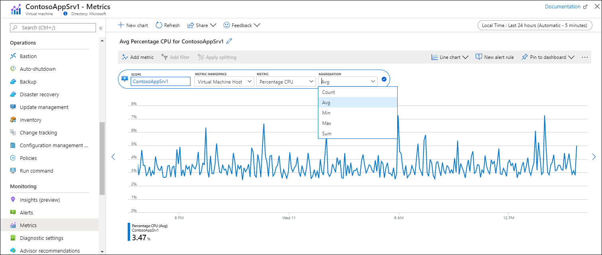

# Schnellstart: Überwachen einer Azure-Ressource mit Azure Monitor
[Azure Monitor](../overview.md) beginnt in dem Moment, in dem Azure-Ressourcen erstellt werden, mit dem Sammeln von Daten aus diesen Ressourcen. Diese Schnellstartanleitung bietet eine kurze Übersicht darüber, welche Daten für eine Ressource automatisch gesammelt werden, und erläutert, wie Sie die Daten für eine bestimmte Ressource im Azure-Portal anzeigen können. Später können Sie Einstellungen für die Sammlung weiterer Daten konfigurieren und zum Azure Monitor-Menü wechseln, um mit denselben Tools auf Daten zuzugreifen, die für alle Ressourcen in Ihrem Abonnement gesammelt wurden.

Eine genaue Beschreibung der Überwachungsdaten, die aus Azure-Ressourcen gesammelt werden, finden Sie unter [Überwachen von Azure-Ressourcen mit Azure Monitor](../essentials/monitor-azure-resource.md).

## Anmelden beim Azure-Portal

Melden Sie sich unter [https://portal.azure.com](https://portal.azure.com) beim Azure-Portal an. 

## Seite „Übersicht“
Viele Dienste stellen auf der Seite **Übersicht** Überwachungsdaten bereit, die einen kurzen Einblick in ihren Betrieb erlauben. Die Informationen basieren in der Regel auf einer Teilmenge der Plattformmetriken, die in Azure Monitor-Metriken gespeichert werden.

1. Suchen Sie in Ihrem Abonnement nach einer Azure-Ressource.
2. Wechseln Sie zur Seite **Übersicht**, und prüfen Sie, ob dort Leistungsdaten angezeigt werden. Diese Daten werden von Azure Monitor bereitgestellt. Das folgende Beispiel ist die Seite **Übersicht** für ein Azure-Speicherkonto, und wie Sie sehen, werden mehrere Metriken angezeigt.

    

3. Sie können auf ein beliebiges Diagramm klicken, um die Daten im Metrik-Explorer zu öffnen. Dieser wird weiter unten beschrieben.

## Anzeigen des Aktivitätsprotokolls
Das Aktivitätsprotokoll bietet Einblicke in die Vorgänge, die für die einzelnen Azure-Ressourcen im Abonnement durchgeführt wurden. Hierzu gehören Informationen beispielsweise dazu, wann eine Ressource erstellt oder geändert wird, wann ein Auftrag gestartet wird oder wann ein bestimmter Vorgang ausgeführt wird.

1. Wählen Sie oben im Menü für Ihre Ressource die Option **Aktivitätsprotokoll** aus.
2. Der aktuelle Filter ist so eingestellt, dass Ereignisse in Bezug auf Ihre Ressource angezeigt werden. Wenn keine Ereignisse angezeigt werden, ändern Sie den **Zeitraum**, um den Zeitbereich zu vergrößern.

    

4. Wenn Sie Ereignisse aus anderen Ressourcen in Ihrem Abonnement anzeigen möchten, ändern Sie Kriterien im Filter, oder entfernen Sie Filtereigenschaften.

    

## Anzeigen von Metriken
Metriken sind numerische Werte, die einen Aspekt Ihrer Ressource zu einem bestimmten Zeitpunkt beschreiben. Azure Monitor sammelt Plattformmetriken automatisch aus allen Azure-Ressourcen in Intervallen von einer Minute. Sie können diese Metriken im Metrik-Explorer anzeigen.

1. Wählen Sie im Menü Ihrer Ressource im Abschnitt **Überwachung** die Option **Metriken** aus. Damit wird der Metrik-Explorer geöffnet, und der Bereich ist auf Ihre Ressource festgelegt.
2. Klicken Sie auf **Metrik hinzufügen**, um dem Diagramm eine Metrik hinzuzufügen.
   
   
   
4. Wählen Sie aus der Liste eine **Metrik** und dann eine **Aggregation** aus. Damit wird definiert, wie die Werte für jedes Zeitintervall erfasst werden.

    

5. Klicken Sie auf **Metrik hinzufügen**, um weitere Kombinationen aus Metrikwerten und Aggregationen zum Diagramm hinzuzufügen.

    

## Nächste Schritte
In dieser Schnellstartanleitung haben Sie das Aktivitätsprotokoll und die Metriken für eine Azure-Ressource angezeigt, die von Azure Monitor automatisch erfasst werden. Fahren Sie mit dem nächsten Schnellstart fort, der Ihnen zeigt, wie Sie das Aktivitätsprotokoll in einem Log Analytics-Arbeitsbereich erfassen, wo es mit [Protokollabfragen](../logs/log-query-overview.md) analysiert werden kann.

> [!div class="nextstepaction"]
> [Senden eines Azure-Aktivitätsprotokolls an einen Log Analytics-Arbeitsbereich](./quick-collect-activity-log-portal.md)