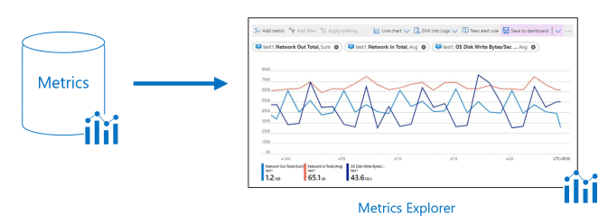
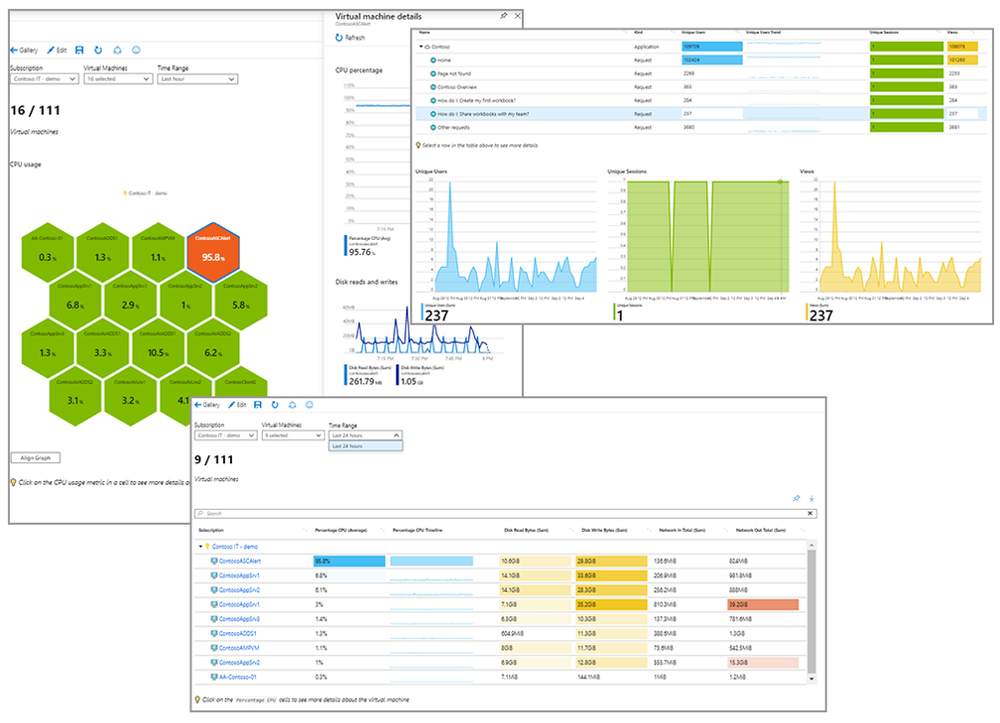

# Azure Monitor – Übersicht

Mit Azure Monitor werden Verfügbarkeit und Leistung Ihrer Anwendungen und Dienste maximiert. Er bietet eine umfassende Lösung für das Sammeln, Analysieren und Behandeln von Telemetriedaten aus Ihren Cloud- und lokalen Umgebungen. Diese Informationen helfen Ihnen, die Leistung Ihrer Anwendungen zu verstehen und proaktiv Probleme zu erkennen, die sich auf sie auswirken, und Ressourcen, von denen sie abhängen.

Im Folgenden sind einige Beispiele für die Möglichkeiten von Azure Monitor aufgeführt:

- Erkennen und diagnostizieren Sie Probleme über Anwendungen und Abhängigkeiten hinweg mit [Application Insights](app/app-insights-overview.md).
- Korrelieren Sie Infrastrukturprobleme mit [VM Insights](vm/vminsights-overview.md) und [Container Insights](containers/container-insights-overview.md).
- Führen Sie zur Problembehandlung und umfassenden Diagnose mit [Log Analytics](logs/log-query-overview.md) einen Drilldown in Ihre Überwachungsdaten durch.
- Unterstützen Sie Operations im großen Maßstab mit [intelligenten Warnungen](alerts/alerts-smartgroups-overview.md) und [automatisierten Aktionen](alerts/alerts-action-rules.md).
- Erstellen Sie Visualisierungen mit Azure-[Dashboards](visualize/tutorial-logs-dashboards.md) und [Arbeitsmappen](visualize/workbooks-overview.md).
- Sammeln Sie Daten aus [überwachten Ressourcen](./monitor-reference.md) mithilfe von [Azure Monitor-Metriken](./essentials/data-platform-metrics.md).

> [!VIDEO https://www.microsoft.com/en-us/videoplayer/embed/RE4qXeL]

[!INCLUDE [azure-lighthouse-supported-service](../../includes/azure-lighthouse-supported-service.md)]

## Übersicht

Das folgende Diagramm zeigt eine allgemeine Übersicht von Azure Monitor. In der Mitte des Diagramms finden Sie die Datenspeicher für Metriken und Protokolle, die beiden grundlegenden Datenarten, mit denen Azure Monitor arbeitet. Auf der linken Seite befinden sich die [Quellen für Überwachungsdaten](agents/data-sources.md), die diese [Datenspeicher](data-platform.md) ausfüllen. Auf der rechten Seite finden Sie die verschiedenen Funktionen, die Azure Monitor mit diesen gesammelten Daten ausführt, wie etwa Analyse, Ausgeben von Warnungen und Streamen auf externe Systeme.

## Überwachungsdaten-Plattform

Alle von Azure Monitor gesammelten Daten gehören einem von zwei Grundtypen an, [Metriken und Protokolle](data-platform.md). [Metriken](essentials/data-platform-metrics.md) sind numerische Werte, die einen Aspekt eines Systems zu einem bestimmten Zeitpunkt beschreiben. Sie sind einfach strukturiert und in der Lage, Szenarien nahezu in Echtzeit zu unterstützen. [Protokolle](logs/data-platform-logs.md) enthalten verschiedene Arten von Daten, die in Datensätzen mit unterschiedlichen Eigenschaften für jeden Typ organisiert sind. Telemetriedaten wie etwa Ereignisse und Ablaufverfolgungen werden als Protokolle zusätzlich zu Leistungsdaten gespeichert, die alle zur Analyse kombiniert werden können.

Für viele Azure-Ressourcen können die von Azure Monitor gesammelten Daten direkt auf ihrer Übersichtsseite im Azure-Portal angezeigt werden. Werfen Sie beispielsweise einen Blick auf eine beliebige VM, dann sehen Sie eine Reihe von Diagrammen, die Leistungsmetriken darstellen. Klicken Sie auf eines dieser Diagramme, um die Daten im Azure-Portal im [Metrik-Explorer](essentials/metrics-charts.md) anzuzeigen. Hier können Sie die Werte mehrerer Metriken im zeitlichen Verlauf als Diagramm darstellen.  Sie können die Diagramme interaktiv nutzen oder an ein Dashboard anheften, um sie mit anderen Visualisierungstools anzuzeigen.

Die in Azure Monitor gesammelten Protokolldaten können mit [Abfragen](logs/log-query-overview.md) analysiert werden, die die gesammelten Daten schnell abrufen, konsolidieren und analysieren.  Sie können Abfragen mithilfe von [Log Analytics](./logs/log-query-overview.md) im Azure-Portal erstellen und testen. Sie die können die Daten dann entweder mit verschiedenen Tools direkt analysieren oder Abfragen zur Verwendung mit [Visualisierungen](visualizations.md) oder [Warnungsregeln](alerts/alerts-overview.md) speichern.

Azure Monitor verwendet eine Version der [Kusto-Abfragesprache](/azure/kusto/query/), die für einfache Protokollabfragen geeignet ist, aber auch erweiterte Funktionen enthält, z. B. Aggregationen, Verknüpfungen und intelligente Analysen. Sie können die Abfragesprache schnell erlernen, indem Sie [mehrere Lektionen](logs/get-started-queries.md) nutzen.  Es ist eine spezielle Anleitung für Benutzer vorhanden, die bereits mit [SQL](/azure/data-explorer/kusto/query/sqlcheatsheet) und [Splunk](/azure/data-explorer/kusto/query/splunk-cheat-sheet) vertraut sind.

## Welche Daten sammelt Azure Monitor?

Azure Monitor kann Daten aus [vielen verschiedenen Quellen](monitor-reference.md) sammeln. Dies reicht von Ihrer Anwendung, allen Betriebssystemen und Diensten, von denen Sie abhängig ist, bis hin zur Plattform selbst. Azure Monitor sammelt Daten aus jeder der folgenden Schichten:

- **Überwachungsdaten zu Anwendungen**: Daten zur Leistung und Funktionalität des von Ihnen geschriebenen Codes, unabhängig von seiner Plattform.
- **Überwachungsdaten zum Gast-BS:** Daten zum Betriebssystem, unter dem die Anwendung ausgeführt wird. Es kann in Azure, einer anderen Cloud oder lokal ausgeführt werden. 
- **Überwachungsdaten zur Azure-Ressource:** Daten zum Betrieb einer Azure-Ressource.
- **Überwachungsdaten zum Azure-Abonnement**: Daten zum Betrieb und zur Verwaltung eines Azure-Abonnements sowie Daten zur Integrität und zum Betrieb von Azure selbst. 
- **Überwachungsdaten zu Azure-Mandanten**: Daten zum Betrieb von Azure-Diensten auf Mandantenebene, z. B. Azure Active Directory.

Sobald Sie ein Azure-Abonnement erstellen und damit beginnen, ihm Ressourcen hinzuzufügen, wie etwa VMs und Web-Apps, beginnt Azure Monitor mit dem Sammeln von Daten.  [Aktivitätsprotokolle](essentials/platform-logs-overview.md) zeichnen auf, wenn Ressourcen erstellt oder geändert werden. [Metriken](data-platform.md) teilen Ihnen mit, welche Leistung die Ressource aufweist und welche Ressourcen sie nutzt. 

[Aktivieren Sie die Diagnose](essentials/platform-logs-overview.md), um Datenerfassung auf den internen Betrieb der Ressourcen zu erweitern.  [Fügen Sie einen Agent hin](agents/agents-overview.md), um Ressourcen zum Sammeln von Telemetriedaten von deren Gastbetriebssystemen zu berechnen. 

Aktivieren Sie die Überwachung für Ihre Anwendung mit [Application Insights](app/app-insights-overview.md), um ausführliche Informationen zu erfassen, einschließlich der Anzahl der Seitenaufrufe, Anwendungsanforderungen und Ausnahmen. Überprüfen Sie darüber hinaus die Verfügbarkeit Ihrer Anwendung, indem Sie einen [Verfügbarkeitstest](app/monitor-web-app-availability.md) konfigurieren, um Benutzerdatenverkehr zu simulieren.

### Benutzerdefinierte Quellen

Azure Monitor kann mithilfe der [Datensammler-API](logs/data-collector-api.md) Protokolldaten von jedem REST-Client erfassen. Dies erlaubt Ihnen das Erstellen von benutzerdefinierten Überwachungsszenarien und das Ausweiten der Überwachung auf Ressourcen, die Telemetriedaten nicht durch andere Quellen verfügbar machen.

## Einblicke
Das Überwachen von Daten ist nur nützlich, wenn dadurch Ihre Einsicht in den Betrieb Ihrer Computerumgebung ausgeweitet wird. Mit [Erkenntnissen](monitor-reference.md#insights-and-core-solutions) wird eine angepasste Überwachungsoberfläche für bestimmte Azure-Dienste bereitgestellt. Sie erfordern nur eine minimale Konfiguration und erhöhen die Transparenz des Betriebs kritischer Ressourcen.

### Application Insights
[Application Insights](app/app-insights-overview.md) überwacht Verfügbarkeit, Leistung und Nutzung Ihrer Webanwendungen, gleich ob sie in der Cloud oder lokal gehostet sind. Es nutzt die leistungsstarke Datenanalyseplattform in Azure Monitor, um Ihnen tiefgreifende Einblicke in den Betrieb Ihrer Anwendung zu geben. Sie können Fehler diagnostizieren, ohne darauf warten zu müssen, dass diese von Benutzern gemeldet werden. Application Insights beinhaltet Verbindungspunkte zu einer Vielzahl von Entwicklungstools und lässt sich in Visual Studio integrieren, um Ihre DevOps-Prozesse zu unterstützen.

### Container Insights
[Container Insights](containers/container-insights-overview.md) überwacht die Leistung von Containerworkloads, die in Managed Kubernetes-Clustern bereitgestellt und in Azure Kubernetes Service (AKS) gehostet werden. Es ermöglicht den Einblick in die Leistung, indem anhand der Metrik-API die in Kubernetes verfügbaren Metriken von Controllern, Knoten und Containern erfasst werden. Auch Containerprotokolle werden erfasst.  Nach der Aktivierung der Überwachung auf Kubernetes-Clustern werden diese Metriken und Protokolle für Sie automatisch mittels einer Containerversion des Log Analytics-Agents für Linux erfasst gespeichert.

### VM Insights
[VM Insights](vm/vminsights-overview.md) überwacht Ihre virtuellen Azure-Computer (VMs) im großen Stil. Der Dienst analysiert die Leistung und Integrität Ihrer Windows- und Linux-VMs und identifiziert ihre verschiedenen Prozesse und miteinander verbundenen Abhängigkeiten von externen Prozessen. Die Lösung umfasst Unterstützung für die Überwachung von Leistung und Anwendungsabhängigkeiten für VMs, die lokal oder bei einem anderen Cloudanbieter gehostet sind.  

## Reagieren auf kritische Situationen
Über die Möglichkeit zum interaktiven Analysieren von Überwachungsdaten hinaus muss eine effektive Überwachungslösung auch in der Lage sein, proaktiv auf kritische Bedingungen zu reagieren, die in den gesammelten Daten erkannt werden. Das kann durch Senden eines Texts oder einer E-Mail an einen für die Untersuchung eines Problems zuständigen Administrator erfolgen. Alternativ können Sie einen automatisierten Prozess starten, der versucht, einen Fehlerzustand zu korrigieren.

### Alerts
[Warnungen in Azure Monitor](alerts/alerts-overview.md) informieren Sie proaktiv über kritische Zustände und versuchen potenziell, Korrekturmaßnahmen einzuleiten. Auf Metriken basierende Warnungsregeln bieten Warnungen nahezu in Echtzeit basierend auf numerischen Werten. Auf Protokollen basierende Regeln ermöglichen eine komplexe Logik über Daten aus mehreren Quellen hinweg.

Warnungsregeln in Azure Monitor verwenden [Aktionsgruppen](alerts/action-groups.md), die eindeutige Sätze von Empfängern und Aktionen enthalten, die gemeinsam von mehreren Regeln übergreifend verwendet werden können. Je nach Ihren Anforderungen können Aktionsgruppen Aktionen wie das Verwenden von Webhooks ausführen, um externe Aktionen mithilfe von Warnungen zu starten oder die Integration in Ihre ITSM-Tools zu ermöglichen.

### Autoscale
Bei der automatischen Skalierung können Sie jeweils die richtige Menge an Ressourcen ausführen, um die Lasten für Ihre Anwendung zu bewältigen. Erstellen Sie Regeln, die von Azure Monitor gesammelte Metriken verwenden, um zu bestimmen, wann bei steigender Last automatisch Ressourcen hinzugefügt werden sollen. Sparen Sie Geld, indem Sie Ressourcen entfernen, die sich im Leerlauf befinden. Sie geben eine Minimal- und eine Maximalanzahl von Instanzen an und legen die Logik zum Herauf- oder Herabsetzen der Ressourcen fest.

## Visualisieren von Überwachungsdaten
[Visualisierungen](visualizations.md) wie Diagramme und Tabellen sind effektive Tools zur Zusammenfassung von Überwachungsdaten und zu ihrer Präsentation für verschiedene Zielgruppen. Azure Monitor verfügt über eigene Features zum Visualisieren von Überwachungsdaten und nutzt andere Azure-Dienste, um sie für verschiedene Zielgruppen zu veröffentlichen.

### Dashboards
Mit [Azure Dashboards](../azure-portal/azure-portal-dashboards.md) können Sie verschiedene Arten von Daten zentral in einem Bereich im [Azure-Portal](https://portal.azure.com) kombinieren. Sie können das Dashboard optional gemeinsam mit anderen Azure-Benutzern nutzen. Fügen Sie einem Azure-Dashboard die Ausgabe einer beliebigen Protokollabfrage oder eines Metrikdiagramms hinzu. Beispielsweise können Sie ein Dashboard erstellen, das Kacheln kombiniert, die ein Diagramm der Metriken, eine Tabelle mit Aktivitätsprotokollen, ein Nutzungsdiagramm von Application Insights und die Ausgabe einer Protokollabfrage zeigen.

### Arbeitsmappen
[Arbeitsmappen](visualize/workbooks-overview.md) bieten einen flexiblen Bereich für die Datenanalyse und die Erstellung umfassender visueller Berichte im Azure-Portal. Mit ihnen können Sie mehrere Datenquellen in Azure nutzen und sie zu vereinheitlichten interaktiven Oberflächen kombinieren. Verwenden Sie mit Erkenntnissen bereitgestellte Arbeitsmappen, oder erstellen Sie eigene aus vordefinierten Vorlagen.

### Power BI
[Power BI](https://powerbi.microsoft.com) ist ein Business Analytics-Dienst, der interaktive Visualisierungen für eine Vielzahl von Datenquellen bereitstellt. Es handelt sich dabei um eine effektive Methode, um Daten anderen Personen innerhalb und außerhalb Ihrer Organisation zur Verfügung stellen. Sie können Power BI für den [automatischen Import von Protokolldaten aus Azure Monitor](./visualize/powerbi.md) konfigurieren, um diese zusätzlichen Visualisierungen zu nutzen.

## Integrieren und Exportieren von Daten
Oft besteht die Anforderung, Azure Monitor in andere Systeme zu integrieren und benutzerdefinierte Lösungen zu erstellen, die Ihre Überwachungsdaten nutzen. Andere Azure-Dienste arbeiten mit Azure Monitor, um diese Integration zu ermöglichen.

### Event Hub
Bei [Azure Event Hubs](../event-hubs/index.yml) handelt es sich um eine Streamingplattform und einen Ereigniserfassungsdienst. Er kann Daten über einen beliebigen Echtzeitanalyseanbieter oder Batchverarbeitungs-/Speicheradapter transformieren und speichern. Verwenden Sie Event Hubs für das [Streamen von Azure Monitor-Daten](essentials/stream-monitoring-data-event-hubs.md) zu SIEM- und Überwachungstools von Partnern.

### Logic Apps
[Logic Apps](https://azure.microsoft.com/services/logic-apps) ist ein Dienst, der Ihnen das Automatisieren von Aufgaben und Geschäftsprozessen mithilfe von Workflows ermöglicht, die sich in verschiedene Systeme und Dienste integrieren. Es sind Aktivitäten verfügbar, die Metriken und Protokolle in Azure Monitor lesen und schreiben. Dies ermöglicht Ihnen das Erstellen von Workflows, die in verschiedene andere Systeme integriert sind.

### API
Über den Zugriff auf generierte Warnungen hinaus stehen mehrere APIs zur Verfügung, um Metriken und Protokolle in Azure Monitor zu schreiben und daraus zu lesen. Warnungen können darüber hinaus konfiguriert und abgerufen werden. Dadurch stehen Ihnen praktisch unbegrenzte Möglichkeiten zum Erstellen von benutzerdefinierten Lösungen zur Verfügung, die sich in Azure Monitor integrieren lassen.

## Nächste Schritte
Weitere Informationen:

* [Metriken und Protokolle](https://docs.microsoft.com/azure/azure-monitor/data-platform#metrics) für die von Azure Monitor gesammelten Daten
* [Datenquellen](agents/data-sources.md) dazu, wie die verschiedenen Komponenten Ihrer Anwendung Telemetriedaten senden
* [Protokollabfragen](logs/log-query-overview.md) zur Analyse der gesammelten Daten
* [Bewährte Methoden](/azure/architecture/best-practices/monitoring) zum Überwachen von Cloudanwendungen und-Diensten.
