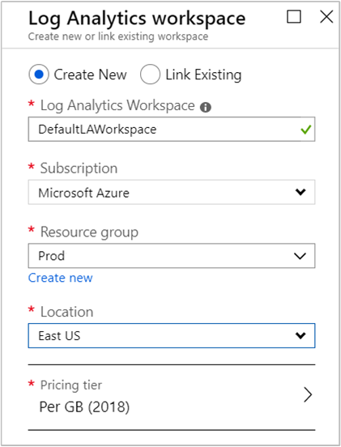
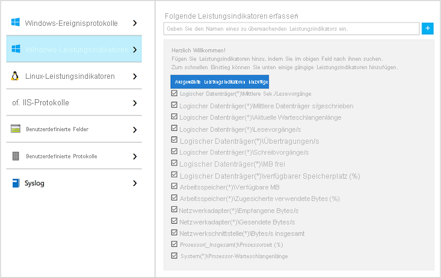
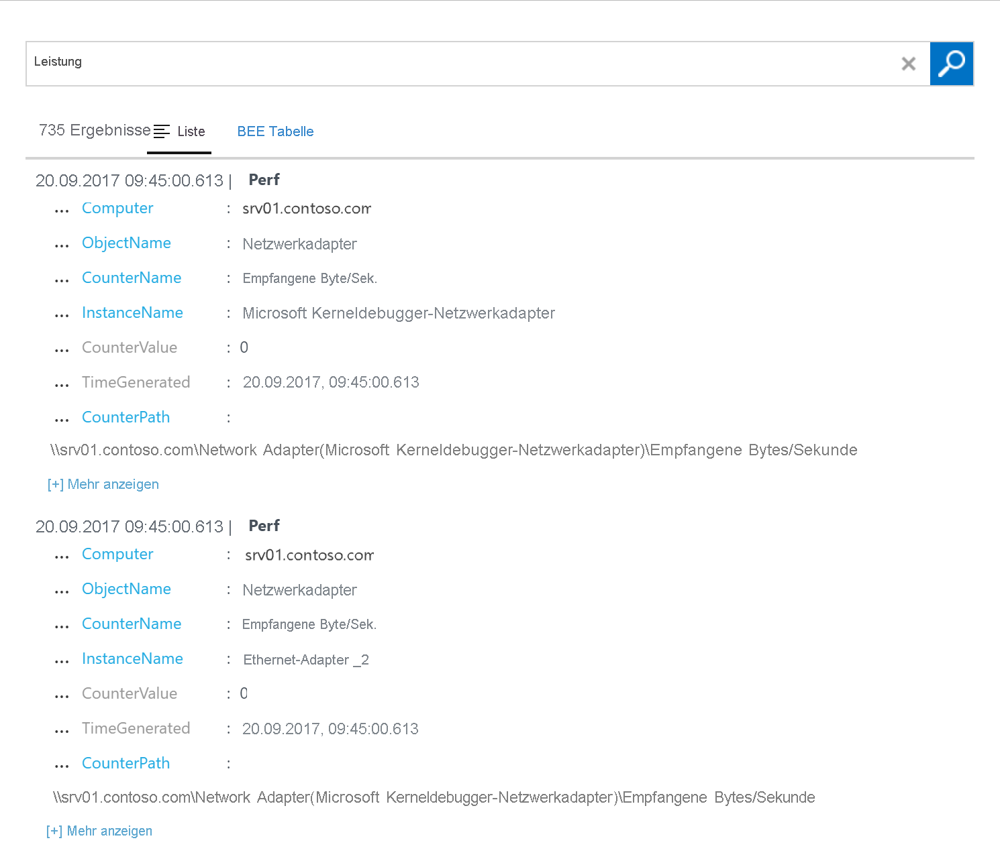

# Sammeln von Daten auf einem Windows-Computer in einer Hybridumgebung mit Azure Monitor

[Azure Monitor](../overview.md) kann Daten direkt von Ihren physischen oder virtuellen Windows-Computern in Ihrer Umgebung zur detaillierten Analyse und Korrelation in einem Log Analytics-Arbeitsbereich sammeln. Wenn Sie den [Log Analytics-Agent](../agents/log-analytics-agent.md) installieren, kann Azure Monitor Daten aus einem Datencenter oder einer anderen Cloudumgebung sammeln. Dieser Schnellstart zeigt Ihnen, wie Sie in wenigen einfachen Schritten Daten von Ihrem Windows-Computer konfigurieren und sammeln. Informationen zu virtuellen Azure-Windows-Computern finden Sie unter [Sammeln von Daten zu virtuellen Azure-Computern](./quick-collect-azurevm.md).  

Informationen zur unterstützten Konfiguration finden Sie unter [Unterstützte Betriebssysteme](../agents/agents-overview.md#supported-operating-systems) und [Netzwerkfirewall-Konfiguration](../agents/log-analytics-agent.md#network-requirements).
 
Wenn Sie kein Azure-Abonnement besitzen, können Sie ein [kostenloses Konto](https://azure.microsoft.com/free/?WT.mc_id=A261C142F) erstellen, bevor Sie beginnen.

## Anmelden beim Azure-Portal

Melden Sie sich unter [https://portal.azure.com](https://portal.azure.com) beim Azure-Portal an. 

## Erstellen eines Arbeitsbereichs

1. Wählen Sie im Azure-Portal **Alle Dienste** aus. Geben Sie in der Liste mit den Ressourcen **Log Analytics** ein. Sobald Sie mit der Eingabe beginnen, wird die Liste auf der Grundlage Ihrer Eingabe gefiltert. Wählen Sie **Log Analytics-Arbeitsbereiche** aus.

       

2. Wählen Sie die Option **Erstellen** und anschließend Optionen für die folgenden Elemente aus:

   * Geben Sie einen Namen für den neuen **Log Analytics-Arbeitsbereich** ein, z.B. *DefaultLAWorkspace*.  
   * Wählen Sie ein **Abonnement** aus, mit dem eine Verknüpfung erstellt werden soll, indem Sie in der Dropdownliste einen anderen Eintrag auswählen, falls der Standardeintrag nicht geeignet ist.
   * Wählen Sie für **Ressourcengruppe** eine vorhandene Ressourcengruppe aus, die einen oder mehrere virtuelle Azure-Computer enthält.  
   * Wählen Sie den **Speicherort** für die Bereitstellung Ihrer virtuellen Computer aus.  Weitere Informationen finden Sie auf der Seite zur [Verfügbarkeit von Log Analytics in den einzelnen Regionen](https://azure.microsoft.com/regions/services/).
   * Wenn Sie einen Arbeitsbereich in einem neuen Abonnement erstellen, das nach dem 2. April 2018 erstellt wurde, wird automatisch der Tarif *Pro GB* verwendet. In diesem Fall ist keine Tarifauswahloption verfügbar.  Wenn Sie einen Arbeitsbereich für ein Abonnement erstellen, das vor dem 2. April erstellt oder mit einer vorhandenen EA-Registrierung verknüpft wurde, wählen Sie Ihren bevorzugten Tarif aus.  Weitere Informationen zu den einzelnen Tarifen finden Sie unter [Log Analytics – Preise](https://azure.microsoft.com/pricing/details/log-analytics/).
  
         

3. Wählen Sie nach dem Bereitstellen der erforderlichen Informationen im Bereich **Log Analytics-Arbeitsbereich** die Option **OK** aus.  

Die Informationen werden überprüft, und der Arbeitsbereich wird erstellt. Sie können den Fortschritt im Menü unter **Benachrichtigungen** nachverfolgen. 

## Abrufen von Arbeitsbereichs-ID und Schlüssel

Vor der Installation des Log Analytics-Agents für Windows (auch Microsoft Monitoring Agent (MMA) genannt) benötigen Sie die Arbeitsbereichs-ID und den Schlüssel für Ihren Log Analytics-Arbeitsbereich. Der Setup-Assistent benötigt diese Informationen, um den Agent ordnungsgemäß zu konfigurieren und sicherzustellen, dass er mit Azure Monitor kommunizieren kann.  

1. Wählen Sie in der linken oberen Ecke des Azure-Portals **Alle Dienste** aus. Geben Sie im Suchfeld **Log Analytics** ein. Die Liste wird während Ihrer Eingabe gefiltert. Wählen Sie **Log Analytics-Arbeitsbereiche** aus.

2. Wählen Sie in der Liste der Log Analytics-Arbeitsbereiche den zuvor erstellten Arbeitsbereich aus. (Möglicherweise haben Sie ihm den Namen **DefaultLAWorkspace** gegeben.)

3. Wählen Sie **Erweiterte Einstellungen** aus:

    
  
4. Wählen Sie **Verbundene Quellen** und dann **Windows Server** aus.

5. Kopieren Sie die Werte rechts von **Arbeitsbereichs-ID** und **Primärschlüssel**. Fügen Sie sie in Ihrem bevorzugten Editor ein.

## Installieren des Agents für Windows

Mit den folgenden Schritten wird der Agent für Log Analytics in Azure und Azure Government installiert und konfiguriert. Sie verwenden das Setupprogramm für Microsoft Monitoring Agent, um den Agent auf Ihrem Computer zu installieren.

1. Wählen Sie als Nächstes auf der Seite **Windows Server** für **Windows-Agent herunterladen** die Version aus, die Sie herunterladen möchten. Wählen Sie die entsprechende Version für die Prozessorarchitektur Ihres Windows-Betriebssystems aus.

2. Führen Sie Setup aus, um den Agent auf Ihrem Computer zu installieren.

3. Wählen Sie auf der Seite **Willkommen** die Option **Weiter** aus.

4. Lesen Sie die Seite **Lizenzbedingungen** durch, und klicken Sie anschließend auf **Ich stimme zu**.

5. Auf der Seite **Zielordner** können Sie den Standardinstallationsordner entweder ändern oder beibehalten. Klicken Sie anschließend auf **Weiter**.

6. Stellen Sie über die Seite **Agent-Setupoptionen** eine Verbindung zwischen dem Agent und Azure Log Analytics her, und wählen Sie anschließend **Weiter** aus.

7. Führen Sie auf der Seite **Azure Log Analytics** die folgenden Schritte aus:

   1. Fügen Sie die **Arbeitsbereichs-ID** und den **Arbeitsbereichsschlüssel (Primärschlüssel)** ein, die Sie zuvor kopiert haben. Wenn der Computer einem Log Analytics-Arbeitsbereich in Azure Government unterstellt sein soll, wählen Sie in der Liste **Azure Cloud** die Option **Azure US-Regierung** aus.  
   2. Wenn der Computer über einen Proxyserver mit dem Log Analytics-Dienst kommunizieren muss, klicken Sie auf **Erweitert**, und stellen Sie die URL sowie die Portnummer des Proxyservers bereit. Wenn der Proxyserver eine Authentifizierung erfordert, geben Sie den Benutzernamen und das Kennwort für die Authentifizierung beim Proxyserver ein, und wählen Sie dann **Weiter** aus.  

8. Wählen Sie **Weiter** aus, nachdem Sie die Konfigurationseinstellungen hinzugefügt haben:

    

9. Überprüfen Sie Ihre Auswahl auf der Seite **Bereit zum Installieren**, und klicken Sie dann auf **Installieren**.

10. Wählen Sie auf der Seite **Die Konfiguration wurde erfolgreich abgeschlossen** die Option **Fertig stellen** aus.

Wenn Installation und Einrichtung abgeschlossen sind, wird Microsoft Monitoring Agent in der Systemsteuerung angezeigt. Sie können Ihre Konfiguration überprüfen und sich vergewissern, dass der Agent mit dem Log Analytics-Arbeitsbereich verbunden ist. Nach der Verbindung zeigt der Agent auf der Registerkarte **Azure Log Analytics** diese Meldung an: **Der Microsoft Monitoring Agent hat erfolgreich eine Verbindung mit dem Microsoft Log Analytics-Dienst hergestellt.**   

## Sammeln von Ereignis- und Leistungsdaten

Azure Monitor kann angegebene Ereignisse aus dem Windows-Ereignisprotokoll und Leistungsindikatoren für längerfristige Analysen und Berichte sammeln. Es kann auch Maßnahmen ergreifen, wenn eine bestimmte Bedingung erkannt wird. Führen Sie diese Schritte aus, um die Sammlung von Ereignissen aus dem Ereignisprotokoll von Windows sowie mehreren allgemeinen Leistungsindikatoren zu konfigurieren.  

1. Wählen Sie in der linken oberen Ecke des Azure-Portals **Weitere Dienste** aus. Geben Sie im Suchfeld **Log Analytics** ein. Die Liste wird während Ihrer Eingabe gefiltert. Wählen Sie **Log Analytics-Arbeitsbereiche** aus.

2. Wählen Sie **Erweiterte Einstellungen** aus:

    
 
3. Wählen Sie **Daten** und dann **Windows-Ereignisprotokolle**.  

4. Sie können ein Ereignisprotokoll hinzufügen, indem Sie den Namen des Protokolls eingeben. Geben Sie **System** ein, und wählen Sie dann das Pluszeichen **+** aus.  

5. Wählen Sie in der Tabelle die Schweregrade **Fehler** und **Warnung** aus.

6. Wählen Sie im oberen Bereich der Seite **Speichern** aus.

7. Wählen Sie **Windows-Leistungsindikatoren** aus, um die Sammlung von Leistungsindikatoren auf einem Windows-Computer zu aktivieren.

8. Wenn Sie die Windows-Leistungsindikatoren zum ersten Mal für einen neuen Log Analytics-Arbeitsbereich konfigurieren, haben Sie die Möglichkeit, schnell mehrere allgemeine Indikatoren zu erstellen. Jede Option wird mit einem Kontrollkästchen aufgeführt:

    .
    
    Wählen Sie **Ausgewählte Leistungsindikatoren hinzufügen** aus. Die Leistungsindikatoren werden hinzugefügt und mit einem Stichprobenintervall von zehn Sekunden voreingestellt.

9. Wählen Sie im oberen Bereich der Seite **Speichern** aus.

## Anzeigen der gesammelten Daten

Jetzt haben Sie die Datensammlung aktiviert und können eine einfache Protokollsuche ausführen, um einige Daten vom Zielcomputer anzuzeigen.  

1. Wählen Sie im ausgewählten Arbeitsbereich im linken Bereich **Protokolle** aus.

2. Geben Sie auf der Seite „Protokollabfrage“ im Abfrageeditor `Perf` ein, und wählen Sie **Ausführen** aus.
 
    

    Die Abfrage in dieser Abbildung gibt beispielsweise 10,000 Leistungsdatensätze zurück. Ihre Ergebnisse werden deutlich geringer ausfallen.

    

## Bereinigen von Ressourcen

Sie können den Agent vom Computer entfernen und den Log Analytics-Arbeitsbereich löschen, wenn Sie sie nicht mehr benötigen.  

Gehen Sie wie folgt vor, um den Agent zu entfernen:

1. Öffnen Sie die Systemsteuerung.

2. Öffnen Sie **Programme und Features**.

3. Wählen Sie in **Programme und Features** die Option **Microsoft Monitoring Agent** aus, und wählen Sie **Deinstallieren** aus.

Um den zuvor erstellten Log Analytics-Arbeitsbereich zu löschen, wählen Sie ihn aus, und wählen Sie dann auf der Ressourcenseite **Löschen** aus:

## Nächste Schritte

Jetzt sammeln Sie Betriebs- und Leistungsdaten von Ihrem Windows-Computer und können problemlos damit beginnen, *kostenlos* Daten zu untersuchen, zu analysieren und Aktionen mit ihnen auszuführen.  

Um zu erfahren, wie Sie die Daten anzeigen und analysieren, fahren Sie mit dem Tutorial fort:

> [!div class="nextstepaction"]
> [Anzeigen oder Analysieren der Daten in Log Analytics](../logs/log-analytics-tutorial.md)