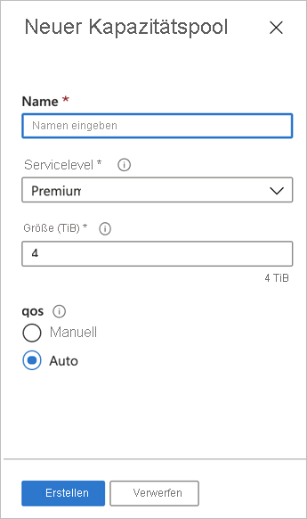

# Einrichten eines Kapazitätspools

Nach dem Einrichten eines Kapazitätspools können Sie Volumes in diesem Pool erstellen.  

## Voraussetzungen 

Sie müssen bereits ein NetApp-Konto erstellt haben.   

[Erstellen eines NetApp-Kontos](azure-netapp-files-create-netapp-account.md)

## Schritte 

1. Navigieren Sie zum Blatt für die Verwaltung Ihres NetApp-Kontos, und klicken Sie anschließend im Navigationsbereich auf **Kapazitätspools**.  
    
    

2. Klicken Sie auf **+ Pools hinzufügen**, um einen neuen Kapazitätspool zu erstellen.   
    Das Fenster für den neuen Kapazitätspool wird angezeigt.

3. Geben Sie für den neuen Kapazitätspool folgende Informationen an:  
   * **Name**  
     Geben Sie den Namen für den Kapazitätspool an.  
     Der Name des Kapazitätspools muss für jedes NetApp-Konto eindeutig sein.

   * **Servicelevel**   
     In diesem Feld wird die gewünschte Leistung des Kapazitätspools angezeigt.  
     Geben Sie die Dienstebene für den Kapazitätspool an: [**Ultra**](azure-netapp-files-service-levels.md#Ultra), [**Premium**](azure-netapp-files-service-levels.md#Premium) oder [**Standard**](azure-netapp-files-service-levels.md#Standard).

    * **Größe**     
     Geben Sie die Größe des Kapazitätspools an, den Sie erwerben.        
     Die Mindestgröße eines Kapazitätspools beträgt 4 TiB. Die Poolgröße kann auf ein Vielfaches von 4 TiB festgelegt werden.   

   * **QoS**   
     Geben Sie an, ob für den Kapazitätspool der QoS-Typ **Manuell** oder **Automatisch** verwendet werden soll.  

     Informationen zu den QoS-Typen finden Sie unter [Speicherhierarchie von Azure NetApp Files](azure-netapp-files-understand-storage-hierarchy.md) und [Überlegungen zur Leistung für Azure NetApp Files](azure-netapp-files-performance-considerations.md).  

     > [!IMPORTANT] 
     > Wenn Sie **QoS-Typ** auf **Manuell** festlegen, kann dies nicht rückgängig gemacht werden. Sie können einen manuellen QoS-Kapazitätspool nicht auf die Verwendung des QoS-Typs „Automatisch“ umstellen. Sie können jedoch einen automatischen QoS-Kapazitätspool auf die Verwendung des QoS-Typs „Manuell“ umstellen. Weitere Informationen finden Sie unter [Ändern eines Kapazitätspools für die Verwendung der manuellen QoS](manage-manual-qos-capacity-pool.md#change-to-qos).   

    

4. Klicken Sie auf **Erstellen**.

## Nächste Schritte 

- [Speicherhierarchie](azure-netapp-files-understand-storage-hierarchy.md) 
- [Dienstebenen für Azure NetApp Files](azure-netapp-files-service-levels.md)
- [Seite mit den Preisen von Azure NetApp Files](https://azure.microsoft.com/pricing/details/storage/netapp/)
- [Verwalten eines manuellen QoS-Kapazitätspools](manage-manual-qos-capacity-pool.md)
- [Delegieren eines Subnetzes für Azure NetApp Files](azure-netapp-files-delegate-subnet.md)
