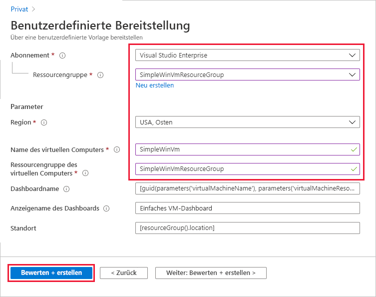
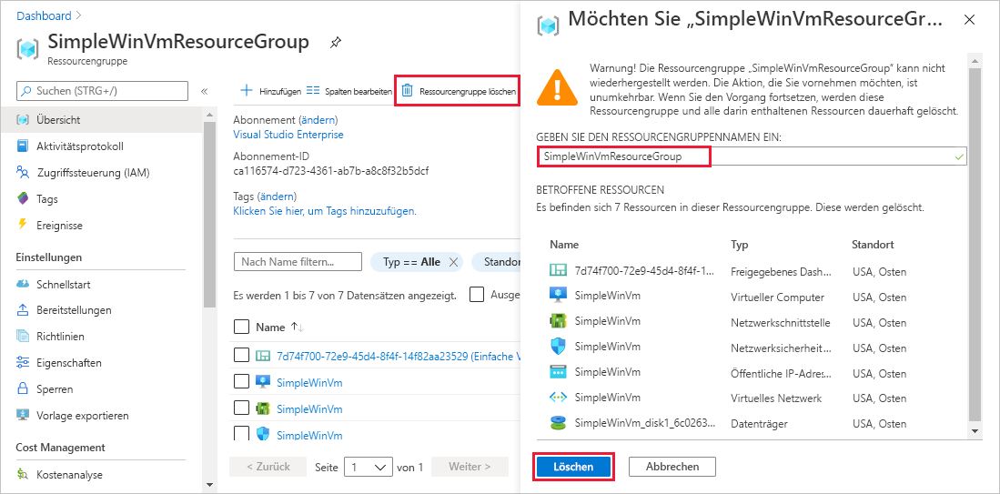

# <a name="quickstart-create-a-dashboard-in-the-azure-portal-by-using-an-arm-template"></a>Schnellstart: Erstellen eines Dashboards im Azure-Portal mithilfe einer ARM-Vorlage

Ein Dashboard im Azure-Portal bietet eine fokussierte und organisierte Ansicht Ihrer Cloudressourcen. In dieser Schnellstartanleitung geht es um die Bereitstellung einer Azure Resource Manager-Vorlage (ARM-Vorlage) zum Erstellen eines Dashboards. Das Dashboard zeigt die Leistung eines virtuellen Computers (VM) sowie einige statische Informationen und Verknüpfungen an.

[!INCLUDE [About Azure Resource Manager](../../includes/resource-manager-quickstart-introduction.md)]

Wenn Ihre Umgebung die Voraussetzungen erfüllt und Sie mit der Verwendung von ARM-Vorlagen vertraut sind, klicken Sie auf die Schaltfläche **In Azure bereitstellen**. Die Vorlage wird im Azure-Portal geöffnet.

[](https://portal.azure.com/#create/Microsoft.Template/uri/https%3A%2F%2Fraw.githubusercontent.com%2FAzure%2Fazure-quickstart-templates%2Fmaster%2Fquickstarts%2Fmicrosoft.portal%2Fazure-portal-dashboard%2Fazuredeploy.json)

## <a name="prerequisites"></a>Voraussetzungen

- Wenn Sie kein Azure-Abonnement besitzen, können Sie ein [kostenloses Konto](https://azure.microsoft.com/free/?WT.mc_id=A261C142F) erstellen, bevor Sie beginnen.
- Ein vorhandener virtueller Computer.

## <a name="create-a-virtual-machine"></a>Erstellen eines virtuellen Computers

Das Dashboard, das Sie im nächsten Teil dieses Schnellstarts erstellen, erfordert eine vorhandene VM. Führen Sie diese Schritte durch, um eine VM zu erstellen.

1. Wählen Sie im Azure-Portal die Option **Cloud Shell** aus.

    

1. Wählen Sie im Fenster **Cloud Shell** die Option **PowerShell** aus.

    

1. Kopieren Sie den folgenden Befehl, und geben Sie ihn an der Eingabeaufforderung ein, um eine Ressourcengruppe zu erstellen.

    ```powershell
    New-AzResourceGroup -Name SimpleWinVmResourceGroup -Location EastUS
    ```

    

1. Kopieren Sie den folgenden Befehl, und geben Sie ihn an der Eingabeaufforderung ein, um eine VM in der Ressourcengruppe zu erstellen.

    ```powershell
    New-AzVm `
        -ResourceGroupName "SimpleWinVmResourceGroup" `
        -Name "SimpleWinVm" `
        -Location "East US" 
    ```

1. Geben Sie einen Benutzernamen und ein Kennwort für den virtuellen Computer ein. Dabei handelt es sich um einen neuen Benutzernamen und ein neues Kennwort, also beispielsweise nicht das Konto, mit dem Sie sich bei Azure anmelden. Weitere Informationen finden Sie unter [Anforderungen an Benutzernamen](../virtual-machines/windows/faq.yml#what-are-the-username-requirements-when-creating-a-vm-) und [Anforderungen an Kennwörter](../virtual-machines/windows/faq.yml#what-are-the-password-requirements-when-creating-a-vm-).

    Die Bereitstellung des virtuellen Computers wird jetzt gestartet und dauert in der Regel ein paar Minuten. Fahren Sie nach Abschluss der Bereitstellung mit dem nächsten Abschnitt fort.

## <a name="review-the-template"></a>Überprüfen der Vorlage

Die in dieser Schnellstartanleitung verwendete Vorlage stammt von der Seite mit den [Azure-Schnellstartvorlagen](https://azure.microsoft.com/resources/templates/azure-portal-dashboard/). Die Vorlage für diesen Artikel ist zu lang und kann hier nicht angezeigt werden. Die Vorlage können Sie sich in [azuredeploy.json](https://raw.githubusercontent.com/Azure/azure-quickstart-templates/master/quickstarts/microsoft.portal/azure-portal-dashboard/azuredeploy.json) ansehen. In der Vorlage ist eine Azure-Ressource definiert, [Microsoft.Portal/dashboards](/azure/templates/microsoft.portal/dashboards) – Erstellen eines Dashboards im Azure-Portal.

## <a name="deploy-the-template"></a>Bereitstellen der Vorlage

1. Klicken Sie auf das folgende Bild, um sich bei Azure anzumelden und eine Vorlage zu öffnen.

    [](https://portal.azure.com/#create/Microsoft.Template/uri/https%3A%2F%2Fraw.githubusercontent.com%2FAzure%2Fazure-quickstart-templates%2Fmaster%2Fquickstarts%2Fmicrosoft.portal%2Fazure-portal-dashboard%2Fazuredeploy.json)

1. Wählen Sie die folgenden Werte aus, oder geben Sie sie ein, und wählen Sie dann **Überprüfen + erstellen** aus.

    

    Sofern nicht anders angegeben, verwenden Sie die Standardwerte, um das Dashboard zu erstellen.

    * **Abonnement**: Wählen Sie ein Azure-Abonnement aus.
    * **Ressourcengruppe**: Wählen Sie **SimpleWinVmResourceGroup** aus.
    * **Standort**: Wählen Sie **USA, Osten** aus.
    * **Name des virtuellen Computers**: Geben Sie **SimpleWinVm** ein.
    * **Ressourcengruppe des virtuellen Computers**: Geben Sie **SimpleWinVmResourceGroup** ein.

1. Wählen Sie **Erstellen** oder **Kaufen** aus. Nach der erfolgreichen Bereitstellung des Dashboards erhalten Sie eine Benachrichtigung:

    

Zum Bereitstellen der Vorlage wurde das Azure-Portal verwendet. Neben dem Azure-Portal können Sie auch Azure PowerShell, die Azure-Befehlszeilenschnittstelle (Azure CLI) und die REST-API verwenden. Informationen zu anderen Bereitstellungsmethoden finden Sie unter [Bereitstellen von Vorlagen](../azure-resource-manager/templates/deploy-powershell.md).

## <a name="review-deployed-resources"></a>Überprüfen der bereitgestellten Ressourcen

[!INCLUDE [azure-portal-review-deployed-resources](../../includes/azure-portal-review-deployed-resources.md)]

## <a name="clean-up-resources"></a>Bereinigen von Ressourcen

Wenn Sie den virtuellen Computer und das zugehörige Dashboard entfernen möchten, löschen Sie die Ressourcengruppe, in der diese enthalten sind.

1. Suchen Sie im Azure-Portal nach **SimpleWinVmResourceGroup-** , und wählen Sie sie in den Suchergebnissen aus.

1. Wählen Sie auf der Seite **SimpleWinVmResourceGroup** die Option **Ressourcengruppe löschen** aus, geben Sie zur Bestätigung den Ressourcengruppennamen ein, und wählen Sie dann **Löschen** aus.

    

## <a name="next-steps"></a>Nächste Schritte

Weitere Informationen zu Dashboards im Azure-Portal finden Sie unter:

> [!div class="nextstepaction"]
> [Erstellen und Freigeben von Dashboards im Azure-Portal](azure-portal-dashboards.md).
