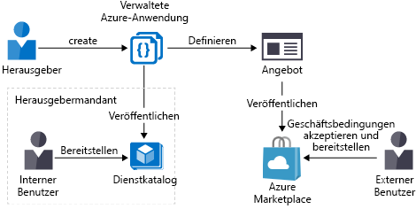

# Übersicht über verwaltete Azure-Anwendungen

Verwaltete Azure-Anwendungen ermöglichen es Ihnen, Ihren Kunden Cloudlösungen anzubieten, die diese einfach bereitstellen und betreiben können. Sie implementieren die Infrastruktur und bieten kontinuierlichen Support. Wenn Sie eine verwaltete Anwendung für alle Kunden verfügbar machen möchten, können Sie sie im Azure Marketplace veröffentlichen. Wenn Sie sie nur Benutzern in Ihrer Organisation zur Verfügung stellen möchten, können Sie sie in einem internen Katalog veröffentlichen. 

Eine verwaltete Anwendung ähnelt bis auf einen wichtigen Unterschied einer Marketplace-Lösungsvorlage. Bei einer verwalteten Anwendung werden die Ressourcen in einer Ressourcengruppe bereitgestellt, die vom Herausgeber der App verwaltet wird. Die Ressourcengruppe befindet sich zwar im Abonnement des Verbrauchers, eine Identität im Mandanten des Herausgebers hat jedoch Zugriff auf die Ressourcengruppe. Als Herausgeber geben Sie die Kosten für den kontinuierlichen Support der Lösung an.

> [!NOTE]
> Früher war die Dokumentation für benutzerdefinierte Azure-Anbieter in der Dokumentation für verwaltete Anwendungen enthalten. Diese Dokumentation wurde verschoben. Sie befindet sich jetzt unter [Benutzerdefinierte Azure-Anbieter](../custom-providers/overview.md).

## Vorteile von verwalteten Anwendungen

Verwaltete Anwendungen bauen Hürden für Verbraucher ab, die Ihre Lösungen verwenden. Verbraucher benötigen keine Cloudinfrastrukturkenntnisse, um Ihre Lösung verwenden zu können. Verbraucher haben eingeschränkten Zugriff auf die kritischen Ressourcen und müssen sich keine Sorgen machen, beim Verwalten einen Fehler zu begehen. 

Mithilfe von verwalteten Anwendungen können Sie eine anhaltende Beziehung zu Ihren Verbrauchen aufbauen. Sie definieren die Bedingungen für die Verwaltung der Anwendung, und sämtliche Gebühren werden über Azure abgerechnet.

Obwohl Kunden diese verwalteten Anwendungen in ihren Abonnements bereitstellen, müssen sie diese nicht verwalten, aktualisieren oder betreuen. Sie können sicherstellen, dass alle Kunden genehmigte Versionen verwenden. Für die Verwaltung dieser Anwendungen müssen sich Kunden kein anwendungsspezifisches Domänenwissen aneignen. Kunden erhalten automatisch Anwendungsupdates, ohne sich mit der Behandlung und Diagnose von Anwendungsproblemen befassen zu müssen. 

Für IT-Teams können Sie mit verwalteten Anwendungen vorab genehmigte Lösungen für Benutzer in der Organisation anbieten. Sie wissen, dass diese Lösungen mit den Standards der Organisation konform sind.

Verwaltete Anwendungen unterstützen [verwaltete Identitäten für Azure-Ressourcen](./publish-managed-identity.md).

## Arten von verwalteten Anwendungen

Sie können Ihre verwaltete Anwendung entweder extern oder intern veröffentlichen.

### Dienstkatalog

Der Dienstkatalog ist ein interner Katalog mit freigegebenen Lösungen für Benutzer in einer Organisation. Sie verwenden den Katalog, um Organisationsstandards zu erfüllen, während Lösungen für die Organisationen angeboten werden. Mitarbeiter können über den Katalog komfortabel Anwendungen finden, die die IT-Abteilung empfohlen und freigegeben hat. Sie sehen die verwalteten Anwendungen, die auch von anderen Personen in der Organisation verwendet werden.

Informationen zum Veröffentlichen einer verwalteten Dienstkataloganwendung finden Sie unter [Erstellen einer Dienstkataloganwendung](publish-service-catalog-app.md).

### Marketplace

Anbieter, die ihre Dienste kostenpflichtig anbieten möchten, können eine verwaltete Anwendung über den Azure Marketplace verfügbar machen. Die veröffentlichte Anwendung ist für Benutzer außerhalb der Organisation verfügbar. So können Anbieter verwalteter Dienste (Managed Service Providers, MSPs), unabhängige Softwarehersteller (Independent Software Vendors, ISVs) und Systemintegratoren (SIs) ihre Lösung allen Azure-Kunden anbieten.

Informationen zum Veröffentlichen einer verwalteten Anwendung im Marketplace finden Sie unter [Erstellen einer Marketplace-Anwendung](../../marketplace/create-new-azure-apps-offer.md).

## Ressourcengruppen für verwaltete Anwendungen

Die Ressourcen für eine verwaltete Anwendung befinden sich üblicherweise in zwei Ressourcengruppen. Eine wird vom Verbraucher verwaltet, die andere vom Herausgeber. Beim Definieren der verwalteten Anwendung gibt der Herausgeber die Zugriffsebenen an. Der Herausgeber kann eine permanente Rollenzuweisung oder [Just-In-Time-Zugriff](request-just-in-time-access.md) für eine Zuweisung anfordern, die auf einen bestimmten Zeitraum beschränkt ist.

Das Einschränken des Zugriffs für [Datenvorgänge](../../role-based-access-control/role-definitions.md) wird derzeit nicht für alle Datenanbieter in Azure unterstützt.

Die folgende Abbildung zeigt ein Szenario, in dem der Herausgeber die Besitzerrolle für die verwaltete Ressourcengruppe anfordert. Der Herausgeber hat die Ressourcengruppe für den Verbraucher mit einer Schreibschutzsperre belegt. Dies gilt nicht für die Identitäten des Herausgebers, denen Zugriff auf die verwaltete Ressourcengruppe gewährt wird.

### Anwendungsressourcengruppe

Diese Ressourcengruppe enthält die Instanz der verwalteten Anwendung. Diese Ressourcengruppe darf nur eine einzelne Ressource enthalten. Der Ressourcentyp der verwalteten Anwendung lautet **Microsoft.Solutions/applications**.

Der Verbraucher hat uneingeschränkten Zugriff auf die Ressourcengruppe und verwendet sie zum Verwalten des Lebenszyklus der verwalteten Anwendung.

### Verwaltete Ressourcengruppe

Diese Ressourcengruppe enthält alle Ressourcen, die von der verwalteten Anwendung benötigt werden. Hierzu zählen beispielsweise die virtuellen Computer, Speicherkonten und virtuellen Netzwerke für die Lösung. Der Verbraucher hat eingeschränkten Zugriff auf diese Ressourcengruppe, da er nicht die einzelnen Ressourcen für die verwaltete Anwendung verwaltet. Der Zugriff des Herausgebers auf diese Ressourcengruppe entspricht der Rolle, die in der Definition der verwalteten Anwendung angegeben ist. Der Herausgeber kann für diese Ressourcengruppe beispielsweise die Rolle „Besitzer“ oder „Mitwirkender" anfordern. Der Zugriff gilt entweder permanent oder ist auf einen bestimmten Zeitraum beschränkt.

Beim Veröffentlichen der [verwalteten Anwendung im Marketplace](../../marketplace/create-new-azure-apps-offer.md) kann der Herausgeber den Verbrauchern die Möglichkeit gewähren, bestimmte Aktionen an Ressourcen in der verwalteten Ressourcengruppe vorzunehmen. Beispielsweise kann der Herausgeber angeben, dass Verbraucher virtuelle Computer neu starten können. Alle anderen Aktionen, die über Leseaktionen hinausgehen, werden weiterhin verweigert. Für Änderungen an Ressourcen in einer verwalteten Ressourcengruppe, die von einem Consumer mit zulässigen Aktionen vorgenommen werden, gelten die [Azure Policy](../../governance/policy/overview.md)-Zuweisungen innerhalb des Consumermandanten, der die verwaltete Ressourcengruppe einbezieht.

Wenn der Verbraucher die verwaltete Anwendung löscht, wird auch die verwaltete Ressourcengruppe gelöscht.

## Azure Policy

Sie können eine [Azure Policy](../../governance/policy/overview.md)-Instanz anwenden, um Ihre verwaltete Anwendung zu überwachen. Richtliniendefinitionen werden angewendet, um sicherzustellen, dass die bereitgestellten Instanzen Ihrer verwalteten Anwendung die Daten- und Sicherheitsanforderungen erfüllen. Falls Ihre Anwendung mit sensiblen Daten interagiert, müssen Sie prüfen, wie diese Daten geschützt werden müssen. Interagiert Ihre Anwendung also beispielsweise mit Daten aus Microsoft 365, wenden Sie eine Richtliniendefinition an, um sicherzustellen, dass die Datenverschlüsselung aktiviert ist.

## Nächste Schritte

In diesem Artikel haben Sie Informationen zu den Vorteilen erhalten, die sich bei der Verwendung von verwalteten Anwendungen ergeben. Fahren Sie mit dem nächsten Artikel fort, um eine Definition für die verwaltete Anwendung zu erstellen.

> [!div class="nextstepaction"]
> [Schnellstart: Veröffentlichen einer Definition für eine verwaltete Azure-Anwendung](publish-service-catalog-app.md)