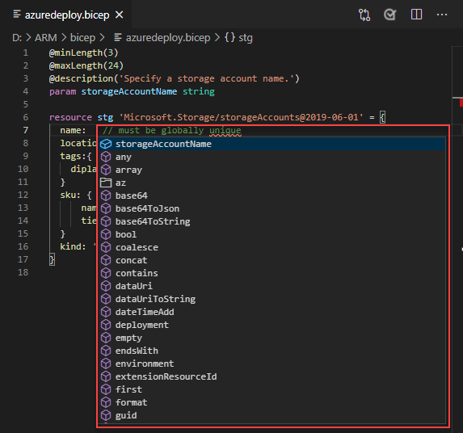

# <a name="quickstart-create-bicep-files-with-visual-studio-code"></a>Schnellstart: Erstellen von Bicep-Dateien mit Visual Studio Code

Die Bicep-Erweiterung für Visual Studio Code bietet Sprachunterstützung und automatische Vervollständigung für Ressourcen. Diese Tools unterstützen Sie beim Erstellen und Überprüfen von [Bicep](./bicep-overview.md)-Dateien. In diesem Schnellstart verwenden Sie die Erweiterung, um eine Bicep-Datei von Grund auf zu erstellen. Dabei lernen Sie die Funktionen der Erweiterung kennen, z. B. die Überprüfung und Vervollständigung.

Für diesen Schnellstart benötigen Sie [Visual Studio Code](https://code.visualstudio.com/) mit der [Bicep-Erweiterung](https://marketplace.visualstudio.com/items?itemName=ms-azuretools.vscode-bicep) installiert. Außerdem müssen Sie die neueste Version der [Azure CLI](/cli/azure/) oder das neueste [Azure PowerShell-Modul](/powershell/azure/new-azureps-module-az) installieren und authentifizieren.

Wenn Sie kein Azure-Abonnement besitzen, können Sie ein [kostenloses Konto](https://azure.microsoft.com/free/) erstellen, bevor Sie beginnen.

## <a name="create-a-bicep-file"></a>Erstellen einer Bicep-Datei

Erstellen und öffnen Sie Visual Studio Code mit einer neuen Datei namens *azuredeploy.bicep*.

## <a name="add-an-azure-resource"></a>Hinzufügen einer Azure-Ressource

Fügen Sie eine grundlegende Speicherkontoressource zur Bicep-Datei hinzu.

```bicep
resource stg 'Microsoft.Storage/storageAccounts@2019-06-01' = {
  name: 'storageaccount1' // must be globally unique
  location: 'eastus'
  tags:{
    diplayName: 'storageaccount1'
  }
  sku: {
      name: 'Standard_LRS'
      tier: 'Standard'
  }
  kind: 'Storage'
}
```

Die Ressourcendeklaration umfasst vier Komponenten:

- **resource:** Hierbei handelt es sich um das Schlüsselwort.
- **symbolic name** (stg): Der symbolische Name ist ein Bezeichner zum Referenzieren der Ressource in Ihrer Bicep-Datei. Dabei handelt es sich nicht um den Namen der Ressource, der nach der Bereitstellung verwendet wird. Der Name der Ressource wird von der Eigenschaft **name** definiert.  Weitere Informationen finden Sie in der vierten Komponente in dieser Liste.
- **resource type** (Microsoft.Storage/storageAccounts@2019-06-01): Diese Komponente besteht aus dem Ressourcenanbieter (Microsoft.Storage), dem Ressourcentyp (storageAccounts) und der API-Version (apiVersion: 2019-06-01). Jeder Ressourcenanbieter veröffentlicht seine eigenen API-Versionen. Dieser Wert unterscheidet sich daher je nach Typ. Weitere Typen und API-Versionen für verschiedene Azure-Ressourcen finden Sie in der [ARM-Vorlagenreferenz](/azure/templates/).
- **properties** (alles innerhalb von „= {...}“): Hier legen Sie die Eigenschaften für den Ressourcentyp fest. Jede Ressource umfasst eine `name`-Eigenschaft. Die meisten Ressourcen verfügen auch über eine `location`-Eigenschaft, mit der die Region festgelegt wird, in der die Ressource bereitgestellt wird. Die anderen Eigenschaften variieren je nach Ressourcentyp und API-Version.

## <a name="completion-and-validation"></a>Vervollständigung und Überprüfung

Eine der praktischsten Funktionen der Erweiterung ist die Azure-Schemaintegration. Durch Azure-Schemas stehen der Erweiterung Überprüfungs- und ressourcenbasierte Vervollständigungsfunktionen zur Verfügung. Im nächsten Schritt wird das Speicherkonto geändert, um die Überprüfung und Vervollständigung in Aktion zu sehen.

Legen Sie zunächst die Art des Speicherkontos auf einen ungültigen Wert fest (beispielsweise `megaStorage`). Beachten Sie, dass diese Aktion zu einer Warnung mit dem Hinweis führt, dass `megaStorage` kein gültiger Wert ist.


Entfernen Sie `megaStorage`, platzieren Sie den Cursor in den einfachen Anführungszeichen, und drücken Sie `ctrl` + `space`, um die Vervollständigungsfunktionen zu verwenden. Daraufhin wird eine Vervollständigungsliste mit gültigen Werten angezeigt.


## <a name="add-parameters"></a>Hinzufügen von Parametern

Erstellen Sie nun einen Parameter, und verwenden Sie ihn zur Angabe des Speicherkontonamens.

Fügen Sie am Anfang der Datei folgenden Code hinzu:

```bicep
@minLength(3)
@maxLength(24)
@description('Specify a storage account name.')
param storageAccountName string
```

Azure-Speicherkontonamen müssen zwischen drei und 24 Zeichen lang sein. Verwenden Sie `minLength` und `maxLength` zum Angeben geeigneter Werte.

Aktualisieren Sie nun in der Speicherressource die Namenseigenschaft, um den Parameter zu verwenden. Entfernen Sie hierzu den aktuellen Namen der Speicherressource, einschließlich der einfachen Anführungszeichen. Drücken Sie `ctrl` + `space`. Wählen Sie den Parameter **storageAccountName** aus der Liste aus. Beachten Sie, dass Sie die Parameter direkt mithilfe ihrer Namen in Bicep referenzieren können. JSON-Vorlagen erfordern die Funktion „parameter()“.



## <a name="deploy-the-bicep-file"></a>Bereitstellen der Bicep-Datei

Öffnen Sie das integrierte Visual Studio Code-Terminal mithilfe der Tastenkombination `ctrl` + ```` ` ````, ändern Sie das aktuelle Verzeichnis in das Verzeichnis, in dem sich die Bicep-Datei befinden, und verwenden Sie dann entweder die Azure CLI oder das Azure PowerShell-Modul zum Bereitstellen der Bicep-Datei.

# <a name="cli"></a>[BEFEHLSZEILENSCHNITTSTELLE (CLI)](#tab/CLI)

```azurecli
az group create --name arm-vscode --location eastus

az deployment group create --resource-group arm-vscode --template-file azuredeploy.bicep --parameters storageAccountName={your-unique-name}
```

# <a name="powershell"></a>[PowerShell](#tab/PowerShell)

```azurepowershell
New-AzResourceGroup -Name arm-vscode -Location eastus

New-AzResourceGroupDeployment -ResourceGroupName arm-vscode -TemplateFile ./azuredeploy.bicep -storageAccountName "{your-unique-name}"
```

---

## <a name="clean-up-resources"></a>Bereinigen von Ressourcen

Wenn Sie die Azure-Ressourcen nicht mehr benötigen, löschen Sie die Ressourcengruppe der Schnellstartanleitung mithilfe der Azure-Befehlszeilenschnittstelle oder des Azure PowerShell-Moduls.

# <a name="cli"></a>[BEFEHLSZEILENSCHNITTSTELLE (CLI)](#tab/CLI)

```azurecli
az group delete --name arm-vscode
```

# <a name="powershell"></a>[PowerShell](#tab/PowerShell)

```azurepowershell
Remove-AzResourceGroup -Name arm-vscode
```

---

## <a name="next-steps"></a>Nächste Schritte

> [!div class="nextstepaction"]
> [Bicep-Tutorials für Anfänger](./bicep-tutorial-create-first-bicep.md)
