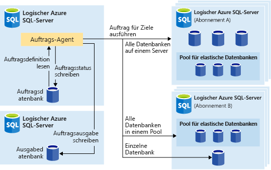
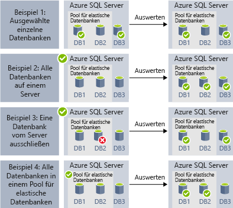
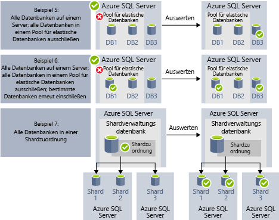

# Automatisieren von Verwaltungsaufgaben mithilfe elastischer Aufträge (Vorschau)

[!INCLUDE[appliesto-sqldb](../includes/appliesto-sqldb.md)]

Sie können elastische Aufträge erstellen und planen, die in regelmäßigen Abständen für einzelne oder mehrere Azure SQL-Datenbanken ausgeführt werden können, um T-SQL-Abfragen (Transact-SQL) und Wartungsaufgaben zu ermöglichen. 

Sie können eine Zieldatenbank oder Gruppen von Datenbanken sowie Zeitpläne für die Auftragsausführung definieren.
Ein Auftrag übernimmt die Aufgabe der Anmeldung bei der Zieldatenbank. Zudem können Sie Transact-SQL-Skripts zur Ausführung für eine Gruppe von Datenbanken definieren, verwalten und speichern.

Jeder Auftrag protokolliert den Ausführungsstatus und wiederholt die Vorgänge im Falle eines Fehlers automatisch.

## Empfohlene Verwendung für elastische Aufträge

Die Automatisierung mit elastischen Aufträgen kann in verschiedenen Szenarien hilfreich sein:

- Automatisierung von Verwaltungsaufgaben und Planung der Ausführung beispielsweise an jedem Werktag oder nach Geschäftsschluss usw.
  - Bereitstellung von Schemaänderungen, Anmeldeinformationsverwaltung, Leistungsdatensammlung oder Telemetrieerfassung für Mandanten (Kunden).
  - Aktualisierung von Referenzdaten (datenbankübergreifende Informationen), Laden von Daten aus Azure Blob Storage.
- Konfiguration von Aufträgen, sodass diese für eine gesamte Sammlung von Datenbanken auf wiederkehrender Basis ausgeführt werden (etwa in Zeiten mit geringer Auslastung).
  - Sammlung von Abfrageergebnissen aus einer Menge von Datenbanken in einer zentralen Tabelle auf fortlaufender Grundlage. Leistungsabfragen können fortlaufend ausgeführt werden und für die Auslösung der Ausführung weiterer Aufgaben konfiguriert werden.
- Sammeln von Berichtsdaten
  - Aggregation von Daten aus einer Sammlung von Datenbanken in einer einzelnen Zieltabelle.
  - Ausführung von Abfragen zur Datenverarbeitung mit längerer Laufzeit für eine große Anzahl von Datenbanken, z.B. bei der Sammlung von Kundentelemetrie. Die Ergebnisse werden zur weiteren Analyse in einer einzelnen Zieltabelle gesammelt.
- Datenverschiebungen 

### Automatisierung auf anderen Plattformen

Im Anschluss finden Sie Auftragsplanungstechnologien für verschiedene Plattformen:

- **Elastische Aufträge** sind Auftragsplanungsdienste zum Ausführen benutzerdefinierter Aufträge für einzelne oder mehrere Datenbanken in Azure SQL-Datenbank.
- **SQL-Agent-Aufträge** werden vom SQL-Agent-Dienst ausgeführt, der weiterhin für die Aufgabenautomatisierung in SQL Server verwendet wird und auch in Azure SQL Managed Instance-Instanzen enthalten ist. In Azure SQL-Datenbank stehen keine SQL-Agent-Aufträge zur Verfügung.

Elastische Aufträge können für [Azure SQL-Datenbank-Instanzen](sql-database-paas-overview.md), für [Pools für elastische Datenbanken in Azure SQL-Datenbank](elastic-pool-overview.md) sowie für Azure SQL-Datenbank-Instanzen in [Shardzuordnungen](elastic-scale-shard-map-management.md) verwendet werden.

Bei der T-SQL-skriptbasierten Auftragsautomatisierung in SQL Server und Azure SQL Managed Instance kann ein [SQL-Agent](job-automation-managed-instances.md) verwendet werden. 

Bei der T-SQL-skriptbasierten Auftragsautomatisierung in Azure Synapse Analytics können Sie [Pipelines mit sich wiederholenden Triggern](../../synapse-analytics/data-integration/concepts-data-factory-differences.md) verwenden, die [auf Azure Data Factory basieren](../../synapse-analytics/data-integration/concepts-data-factory-differences.md).

Beachten Sie die Unterschiede zwischen dem (in SQL Server und als Teil von SQL Managed Instance verfügbaren) SQL-Agent und dem Datenbank-Agent für elastische Aufträge (der T-SQL für Azure SQL-Datenbank-Instanzen oder für Datenbanken in SQL Server und Azure SQL Managed Instance sowie in Azure Synapse Analytics ausführen kann).

| |Elastische Aufträge |SQL-Agent |
|---------|---------|---------|
|**Umfang** | Beliebige Anzahl von Datenbanken in Azure SQL-Datenbank und/oder Data Warehouses in derselben Azure-Cloud wie der Auftrags-Agent. Ziele können sich auf unterschiedlichen Servern, in unterschiedlichen Abonnements und/oder in unterschiedlichen Regionen befinden.   Zielgruppen können einzelne Datenbanken oder Data Warehouses oder alle Datenbanken eines Servers, eines Pools oder einer Shardzuordnung sein (dynamisch aufgezählt zum Zeitpunkt der Auftragsausführung). | Beliebige einzelne Datenbank in derselben Instanz wie der SQL-Agent. Das Multiserververwaltungsfeature des SQL Server-Agents ermöglicht zwar die Koordinierung der Auftragsausführung durch Master-/Zielinstanzen, steht in SQL Managed Instance allerdings nicht zur Verfügung. |
|**Unterstützte APIs und Tools** | Portal, PowerShell, T-SQL, Azure Resource Manager | T-SQL, SQL Server Management Studio (SSMS) |
 
## Ziele für elastische Aufträge

Mit **elastischen Aufträgen** können Sie einzelne oder mehrere T-SQL-Skripts parallel für eine große Anzahl von Datenbanken ausführen – entweder gemäß einem Zeitplan oder nach Bedarf.

Sie können Aufträge für eine beliebige Kombination von Datenbanken ausführen: für einzelne oder mehrere individuelle Datenbanken, für alle Datenbanken auf einem Server, für alle Datenbanken in einem Pool für elastische Datenbanken oder für eine Shardzuordnung – und zusätzlich mit der Flexibilität, spezifische Datenbanken ein- oder ausschließen zu können. Aufträge können für mehrere Server, für mehrere Pools und sogar für Datenbanken aus anderen Abonnements ausgeführt werden. Server und Pools werden zur Laufzeit dynamisch aufgezählt, sodass Aufträge für alle Datenbanken ausgeführt werden, die zum Zeitpunkt der Ausführung in der Zielgruppe vorhanden sind.

Die folgende Abbildung zeigt einen Auftrags-Agent, der Aufträge für die verschiedenen Arten von Zielgruppen ausführt:

### Komponenten elastischer Aufträge

|Komponente | Beschreibung (Weitere Details finden Sie im Anschluss an die Tabelle.) |
|---------|---------|
|[**Agent für elastische Aufträge**](#elastic-job-agent) | Der Azure-Ressource, die Sie zum Ausführen und Verwalten von Aufträgen erstellen. |
|[**Auftragsdatenbank**](#elastic-job-database) | Eine Datenbank in Azure SQL-Datenbank, in der der Auftrags-Agent auftragsbezogene Daten, Auftragsdefinitionen usw. speichert. |
|[**Zielgruppe**](#target-group) | Die Gruppe von Servern, Pools, Datenbanken und Shardzuordnungen, für die ein Auftrag ausgeführt werden soll. |
|[**Auftrag**](#elastic-jobs-and-job-steps) | Ein Auftrag ist eine Arbeitseinheit mit mindestens einem Auftragsschritt. Auftragsschritte geben das auszuführende T-SQL-Skript sowie andere für die Skriptausführung erforderliche Details an. |

#### Agent für elastische Aufträge

Bei einem Agent für elastische Aufträge handelt es sich um die Azure-Ressource zum Erstellen, Ausführen und Verwalten von Aufträgen. Der Agent für elastische Aufträge ist eine Azure-Ressource, die über das Portal erstellt wird. ([PowerShell](elastic-jobs-powershell-create.md) und REST werden ebenfalls unterstützt.)

Zum Erstellen eines **Agents für elastische Aufträge** muss eine Datenbank in Azure SQL­-Datenbank vorhanden sein. Der Agent konfiguriert die vorhandene Azure SQL-Datenbank-Instanz als [*Auftragsdatenbank*](#elastic-job-database).

Der Agent für elastische Aufträge ist kostenlos. Die Auftragsdatenbank wird zum gleichen Tarif abgerechnet wie eine Datenbank in Azure SQL-Datenbank.

#### Datenbank für elastische Aufträge

Die *Auftragsdatenbank* dient zum Definieren von Aufträgen sowie zum Nachverfolgen des Status und Verlaufs von Auftragsausführungen. Darüber hinaus wird die *Auftragsdatenbank* auch zum Speichern von Agent-Metadaten, Protokollen, Ergebnissen und Auftragsdefinitionen verwendet und enthält außerdem zahlreiche praktische gespeicherte Prozeduren sowie andere Datenbankobjekte zum Erstellen, Ausführen und Verwalten von Aufträgen mit T-SQL.

Für die aktuelle Vorschauversion muss eine Datenbank in Azure SQL-Datenbank (S0 oder höher) vorhanden sein, um einen Agent für elastische Aufträge erstellen zu können.

Die *Auftragsdatenbank* muss eine bereinigte, leere Azure SQL-Datenbank-Instanz mit mindestens dem Dienstziel S0 sein. Für die *Auftragsdatenbank* wird das Dienstziel S1 oder höher empfohlen, die optimale Wahl hängt jedoch von den Leistungsanforderungen Ihrer Aufträge ab (also von der Anzahl von Auftragsschritten, der Anzahl von Auftragszielen und der Ausführungshäufigkeit der Aufträge). 

Sollten Vorgänge für die Auftragsdatenbank unerwartet langsam sein, [überwachen](monitor-tune-overview.md#azure-sql-database-and-azure-sql-managed-instance-resource-monitoring) Sie die Datenbankleistung und die Ressourcenverwendung der Auftragsdatenbank in langsamen Phasen über das Azure-Portal oder mithilfe der dynamische Verwaltungssicht [sys.dm_db_resource_stats](/sql/relational-databases/system-dynamic-management-views/sys-dm-db-resource-stats-azure-sql-database). Wenn eine Ressource (etwa CPU, Daten-E/A oder Protokollschreibvorgänge) in langsamen Phasen nahezu vollständig ausgelastet ist, empfiehlt es sich gegebenenfalls, die Datenbank schrittweise auf höhere Dienstziele zu skalieren (entweder im [DTU-Modell](service-tiers-dtu.md) oder im [V-Kern-Modell](service-tiers-vcore.md)), bis sich die Leistung der Auftragsdatenbank ausreichend verbessert hat.

##### Berechtigungen für die Datenbank für elastische Aufträge

Im Zuge der Erstellung des Auftrags-Agents werden in der *Auftragsdatenbank* ein Schema, Tabellen und eine Rolle namens *jobs_reader* erstellt. Die Rolle wird mit folgenden Berechtigung erstellt und soll Administratoren eine präzisere Zugriffssteuerung für die Auftragsüberwachung ermöglichen:

|Rollenname |Berechtigungen des Schemas „jobs“ |Berechtigungen des Schemas „jobs_internal“ |
|---------|---------|---------|
|**jobs_reader** | SELECT | Keine |

> [!IMPORTANT]
> Bedenken Sie die Auswirkungen auf die Sicherheit, bevor Sie Datenbankadministratorzugriff auf die *Auftragsdatenbank* gewähren. Ein böswilliger Benutzer mit Berechtigungen zum Erstellen oder Bearbeiten von Aufträgen kann theoretisch einen Auftrag erstellen oder bearbeiten, der unter Verwendung gespeicherter Anmeldeinformationen eine Verbindung mit einer Datenbank herstellt, die der Kontrolle des böswilligen Benutzers unterliegt. Auf diese Weise kann der böswillige Benutzer dann das Kennwort der Anmeldeinformationen ermitteln.

#### Zielgruppe

Eine *Zielgruppe* definiert die Gruppe von Datenbanken, für die ein Auftragsschritt ausgeführt wird. Eine Zielgruppe kann eine beliebige Anzahl und Kombination der folgenden Optionen enthalten:

- **Logischer SQL-Server:** Bei Angabe eines Servers werden alle Datenbanken, die sich zum Zeitpunkt der Auftragsausführung auf dem Server befinden, in die Gruppe einbezogen. Damit die Gruppe vor der Auftragsausführung aufgezählt und aktualisiert werden kann, müssen die Anmeldeinformationen für die Masterdatenbank angegeben werden. Weitere Informationen zu logischen Servern finden Sie unter [Was ist ein logischer SQL-Server in Azure SQL-Datenbank und Azure Synapse?](logical-servers.md).
- **Pool für elastische Datenbanken:** Bei Angabe eines Pools für elastische Datenbanken werden alle Datenbanken, die sich zum Zeitpunkt der Auftragsausführung in dem Pool für elastische Datenbanken befinden, in die Gruppe einbezogen. Genau wie bei einem Server müssen die Anmeldeinformationen für die Masterdatenbank angegeben werden, damit die Gruppe vor der Auftragsausführung aktualisiert werden kann.
- **Einzelne Datenbank:** Geben Sie eine oder mehrere einzelne Datenbanken an, die in die Gruppe einbezogen werden sollen.
- **Shardzuordnung:** Datenbanken einer Shardzuordnung.

> [!TIP]
> Die Gruppe von Datenbanken in Zielgruppen mit Servern oder Pools wird dank *dynamischer Enumeration* zum Zeitpunkt der Auftragsausführung neu ausgewertet. Die dynamische Enumeration stellt sicher, dass **Aufträge für alle Datenbanken ausgeführt werden, die zum Zeitpunkt der Auftragsausführung auf dem Server oder im Pool vorhanden sind**. Das erneute Auswerten der Datenbankliste zur Laufzeit ist besonders hilfreich in Szenarios mit häufig wechselnder Pool- oder Servermitgliedschaft.

Pools und einzelne Datenbanken können in die Gruppe eingeschlossen oder aus der Gruppe ausgeschlossen werden. Dadurch können Sie eine Zielgruppe mit einer beliebigen Kombination von Datenbanken erstellen. So können Sie beispielsweise einer Zielgruppe einen Server hinzufügen, aber bestimmte Datenbanken aus einem Pool für elastische Datenbanken (oder den gesamten Pool) ausschließen.

Eine Zielgruppe kann Datenbanken aus mehreren Abonnements und aus mehreren Regionen enthalten. Im Vergleich zu Ausführungen in der gleichen Region ist bei regionsübergreifenden Ausführungen mit höheren Wartezeiten zu rechnen.

Die folgenden Beispiele zeigen, wie verschiedene Zielgruppendefinitionen zum Zeitpunkt der Auftragsausführung dynamisch aufgelistet werden, um zu bestimmen, welche Datenbanken vom Auftrag ausgeführt werden:

**Beispiel 1** zeigt eine Zielgruppe, die aus einer Liste einzelner Datenbanken besteht. Wenn ein Auftragsschritt mithilfe dieser Zielgruppe ausgeführt wird, wird die Aktion des Auftragsschritts in jeder dieser Datenbanken ausgeführt. 
**Beispiel 2** zeigt eine Zielgruppe, die einen Server als Ziel enthält. Wenn ein Auftragsschritt mit dieser Zielgruppe ausgeführt wird, wird der Server dynamisch aufgezählt, um die Liste der Datenbanken zu bestimmen, die sich aktuell auf dem Server befinden. Die Aktion des Auftragsschritts wird in jeder dieser Datenbanken ausgeführt. 
**Beispiel 3** zeigt eine ähnliche Zielgruppe wie *Beispiel 2*, eine einzelne Datenbank wird jedoch ausdrücklich ausgeschlossen. Die Aktion des Auftragsschritts wird in der ausgeschlossenen Datenbank *nicht* ausgeführt. 
**Beispiel 4** zeigt eine Zielgruppe, die einen Pool für elastische Datenbanken als Ziel enthält. So ähnlich wie in *Beispiel 2* wird der Pool zum Zeitpunkt der Auftragsausführung dynamisch aufgezählt, um die Liste der Datenbanken im Pool zu bestimmen.
  

**Beispiel 5** und **Beispiel 6** zeigen erweiterte Szenarien, bei denen Server, Datenbanken und Pools für elastische Datenbanken mithilfe von Ein- und Ausschlussregeln kombiniert werden können. 
**Beispiel 7** zeigt, dass die Shards in einer Shard-Zuordnung zum Zeitpunkt der Auftragsausführung ebenfalls ausgewertet werden können.

> [!NOTE]
> Die Auftragsdatenbank kann selbst Ziel eines Auftrags sein. In diesem Szenario wird die Auftragsdatenbank genau wie jede andere Zieldatenbank behandelt. Der Auftragsbenutzer muss in der Auftragsdatenbank mit ausreichenden Berechtigungen erstellt werden, und die datenbankweit gültigen Anmeldeinformationen für den Auftragsbenutzer müssen auch in der Auftragsdatenbank vorhanden sein (genau wie bei anderen Zieldatenbanken).

#### Elastische Aufträge und Auftragsschritte

Ein *Auftrag* ist eine Arbeitseinheit, die gemäß einem Zeitplan oder als einmaliger Auftrag ausgeführt wird. Ein Auftrag enthält mindestens einen *Auftragsschritt*.

Jeder Auftragsschritt gibt ein auszuführendes T-SQL-Skript, mindestens eine Zielgruppe für die T-SQL-Skriptausführung sowie die Anmeldeinformationen an, die der Auftrags-Agent für die Verbindungsherstellung mit der Zieldatenbank benötigt. Jeder Auftragsschritt verfügt über anpassbare Timeout- und Wiederholungsrichtlinien und kann optional mit Ausgabeparametern versehen werden.

#### Auftragsausgabe

Das Ergebnis der Auftragsschritte wird für jede Zieldatenbank detailliert erfasst, und als Ziel für die Skriptausgabe kann eine Tabelle angegeben werden. Sie können eine Datenbank angeben, in der alle von einem Auftrag zurückgegebenen Daten gespeichert werden.

#### Auftragsverlauf

Der Ausführungsverlauf eines elastischen Auftrags in der *Auftragsdatenbank* kann durch [Abfragen der Tabelle „jobs.job_executions“](elastic-jobs-tsql-create-manage.md#monitor-job-execution-status) angezeigt werden. Daten des Ausführungsverlaufs, die älter als 45 Tage sind, werden durch einen Systembereinigungsauftrag bereinigt. Wenn Sie Verlaufsdaten löschen möchten, die noch keine 45 Tage alt sind, rufen Sie die gespeicherte Prozedur **sp_purge_history** in der *Auftragsdatenbank* auf.

#### Auftragsstatus

Die Ausführung elastischer Aufträge in der *Auftragsdatenbank* kann durch [Abfragen der Tabelle „jobs.job_executions“](elastic-jobs-tsql-create-manage.md#monitor-job-execution-status) überwacht werden. 

### Leistung, Kapazität und Einschränkungen des Agents

Elastische Aufträge benötigen nur sehr wenig Computeressourcen, während sie auf den Abschluss von Aufträgen mit langer Ausführungszeit warten.

Die Compute- und Leistungsanforderungen, die der Agent an die *Auftragsdatenbank* stellt, hängen von der Größe der Zielgruppe mit den Datenbanken und der gewünschten Ausführungszeit für einen Auftrag (Anzahl gleichzeitiger Worker) ab: je mehr Ziele und je höher die Anzahl von Aufträgen, desto höher die Computeanforderungen.

Der Grenzwert liegt aktuell bei 100 gleichzeitigen Aufträgen.

#### Verhindern einer Leistungsbeeinträchtigung für die Zieldatenbank durch Aufträge

Die Anzahl von Datenbanken, für die ein Auftrag gleichzeitig ausgeführt werden kann, kann beschränkt werden, um sicherzustellen, dass es beim Ausführen von Aufträgen für Datenbanken in einem elastischen SQL-Pool nicht zu einer Überlastung der Ressourcen kommt.

## Nächste Schritte

- [Verwalten von Datenbankgruppen mithilfe von Aufträgen für die elastische Datenbank](elastic-jobs-overview.md)
- [Erstellen und Verwalten von elastischen Aufträgen mithilfe von PowerShell](elastic-jobs-powershell-create.md)
- [Erstellen und Verwalten von Aufträgen für die elastische Datenbank mithilfe von Transact-SQL (T-SQL)](elastic-jobs-tsql-create-manage.md)