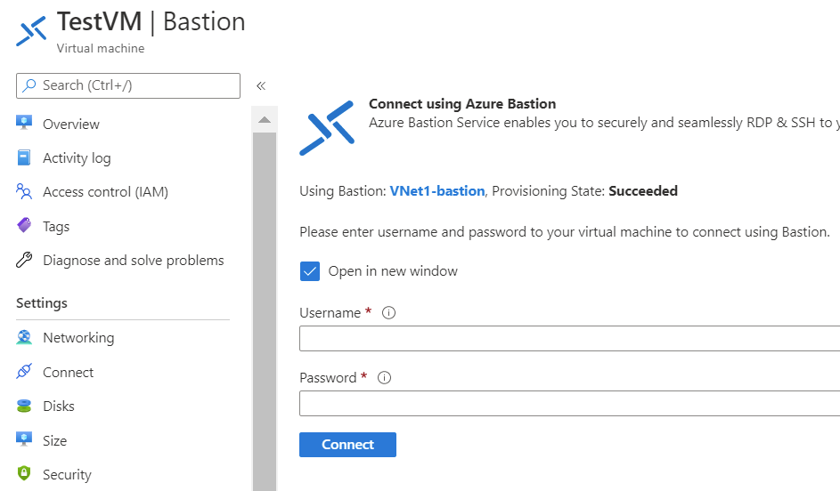

# Schnellstart: Herstellen einer Verbindung mit einem virtuellen Computer mit einer privaten IP-Adresse und Azure Bastion

In dieser Schnellstartanleitung wird veranschaulicht, wie Sie mit einer privaten IP-Adresse eine Verbindung mit einem virtuellen Computer herstellen. Beim Herstellen einer Verbindung über Bastion benötigen Ihre virtuellen Computer keine öffentliche IP-Adresse. Mit den Schritten in diesem Artikel können Sie Bastion für Ihr virtuelles Netzwerk über Ihren virtuellen Computer im Portal bereitstellen. Nachdem der Dienst bereitgestellt wurde, ist die RDP/SSH-Umgebung für alle virtuellen Computer des jeweiligen virtuellen Netzwerks verfügbar.

## Voraussetzungen

* Ein virtuelles Azure-Netzwerk
* Ein virtueller Azure-Computer im virtuellen Netzwerk mit geöffnetem Port 3389.

### Beispielwerte

|**Name** | **Wert** |
| --- | --- |
| Name |  VNet1Bastion |
| Region | eastus |
| Virtuelles Netzwerk |  VNet1 |
| + Subnetzname | AzureBastionSubnet |
| AzureBastionSubnet-Adressen |  10.1.254.0/27 |
| Öffentliche IP-Adresse |  Neu erstellen |
| Name der öffentlichen IP-Adresse | VNet1BastionPIP  |
| SKU der öffentlichen IP-Adresse |  Standard  |
| Zuweisung  | statischen |

## Erstellen eines Bastion-Hosts

Wenn Sie im Portal einen Bastion-Host über einen bereits vorhandenen virtuellen Computer erstellen, werden verschiedene Einstellungen automatisch auf Standardwerte für Ihren virtuellen Computer bzw. Ihr virtuelles Netzwerk festgelegt.

1. Öffnen Sie das [Azure-Portal](https://portal.azure.com). Navigieren Sie zu Ihrem virtuellen Computer, und klicken Sie dann auf **Verbinden**.

   
1. Wählen Sie in der Dropdownliste die Option **Bastion** aus.
1. Wählen Sie auf der Seite „Verbinden“ die Option **Bastion verwenden** aus.

   

1. Füllen Sie auf der Seite „Bastion“ die folgenden Einstellungsfelder aus:

   * **Name**: Benennen des Bastion-Hosts
   * **Subnetz**: Das Subnetz in Ihrem virtuellen Netzwerk, in dem die Bastion-Ressource bereitgestellt wird. Das Subnetz muss mit dem Namen **AzureBastionSubnet** erstellt werden. Aufgrund dieses Namens weiß Azure, in welchem Subnetz die Bastion-Ressource bereitgestellt werden soll. Dieses Subnetz unterscheidet sich von einem Gatewaysubnetz. Verwenden Sie mindestens ein Subnetz der Größe „/27“ oder ein größeres Subnetz („/27“, „/26“, „/25“ usw.).
   
      * Wählen Sie **Subnetzkonfiguration verwalten** und dann **+ Subnetz** aus.
      * Geben Sie auf der Seite „Subnetz hinzufügen“ den Namen **AzureBastionSubnet** ein.
      * Geben Sie den Adressbereich in CIDR-Notation ein. Beispiel: 10.1.254.0/27.
      * Klicken Sie auf **OK**, um das Subnetz zu erstellen. Navigieren Sie oben auf der Seite zurück zu Bastion, um die restlichen Einstellungen einzugeben.

         
   * **Öffentliche IP-Adresse:** Dies ist die öffentliche IP-Adresse der Bastion-Ressource für den RDP/SSH-Zugriff (über Port 443). Erstellen Sie eine neue öffentliche IP-Adresse, oder verwenden Sie eine bereits vorhandene. Die öffentliche IP-Adresse muss sich in der gleichen Region befinden wie die Bastion-Ressource, die Sie erstellen.
   * **Öffentliche IP-Adresse**: Der Name der öffentlichen IP-Adressressource.
1. Klicken Sie auf dem Überprüfungsbildschirm auf **Erstellen**. Warten Sie etwa fünf Minuten, bis die Erstellung und Bereitstellung der Bastion-Ressource abgeschlossen wurde.

   

## Verbinden

Nachdem Bastion im virtuellen Netzwerk bereitgestellt wurde, wird die Seite „Verbinden“ angezeigt.

1. Geben Sie den Benutzernamen und das Kennwort für Ihren virtuellen Computer ein. Wählen Sie dann **Verbinden** aus.

   
1. Die RDP-Verbindung zu diesem virtuellen Computer über Bastion wird direkt im Azure-Portal (über HTML5) über Port 443 und den Bastion-Dienst geöffnet.

   

## Bereinigen von Ressourcen

Nachdem Sie Ihre Arbeit mit dem virtuellen Netzwerk und den virtuellen Computern beendet haben, sollten Sie die Ressourcengruppe und alle darin enthaltenen Ressourcen löschen:

1. Geben Sie oben im Portal im Feld **Suche** die Zeichenfolge *TestRG1* ein, und wählen Sie in den Suchergebnissen den Eintrag **TestRG1** aus.

2. Wählen Sie die Option **Ressourcengruppe löschen**.

3. Geben Sie unter **GEBEN SIE DEN RESSOURCENGRUPPENNAMEN EIN** den Namen *TestRG1* ein, und wählen Sie **Löschen** aus.

## Nächste Schritte

In dieser Schnellstartanleitung haben Sie einen Bastion-Host für Ihr virtuelles Netzwerk erstellt und anschließend darüber eine sichere Verbindung mit einem virtuellen Computer hergestellt.

* Weitere Informationen zu Azure Bastion finden Sie in der [Übersicht zu Bastion](bastion-overview.md) und in den [häufig gestellten Fragen zu Bastion](bastion-faq.md).
* Informationen zur Verwendung von Netzwerksicherheitsgruppen mit dem Azure Bastion-Subnetz finden Sie unter [Arbeiten mit Netzwerksicherheitsgruppen](bastion-nsg.md).
* Eine Anleitung mit einer Beschreibung der Einstellungen für den Azure Bastion-Host finden Sie im [Tutorial](bastion-create-host-portal.md).
* Informationen zum Herstellen einer Verbindung mit einer VM-Skalierungsgruppe finden Sie unter [Herstellen einer Verbindung mit einer VM-Skalierungsgruppe mit Azure Bastion](bastion-connect-vm-scale-set.md).