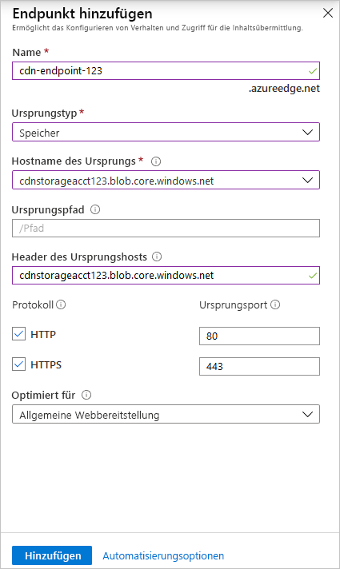

# Schnellstart: Erstellen eines Azure CDN-Profils und -Endpunkts

In dieser Schnellstartanleitung aktivieren Sie Azure Content Delivery Network (CDN), indem Sie ein neues CDN-Profil erstellen. Dabei handelt es sich um eine Sammlung von mehreren CDN-Endpunkten. Nach der Erstellung eines Profils und eines Endpunkts können Sie mit der Bereitstellung von Inhalten für Ihre Kunden beginnen.

## Voraussetzungen

- Ein Azure-Konto mit einem aktiven Abonnement. Sie können [kostenlos ein Konto erstellen](https://azure.microsoft.com/free/?ref=microsoft.com&utm_source=microsoft.com&utm_medium=docs&utm_campaign=visualstudio).
- Ein Azure Storage-Konto mit dem Namen *cdnstorageacct123*, das Sie für den Hostnamen des Ursprungs verwenden. Informationen zu dieser Anforderung finden Sie unter [Schnellstart: Integrieren eines Azure-Speicherkontos in Azure CDN](cdn-create-a-storage-account-with-cdn.md).

## Melden Sie sich auf dem Azure-Portal an.

Melden Sie sich mit Ihrem Azure-Konto beim [Azure-Portal](https://portal.azure.com) an.

[!INCLUDE [cdn-create-profile](../../includes/cdn-create-profile.md)]

## Erstellen eines neuen CDN-Endpunkts

Nachdem Sie ein CDN-Profil erstellt haben, erstellen Sie damit einen Endpunkt.

1. Wählen Sie auf Ihrem Dashboard im Azure-Portal das erstellte CDN-Profil aus. Falls Sie es nicht finden, können Sie entweder die Ressourcengruppe öffnen, in der Sie es erstellt haben, oder die Suchleiste oben im Portal verwenden, den Profilnamen eingeben und das Profil aus den Ergebnissen auswählen.
   
1. Wählen Sie auf der Seite „CDN-Profil“ die Option **+ Endpunkt** aus.
   
    
   
    Der Bereich **Endpunkt hinzufügen** wird angezeigt.

3. Geben Sie die folgenden Einstellungswerte ein:

    | Einstellung | Wert |
    | ------- | ----- |
    | **Name** | Geben Sie *cdn-endpoint-123* als Endpunkthostnamen ein. Dieser Name muss in Azure global eindeutig sein. Sollte er bereits verwendet werden, geben Sie einen anderen Namen ein. Dieser Name wird für den Zugriff auf Ihre zwischengespeicherten Ressourcen in der Domäne „ _&lt;Endpunktname&gt;_ .azureedge.net“ verwendet.|
    | **Ursprungstyp** | Wählen Sie **Speicher**. | 
    | **Hostname des Ursprungs** | Wählen Sie in der Dropdownliste den Hostnamen des von Ihnen verwendeten Azure Storage-Kontos aus, etwa *cdnstorageacct123.blob.core.windows.net*. |
    | **Ursprungspfad** | Lassen Sie dieses Feld leer. |
    | **Header des Ursprungshosts** | Übernehmen Sie den Standardwert (der Hostname für das Speicherkonto). |  
    | **Protokoll** | Übernehmen Sie den ausgewählten Standardoptionen **HTTP** und **HTTPS**. |
    | **Ursprungsport** | Behalten Sie die Standardportwerte bei. | 
    | **Optimiert für** | Behalten Sie die Standardauswahl **Allgemeine Webbereitstellung** bei. |

    

3. Wählen Sie **Hinzufügen**, um den neuen Endpunkt zu erstellen. Der erstellte Endpunkt wird in der Liste mit den Endpunkten für das Profil angezeigt.
    
   
    
   Die Dauer für die Verteilung des Endpunkts hängt vom Tarif ab, den Sie bei der Erstellung des Profils ausgewählt haben. Bei **Akamai Standard** wird der Vorgang in der Regel innerhalb von einer Minute abgeschlossen, bei **Microsoft Standard** in zehn Minuten und bei **Verizon Standard** und **Verizon Premium** in bis zu 30 Minuten.

## Bereinigen von Ressourcen

In den vorherigen Schritten haben Sie ein CDN-Profil und einen Endpunkt in einer Ressourcengruppe erstellt. Speichern Sie diese Ressourcen, falls Sie die [nächsten Schritte](#next-steps) ausführen und erfahren möchten, wie Sie Ihrem Endpunkt eine benutzerdefinierte Domäne hinzufügen. Sollten Sie die Ressourcen dagegen nicht mehr benötigen, können Sie die Ressourcengruppe mit den Ressourcen löschen, um weitere Kosten zu vermeiden:

1. Wählen Sie im Azure-Portal im Menü auf der linken Seite die Option **Ressourcengruppen** und dann **CDNQuickstart-rg** aus.

2. Wählen Sie auf der Seite **Ressourcengruppe** die Option **Ressourcengruppe löschen** aus, geben Sie *CDNQuickstart-rg* in das Textfeld ein, und wählen Sie anschließend **Löschen** aus. Dadurch werden die Ressourcengruppe, das Profil und der Endpunkt gelöscht, die Sie im Rahmen dieser Schnellstartanleitung erstellt haben.

## Nächste Schritte

> [!div class="nextstepaction"]
> [Tutorial: Hinzufügen von Azure CDN zu einer Azure App Service-Web-App](cdn-add-to-web-app.md)

> [!div class="nextstepaction"]
> [Tutorial: Hinzufügen einer benutzerdefinierten Domäne zum Azure CDN-Endpunkt](cdn-map-content-to-custom-domain.md)
