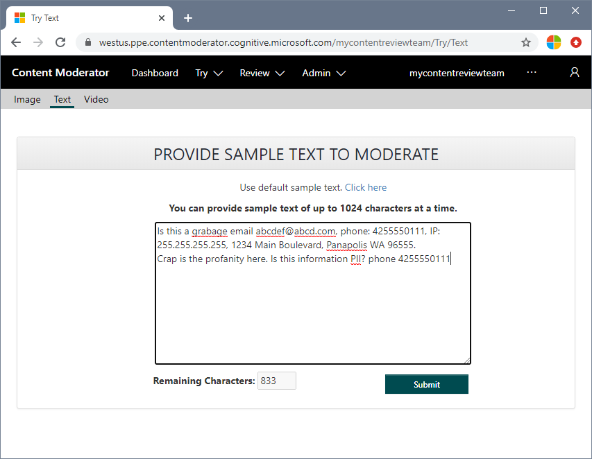

# Schnellstart: Testen von Content Moderator im Web

In diesem Schnellstart verwenden Sie das Onlineprüfungstool Content Moderator, um die grundlegende Funktionalität von Content Moderator zu testen, ohne Code schreiben zu müssen. Wenn Sie diesen Dienst noch schneller in Ihre App integrieren möchten, finden Sie im Abschnitt [Nächste Schritte](#next-steps) weitere Schnellstarts.

## Voraussetzungen

- Aus einem Webbrowser

## Einrichten des Prüfungstools
Das Content Moderator-Prüfungstool ist ein webbasiertes Tool, mit dem menschliche Reviewer Cognitive Services bei der Entscheidungsfindung unterstützen können. In dieser Anleitung werden Sie durch den kurzen Einrichtungsprozess für das Prüfungstool geführt, sodass Sie sehen können, wie der Content Moderator-Dienst funktioniert. Navigieren Sie zur Website des [Content Moderator-Prüfungstools](https://contentmoderator.cognitive.microsoft.com/), und registrieren Sie sich.

## Erstellen eines Prüfungsteams

Erstellen Sie als Nächstes ein Prüfungsteam. In einem Produktionsszenario ist dies die Gruppe von Personen, die manuell die Moderationsentscheidungen des Diensts überprüfen. Wenn Sie ein Team erstellen möchten, müssen Sie eine **Region** auswählen und einen Teamnamen (unter **Teamname**) sowie eine Team-ID (unter **Team-ID**) angeben. Sie können Ihre Kollegen in das Team einladen, indem Sie ihre E-Mail-Adressen eingeben.

> [!NOTE]
> **Teamname** ist ein Anzeigename für Ihr Prüfungsteam. Dieser Name wird im Azure-Portal angezeigt. Die **Team-ID** dient zur programmgesteuerten Identifizierung Ihres Prüfungsteams.

> [!div class="mx-imgBorder"]
> 

Wenn Sie Daten mit einem kundenseitig verwalteten Schlüssel (Customer-Managed Key, CMK) verschlüsseln möchten, werden Sie zur Angabe der **Ressourcen-ID** für Ihre Content Moderator-Ressource im Tarif „E0“ aufgefordert. Die angegebene Ressource muss neu sein. 

> [!div class="mx-imgBorder"]
> 

Wenn Sie versuchen, eine Content Moderator-Ressource erneut zu verwenden, wird die folgende Warnung angezeigt: 

> [!div class="mx-imgBorder"]
> 

## Hochladen von Beispielinhalten

Sie können nun Beispielinhalte hochladen. Wählen Sie **Testen > Bild**, **Testen > Text** oder **Testen > Video** aus.

Übermitteln Sie Ihre Inhalte für die Moderation. Intern ruft das Prüfungstool die Moderations-APIs auf, um Ihre Inhalte zu überprüfen. Wenn die Überprüfung abgeschlossen ist, informiert Sie eine Meldung über die zu überprüfenden Ergebnisse.

## Überprüfen der Moderationstags

Überprüfen Sie die angewandten Moderationstags. Sie können sehen, welche Tags auf Ihre Inhalte angewandt wurden und welche Bewertungen die einzelnen Kategorien enthalten. Weitere Informationen zur Bedeutung der unterschiedlichen Inhaltstags finden Sie unter den Themen zur [Bild-](image-moderation-api.md), [Text-](text-moderation-api.md) und [Videomoderation](video-moderation-api.md).

In einem Projekt können Sie oder Ihr Prüfungsteam diese Tags ändern oder bei Bedarf weitere Tags hinzufügen. Sie übermitteln diese Änderungen mit der Schaltfläche **Weiter**. Wenn Ihre Geschäftsanwendung die Moderator-APIs aufruft, werden markierte Inhalte hier der Warteschlange hinzugefügt, damit die Prüfungsteams sie kontrollieren können. So lassen sich große Mengen von Inhalten schnell überprüfen.

An diesem Punkt haben Sie das Content Moderator-Prüfungstool verwendet, um Beispiele für die Möglichkeiten des Content Moderator-Diensts zu sehen. Als Nächstes können Sie mehr über das Prüfungstool und seine Integration in ein Softwareprojekt mithilfe der Überprüfungs-APIs erfahren oder zum Abschnitt [Nächste Schritte](#next-steps) springen, um die Verwendung der Moderations-APIs selbst in Ihrer App zu erlernen.

## Weitere Informationen zum Prüfungstool

Weitere Informationen zum Verwenden des Content Moderator-Prüfungstools finden Sie in der Anleitung zum [Prüfungstool](Review-Tool-User-Guide/human-in-the-loop.md). In den APIs zum Prüfungstool erfahren Sie mehr über die Optimierung der Überprüfung durch Personen:
- Die [Auftrags-API](try-review-api-job.md) überprüft Ihre Inhalte mithilfe der Moderations-APIs und generiert im Prüfungstool Überprüfungen. 
- Die [Überprüfungs-API](try-review-api-review.md) erstellt direkt Bild-, Text- oder Videoüberprüfungen für Moderatoren, ohne die Inhalte zuerst zu scannen. 
- Die [Workflow-API](try-review-api-workflow.md) erstellt und aktualisiert Informationen zu benutzerdefinierten Workflows Ihres Teams und ruft diese ab.

Sie können auch mit den nächsten Schritten fortfahren, um sich über die Verwendung der Moderations-APIs in eigenem Code zu informieren.

## Nächste Schritte

Erfahren Sie, wie Sie die Moderations-APIs selbst in Ihrer App verwenden.
- Implementieren Sie die Bildmoderation. Nutzen Sie die [API-Konsole](try-image-api.md) oder die [.NET SDK-Schnellstartanleitung](dotnet-sdk-quickstart.md), um Bilder zu überprüfen und anzügliche sowie nur für Erwachsene geeignete Inhalte mithilfe von Tags, Zuverlässigkeitsbewertungen und anderen extrahierten Informationen zu erkennen.
- Implementieren Sie die Textmoderation. Nutzen Sie die [API-Konsole](try-text-api.md) oder die [.NET SDK-Schnellstartanleitung](dotnet-sdk-quickstart.md), um Textinhalte auf obszöne, computergestützte unerwünschte Textklassifizierung (Vorschau) und personenbezogene Daten zu überprüfen.
- Implementieren Sie die Videomoderation. Befolgen Sie die [Anleitung zur Videomoderation für C#](video-moderation-api.md), um Videos zu scannen und potenziell jugendgefährdende und freizügige Inhalte zu erkennen. 
