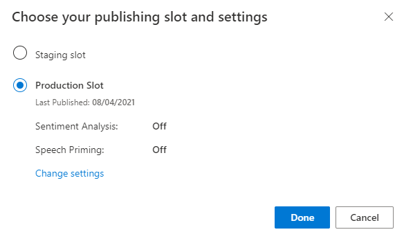

Damit Sie eine LUIS-Vorhersage in einem Chatbot oder einer anderen Clientanwendung empfangen können, muss die App im Vorhersage-Endpunkt veröffentlicht werden.

1. Wählen Sie im Navigationsbereich rechts oben die Option **Veröffentlichen** aus.
    
    > [!div class="mx-imgBorder"]
    > 

1. Wählen Sie den Slot **Produktion** und anschließend **Fertig** aus.

    > [!div class="mx-imgBorder"]
    > 

1. Wählen Sie in der Benachrichtigung die Option **Access your endpoint URLs** (Auf Endpunkt-URLs zugreifen) aus, um zur Seite **Azure-Ressourcen** zu navigieren. Die URLs werden nur angezeigt, wenn der App eine Vorhersageressource zugeordnet ist. Sie können auch auf die Seite **Azure-Ressourcen** zugreifen, indem Sie auf **Verwalten** klicken.

     > [!div class="mx-imgBorder"]
    > 