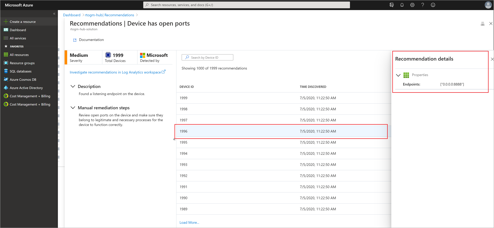

# Schnellstart: Untersuchen von Sicherheitsempfehlungen

Die rechtzeitige Analyse und Entschärfung in Bezug auf die Empfehlungen von Defender für IoT ist die beste Vorgehensweise, um den Sicherheitsstatus zu verbessern und die Angriffsfläche für Ihre IoT-Lösung zu verkleinern.

In dieser Schnellstartanleitung erkunden wir die Informationen in den einzelnen IoT-Sicherheitsempfehlungen. Darüber hinaus wird beschrieben, wie Sie einen Drilldown ausführen und die Details der einzelnen Empfehlungen und der zugehörigen Geräte verwenden, um das Risiko zu verringern.

Los geht’s!

## Untersuchen von neuen Empfehlungen

In der Liste mit den IoT Hub-Empfehlungen werden alle aggregierten Sicherheitsempfehlungen für Ihre IoT Hub-Instanz angezeigt.

1.  Öffnen Sie im Azure-Portal die **IoT Hub**-Instanz, die Sie auf neue Empfehlungen untersuchen möchten.

1.  Wählen Sie im Menü **Sicherheit** die Option **Empfehlungen** aus. Alle Sicherheitsempfehlungen für die IoT Hub-Instanz werden angezeigt. Die Empfehlungen mit dem Flag **Neu** sind die Empfehlungen der letzten 24 Stunden. 

    

1.  Wählen Sie in der Liste eine beliebige Empfehlung aus, und öffnen Sie sie, um die Details dazu anzuzeigen und einen Drilldown auszuführen.

## Details von Sicherheitsempfehlungen

Öffnen Sie die einzelnen aggregierten Empfehlungen, um dazu jeweils die ausführliche Beschreibung, die Problembehandlungsschritte und die Geräte-ID für jedes Gerät anzuzeigen, von dem eine Empfehlung ausgelöst wurde. Darüber hinaus werden der Schweregrad der Empfehlung und die Zugriffsoption zur direkten Untersuchung mit Log Analytics angezeigt.

1.  Wählen Sie in der Liste unter **IoT Hub** \> **Sicherheit** \> **Empfehlungen** eine beliebige Sicherheitsempfehlung aus, und öffnen Sie sie.

1.  Sehen Sie sich für jede Empfehlung die **Beschreibung**, den **Schweregrad** und die **Gerätedetails** aller Geräte an, von denen diese Empfehlung während des Aggregationszeitraums ausgegeben wurde. 

1.  Verwenden Sie nach dem Überprüfen der Empfehlungsdetails die Anleitung im **Schritt zur manuellen Behebung**, um das Problem zu behandeln bzw. zu beheben, das zur Empfehlung geführt hat. 

    

1.  Untersuchen Sie die Empfehlungsdetails für ein bestimmtes Gerät, indem Sie das gewünschte Gerät auf der Drilldownseite auswählen.

    

1.  Falls eine weitere Untersuchung erforderlich ist, können Sie den Link verwenden, um die **Empfehlung in Log Analytics zu untersuchen**. 

## Nächste Schritte

Fahren Sie mit dem nächsten Artikel fort, um sich über das Erstellen von benutzerdefinierten Warnungen zu informieren.

> [!div class="nextstepaction"]
> [Erstellen benutzerdefinierter Benachrichtigungen](quickstart-create-custom-alerts.md)
