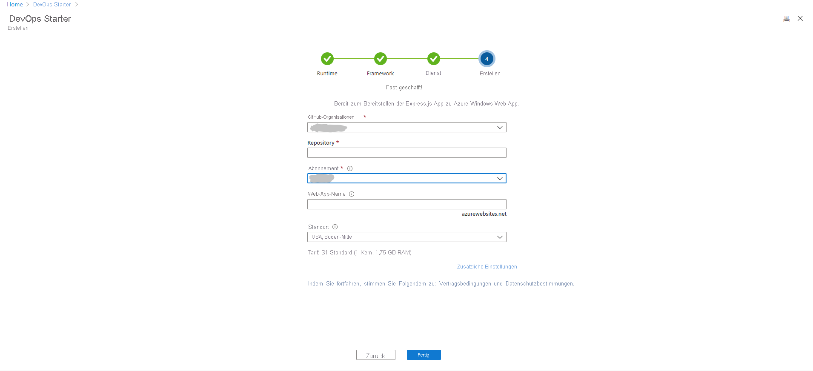

# Einrichten von CI/CD für eine Node.js-App mit DevOps Starter mithilfe von GitHub Actions

In diesem Schnellstart verwenden Sie die vereinfachte Benutzeroberfläche von DevOps Starter zum Einrichten eines CI/CD-Workflows (Continuous Integration und Continuous Delivery) für Ihre Node.js-App mit GitHub Actions. Sie können mit DevOps Starter alles einrichten, was Sie zum Entwickeln, Bereitstellen und Überwachen Ihrer App benötigen. 

## Voraussetzungen

- Ein Azure-Konto mit einem aktiven Abonnement. Sie können [kostenlos ein Konto erstellen](https://azure.microsoft.com/free/?ref=microsoft.com&utm_source=microsoft.com&utm_medium=docs&utm_campaign=visualstudio). 
- Ein [GitHub-Konto](https://github.com/).

## Melden Sie sich auf dem Azure-Portal an.

DevOps Starter erstellt mithilfe von GitHub Actions einen CI/CD-Workflow. Ferner werden mit DevOps Starter Azure-Ressourcen im Azure-Abonnement Ihrer Wahl erstellt.

1. Melden Sie sich beim [Azure-Portal](https://portal.azure.com) an.

1. Geben Sie in das Suchfeld **DevOps Starter** ein, und wählen sie die Option dann aus. Klicken Sie auf **Hinzufügen**, um einen neuen zu erstellen.

    

## Auswählen einer Beispielanwendung und eines Azure-Diensts

1. Klicken Sie im Banner auf der rechten Seite auf **DevOps Starter mit GitHub einrichten**.

    

1. Stellen Sie sicher, dass der CI/CD-Anbieter als **GitHub Actions** ausgewählt ist.

    

1. Wählen Sie die **Node.js**-Beispielanwendung aus. Zu den Node.js-Beispielen zählen verschiedene Anwendungsframeworks.

1. Standardmäßig wird das Beispielframework **Express.js** verwendet. Übernehmen Sie die Standardeinstellung, und wählen Sie **Weiter** aus.   

2. Windows-Web-App ist das Standardziel für die Bereitstellung. Das Anwendungsframework, das Sie zuvor ausgewählt haben, bestimmt den Typ des hier verfügbaren Bereitstellungsziels für den Azure-Dienst. Übernehmen Sie den Standarddienst, und wählen Sie **Weiter** aus.
 
## Konfigurieren eines GitHub-Kontos und eines Azure-Abonnements 

1. Authentifizieren Sie sich bei GitHub.

   1. Klicken Sie auf die Schaltfläche **Autorisieren**. 
   
   1. Melden Sie sich bei GitHub an. Wenn Sie kein GitHub-Konto besitzen, können Sie sich hier auch registrieren.

2. Wählen Sie eine vorhandene **GitHub-Organisation** aus. 
   
   1. Wählen Sie einen Namen für Ihr GitHub-Repository aus. 
   
   1. Wählen Sie Ihr Azure-Abonnement und den Standort sowie einen Namen für Ihre Anwendung aus, und klicken Sie dann auf **Fertig**.
    
       

    Nach wenigen Minuten wird das DevOps Starter-Dashboard im Azure-Portal angezeigt. Eine Beispielanwendung wird in einem Repository in Ihrer Azure DevOps-Organisation eingerichtet, ein GitHub-Workflow wird ausgelöst, und Ihre Anwendung wird in Azure bereitgestellt. Dieses Dashboard bietet Einblick in Ihr Coderepository, in den GitHub-Workflow und in Ihre Anwendung in Azure.
   
3. Wählen Sie **Durchsuchen** aus, um Ihre ausgeführte Anwendung anzuzeigen.
    
    Das Dashboard enthält Details zum GitHub-Workflow und zu Azure-Ressourcen. Um die Details des GitHub-Workflows wie letzte Ausführung, Commits und Auftragsstatus anzuzeigen, müssen Sie sich **bei GitHub autorisieren**.
   
   

DevOps Starter hat automatisch einen GitHub-Workflow mit Build- und Bereitstellungsaufträgen mithilfe von GitHub Actions konfiguriert. Nun können Sie mithilfe eines CI/CD-Prozesses, mit dem Ihre aktuelle Arbeit an Ihrer Website automatisch bereitgestellt wird, mit einem Team an einer Node.js-App zusammenarbeiten.

   

## Ausführen eines Commits für Codeänderungen und Ausführen von CI/CD

Devops Starter erstellt ein Repository in GitHub. Gehen Sie wie folgt vor, um das Repository anzuzeigen und Codeänderungen an Ihrer Anwendung vorzunehmen:

1. Klicken Sie auf der linken Seite des DevOps Starter-Dashboards auf den Link für Ihren Mainbranch. Über diesen Link wird die Ansicht des neu erstellten GitHub-Repositorys geöffnet.

1. Wählen Sie oben rechts im Browser die Option **Klonen** aus, um die Repository-Klon-URL anzuzeigen. Sie können Ihr Git-Repository in Ihrer bevorzugten IDE klonen. Bei den nächsten Schritten können Sie den Webbrowser verwenden, um Codeänderungen direkt am Mainbranch vorzunehmen und für Codeänderungen einen Commit auszuführen.

1. Navigieren Sie auf der linken Seite des Browsers zur Datei **/Application/views/index.pug**.

1. Wählen Sie **Bearbeiten** aus, und ändern Sie den Text an einigen Stellen.
    Ändern Sie beispielsweise einige Textstellen für eines der Tags.

1. Wählen Sie **Commit** aus, und speichern Sie anschließend die Änderungen.

1. Navigieren Sie in Ihrem Browser zum DevOps Starter-Dashboard.   
Nun sollte ein aktuell ausgeführter GitHub-Workflowbuildauftrag angezeigt werden. Die Änderungen, die Sie vorgenommen haben, werden automatisch erstellt und über einen GitHub-Workflow bereitgestellt.

## Anzeigen des GitHub-Workflows

Im vorherigen Schritt wurde von DevOps Starter automatisch ein vollständiger GitHub-Workflow konfiguriert. Untersuchen Sie den Workflow, und passen Sie ihn bei Bedarf an. Führen Sie die folgenden Schritte aus, um sich mit dem Workflow vertraut zu machen.

1. Wählen Sie auf der linken Seite des DevOps Starter-Dashboards **GitHub-Workflow** aus. Über diesen Link werden eine Browserregisterkarte und der GitHub-Workflow für Ihr neues Projekt geöffnet.
    > [!NOTE]
    > Benennen Sie die Workflowdatei nicht um. Der Name der Workflowdatei sollte **devops-starter-workflow.yml** lauten, damit das Dashboard die Änderungen widerspiegelt.

1. Die YAML-Workflowdatei enthält alle GitHub Actions, die zum Erstellen und Bereitstellen der Anwendung erforderlich sind. Klicken Sie auf die Option **Datei bearbeiten**, um Ihre Workflowdatei anzupassen.

1. Klicken Sie unter der Registerkarte **Code** des Repositorys auf **Commits**. In dieser Ansicht werden die der jeweiligen Bereitstellung zugeordneten Codecommits angezeigt.

1. Auf der Registerkarte **Aktionen** des Repositorys können Sie den Verlauf aller Workflowausführungen Ihres Repositorys anzeigen.

1. Wählen Sie die **letzte Ausführung** aus, um alle Aufträge anzuzeigen, die im Workflow ausgeführt wurden.

1. Klicken Sie auf **Aufträge**, um die ausführlichen Protokolle der Workflowausführung anzuzeigen. Die Protokolle enthalten nützliche Informationen zum Bereitstellungsprozess. Sie können während und nach Bereitstellungen angezeigt werden.

1. Klicken Sie auf die Registerkarte **Pull Request**, um alle Pull Requests für Ihr Repository anzuzeigen.

## Bereinigen von Ressourcen

Sie können die Azure App Service-Instanz und zugehörige Ressourcen löschen, wenn Sie sie nicht mehr benötigen. Verwenden Sie die Funktion **Löschen** auf dem DevOps Starter-Dashboard.

## Nächste Schritte

Wenn Sie den CI/CD-Prozess konfiguriert haben, wurde der GitHub-Workflow automatisch erstellt. Sie können diesen Workflow an die Anforderungen Ihres Teams anpassen. Weitere Informationen zu GitHub Actions und Workflows finden Sie unter:

> [!div class="nextstepaction"]
> [Anpassen des GitHub-Workflows](https://docs.github.com/actions/configuring-and-managing-workflows/configuring-and-managing-workflow-files-and-runs)
