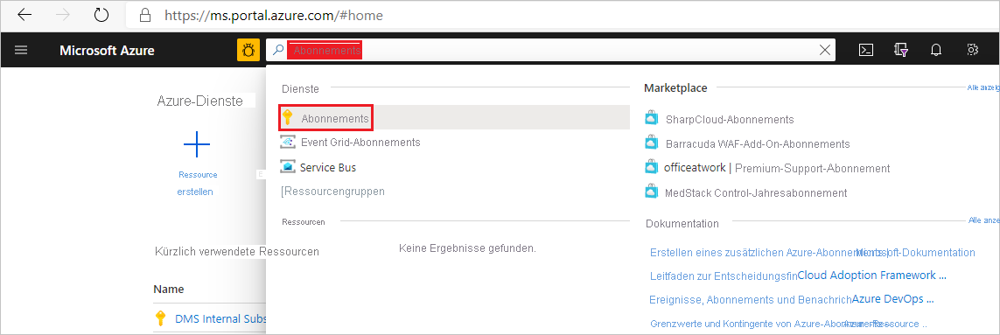
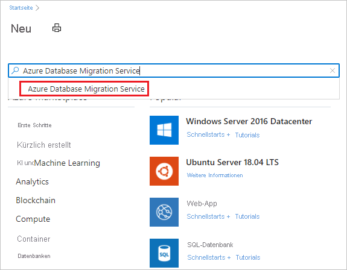
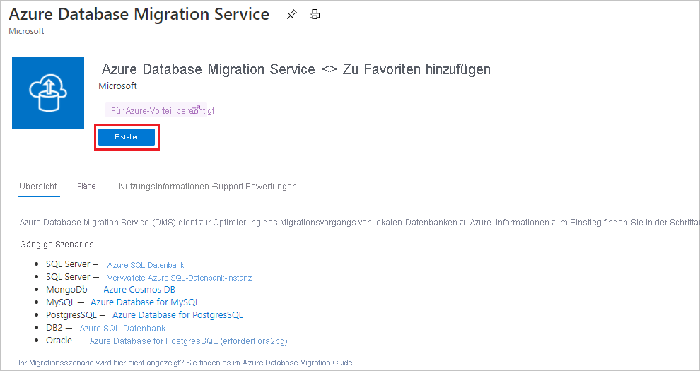
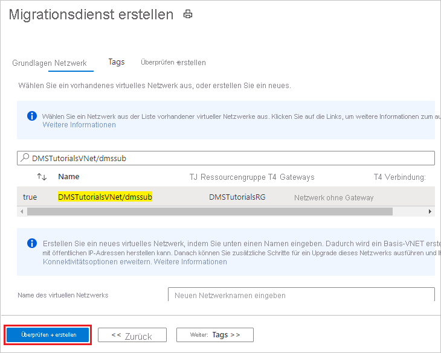

# Schnellstart: Erstellen einer Azure Database Migration Service-Instanz über das Azure-Portal

In dieser Schnellstartanleitung verwenden Sie das Azure-Portal, um eine Instanz von Azure Database Migration Service zu erstellen. Nach der Erstellung der Instanz können Sie sie zum Migrieren von Daten aus mehreren Datenbankquellen zu Azure-Datenplattformen verwenden, etwa von SQL Server zu Azure SQL-Datenbank oder von SQL Server zu Azure SQL Managed Instance.

Wenn Sie kein Azure-Abonnement besitzen, können Sie ein [kostenloses Konto](https://azure.microsoft.com/free/) erstellen, bevor Sie beginnen.

## Melden Sie sich auf dem Azure-Portal an.

Öffnen Sie Ihren Webbrowser, navigieren Sie zum [Microsoft Azure-Portal](https://portal.azure.com/), und geben Sie dann Ihre Anmeldeinformationen ein, um sich am Portal anzumelden. Die Standardansicht ist Ihr Dienstdashboard.

> [!NOTE]
> Sie können bis zu zehn Instanzen von DMS pro Abonnement und Region erstellen. Wenn Sie eine größere Anzahl von Instanzen benötigen, erstellen Sie ein Supportticket.

## Registrieren des Ressourcenanbieters

Sie müssen den Microsoft.DataMigration-Ressourcenanbieter registrieren, bevor Sie Ihre erste Instanz von Database Migration Service erstellen.

1. Suchen Sie im Azure-Portal nach dem Eintrag **Abonnements**, und wählen Sie ihn aus.

   

2. Wählen Sie das Abonnement aus, in dem Sie die Azure Database Migration Service-Instanz erstellen möchten, und klicken Sie dann auf **Ressourcenanbieter**.

    

3. Suchen Sie nach „Migration“, und wählen Sie dann **Registrieren** für **Microsoft.DataMigration** aus.

    

## Erstellen einer Instanz des Diensts

1. Wählen Sie im Menü des Azure-Portals oder auf der **Startseite** die Option **Ressource erstellen** aus. Suchen Sie **Azure Database Migration Service**, und wählen Sie ihn aus.

    

2. Wählen Sie auf dem Bildschirm **Azure Database Migration Service** die Schaltfläche **Erstellen** aus.

    

3. Auf dem Bildschirm **Create Migration Service** (Migrationsdienst erstellen) mit den Grundeinstellungen:

     - Wählen Sie das Abonnement aus.
     - Erstellen Sie eine neue Ressourcengruppe, oder wählen Sie eine vorhandene Ressourcengruppe aus.
     - Geben Sie einen Namen für die Instanz von Azure Database Migration Service an.
     - Wählen Sie den Standort aus, an dem Sie die Azure Database Migration Service-Instanz erstellen möchten.
     - Wählen Sie **Azure** als Dienstmodus aus.
     - Wählen Sie einen Tarif. Weitere Informationen zu Kosten und Tarifen finden Sie in der [Preisübersicht](https://aka.ms/dms-pricing).
     
    

     - Klicken Sie auf Weiter: Netzwerk.

4. Auf dem Netzwerkbildschirm **Create Migration Service** (Migrationsdienst erstellen):

    - Wählen Sie ein vorhandenes virtuelles Netzwerk aus, oder erstellen Sie ein neues. Das virtuelle Netzwerk erteilt Azure Database Migration Service Zugriff auf die Quelldatenbank und die Zielumgebung. Weitere Informationen zum Erstellen eines virtuellen Netzwerks im Azure-Portal finden Sie im Artikel [Erstellen eines virtuellen Netzwerks im Azure Portal](../virtual-network/quick-create-portal.md).

    

    - Wählen Sie zum Erstellen des Diensts die Option **Überprüfen + erstellen** aus. 
    
    - Nach einigen Augenblicken wird die Azure Database Migration Service-Instanz erstellt und kann verwendet werden:

    

## Bereinigen von Ressourcen

Sie können alle in dieser Schnellstartanleitung erstellten Ressourcen bereinigen, indem Sie die [Azure-Ressourcengruppe](../azure-resource-manager/management/overview.md) löschen. Navigieren Sie zum Löschen der Ressourcengruppe zu der von Ihnen erstellten Azure Database Migration Service-Instanz. Klicken Sie auf den Namen der **Ressourcengruppe** und anschließend auf **Ressourcengruppe löschen**. Durch diese Aktion werden alle Ressourcen in der Ressourcengruppe sowie die Gruppe selbst gelöscht.

## Nächste Schritte

* [Offlinemigration von SQL Server zu Azure SQL-Datenbank](tutorial-sql-server-to-azure-sql.md)
* [Offlinemigration von SQL Server zu Azure SQL Managed Instance](tutorial-sql-server-to-managed-instance.md)
* [Onlinemigration von SQL Server zu Azure SQL Managed Instance](tutorial-sql-server-managed-instance-online.md)
