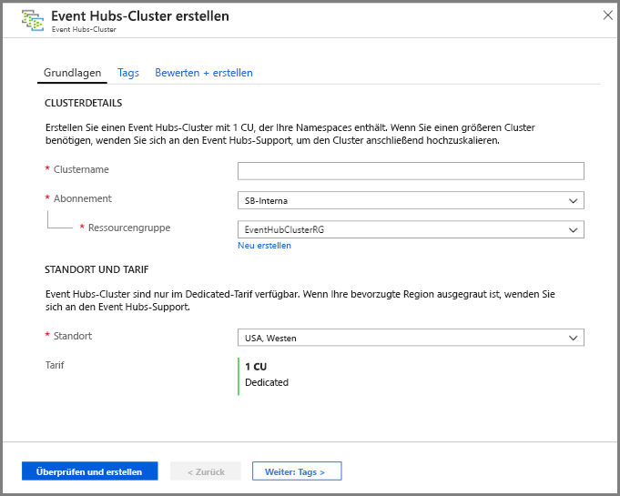
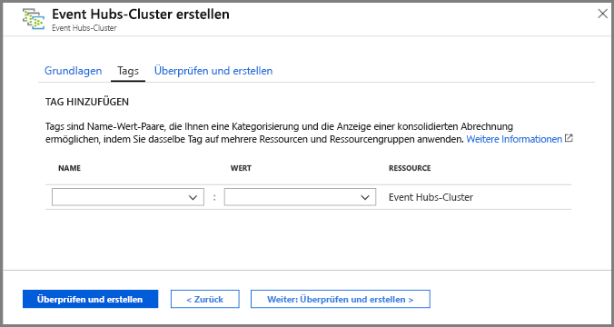
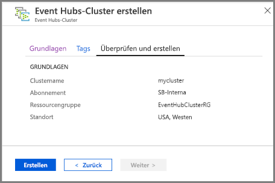
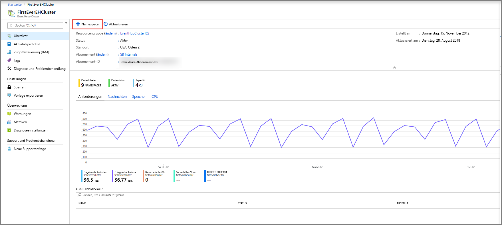
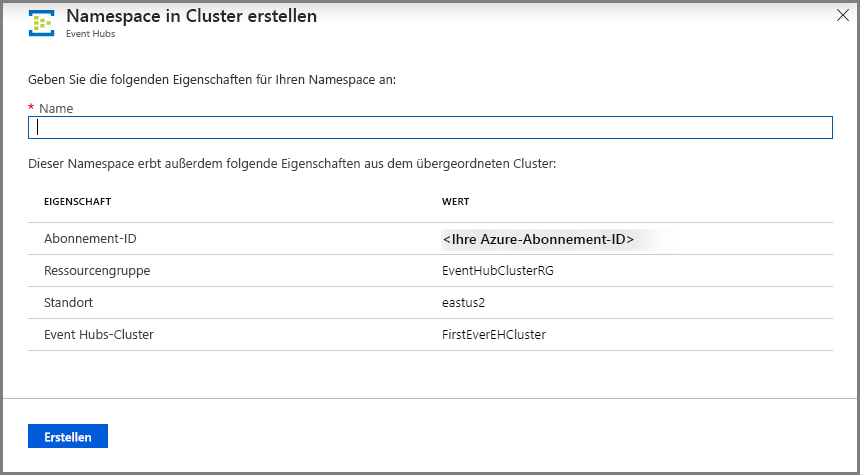
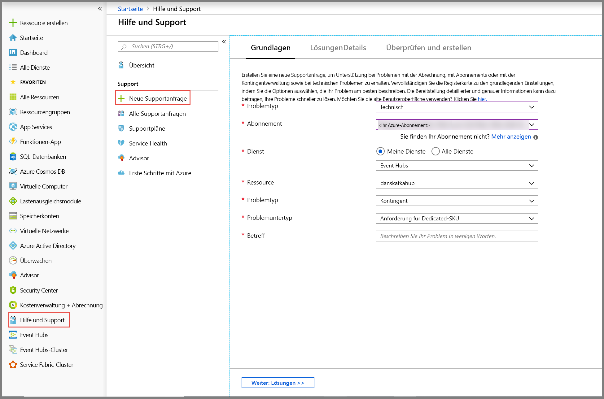
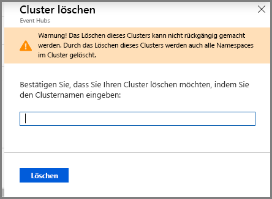

# Schnellstart: Erstellen eines dedizierten Event Hubs-Clusters mithilfe des Azure-Portals 
Event Hubs-Cluster bieten Bereitstellungen mit einem einzelnen Mandanten für Kunden mit äußerst anspruchsvollen Streaminganforderungen. Dieses Angebot umfasst eine SLA mit einer garantierten Verfügbarkeit von 99,99 % und ist nur in unserem Dedicated-Tarif verfügbar. Ein [Event Hubs-Cluster](event-hubs-dedicated-overview.md) kann Millionen Ereignisse pro Sekunde mit garantierter Kapazität und einer Latenz im Sekundenbruchteilbereich erfassen. Namespaces und Event Hubs, die innerhalb eines Clusters erstellt werden, bieten alle Funktionen des Standardangebots und mehr, aber ohne jegliche Einschränkung bei eingehenden Daten. Das Dedicated-Angebot umfasst ferner das beliebte [Event Hubs Capture](event-hubs-capture-overview.md)-Feature ohne zusätzliche Kosten, die es Ihnen ermöglicht, Datenströme zu Batches zusammenzufassen und in [Azure Blob Storage](../storage/blobs/storage-blobs-introduction.md) oder [Azure Data Lake Storage Gen 1](../data-lake-store/data-lake-store-overview.md) zu protokollieren.

Dedizierte Cluster werden in Form von **Kapazitätseinheiten (Capacity Units, CUs)** bereitgestellt und abgerechnet, einem vorab zugewiesenen Maß an CPU- und Arbeitsspeicherressourcen. Sie können für jeden Cluster 1, 2, 4, 8, 12, 16 oder 20 CUs erwerben. In diesem Schnellstart werden Sie durch die Erstellung eines 1-CU-Event Hubs-Clusters über das Azure-Portal geleitet.

> [!NOTE]
> Diese Self-Service-Funktionalität steht aktuell im [Azure-Portal](https://aka.ms/eventhubsclusterquickstart) als Vorschaufeature zur Verfügung. Wenn Sie Fragen zum Dedicated-Angebot haben, wenden Sie sich an das [Event Hubs-Team](mailto:askeventhubs@microsoft.com).

## Voraussetzungen
Stellen Sie für diese Schnellstartanleitung sicher, dass Sie über Folgendes verfügen:

- Ein Azure-Konto. Wenn Sie noch keins besitzen, [kaufen Sie ein Konto](https://azure.microsoft.com/pricing/purchase-options/pay-as-you-go/), bevor Sie beginnen. Diese Funktion wird mit kostenlosen Azure-Konten nicht unterstützt. 
- [Visual Studio](https://visualstudio.microsoft.com/vs/) 2017 Update 3 (Version 15.3, 26730.01) oder höher.
- [.NET Standard SDK](https://dotnet.microsoft.com/download), Version 2.0 oder höher.
- [Erstellte Ressourcengruppe](../event-hubs/event-hubs-create.md#create-a-resource-group).

## Erstellen eines Event Hubs Dedicated-Clusters
Ein Event Hubs-Cluster bietet einen Container mit einem eindeutigen Bereich, in dem Sie einen oder mehrere Namespaces erstellen können. In der Vorschauphase für dieses Self-Service-Feature des Portals können Sie in ausgewählten Regionen einen 1-CU-Cluster erstellen. Wenn Sie einen Cluster mit einer Kapazität von mehr als 1 CU benötigen, können Sie eine Azure-Supportanfrage senden, um Ihren Cluster nach der Erstellung hochzuskalieren.

Führen Sie die folgenden Schritte aus, um über das Azure-Portal einen Cluster in Ihrer Ressourcengruppe zu erstellen:

1. Folgen Sie [diesem Link](https://aka.ms/eventhubsclusterquickstart), um einen Cluster im Azure-Portal zu erstellen. Wählen Sie **Alle Dienste** im linken Navigationsbereich aus, geben Sie dann „Event Hubs-Cluster“ in der Suchleiste ein, und wählen Sie „Event Hubs-Cluster“ aus der Ergebnisliste aus.
2. Konfigurieren Sie auf der Seite **Cluster erstellen** die folgenden Einstellungen:
    1. Geben Sie einen **Namen für den Cluster** ein. Das System überprüft sofort, ob dieser Name verfügbar ist.
    2. Wählen Sie das **Abonnement** aus, in dem Sie den Cluster erstellen möchten.
    3. Wählen Sie die **Ressourcengruppe** aus, in der Sie den Cluster erstellen möchten.
    4. Wählen Sie einen **Standort** für den Cluster aus. Wenn Ihre bevorzugte Region abgeblendet dargestellt wird, steht vorübergehend keine Kapazität zur Verfügung, und Sie können eine [Supportanfrage](#submit-a-support-request) an das Event Hubs-Team senden.
    5. Wählen Sie unten auf der Seite die Schaltfläche **Next: Tags** (Weiter: Tags) aus. Möglicherweise müssen Sie ein paar Minuten warten, bis das System die Ressourcen vollständig bereitgestellt hat.

        
3. Konfigurieren Sie auf der Seite **Tags** die folgenden Einstellungen:
    1. Geben Sie einen **Namen** und einen **Wert** für das Tag ein, das Sie hinzufügen möchten. Dieser Schritt ist **optional**.  
    2. Wählen Sie die Schaltfläche **Überprüfen + erstellen** aus.

        
4. Überprüfen Sie auf der Seite **Überprüfen + erstellen** die Details, und wählen Sie **Erstellen** aus. 

    

## Erstellen eines Namespace und eines Event Hubs innerhalb eines Clusters

1. Um einen Namespace in einem Cluster zu erstellen, wählen Sie auf der Seite **Event Hubs-Cluster** für Ihren Cluster im oberen Menü **+Namespace** aus.

    
2. Führen Sie auf der Seite zum Erstellen eines Namespace die folgenden Schritte aus:
    1. Geben Sie einen **Namen für den Namespace** ein.  Das System überprüft, ob der Name verfügbar ist.
    2. Der Namespace erbt die folgenden Eigenschaften:
        1. Abonnement-ID
        2. Ressourcengruppe
        3. Position
        4. Clustername
    3. Klicken Sie auf **Erstellen**, um den Namespace zu erstellen. Jetzt können Sie Ihren Cluster verwalten.  

        
3. Nachdem Ihr Namespace erstellt wurde, können Sie [einen Event Hub erstellen](event-hubs-create.md#create-an-event-hub), wie Sie normalerweise einen Event Hub in einem Namespace erstellen würden. 

## Senden Sie eine Supportanfrage.

Wenn Sie die Größe Ihres Clusters nach der Erstellung ändern möchten oder Ihre bevorzugte Region nicht verfügbar ist, senden Sie eine Supportanfrage, indem Sie diese Schritte ausführen:

1. Wählen Sie im [Azure-Portal](https://portal.azure.com) im linken Menü **Hilfe und Support** aus.
2. Wählen Sie im Menü „Support“ **+ Neue Supportanfrage** aus.
3. Führen Sie auf der Supportseite diese Schritte aus:
    1. Wählen Sie als **Problemtyp** in der Dropdownliste **Technisch** aus.
    2. Wählen Sie unter **Abonnement** Ihr Abonnement aus.
    3. Wählen Sie unter **Dienst** **Meine Dienste** und anschließend **Event Hubs** aus.
    4. Wählen Sie als **Ressource** Ihren Cluster aus, wenn er bereits vorhanden ist, andernfalls **Allgemeine Frage/Ressource nicht verfügbar**.
    5. Wählen Sie als **Problemtyp** **Kontingent** aus.
    6. Wählen Sie als **Problemuntertyp** einen der folgenden Werte in der Dropdownliste aus:
        1. Wählen Sie **Request for Dedicated SKU** (Anforderung der Dedicated-SKU) aus, um die Unterstützung der Funktion in Ihrer Region anzufordern.
        2. Wählen Sie **Anforderung zum Hoch- oder Herunterskalieren eines dedizierten Clusters**, wenn Sie Ihren dedizierten Cluster hoch- oder herunterskalieren möchten. 
    7. Beschreiben Sie unter **Betreff** das Problem.

        

 ## Löschen eines dedizierten Clusters
 
1. Um den Cluster zu löschen, wählen Sie im oberen Menü **Löschen** aus. Beachten Sie, dass für Ihren Cluster für mindestens 4 Stunden ab der Erstellung Gebühren anfallen. 
2. Es wird eine Meldung angezeigt, die Ihren Wunsch, den Cluster zu löschen, bestätigt.
3. Geben Sie den **Namen des Clusters** ein, und wählen Sie **Löschen** aus, um den Cluster zu löschen.

    

## Nächste Schritte
In diesem Artikel haben Sie einen Event Hubs-Cluster erstellt. Schritt-für-Schritt-Anweisungen zum Senden und Empfangen von Ereignissen von einem Event Hub und zum Erfassen von Ereignissen in einem Azure-Speicher oder einem Azure Data Lake Store finden Sie in den folgenden Tutorials:

- Senden und Empfangen von Ereignissen 
    - [.NET Core](event-hubs-dotnet-standard-getstarted-send.md)
    - [Java](event-hubs-java-get-started-send.md)
    - [Python](event-hubs-python-get-started-send.md)
    - [JavaScript](event-hubs-java-get-started-send.md)
- [Verwenden des Azure-Portals zum Aktivieren von Event Hubs Capture](event-hubs-capture-enable-through-portal.md)
- [Verwenden von Azure Event Hubs für Apache Kafka](event-hubs-for-kafka-ecosystem-overview.md)
