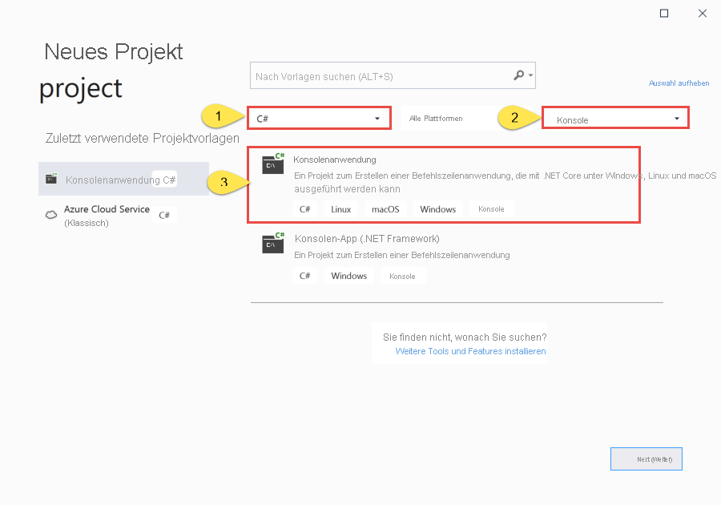
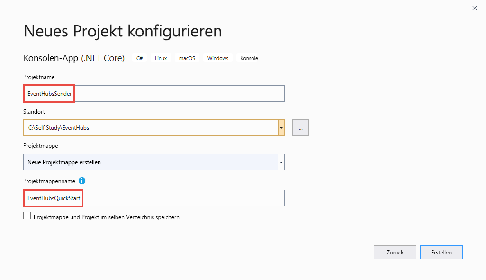

# <a name="send-events-to-and-receive-events-from-azure-event-hubs---net-azuremessagingeventhubs"></a>Senden oder Empfangen von Ereignissen an und von Azure Event Hubs: .NET (Azure.Messaging.EventHubs) 
In dieser Schnellstartanleitung erfahren Sie, wie Sie mithilfe der .NET-Bibliothek **Azure.Messaging.EventHubs** Ereignisse an einen Event Hub senden bzw. von dort empfangen. 

> [!IMPORTANT]
> In dieser Schnellstartanleitung wird die neue Bibliothek **Azure.Messaging.EventHubs** verwendet. Eine Schnellstartanleitung, in der die alte **Microsoft.Azure.EventHubs**-Bibliothek verwendet wird, finden Sie unter [Senden und Empfangen von Ereignissen mithilfe der Bibliothek „Microsoft.Azure.EventHubs“](event-hubs-dotnet-standard-get-started-send-legacy.md). 


## <a name="prerequisites"></a>Voraussetzungen
Wenn Sie mit Azure Event Hubs noch nicht vertraut sind, lesen Sie vor dem Durcharbeiten dieser Schnellstartanleitung die Informationen unter [Übersicht über Event Hubs](event-hubs-about.md). 

Zum Durchführen dieser Schnellstartanleitung benötigen Sie Folgendes:

- **Microsoft Azure-Abonnement.** Für die Verwendung von Azure-Diensten benötigen Sie ein Abonnement. Das gilt auch für Azure Event Hubs.  Falls Sie noch nicht über ein Azure-Konto verfügen, können Sie sich für eine [kostenlose Testversion](https://azure.microsoft.com/free/) registrieren oder beim [Erstellen eines Kontos](https://azure.microsoft.com) Ihre MSDN-Abonnentenvorteile nutzen.
- **Microsoft Visual Studio 2019**. Die Azure Event Hubs-Clientbibliothek nutzt neue Features, die in C# 8.0 eingeführt wurden.  Die Bibliothek kann zwar auch weiterhin mit älteren Versionen von C# verwendet werden, doch die neue Syntax steht dann nicht zur Verfügung. Um die vollständige Syntax nutzen zu können, wird empfohlen, dass Sie mit dem [.NET Core SDK](https://dotnet.microsoft.com/download) 3.0 oder höher kompilieren, wobei die [Sprachversion](/dotnet/csharp/language-reference/configure-language-version#override-a-default) auf `latest` festgelegt ist. Bei Verwendung von Visual Studio sind Versionen vor Visual Studio 2019 nicht mit den Tools kompatibel, die zum Erstellen von C# 8.0-Projekten erforderlich sind. Visual Studio 2019 (einschließlich der kostenlosen Community-Edition) kann [hier](https://visualstudio.microsoft.com/vs/) heruntergeladen werden.
- **Erstellen Sie einen Event Hubs-Namespace und einen Event Hub**. Verwenden Sie zunächst das [Azure-Portal](https://portal.azure.com), um einen Namespace vom Typ „Event Hubs“ zu erstellen, und beschaffen Sie die Verwaltungsanmeldeinformationen, die Ihre Anwendung für die Kommunikation mit dem Event Hub benötigt. Erstellen Sie anhand der Anleitung in [diesem Artikel](event-hubs-create.md) einen Namespace und einen Event Hub. Gehen Sie dann wie im folgenden Artikel beschrieben vor, um die **Verbindungszeichenfolge für den Event Hubs-Namespace** abzurufen: [Abrufen der Verbindungszeichenfolge](event-hubs-get-connection-string.md#get-connection-string-from-the-portal). Sie verwenden die Verbindungszeichenfolge im weiteren Verlauf dieser Schnellstartanleitung.

## <a name="send-events"></a>Senden von Ereignisse 
In diesem Abschnitt erfahren Sie, wie Sie eine .NET Core-Anwendung zum Senden von Ereignissen an einen Event Hub erstellen. 

### <a name="create-a-console-application"></a>Erstellen einer Konsolenanwendung

1. Starten Sie Visual Studio 2019. 
1. Wählen Sie **Neues Projekt erstellen** aus. 
1. Führen Sie im Dialogfeld **Neues Projekt erstellen** die folgenden Schritte aus: Sollte dieses Dialogfeld nicht angezeigt werden, wählen Sie im Menü die Option **Datei** und anschließend **Neu** > **Projekt** aus. 
    1. Wählen Sie die Programmiersprache **C#** aus.
    1. Wählen Sie den Anwendungstyp **Konsole** aus. 
    1. Wählen Sie in der Ergebnisliste die Option **Konsolen-App (.NET Core)** aus. 
    1. Klicken Sie anschließend auf **Weiter**. 

            
1. Geben Sie **EventHubsSender** als Projektname und **EventHubsQuickStart** als Projektmappenname ein, und wählen Sie anschließend **OK** aus, um das Projekt zu erstellen. 

    

### <a name="add-the-event-hubs-nuget-package"></a>Hinzufügen des Event Hubs-NuGet-Pakets

1. Wählen Sie im Menü **Extras** > **NuGet-Paket-Manager** > **Paket-Manager-Konsole** aus. 
1. Führen Sie den folgenden Befehl aus, um das NuGet-Paket **Azure.Messaging.EventHubs** zu installieren:

    ```cmd
    Install-Package Azure.Messaging.EventHubs
    ```


### <a name="write-code-to-send-messages-to-the-event-hub"></a>Schreiben von Code zum Senden von Nachrichten an den Event Hub

1. Fügen Sie am Anfang der Datei **Program.cs** die folgenden `using`-Anweisungen hinzu:

    ```csharp
    using System;
    using System.Text;
    using System.Threading.Tasks;
    using Azure.Messaging.EventHubs;
    using Azure.Messaging.EventHubs.Producer;
    ```

2. Fügen Sie der Klasse `Program` Konstanten für die Event Hubs-Verbindungszeichenfolge und den Namen des Event Hubs hinzu. Ersetzen Sie die in Klammern gesetzten Platzhalter durch die entsprechenden Werte, die Sie beim Erstellen des Event Hubs erhalten haben. Stellen Sie sicher, dass es sich bei `{Event Hubs namespace connection string}` um die Verbindungszeichenfolge auf Namespaceebene und nicht um die Event Hub-Zeichenfolge handelt. 

    ```csharp
    private const string connectionString = "<EVENT HUBS NAMESPACE - CONNECTION STRING>";
    private const string eventHubName = "<EVENT HUB NAME>";
    ```

3. Ersetzen Sie die Methode `Main` durch die folgende Methode vom Typ `async Main`. Weitere Einzelheiten finden Sie in den Codekommentaren. 

    ```csharp
        static async Task Main()
        {
            // Create a producer client that you can use to send events to an event hub
            await using (var producerClient = new EventHubProducerClient(connectionString, eventHubName))
            {
                // Create a batch of events 
                using EventDataBatch eventBatch = await producerClient.CreateBatchAsync();

                // Add events to the batch. An event is a represented by a collection of bytes and metadata. 
                eventBatch.TryAdd(new EventData(Encoding.UTF8.GetBytes("First event")));
                eventBatch.TryAdd(new EventData(Encoding.UTF8.GetBytes("Second event")));
                eventBatch.TryAdd(new EventData(Encoding.UTF8.GetBytes("Third event")));

                // Use the producer client to send the batch of events to the event hub
                await producerClient.SendAsync(eventBatch);
                Console.WriteLine("A batch of 3 events has been published.");
            }
        }
    ```
5. Erstellen Sie das Projekt, und vergewissern Sie sich, dass keine Fehler vorhanden sind.
6. Führen Sie das Programm aus, und warten Sie auf die Bestätigungsmeldung. 
7. Im Azure-Portal können Sie überprüfen, ob der Event Hub die Nachrichten empfangen hat. Wechseln Sie im Abschnitt **Metriken** zur Ansicht **Nachrichten**. Aktualisieren Sie die Seite, um das Diagramm zu aktualisieren. Es kann einige Sekunden dauern, bis angezeigt wird, dass die Nachrichten empfangen wurden. 

    [](./media/getstarted-dotnet-standard-send-v2/verify-messages-portal.png#lightbox)

    > [!NOTE]
    > Den gesamten Quellcode mit weiteren informativen Kommentaren finden Sie [auf GitHub in dieser Datei](https://github.com/Azure/azure-sdk-for-net/blob/master/sdk/eventhub/Azure.Messaging.EventHubs/samples/Sample04_PublishingEvents.md).

## <a name="receive-events"></a>Empfangen von Ereignissen
In diesem Abschnitt erfahren Sie, wie Sie eine .NET Core-Konsolenanwendung schreiben, die unter Verwendung eines Ereignisprozessors Nachrichten von einem Event Hub empfängt. Der Ereignisprozessor vereinfacht das Empfangen von Ereignissen von Event Hubs durch die Verwaltung permanenter Prüfpunkte und paralleler Empfangsvorgänge von diesen Event Hubs. Ein Ereignisprozessor wird einem bestimmten Event Hub und einer bestimmten Consumergruppe zugeordnet. Er empfängt Ereignisse von mehreren Partitionen im Event Hub und übergibt sie zur Verarbeitung an einen Handlerdelegaten, der dafür von Ihnen bereitgestellten Code verwendet. 


> [!WARNING]
> Wenn Sie diesen Code in Azure Stack Hub ausführen, treten Laufzeitfehler auf, es sei denn, Sie verwenden eine bestimmte Storage-API-Version als Ziel. Dies liegt daran, dass das Event Hubs SDK die neueste verfügbare Azure Storage API verwendet, die in Azure verfügbar ist und auf Ihrer Azure Stack Hub-Plattform möglicherweise nicht verfügbar ist. Azure Stack Hub unterstützt möglicherweise eine andere Storage Blob SDK-Version als die üblicherweise in Azure verfügbaren SDKs. Wenn Sie Azure Blob Storage als Prüfpunktspeicher verwenden, überprüfen Sie die [unterstützte Azure Storage-API-Version für Ihren Azure Stack Hub-Build](/azure-stack/user/azure-stack-acs-differences?#api-version), und verwenden Sie diese Version im Code als Ziel. 
>
> Wenn Sie z. B. die Azure Stack Hub-Version 2005 verwenden, ist die Version 2019-02-02 die höchste verfügbare Version für den Storage-Dienst. Standardmäßig verwendet die Clientbibliothek des Event Hubs SDK die höchste verfügbare Version in Azure (2019-07-07 zum Zeitpunkt der Veröffentlichung des SDK). In diesem Fall müssen Sie neben den folgenden Schritten in diesem Abschnitt auch Code für die API-Version 2019-02-02 des Storage-Diensts hinzufügen. Ein Beispiel für die Verwendung einer bestimmten Storage-API-Version als Ziel finden Sie in [diesem Beispiel auf GitHub](https://github.com/Azure/azure-sdk-for-net/tree/master/sdk/eventhub/Azure.Messaging.EventHubs.Processor/samples/). 
 

### <a name="create-an-azure-storage-and-a-blob-container"></a>Erstellen eines Azure Storage-Kontos und eines Blobcontainers
In dieser Schnellstartanleitung wird Azure Storage als Prüfpunktspeicher verwendet. Führen Sie die folgenden Schritte aus, um ein Azure Storage-Konto zu erstellen: 

1. [Erstellen Sie ein Azure Storage-Konto.](../storage/common/storage-account-create.md?tabs=azure-portal)
2. [Erstellen eines Blobcontainers](../storage/blobs/storage-quickstart-blobs-portal.md#create-a-container)
3. [Abrufen der Verbindungszeichenfolge für das Speicherkonto](../storage/common/storage-configure-connection-string.md)

    Notieren Sie sich die Verbindungszeichenfolge und den Containernamen. Diese Angaben werden im Empfangscode verwendet. 


### <a name="create-a-project-for-the-receiver"></a>Erstellen eines Projekts für den Empfänger

1. Klicken Sie im Projektmappen-Explorer mit der rechten Maustaste auf die Projektmappe **EventHubQuickStart**, zeigen Sie auf **Hinzufügen**, und wählen Sie anschließend **Neues Projekt** aus. 
1. Wählen Sie **Konsolen-App (.NET Core)** und anschließend **Weiter** aus. 
1. Geben Sie unter **Projektname** den Namen **EventHubsReceiver** ein, and wählen Sie **Erstellen** aus. 

### <a name="add-the-event-hubs-nuget-package"></a>Hinzufügen des Event Hubs-NuGet-Pakets

1. Wählen Sie im Menü **Extras** > **NuGet-Paket-Manager** > **Paket-Manager-Konsole** aus. 
1. Führen Sie den folgenden Befehl aus, um das NuGet-Paket **Azure.Messaging.EventHubs** zu installieren:

    ```cmd
    Install-Package Azure.Messaging.EventHubs
    ```
1. Führen Sie den folgenden Befehl aus, um das NuGet-Paket **Azure.Messaging.EventHubs.Processor** zu installieren:

    ```cmd
    Install-Package Azure.Messaging.EventHubs.Processor
    ```    

### <a name="update-the-main-method"></a>Aktualisieren der Methode „Main“ 

1. Fügen Sie am Anfang der Datei **Program.cs** die folgenden `using`-Anweisungen hinzu.

    ```csharp
    using System;
    using System.Text;
    using System.Threading.Tasks;
    using Azure.Storage.Blobs;
    using Azure.Messaging.EventHubs;
    using Azure.Messaging.EventHubs.Consumer;
    using Azure.Messaging.EventHubs.Processor;
    ```
1. Fügen Sie der Klasse `Program` Konstanten für die Event Hubs-Verbindungszeichenfolge und den Namen des Event Hubs hinzu. Ersetzen Sie die in Klammern gesetzten Platzhalter durch die entsprechenden Werte, die Sie beim Erstellen des Event Hubs erhalten haben. Ersetzen Sie die in Klammern gesetzten Platzhalter durch die entsprechenden Werte, die Sie beim Erstellen des Event Hubs und des Speicherkontos erhalten haben (Zugriffsschlüssel, primäre Verbindungszeichenfolge). Stellen Sie sicher, dass es sich bei `{Event Hubs namespace connection string}` um die Verbindungszeichenfolge auf Namespaceebene und nicht um die Event Hub-Zeichenfolge handelt.

    ```csharp
        private const string ehubNamespaceConnectionString = "<EVENT HUBS NAMESPACE - CONNECTION STRING>";
        private const string eventHubName = "<EVENT HUB NAME>";
        private const string blobStorageConnectionString = "<AZURE STORAGE CONNECTION STRING>";
        private const string blobContainerName = "<BLOB CONTAINER NAME>";
    ```
3. Ersetzen Sie die Methode `Main` durch die folgende Methode vom Typ `async Main`. Weitere Einzelheiten finden Sie in den Codekommentaren. 

    ```csharp
        static async Task Main()
        {
            // Read from the default consumer group: $Default
            string consumerGroup = EventHubConsumerClient.DefaultConsumerGroupName;

            // Create a blob container client that the event processor will use 
            BlobContainerClient storageClient = new BlobContainerClient(blobStorageConnectionString, blobContainerName);

            // Create an event processor client to process events in the event hub
            EventProcessorClient processor = new EventProcessorClient(storageClient, consumerGroup, ehubNamespaceConnectionString, eventHubName);

            // Register handlers for processing events and handling errors
            processor.ProcessEventAsync += ProcessEventHandler;
            processor.ProcessErrorAsync += ProcessErrorHandler;

            // Start the processing
            await processor.StartProcessingAsync();

            // Wait for 10 seconds for the events to be processed
            await Task.Delay(TimeSpan.FromSeconds(10));

            // Stop the processing
            await processor.StopProcessingAsync();
        }    
    ```
1. Fügen Sie der Klasse nun die folgenden Ereignis- und Fehlerhandlermethoden hinzu. 

    ```csharp
        static async Task ProcessEventHandler(ProcessEventArgs eventArgs)
        {
            // Write the body of the event to the console window
            Console.WriteLine("\tReceived event: {0}", Encoding.UTF8.GetString(eventArgs.Data.Body.ToArray()));

            // Update checkpoint in the blob storage so that the app receives only new events the next time it's run
            await eventArgs.UpdateCheckpointAsync(eventArgs.CancellationToken);
        }

        static Task ProcessErrorHandler(ProcessErrorEventArgs eventArgs)
        {
            // Write details about the error to the console window
            Console.WriteLine($"\tPartition '{ eventArgs.PartitionId}': an unhandled exception was encountered. This was not expected to happen.");
            Console.WriteLine(eventArgs.Exception.Message);
            return Task.CompletedTask;
        }    
    ```
1. Erstellen Sie das Projekt, und vergewissern Sie sich, dass keine Fehler vorhanden sind.

    > [!NOTE]
    > Den gesamten Quellcode mit weiteren informativen Kommentaren finden Sie [auf GitHub in dieser Datei](https://github.com/Azure/azure-sdk-for-net/blob/master/sdk/eventhub/Azure.Messaging.EventHubs.Processor/samples/Sample01_HelloWorld.md).
6. Führen Sie die Empfängeranwendung aus. 
1. Daraufhin sollte eine Nachricht mit dem Hinweis angezeigt werden, dass das Ereignis empfangen wurde. 

    

    Bei diesen Ereignissen handelt es sich um die drei Ereignisse, die Sie zuvor durch Ausführen des Sendeprogramms an den Event Hub gesendet haben. 


## <a name="next-steps"></a>Nächste Schritte
Sehen Sie sich die Beispiele auf GitHub an: 

- [Event Hubs-Beispiele auf GitHub](https://github.com/Azure/azure-sdk-for-net/tree/master/sdk/eventhub/Azure.Messaging.EventHubs/samples)
- [Ereignisprozessorbeispiele auf GitHub](https://github.com/Azure/azure-sdk-for-net/tree/master/sdk/eventhub/Azure.Messaging.EventHubs.Processor/samples)
- [Beispiel für rollenbasierte Zugriffssteuerung in Azure (Azure RBAC)](https://github.com/Azure/azure-event-hubs/tree/master/samples/DotNet/Azure.Messaging.EventHubs/ManagedIdentityWebApp)
