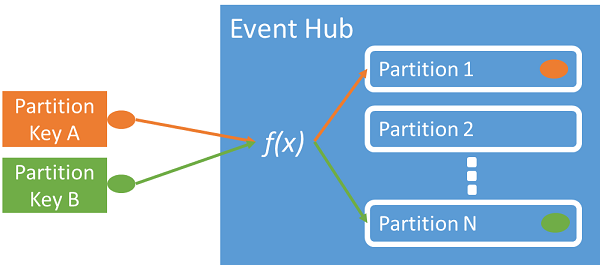
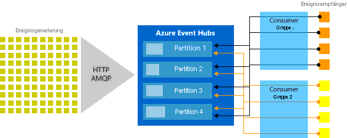
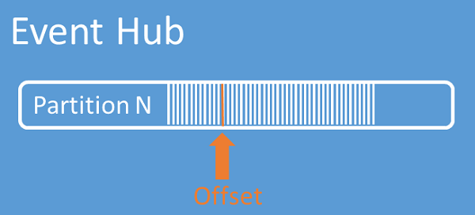

# <a name="features-and-terminology-in-azure-event-hubs"></a>Features und Terminologie in Azure Event Hubs

Azure Event Hubs ist ein skalierbarer Ereignisverarbeitungsdienst, der große Mengen von Ereignissen und Daten mit kurzer Wartezeit und hoher Zuverlässigkeit erfasst und verarbeitet. Unter [Was ist Event Hubs?](./event-hubs-about.md) finden Sie einen allgemeinen Überblick.

Dieser Artikel setzt auf den Informationen in der [Übersichtsartikel](./event-hubs-about.md) auf und bietet technische und Implementierungsdetails zu Event Hubs-Komponenten und -Features.

> [!TIP]
> [Die Protokollunterstützung für **Apache Kafka**-Clients](event-hubs-for-kafka-ecosystem-overview.md) (Version 1.0 oder höher) verfügt über Netzwerkendpunkte, mit denen für Anwendungen, die für die Nutzung von Apache Kafka mit einem beliebigen Client ausgelegt sind, Event Hubs verwendet werden können. Die meisten vorhandenen Kafka-Anwendungen können leicht neu konfiguriert werden, damit sie nicht auf den Bootstrapserver eines Kafka-Clusters verweisen, sondern auf einen Event Hub-Namespace. 
>
>Aus Sicht der Kosten, des Betriebsaufwands und der Zuverlässigkeit ist Azure Event Hubs eine hervorragende Alternative zur Bereitstellung und zum Betrieb Ihrer eigenen Kafka- und Zookeeper-Cluster sowie zu Kafka-as-a-Service-Angeboten, die nicht standardmäßig in Azure integriert sind. 
>
> Sie erhalten nicht nur Zugang zu derselben Kernfunktionalität wie beim Apache Kafka-Broker, sondern auch zu den folgenden Azure Event Hub-Features: automatische Batchverarbeitung und Archivierung über [Event Hubs Capture](event-hubs-capture-overview.md), automatische Skalierung und automatischer Ausgleich, Notfallwiederherstellung, Unterstützung kostenneutraler Verfügbarkeitszonen, flexible und sichere Netzwerkintegration und Unterstützung mehrerer Protokolle, z. B. des firewallfreundlichen AMQP-over-WebSockets-Protokolls.


## <a name="namespace"></a>Namespace
Ein Event Hubs-Namespace verfügt über in das DNS integrierte Netzwerkendpunkte und verschiedene Verwaltungsfunktionen für die Zugriffssteuerung und Netzwerkintegration, z. B. [IP-Filterung](event-hubs-ip-filtering.md), [VNET-Dienstendpunkt](event-hubs-service-endpoints.md) und [Private Link](private-link-service.md). Darüber hinaus dient er als Verwaltungscontainer für eine von mehreren Event Hub-Instanzen (bei Kafka als „Themen“ bezeichnet).

## <a name="event-publishers"></a>Ereignisherausgeber

Jede Entität, die Daten an einen Event Hub sendet, ist ein *Ereignisherausgeber* (Synonym: *Ereigniserzeuger*). Ereignisherausgeber können Ereignisse über HTTPS, AMQP 1.0 oder das Kafka-Protokoll veröffentlichen. Ereignisherausgeber nutzen für den Veröffentlichungszugriff die auf Azure Active Directory basierende Autorisierung mit JSON Web Tokens, die über Auth2 ausgestellt werden, oder ein Event Hub-spezifisches SAS-Token (Shared Access Signature).

### <a name="publishing-an-event"></a>Veröffentlichen eines Ereignisses

Sie können ein Ereignis über AMQP 1.0, das Kafka-Protokoll oder HTTPS veröffentlichen. Der Event Hubs-Dienst stellt eine [REST-API](/rest/api/eventhub/) sowie [.NET](event-hubs-dotnet-standard-getstarted-send.md)-, [Java](event-hubs-java-get-started-send.md)-, [Python](event-hubs-python-get-started-send.md)-, [JavaScript](event-hubs-node-get-started-send.md)- und [Go](event-hubs-go-get-started-send.md)-Clientbibliotheken für die Veröffentlichung von Ereignissen in einem Event Hub bereit. Für andere Runtimes und Plattformen können beliebige AMQP 1.0-Clients verwendet werden, z.B. [Apache Qpid](https://qpid.apache.org/). 

Die Wahl zwischen AMQP oder HTTPS ist auf das Verwendungsszenario bezogen. AMQP erfordert die Einrichtung eines persistenten bidirektionalen Sockets zusätzlich zu TLS (Transport Level Security) oder SSL/TLS. AMQP weist höhere Netzwerkkosten beim Initialisieren der Sitzung auf, HTTPS erfordert jedoch zusätzlichen TLS-Mehraufwand für jede Anforderung. Mit AMQP kann eine erheblich höhere Leistung für häufig genutzte Herausgeber erzielt werden, und es können deutlich geringere Latenzen realisiert werden, wenn asynchroner Veröffentlichungscode verwendet wird.

Sie können Ereignisse einzeln oder als Batch veröffentlichen. Jede Veröffentlichung ist auf 1 MB beschränkt. Dies gilt unabhängig davon, ob es sich um ein einzelnes Ereignis oder einen Batch handelt. Wenn dieser Schwellenwert für Veröffentlichungsereignisse überschritten wird, werden diese abgelehnt. 

Der Event Hubs-Durchsatz wird skaliert, indem Partitionen und Zuteilungen von Durchsatzeinheiten verwendet werden (siehe unten). Eine bewährte Methode für Herausgeber besteht darin, dass das für einen Event Hub ausgewählte spezifische Partitionierungsmodell nicht bekannt ist und nur ein *Partitionsschlüssel* angegeben wird, der zum konsistenten Zuweisen von verwandten Ereignissen zu derselben Partition verwendet wird.



Event Hubs stellt sicher, dass alle Ereignisse mit dem gleichen Partitionsschlüsselwert zusammen gespeichert und in der Empfangsreihenfolge übermittelt werden. Wenn Partitionsschlüssel mit Herausgeberrichtlinien verwendet werden, müssen die Identität des Herausgebers und der Wert des Partitionsschlüssels übereinstimmen. Andernfalls tritt ein Fehler auf.

### <a name="event-retention"></a>Aufbewahrung von Ereignissen

Veröffentlichte Ereignisse werden basierend auf einer konfigurierbaren, zeitbasierten Aufbewahrungsrichtlinie von einem Event Hub entfernt. Der Standardwert und der kürzestmögliche Aufbewahrungszeitraum beträgt einen Tag (24 Stunden). Für Event Hubs Standard beträgt der maximale Aufbewahrungszeitraum sieben Tage. Für Event Hubs Dedicated beträgt der maximale Aufbewahrungszeitraum 90 Tage.

> [!NOTE]
> Event Hubs ist eine Engine für das Ereignisstreaming in Echtzeit. Sie ist nicht dafür ausgelegt, anstelle einer Datenbank bzw. als dauerhafter Speicher für Ereignisdatenströme mit unendlich langer Aufbewahrungsdauer verwendet zu werden. 
> 
> Je umfangreicher der Verlauf eines Ereignisdatenstroms wird, desto mehr benötigen Sie Hilfsindizes, um ein bestimmtes Verlaufssegment eines bestimmten Datenstroms zu finden. Die Untersuchung von Ereignisnutzdaten und die Indizierung sind nicht Teil des Funktionsumfangs von Event Hubs (oder Apache Kafka). Datenbanken und spezielle Analysespeicher und Engines, z. B. [Azure Data Lake Store](../data-lake-store/data-lake-store-overview.md), [Azure Data Lake Analytics](../data-lake-analytics/data-lake-analytics-overview.md) und [Azure Synapse](../synapse-analytics/overview-what-is.md), sind zum Speichern von Verlaufsereignissen daher viel besser geeignet.
>
> [Event Hubs Capture](event-hubs-capture-overview.md) ist direkt in Azure Blob Storage und Azure Data Lake Storage integriert und ermöglicht daher auch das [direkte Senden von Ereignissen an Azure Synapse](store-captured-data-data-warehouse.md).
>
> Falls Sie das Muster [Ereignissourcing](https://docs.microsoft.com/azure/architecture/patterns/event-sourcing) für Ihre Anwendung nutzen möchten, sollten Sie Ihre Strategie für Momentaufnahmen an den Grenzwerten für die Aufbewahrung von Event Hubs ausrichten. Vermeiden Sie es, materialisierte Sichten aus den Rohereignissen des gesamten Anfangsdatenbestands neu zu erstellen. Sie würden die Verwendung dieser Strategie sicherlich bereuen, nachdem Sie Ihre Anwendung eine Weile in der Produktion eingesetzt haben und diese stark genutzt wurde, weil Ihr Projektionsgenerator dann die Änderungsereignisse vieler Jahre durchgehen muss, um zu den aktuellen Änderungen zu gelangen. 


### <a name="publisher-policy"></a>Herausgeberrichtlinie

Event Hubs ermöglicht eine differenzierte Kontrolle über Ereignisherausgeber durch *Herausgeberrichtlinien*. Herausgeberrichtlinien sind Laufzeitfunktionen, mit denen große Mengen unabhängiger Herausgeber verwaltet werden können. Mit Herausgeberrichtlinien verwendet jeder Herausgeber einen eigenen eindeutigen Bezeichner für die Veröffentlichung von Ereignissen in einem Event Hub. Dabei kommt der folgende Mechanismus zum Einsatz:

```http
//<my namespace>.servicebus.windows.net/<event hub name>/publishers/<my publisher name>
```

Sie müssen Herausgebernamen nicht im Voraus erstellen, jedoch müssen diese mit dem SAS-Token übereinstimmen, das beim Veröffentlichen eines Ereignisses verwendet wird, um die Identitäten unabhängiger Herausgeber sicherzustellen. Bei Verwendung von Herausgeberrichtlinien wird der Wert **PartitionKey** auf den Herausgebernamen festgelegt. Diese Werte müssen übereinstimmen, damit alles ordnungsgemäß funktioniert.

## <a name="capture"></a>Erfassung

Mit [Event Hubs Capture](event-hubs-capture-overview.md) lassen sich die Streamingdaten automatisch in Event Hubs aufzeichnen und in einem Blob Storage-Konto oder einem Azure Data Lake-Dienstkonto speichern. Sie können Event Hubs Capture im Azure-Portal aktivieren und eine Mindestgröße sowie ein Mindestzeitfenster für die Aufzeichnung angeben. Mit Event Hubs Capture legen Sie ein eigenes Azure Blob Storage-Konto und einen Container bzw. ein Azure Data Lake-Dienstkonto fest, wovon eines zum Speichern der aufgezeichneten Daten verwendet wird. Die aufgezeichneten Daten werden im Apache Avro-Format geschrieben.

## <a name="partitions"></a>Partitionen
[!INCLUDE [event-hubs-partitions](../../includes/event-hubs-partitions.md)]


## <a name="sas-tokens"></a>SAS-Token

Event Hubs verwendet *Shared Access Signatures*, die auf Namespace- und Event Hub-Ebene verfügbar sind. Ein SAS-Token wird aus einem SAS-Schlüssel generiert und ist ein SHA-Hash einer URL, der in einem bestimmten Format codiert ist. Mit dem Namen des Schlüssels (Richtlinie) und dem Token kann Event Hubs den Hash erneut generieren und somit den Absender authentifizieren. In der Regel werden SAS-Token für Ereignisherausgeber nur mit **Senden**-Berechtigung für einen bestimmten Event Hub erstellt. Dieser SAS-Token-URL-Mechanismus bildet die Grundlage für die Herausgeberidentifizierung, die in der Herausgeberrichtlinie eingeführt wurde. Weitere Informationen zur Verwendung von SAS finden Sie unter [SAS-Authentifizierung (Shared Access Signature) mit Service Bus](../service-bus-messaging/service-bus-sas.md).

## <a name="event-consumers"></a>Ereignisconsumer

Eine Entität, die Ereignisdaten von einem Event Hub liest, ist ein *Ereignisconsumer*. Alle Event Hubs-Consumer stellen über eine AMQP 1.0-Sitzung eine Verbindung her und Ereignisse werden über die Sitzung übermittelt, sobald sie verfügbar sind. Der Client muss die Verfügbarkeit der Daten nicht abfragen.

### <a name="consumer-groups"></a>Verbrauchergruppen

Der Veröffentlichen-/Abonnieren-Mechanismus von Event Hubs erfolgt durch *Consumergruppen*. Eine Consumergruppe ist eine Ansicht (Status, Position oder Offset) des gesamten Event Hubs. Mithilfe von Consumergruppen können mehrere verarbeitende Anwendungen jeweils eine separate Ansicht des Ereignisdatenstroms aufweisen und den Datenstrom unabhängig voneinander in einem unabhängigen Tempo und mit eigenen Offsets lesen.

In einer Streamverarbeitungsarchitektur entspricht jede Downstreamanwendung einer Consumergruppe. Wenn Sie Ereignisdaten in den langfristigen Speicher schreiben möchten, ist die entsprechende Speicherschreibanwendung eine Consumergruppe. Komplexe Ereignisverarbeitung kann von einer anderen separaten Consumergruppe ausgeführt werden. Sie können auf Partitionen nur über eine Consumergruppe zugreifen. In einem Event Hub gibt es immer eine Standardconsumergruppe, und Sie können bis zu 20 Consumergruppen für einen Event Hub auf Standardebene erstellen.

Pro Consumergruppe sind maximal 5 gleichzeitige Leser in einer Partition zulässig. Jedoch **wird nur ein aktiver Empfänger in einer Partition pro Consumergruppe empfohlen**. Innerhalb einer einzelnen Partition erhält jeder Leser alle Nachrichten. Wenn Sie für die gleiche Partition über mehrere Leser verfügen, verarbeiten Sie doppelte Nachrichten. Sie müssen dies in Ihrem Code berücksichtigen, was möglicherweise nicht trivial ist. In einigen Szenarien ist dies jedoch ein gültiger Ansatz.

Bei einigen Clients der Azure SDKs handelt es sich um intelligente Consumer-Agents, die im Detail sicherstellen, dass jede Partition über einen einzelnen Reader verfügt und dass alle Partitionen eines Event Hubs ausgelesen werden. Ihr Code muss daher nur noch die aus dem Event Hub gelesenen Ereignisse verarbeiten und kann viele Details der Partitionen ignorieren. Weitere Informationen finden Sie unter [Herstellen einer Verbindung mit einer Partition](#connect-to-a-partition).

Nachstehend finden Sie einige Beispiele für die URI-Konvention für Consumergruppen:

```http
//<my namespace>.servicebus.windows.net/<event hub name>/<Consumer Group #1>
//<my namespace>.servicebus.windows.net/<event hub name>/<Consumer Group #2>
```

Die folgende Abbildung zeigt die Datenstromverarbeitungsarchitektur von Event Hubs:



### <a name="stream-offsets"></a>Streamoffsets

Ein *Offset* ist die Position eines Ereignisses innerhalb einer Partition. Sie können sich einen Offset als einen clientseitigen Zeiger vorstellen. Der Offset ist eine Nummerierung des Ereignisses in Byte. Dieser Offset ermöglicht es Ereignisconsumern (Lesern), einen Punkt im Ereignisstream anzugeben, ab dem Ereignisse gelesen werden sollen. Sie können den Offset als Zeitstempel oder als Offsetwert angeben. Es liegt in der Verantwortung jedes Consumers, seine eigenen Offsetwerte außerhalb des Event Hubs-Diensts zu speichern. Innerhalb einer Partition enthält jedes Ereignis einen Offset.



### <a name="checkpointing"></a>Setzen von Prüfpunkten

*Setzen von Prüfpunkten* ist ein Vorgang, bei dem Leser ihre Position innerhalb einer Partitionsereignissequenz markieren oder bestätigen. Dies liegt in der Verantwortung des Consumers und erfolgt auf Partitionsbasis innerhalb einer Consumergruppe. Das bedeutet, dass jeder Partitionsleser für jede Consumergruppe seine aktuelle Position im Ereignisstream nachverfolgen muss und den Dienst informieren kann, wenn er den Datenstrom als abgeschlossen betrachtet.

Wenn ein Leser die Verbindung zu eine Partition trennt, beginnt nach dem erneuten Herstellen der Verbindung das Lesen bei dem Prüfpunkt, der zuvor durch den letzten Leser dieser Partition in dieser Consumergruppe übermittelt wurde. Wenn der Leser verbunden ist, übergibt er diesen Offset an den Event Hub, um die Position für den nächsten Lesevorgang anzugeben. Auf diese Weise können mithilfe von Prüfpunkten Ereignisse von Downstreamanwendungen als abgeschlossen markiert werden. Darüber hinaus sorgen Prüfpunkte für Resilienz bei einem Failover zwischen Lesern, die auf unterschiedlichen Computern ausgeführt werden. Sie können ältere Daten zurückgeben, indem Sie einen niedrigeren Offset aus diesem Prüfpunktprozess angeben. Durch diesen Mechanismus ermöglicht das Setzen von Prüfpunkten Failoverstabilität und eine erneute Wiedergabe des Ereignisstreams.

> [!NOTE]
> Wenn Sie Azure Blob Storage als Prüfpunktspeicher in einer Umgebung verwenden, die eine andere Version des Storage Blob SDK unterstützt als diejenigen, die in der Regel in Azure verfügbar sind, müssen Sie Code verwenden, um die Version der Speicherdienst-API in die von dieser Umgebung unterstützte Version zu ändern. Wenn Sie z. B. [Event Hubs mit einer Azure Stack Hub-Version 2002](/azure-stack/user/event-hubs-overview) ausführen, ist die höchste verfügbare Version für den Speicherdienst Version 2017-11-09. In diesem Fall müssen Sie Code verwenden, um Version 2017-11-09 der Storage Service-API als Ziel zu nutzen. Ein Beispiel für die Verwendung einer bestimmten Storage-API-Version als Ziel finden Sie in den folgenden Beispielen auf GitHub: 
> - [.NET](https://github.com/Azure/azure-sdk-for-net/tree/master/sdk/eventhub/Azure.Messaging.EventHubs.Processor/samples/). 
> - [Java](https://github.com/Azure/azure-sdk-for-java/blob/master/sdk/eventhubs/azure-messaging-eventhubs-checkpointstore-blob/src/samples/java/com/azure/messaging/eventhubs/checkpointstore/blob/)
> - [JavaScript](https://github.com/Azure/azure-sdk-for-js/blob/master/sdk/eventhub/eventhubs-checkpointstore-blob/samples/javascript) oder [TypeScript](https://github.com/Azure/azure-sdk-for-js/blob/master/sdk/eventhub/eventhubs-checkpointstore-blob/samples/typescript)
> - [Python](https://github.com/Azure/azure-sdk-for-python/blob/master/sdk/eventhub/azure-eventhub-checkpointstoreblob-aio/samples/)

### <a name="common-consumer-tasks"></a>Allgemeine Consumeraufgaben

Alle Event Hubs-Consumer stellen eine Verbindung über eine AMQP 1.0-Sitzung (statusaktivierter bidirektionaler Kommunikationskanal) her. Jede Partition weist eine AMQP 1.0-Sitzung auf, die den Transport von Ereignissen nach Partition getrennt ermöglicht.

#### <a name="connect-to-a-partition"></a>Herstellen einer Verbindung mit einer Partition

Bei der Verbindungsherstellung zu Partitionen erfolgt die Koordination von Readerverbindungen zu bestimmten Partitionen oft mithilfe eines Leasingmechanismus. Auf diese Weise ist es möglich, dass jede Partition in einer Consumergruppe nur über einen aktiven Reader verfügt. Wenn Sie die Clients in den Event Hubs-SDKs verwenden, erleichtern Sie sich das Leasing und die Verwaltung von Readern sowie das Setzen von Prüfpunkten für diese, denn diese Clients verhalten sich wie intelligente Consumer-Agents. Dies sind:

- [EventProcessorClient](/dotnet/api/azure.messaging.eventhubs.eventprocessorclient) für .NET
- [EventProcessorClient](/java/api/com.azure.messaging.eventhubs.eventprocessorclient) für Java
- [EventHubConsumerClient](/python/api/azure-eventhub/azure.eventhub.aio.eventhubconsumerclient) für Python
- [EventHubConsumerClient](/javascript/api/@azure/event-hubs/eventhubconsumerclient) für JavaScript/TypeScript

#### <a name="read-events"></a>Lesen von Ereignissen

Nachdem eine AMQP 1.0-Sitzung und ein Link für eine bestimmte Partition geöffnet wurde, werden Ereignisse vom Event Hubs-Dienst an den AMQP 1.0-Client übergeben. Dieser Mechanismus ermöglicht einen höheren Durchsatz und eine niedrigere Latenz als Pull-basierte Mechanismen wie z. B. HTTP GET. Wenn Ereignisse an den Client gesendet werden, enthält jede Ereignisdateninstanz wichtige Metadaten wie z. B. den Offset und die Sequenznummer, die zur Vereinfachung des Setzens von Prüfpunkten in der Ereignissequenz verwendet werden.

Ereignisdaten:
* Offset
* Sequenznummer
* Body
* Benutzereigenschaften
* Systemeigenschaften

Die Verwaltung des Offsets liegt in Ihrer Verantwortung.

## <a name="next-steps"></a>Nächste Schritte

Weitere Informationen zu Event Hubs erhalten Sie unter den folgenden Links:

- Erste Schritte mit Event Hubs
    - [.NET](event-hubs-dotnet-standard-getstarted-send.md)
    - [Java](event-hubs-java-get-started-send.md)
    - [Python](event-hubs-python-get-started-send.md)
    - [JavaScript](event-hubs-java-get-started-send.md)
* [Programmierleitfaden für Event Hubs](event-hubs-programming-guide.md)
* [Verfügbarkeit und Konsistenz in Event Hubs](event-hubs-availability-and-consistency.md)
* [Event Hubs – häufig gestellte Fragen](event-hubs-faq.md)
* [Event Hubs-Beispiele](event-hubs-samples.md)