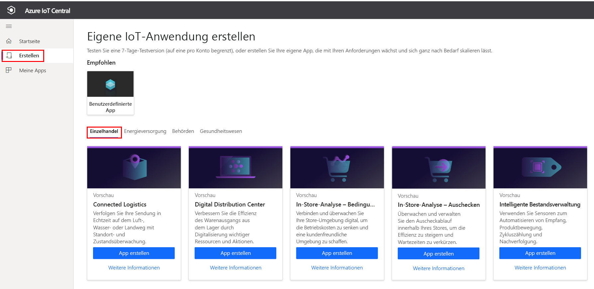
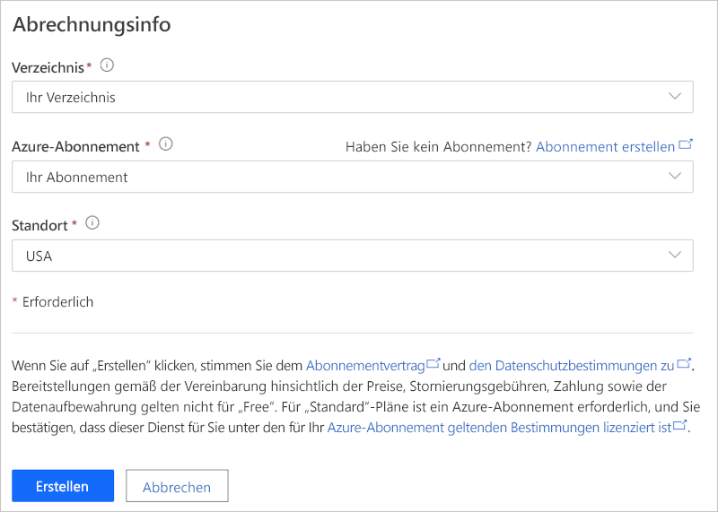

# Tutorial: Bereitstellung und exemplarische Vorgehensweise für eine Anwendungsvorlage für vernetzte Logistik

In diesem Tutorial werden die ersten Schritte mit der IoT Central-Anwendungsvorlage für *vernetzte Logistik* gezeigt. Sie erfahren, wie Sie die Vorlage bereitstellen und verwenden.

In diesem Tutorial lernen Sie Folgendes:

> [!div class="checklist"]
> * Erstellen einer Anwendung für vernetzte Logistik
> * Verwenden der wichtigsten Funktionen in der Anwendung
> * Verwenden des Dashboards, um die Aktivität von kritischen Vorgängen bei Logistikgeräten anzuzeigen
> * Verwenden der Gerätevorlage
> * Befolgen von Regeln
> * Verwenden von Aufträgen

## Voraussetzungen

* Zum Bereitstellen dieser App müssen keine besonderen Voraussetzungen erfüllt werden.
* Sie können den Tarif „Free“ oder ein Azure-Abonnement verwenden.

## Erstellen einer Anwendung für vernetzte Logistik

Gehen Sie wie folgt vor, um die Anwendung zu erstellen:

1. Navigieren Sie zur Buildwebsite für [Azure IoT Central](https://aka.ms/iotcentral). Melden Sie sich dann mit einem persönlichen Microsoft-Konto oder mit einem Geschäfts-, Schul- oder Unikonto an. Wählen Sie auf der linken Navigationsleiste **Erstellen** und anschließend die Registerkarte **Einzelhandel** aus.

    :::image type="content" source="media/tutorial-iot-central-connected-logistics/iotc-retail-homepage.png" alt-text="Vorlage für vernetzte Logistik":::

1. Wählen Sie unter **Connected Logistics-Anwendung** die Option **App erstellen** aus.

1. Durch Auswählen von **App erstellen** wird das Formular **Neue Anwendung** geöffnet. Geben Sie die folgenden Details ein:

    * **Anwendungsname:** Sie können den vorgeschlagenen Standardnamen verwenden oder einen eigenen Anwendungsnamen eingeben.
    * **URL:** Sie können die vorgeschlagene Standard-URL verwenden oder eine eigene, einfach merkbare und benutzerfreundliche URL eingeben. Als Nächstes wird die Standardeinstellung empfohlen, wenn Sie bereits über ein Azure-Abonnement verfügen. Sie können mit dem Tarif für die kostenlose 7-Tage-Testversion beginnen und jederzeit vor Ablauf der kostenlosen Testversion auf einen Standard-Tarif umstellen.
    * **Abrechnungsinfo**: Zum Bereitstellen der Ressourcen sind die Details zum Verzeichnis, zum Azure-Abonnement und zur Region erforderlich.
    * **Erstellen**: Wählen Sie unten auf der Seite „Erstellen“ aus, um Ihre Anwendung bereitzustellen.

    :::image type="content" source="media/tutorial-iot-central-connected-logistics/connected-logistics-app-create.png" alt-text="App-Vorlage für vernetzte Logistik":::

    :::image type="content" source="media/tutorial-iot-central-connected-logistics/connected-logistics-app-create-billinginfo.png" alt-text="Abrechnungsinformationen für vernetzte Logistik":::

## Einführung in die Anwendung

Der folgende Screenshot zeigt das Auswählen der Anwendungsvorlage für vernetzte Logistik:

> [!div class="mx-imgBorder"]
> 

In den nächsten Abschnitten werden die wichtigsten Features der Anwendung behandelt:

### Dashboard

Nach Bereitstellung der Anwendung ist Ihr Standarddashboard ein Operatorportal mit Schwerpunkt auf vernetzter Logistik. Northwind Trader ist ein fiktiver Logistikanbieter, der eine Frachtflotte zu Wasser und zu Lande verwaltet. Auf diesem Dashboard werden zwei verschiedene Gateways mit Telemetriedaten von Transporten sowie mit zugeordneten Befehlen, Aufträgen und Aktionen angezeigt.

> [!div class="mx-imgBorder"]
> 

> [!div class="mx-imgBorder"]
> 

Dieses Dashboard ist vorkonfiguriert, um die Aktivität von kritischen Vorgängen bei Logistikgeräten zu veranschaulichen.

Das Dashboard ermöglicht zwei verschiedene Gateway-Geräteverwaltungsvorgänge:

* Anzeigen von Logistikrouten für Transporte per LKW und von Standortdetails für Schiffstransporte
* Anzeigen des Gatewaystatus und anderer relevanter Informationen

:::image type="content" source="media/tutorial-iot-central-connected-logistics/connected-logistics-dashboard1.png" alt-text="Dashboard für vernetzte Logistik":::

* Sie können die Gesamtanzahl von Gateways sowie von aktiven und unbekannten Tags nachverfolgen.
* Sie können Geräteverwaltungsvorgänge durchführen, beispielsweise Firmwareupdates, Deaktivieren und Aktivieren von Sensoren sowie Aktualisieren von Sensorschwellenwerten, Telemetrieintervallen und Geräteserviceverträgen.
* Anzeigen des Geräteakkuverbrauchs

:::image type="content" source="media/tutorial-iot-central-connected-logistics/connected-logistics-dashboard2.png" alt-text="Dashboard für vernetzte Logistik: Status":::

#### Gerätevorlage

Wählen Sie **Gerätevorlagen** aus, um das Gatewayfunktionsmodell anzuzeigen. Ein Funktionsmodell ist um die Schnittstellen **Gatewaytelemetrie und -eigenschaften** und **Gatewaybefehle** strukturiert.

**Gatewaytelemetrie und -eigenschaften:** Diese Schnittstelle definiert die gesamte Telemetrie im Zusammenhang mit Sensor-, Standort- und Geräteinformationen. Außerdem definiert sie Funktionen von Gerätezwillingseigenschaften wie Gatewayschwellenwerte und Aktualisierungsintervalle.

:::image type="content" source="media/tutorial-iot-central-connected-logistics/connected-logistics-devicetemplate1.png" alt-text="Schnittstelle für Telemetriedaten und Eigenschaften":::

**Gatewaybefehle:** Diese Schnittstelle dient zur Strukturierung aller Gatewaybefehlsfunktionen:

:::image type="content" source="media/tutorial-iot-central-connected-logistics/connected-logistics-devicetemplate2.png" alt-text="Schnittstelle für Gatewaybefehle":::

### Regeln

Wählen Sie die Registerkarte **Regeln** aus, um die Regeln dieser Anwendungsvorlage anzuzeigen. Diese Regeln sind so konfiguriert, dass E-Mail-Benachrichtigungen für weitere Untersuchungen an die Operatoren gesendet werden:

**Gateway-Diebstahlwarnung**: Diese Regel wird ausgelöst, wenn von den Sensoren während des Transports unerwarteter Lichteinfall erkannt wird. Operatoren müssen umgehend benachrichtigt werden, um einen möglichen Diebstahl zu untersuchen.

**Nicht reagierendes Gateway**: Diese Regel wird ausgelöst, wenn das Gateway für einen längeren Zeitraum keine Meldung an die Cloud sendet. Das Gateway reagiert möglicherweise aufgrund eines niedrigen Akkustands, eines Verbindungsabbruchs oder einer Beschädigung nicht.

:::image type="content" source="media/tutorial-iot-central-connected-logistics/connected-logistics-rules.png" alt-text="Regeldefinitionen":::

### Aufträge

Wählen Sie die Registerkarte **Aufträge** aus, um die Aufträge in dieser Anwendung anzuzeigen:

:::image type="content" source="media/tutorial-iot-central-connected-logistics/connected-logistics-jobs.png" alt-text="Auszuführende Aufträge":::

Aufträge können für anwendungsweite Vorgänge verwendet werden. Bei den Aufträgen in dieser Anwendung werden Gerätebefehle und die Zwillingsfunktionen verwendet, um Aufgaben wie das Deaktivieren bestimmter Sensoren für alle Gateways oder das Ändern von Sensorschwellenwerten abhängig von der Transportart und -route durchzuführen:

* Es ist ein Standardvorgang, Aufprallsensoren beim Transport auf See zu deaktivieren, um Akkukapazität zu sparen, oder den Temperaturschwellenwert bei Kühlkettentransporten zu senken.

* Mithilfe von Aufträgen können Sie systemweite Vorgänge wie das Updaten der Gatewayfirmware oder das Aktualisieren des Dienstvertrags durchführen, um bei Wartungsaktivitäten auf dem aktuellen Stand zu bleiben.

## Bereinigen von Ressourcen

Wenn Sie diese Anwendung nicht mehr benötigen, löschen Sie die Anwendungsvorlage, indem Sie zu **Verwaltung** > **Anwendungseinstellungen** navigieren und **Löschen** auswählen.

:::image type="content" source="media/tutorial-iot-central-connected-logistics/connected-logistics-cleanup.png" alt-text="Vorlagenbereinigung":::

## Nächste Schritte

Weitere Informationen zu :

> [!div class="nextstepaction"]
> [Konzepte der vernetzten Logistik](./architecture-connected-logistics.md)
