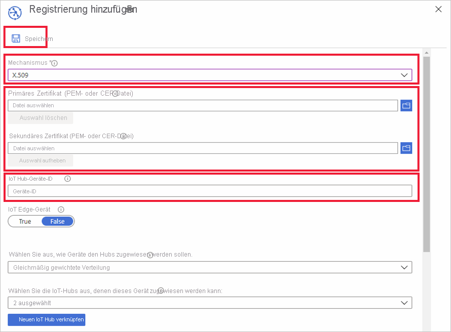

# Verwalten von Geräteregistrierungen mit dem Azure-Portal

Eine *Geräteregistrierung* erstellt einen Datensatz eines einzelnen Geräts oder einer Gruppe von Geräten, die sich zu einem beliebigen Zeitpunkt beim Azure IoT Hub Device Provisioning-Dienst registrieren können. Der Registrierungsdatensatz enthält die Erstkonfiguration für das Gerät/die Geräte im Rahmen dieser Registrierung. In der Konfiguration enthalten ist der IoT-Hub, dem ein Gerät zugewiesen wird, oder eine Zuweisungsrichtlinie, die den Hub aus einer Gruppe von Hubs konfiguriert. Dieser Artikel zeigt Ihnen die Verwaltung von Geräteregistrierungen für Ihren Bereitstellungsdienst.

## Erstellen einer Geräteregistrierung

Sie haben zwei Möglichkeiten, Ihre Geräte beim Bereitstellungsdienst zu registrieren:

* Eine **Registrierungsgruppe** ist ein Eintrag für eine Gruppe von Geräten, die einen allgemeinen Nachweismechanismus gemeinsam nutzen. Wir empfehlen, eine Registrierungsgruppe für eine große Anzahl von Geräten, die eine Erstkonfiguration gemeinsam nutzen, oder für Geräte zu verwenden, die alle demselben Mandanten zugeordnet sind. Geräte, die den [symmetrischen Schlüssel](concepts-symmetric-key-attestation.md) oder [X.509-Zertifikate](concepts-x509-attestation.md) verwenden, werden unterstützt. 

    Schrittweise Anleitungen zum Erstellen und Verwenden von Registrierungsgruppen mit symmetrischen Schlüsseln finden Sie im Tutorial [Bereitstellen von Geräten mit symmetrischen Schlüsseln](how-to-legacy-device-symm-key.md).

    Mit den folgenden Schritten erstellen Sie im Portal eine Registrierungsgruppe für eine Gruppe von Geräten:

    1. Melden Sie sich beim Azure-Portal an, und klicken Sie im linken Menü auf **Alle Ressourcen**.  
    1. Klicken Sie auf den Gerätebereitstellungsdienst, bei dem Sie Ihr Gerät aus der Liste der Ressourcen registrieren möchten.  
    1. Klicken Sie in Ihrem Bereitstellungsdienst auf **Registrierungen verwalten** und dann oben auf die Schaltfläche **Registrierungsgruppe hinzufügen**.  
     
        
        
    1. Wenn der Bereich „Registrierungsgruppe hinzufügen“ angezeigt wird, geben Sie die Informationen für Ihre Registrierung ein, und klicken Sie auf **Speichern**.  
     
        
        
        | Feld | Beschreibung |
        | :--- | :--- |
        | **Gruppenname** | Erforderlicher Name für Ihre Gruppe von Geräten. |
        | **Nachweistyp** | Klicken Sie je nach der von Ihren Geräten verwendeten Nachweismethode auf **Zertifikat** oder **Symmetrischer Schlüssel**. |
        | **Zertifikattyp** | Verfügbar, wenn Sie den Zertifikatnachweis verwenden. Wählen Sie **Zertifizierungsstellenzertifikat** oder **Zwischenzertifikat** aus – abhängig davon, mit welchem Zertifikat Ihre Gerätezertifikate signiert wurden. |
        | **Primäres Zertifikat** | Wenn Sie Ihre Gerätezertifikate mit einem Zertifikat der Stammzertifizierungsstelle signieren, muss für dieses Zertifikat der [Eigentumsnachweis](how-to-verify-certificates.md) abgeschlossen sein. Dann können Sie es als **Primäres Zertifikat** für die Gruppe von Geräten auswählen.  Wenn Sie Ihre Gerätezertifikate mit einem Zwischenzertifikat signieren, steht Ihnen eine Schaltfläche zum Hochladen zur Verfügung, über die Sie dieses Zertifikat hochladen können. Für das Zertifikat, mit dem das Zwischenzertifikat signiert wurde, muss ebenfalls der [Eigentumsnachweis](how-to-verify-certificates.md) abgeschlossen sein. |

        
    

* Eine **individuelle Registrierung** ist ein Eintrag für ein einzelnes Gerät, das einem IoT-Hub zugewiesen werden kann. Geräte, die den [symmetrischen Schlüssel](concepts-symmetric-key-attestation.md), [X.509-Zertifikate](concepts-x509-attestation.md) und den [TPM-Nachweis](concepts-tpm-attestation.md) verwenden, werden unterstützt. 

    Sie können mit den folgenden Schritten eine individuelle Registrierung im Portal erstellen:

    1. Melden Sie sich beim Azure-Portal an, und klicken Sie im linken Menü auf **Alle Ressourcen**.
    1. Klicken Sie auf den Gerätebereitstellungsdienst, bei dem Sie Ihr Gerät aus der Liste der Ressourcen registrieren möchten.
    1. Klicken Sie in Ihrem Bereitstellungsdienst auf **Registrierungen verwalten** und dann oben auf die Schaltfläche **Individuelle Registrierung hinzufügen**.   

       

    1. Wenn der Bereich „Registrierung hinzufügen“ angezeigt wird, geben Sie die Informationen für die individuelle Geräteregistrierung ein, und klicken Sie auf **Speichern**. 
     
        
    
        | Feld | Beschreibung |
        | :--- | :--- |
        | **Mechanismus** | Wählen Sie je nach der von Ihren Geräten verwendeten Nachweismethode **X.509**, **TPM** oder **Symmetrischer Schlüssel** für den Nachweismechanismus aus. |
        | Nachweiseinstellungen | Schrittweise Anleitungen zum Erstellen und Verwenden von individuellen Registrierungen mit symmetrischen Schlüsseln oder X.509-Zertifikaten finden Sie in einem der Schnellstarts [Bereitstellen eines Geräts mit symmetrischem Schlüssel](quick-create-simulated-device-symmetric-key-java.md#create-a-device-enrollment) bzw. [Bereitstellen eines Geräts mit X.509-Zertifikat](quick-create-simulated-device-x509-java.md#create-a-self-signed-x509-device-certificate-and-individual-enrollment-entry).  Schrittweise Anleitungen zum Erstellen und Verwenden von individuellen Registrierungen mithilfe des TPM-Nachweises finden Sie in einem der Beispiele für [Bereitstellen eines simulierten TPM-Geräts](quick-create-simulated-device-tpm-java.md#create-a-device-enrollment-entry).|
        | **IoT Hub-Geräte-ID** |  Diese ID steht für Ihr Gerät. Sie muss den Regeln für eine Geräte-ID entsprechen. Weitere Informationen finden Sie unter [Geräteidentitätseigenschaften](../iot-hub/iot-hub-devguide-identity-registry.md#device-identity-properties).  Bei der Verwendung von X.509-Zertifikaten muss dieser Text der Antragstellername auf dem Gerätezertifikat sein, das Sie für die Registrierung hochladen. Dieser Antragstellername muss den Regeln für eine Geräte-ID entsprechen.|
            

## Aktualisieren eines Registrierungseintrags
Sie können mit den folgenden Schritten einen vorhandenen Registrierungseintrag im Portal aktualisieren:

1. Öffnen Sie Ihren Gerätebereitstellungsdienst im Azure-Portal, und klicken Sie auf **Registrierungen verwalten**. 
1. Navigieren Sie zu dem Registrierungseintrag, den Sie ändern möchten. Klicken Sie auf den Eintrag, worauf zusammenfassende Informationen zu Ihrer Geräteregistrierung geöffnet werden. 
1. Auf dieser Seite können Sie Elemente außer dem Sicherheitstyp und den Anmeldeinformationen ändern, z. B. den IoT-Hub, mit dem das Gerät verknüpft werden soll, und die Geräte-ID. Sie können auch den anfänglichen Gerätezwillingsstatus ändern. 
1. Klicken Sie bei Abschluss auf **Speichern**, um die Geräteregistrierung zu aktualisieren. 

    

## Entfernen einer Geräteregistrierung
In Fällen, in denen Ihre Geräte nicht in einem IoT Hub bereitgestellt werden müssen, können Sie mit den folgenden Schritten den zugehörigen Registrierungseintrag im Portal entfernen:

1. Öffnen Sie Ihren Gerätebereitstellungsdienst im Azure-Portal, und klicken Sie auf **Registrierungen verwalten**. 
1. Navigieren Sie zu dem Registrierungseintrag, den Sie entfernen möchten, und wählen Sie ihn aus. 
1. Klicken Sie ganz oben auf die Schaltfläche **Löschen**, und bestätigen Sie nach Aufforderung mit **Ja**. 
1. Nach Abschluss der Aktion sehen Sie, dass Ihr Eintrag aus der Geräteregistrierungsliste entfernt wurde. 
 
    