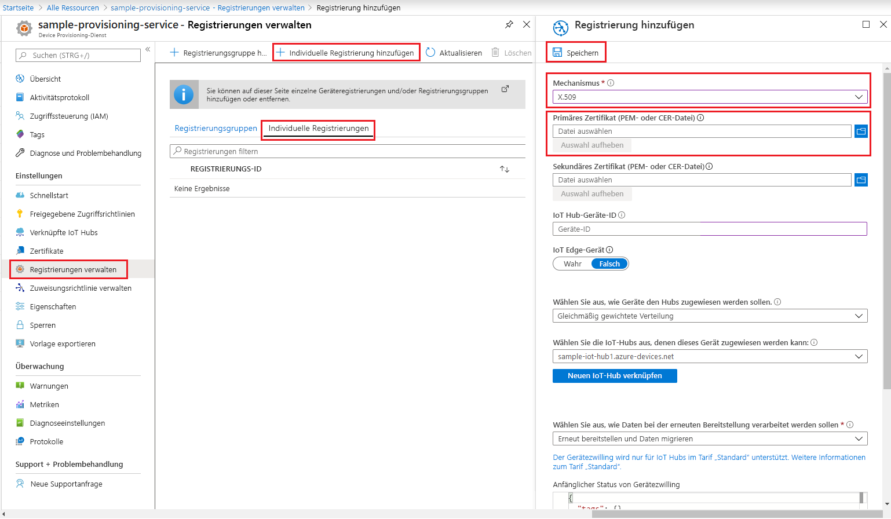
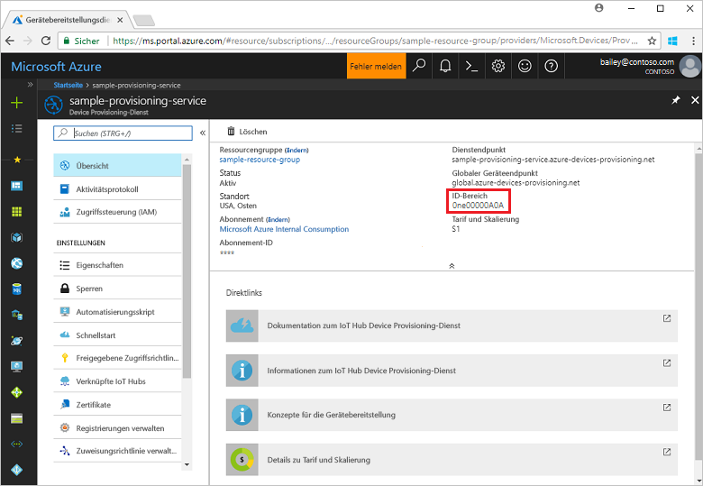

# <a name="quickstart-create-and-provision-an-x509-device-using-c-device-sdk-for-iot-hub-device-provisioning-service"></a>Schnellstart: Erstellen und Bereitstellen eines X.509-Geräts mithilfe des C#-Geräte-SDK für IoT Hub Device Provisioning Service

[!INCLUDE [iot-dps-selector-quick-create-simulated-device-x509](../../includes/iot-dps-selector-quick-create-simulated-device-x509.md)]

In den folgenden Schritten wird gezeigt, wie Sie Gerätecode aus den [Azure IoT-Beispielen für C#](https://github.com/Azure-Samples/azure-iot-samples-csharp) für die Bereitstellung eines X.509-Geräts verwenden. In diesem Artikel führen Sie den Gerätebeispielcode auf Ihrem Entwicklungscomputer aus, um mithilfe von Device Provisioning Service eine Verbindung mit einer IoT Hub-Instanz herzustellen.

## <a name="prerequisites"></a>Voraussetzungen

Wenn Sie mit der automatischen Bereitstellung nicht vertraut sind, lesen Sie die Übersicht zur [Bereitstellung](about-iot-dps.md#provisioning-process). Vergewissern Sie sich außerdem, dass Sie die Schritte unter [Einrichten des IoT Hub Device Provisioning-Diensts über das Azure-Portal](./quick-setup-auto-provision.md) ausgeführt haben, bevor Sie fortfahren.

In Azure IoT Device Provisioning Service werden zwei Registrierungsarten unterstützt:
- [Registrierungsgruppen:](concepts-service.md#enrollment-group) Für die Registrierung mehrerer verbundener Geräte
- [Individuelle Registrierung:](concepts-service.md#individual-enrollment) Für die Registrierung eines einzelnen Geräts

In diesem Artikel werden individuelle Registrierungen veranschaulicht.

[!INCLUDE [IoT Device Provisioning Service basic](../../includes/iot-dps-basic.md)]

<a id="setupdevbox"></a>
## <a name="prepare-the-development-environment"></a>Vorbereiten der Entwicklungsumgebung 

1. Vergewissern Sie sich, dass `git` auf Ihrem Computer installiert ist und den Umgebungsvariablen hinzugefügt wurde, auf die das Befehlsfenster Zugriff hat. Unter [Git-Clienttools von Software Freedom Conservancy](https://git-scm.com/download/) finden Sie die neueste Version der zu installierenden `git`-Tools. Hierzu zählt auch die Befehlszeilen-App **Git Bash**, über die Sie mit Ihrem lokalen Git-Repository interagieren können. 

1. Öffnen Sie eine Eingabeaufforderung oder Git Bash. Klonen Sie die Azure IoT-Codebeispiele für das C#-GitHub-Repository:
    
    ```bash
    git clone https://github.com/Azure-Samples/azure-iot-samples-csharp.git
    ```

1. Vergewissern Sie sich, dass auf Ihrem Computer das [.NET Core 3.1 SDK oder höher](https://dotnet.microsoft.com/download) installiert ist. Sie können den folgenden Befehl ausführen, um Ihre Version zu überprüfen:

    ```bash
    dotnet --info
    ```

## <a name="create-a-self-signed-x509-device-certificate"></a>Erstellen eines selbstsignierten X.509-Gerätezertifikats

In diesem Abschnitt erstellen Sie ein selbstsigniertes X.509-Testzertifikat mit `iothubx509device1` als allgemeinem Antragstellernamen. Dabei sollten Sie unbedingt die folgenden Punkte berücksichtigen:

* Selbstsignierte Zertifikate dienen nur zu Testzwecken und sollten nicht in der Produktion verwendet werden.
* Die Standardgültigkeitsdauer für ein selbstsigniertes Zertifikat beträgt ein Jahr.
* Die Geräte-ID des IoT-Geräts ist der allgemeine Antragstellername des Zertifikats. Verwenden Sie unbedingt einen Antragstellernamen, der die [Anforderungen für Geräte-ID-Zeichenfolgen](../iot-hub/iot-hub-devguide-identity-registry.md#device-identity-properties) erfüllt.

Sie verwenden Beispielcode aus [X509Sample](https://github.com/Azure-Samples/azure-iot-samples-csharp/tree/master/provisioning/Samples/device/X509Sample), um das Zertifikat zu erstellen, das mit dem individuellen Registrierungseintrag für das Gerät verwendet werden soll.


1. Wechseln Sie an einer PowerShell-Eingabeaufforderung zum Projektverzeichnis für das X.509-Gerätebereitstellungsbeispiel.

    ```powershell
    cd .\azure-iot-samples-csharp\provisioning\Samples\device\X509Sample
    ```

2. Der Beispielcode ist für die Verwendung von X.509-Zertifikaten eingerichtet, die in einer kennwortgeschützten Datei im PKCS12-Format (certificate.pfx) gespeichert sind. Darüber hinaus benötigen Sie im weiteren Verlauf dieses Schnellstarts eine Zertifikatsdatei mit einem öffentlichen Schlüssel („certificate.cer“), um eine individuelle Registrierung erstellen zu können. Führen Sie den folgenden Befehl aus, um das selbstsignierte Zertifikat und die dazugehörigen CER- und PFX-Dateien zu generieren:

    ```powershell
    PS D:\azure-iot-samples-csharp\provisioning\Samples\device\X509Sample> .\GenerateTestCertificate.ps1 iothubx509device1
    ```

3. Das Skript fordert Sie zur Eingabe eines PFX-Kennworts auf. Merken Sie sich dieses Kennwort gut. Es wird später zum Ausführen des Beispiels benötigt. Sie können `certutil` ausführen, um das Zertifikat zu sichern und den Antragstellernamen zu überprüfen.

    ```powershell
    PS D:\azure-iot-samples-csharp\provisioning\Samples\device\X509Sample> certutil .\certificate.pfx
    Enter PFX password:
    ================ Certificate 0 ================
    ================ Begin Nesting Level 1 ================
    Element 0:
    Serial Number: 7b4a0e2af6f40eae4d91b3b7ff05a4ce
    Issuer: CN=iothubx509device1, O=TEST, C=US
     NotBefore: 2/1/2021 6:18 PM
     NotAfter: 2/1/2022 6:28 PM
    Subject: CN=iothubx509device1, O=TEST, C=US
    Signature matches Public Key
    Root Certificate: Subject matches Issuer
    Cert Hash(sha1): e3eb7b7cc1e2b601486bf8a733887a54cdab8ed6
    ----------------  End Nesting Level 1  ----------------
      Provider = Microsoft Strong Cryptographic Provider
    Signature test passed
    CertUtil: -dump command completed successfully.    
    ```

 ## <a name="create-an-individual-enrollment-entry-for-the-device"></a>Erstellen eines individuellen Registrierungseintrags für das Gerät


1. Melden Sie sich beim Azure-Portal an, wählen Sie im Menü links die Schaltfläche **Alle Ressourcen** aus, und öffnen Sie Ihren Bereitstellungsdienst.

2. Wählen Sie im Menü von Device Provisioning Service die Option **Registrierungen verwalten** aus. Wählen Sie die Registerkarte **Individuelle Registrierungen** und dann oben die Schaltfläche **Individuelle Registrierung hinzufügen** aus. 

3. Geben Sie im Bereich **Registrierung hinzufügen** die folgenden Informationen ein:
   - Wählen Sie **X.509** als *Mechanismus* für den Nachweis der Identität.
   - Wählen Sie unter *Primäres Zertifikat (PEM- oder CER-Datei)* die Option *Datei auswählen* aus, und wählen Sie die in den vorherigen Schritten erstellte Zertifikatsdatei **certificate.pem** aus.
   - Lassen Sie die **Geräte-ID** leer. Bei der Bereitstellung Ihres Geräts wird die Geräte-ID auf den allgemeinen Namen (Common Name, CN) aus dem X.509-Zertifikat festgelegt (in diesem Fall: **iothubx509device1**). Dieser allgemeine Name wird auch für die Registrierungs-ID des Eintrags für die individuelle Registrierung verwendet. 
   - Optional können Sie die folgenden Informationen angeben:
       - Wählen Sie einen IoT Hub aus, der mit Ihrem Bereitstellungsdienst verknüpft ist.
       - Aktualisieren Sie **Initial device twin state** (Anfänglicher Gerätezwillingsstatus) mit der gewünschten Anfangskonfiguration für das Gerät.
   - Klicken Sie abschließend auf die Schaltfläche **Speichern**. 

     [](./media/quick-create-simulated-device-x509-csharp/device-enrollment.png#lightbox)
    
   Nach der Registrierung wird Ihr X.509-Registrierungseintrag auf der Registerkarte *Individuelle Registrierungen* in der Spalte *Registrierungs-ID* als **iothubx509device1** angezeigt. 


## <a name="provision-the-device"></a>Bereitstellen des Geräts

1. Notieren Sie sich den Wert für **_ID-Bereich_** , den Sie auf dem Blatt **Übersicht** für Ihren Bereitstellungsdienst finden.

     


2. Geben Sie den folgenden Befehl ein, um das X.509-Gerätebereitstellungsbeispiel zu erstellen und auszuführen. Ersetzen Sie den Wert `<IDScope>` durch den ID-Bereich für Ihren Bereitstellungsdienst. 

    Die Zertifikatdatei wird standardmäßig unter *./certificate.pfx* erstellt, und Sie werden zur Eingabe des PFX-Kennworts aufgefordert.  

    ```powershell
    dotnet run -- -s <IDScope>
    ```

    Wenn Sie alle Angaben als Parameter übergeben möchten, können Sie das folgende Beispielformat verwenden:

    ```powershell
    dotnet run -- -s 0ne00000A0A -c certificate.pfx -p 1234
    ```


3. Das Gerät stellt eine Verbindung mit DPS her und wird einer IoT Hub-Instanz zugewiesen. Das Gerät sendet außerdem eine Telemetrienachricht an den Hub.

    ```output
    Loading the certificate...
    Found certificate: 10952E59D13A3E388F88E534444484F52CD3D9E4 CN=iothubx509device1, O=TEST, C=US; PrivateKey: True
    Using certificate 10952E59D13A3E388F88E534444484F52CD3D9E4 CN=iothubx509device1, O=TEST, C=US
    Initializing the device provisioning client...
    Initialized for registration Id iothubx509device1.
    Registering with the device provisioning service...
    Registration status: Assigned.
    Device iothubx509device2 registered to sample-iot-hub1.azure-devices.net.
    Creating X509 authentication for IoT Hub...
    Testing the provisioned device with IoT Hub...
    Sending a telemetry message...
    Finished.
    ```

4. Vergewissern Sie sich, dass das Gerät bereitgestellt wurde. Nachdem das Gerät erfolgreich für die mit Ihrem Bereitstellungsdienst verknüpfte IoT Hub-Instanz bereitgestellt wurde, wird die Geräte-ID auf dem Blatt **IoT-Geräte** des Hubs angezeigt. 

     

    Wenn Sie den *anfänglichen Gerätezwillingsstatus* im Registrierungseintrag für Ihr Gerät gegenüber dem Standardwert geändert haben, kann der gewünschte Zwillingsstatus vom Hub abgerufen werden, und es können entsprechende Aktionen durchgeführt werden. Weitere Informationen finden Sie unter [Verstehen und Verwenden von Gerätezwillingen in IoT Hub](../iot-hub/iot-hub-devguide-device-twins.md).


## <a name="clean-up-resources"></a>Bereinigen von Ressourcen

Wenn Sie das Geräteclientbeispiel weiterhin verwenden und erkunden möchten, überspringen Sie die Bereinigung der in diesem Schnellstart erstellten Ressourcen. Falls Sie nicht fortfahren möchten, führen Sie die folgenden Schritte aus, um alle Ressourcen zu löschen, die im Rahmen dieses Schnellstarts erstellt wurden.

1. Schließen Sie auf Ihrem Computer das Ausgabefenster des Geräteclientbeispiels.
1. Wählen Sie im Azure-Portal im Menü links **Alle Ressourcen** und dann Ihren Gerätebereitstellungsdienst aus. Klicken Sie auf dem Blatt **Übersicht** am oberen Rand des Bereichs auf **Löschen**.  
1. Wählen Sie im linken Menü im Azure-Portal **Alle Ressourcen** und dann Ihren IoT-Hub aus. Klicken Sie auf dem Blatt **Übersicht** am oberen Rand des Bereichs auf **Löschen**.  

## <a name="next-steps"></a>Nächste Schritte

In dieser Schnellstartanleitung haben Sie mithilfe von Azure IoT Hub Device Provisioning Service ein X.509-Gerät für Ihren IoT-Hub bereitgestellt. Informationen zum programmgesteuerten Registrieren Ihres X.509-Geräts finden Sie im Schnellstart für die programmgesteuerte Registrierung von X.509-Geräten. 

> [!div class="nextstepaction"]
> [Azure-Schnellstart: Registrieren von X.509-Geräten bei Azure IoT Hub Device Provisioning Service](quick-enroll-device-x509-csharp.md)
