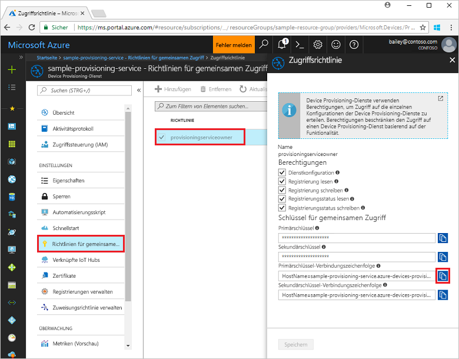
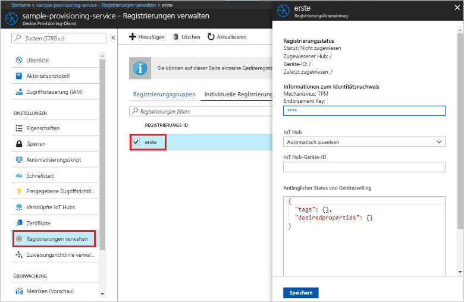

# <a name="quickstart-enroll-tpm-device-to-iot-hub-device-provisioning-service-using-nodejs-service-sdk"></a>Schnellstart: Registrieren eines TPM-Geräts für den IoT Hub Device Provisioning-Dienst per Node.js-Dienst-SDK

[!INCLUDE [iot-dps-selector-quick-enroll-device-tpm](../../includes/iot-dps-selector-quick-enroll-device-tpm.md)]

In dieser Schnellstartanleitung erstellen Sie programmgesteuert eine individuelle Registrierung für ein TPM-Gerät im Azure IoT Hub Device Provisioning-Dienst, indem Sie das Node.js-Dienst-SDK und eine Node.js-Beispielanwendung verwenden. Mit diesem Eintrag für die individuelle Registrierung können Sie ein simuliertes TPM-Gerät optional für den Provisioning-Dienst registrieren.

## <a name="prerequisites"></a>Voraussetzungen

- Ausführung der Schritte unter [Schnellstart: Einrichten des IoT Hub Device Provisioning-Diensts über das Azure-Portal](./quick-setup-auto-provision.md).
- Ein Azure-Konto mit einem aktiven Abonnement. [Erstellen Sie ein kostenloses Konto.](https://azure.microsoft.com/free/?ref=microsoft.com&utm_source=microsoft.com&utm_medium=docs&utm_campaign=visualstudio)
- [Node.js v4.0+](https://nodejs.org). In dieser Schnellstartanleitung wird weiter unten das [Node.js-Dienst-SDK](https://github.com/Azure/azure-iot-sdk-node) installiert.
- Endorsement Key (optional). Befolgen Sie die Schritte unter [Erstellen und Bereitstellen eines simulierten Geräts](quick-create-simulated-device.md), bis Sie den Schlüssel erhalten haben. Verwenden Sie nicht das Azure-Portal, um eine individuelle Registrierung zu erstellen.

## <a name="create-the-individual-enrollment-sample"></a>Erstellen des Beispiels für die individuelle Registrierung 

 
1. Führen Sie in einem Befehlsfenster in Ihrem Arbeitsordner Folgendes aus:
  
    ```cmd\sh
    npm install azure-iot-provisioning-service
    ```  

2. Erstellen Sie mit einem Text-Editor in Ihrem Arbeitsordner die Datei **create_individual_enrollment.js**. Fügen Sie der Datei den folgenden Code hinzu, und speichern Sie sie:

    ```
    'use strict';

    var provisioningServiceClient = require('azure-iot-provisioning-service').ProvisioningServiceClient;

    var serviceClient = provisioningServiceClient.fromConnectionString(process.argv[2]);
    var endorsementKey = process.argv[3];

    var enrollment = {
      registrationId: 'first',
      attestation: {
        type: 'tpm',
        tpm: {
          endorsementKey: endorsementKey
        }
      }
    };

    serviceClient.createOrUpdateIndividualEnrollment(enrollment, function(err, enrollmentResponse) {
      if (err) {
        console.log('error creating the individual enrollment: ' + err);
      } else {
        console.log("enrollment record returned: " + JSON.stringify(enrollmentResponse, null, 2));
      }
    });
    ```

## <a name="run-the-individual-enrollment-sample"></a>Ausführen des Beispiels für die individuelle Registrierung
  
1. Zum Ausführen des Beispiels benötigen Sie die Verbindungszeichenfolge für Ihren Provisioning-Dienst. 
    1. Melden Sie sich beim Azure-Portal an, wählen Sie im Menü links die Schaltfläche **Alle Ressourcen** aus, und öffnen Sie Ihren Gerätebereitstellungsdienst. 
    2. Wählen Sie **Richtlinien für gemeinsamen Zugriff** und anschließend die gewünschte Zugriffsrichtlinie aus, um die zugehörigen Eigenschaften zu öffnen. Kopieren Sie im Fenster **Zugriffsrichtlinie** die Primärschlüssel-Verbindungszeichenfolge, und notieren Sie sie. 

        


2. Außerdem benötigen Sie den Endorsement Key für Ihr Gerät. Falls Sie die Schritte der Schnellstartanleitung unter [Erstellen und Bereitstellen eines simulierten Geräts mithilfe von IoT Hub Device Provisioning-Diensten](quick-create-simulated-device.md) befolgt haben, um ein simuliertes TPM-Gerät zu erstellen, können Sie den für dieses Gerät erstellten Schlüssel verwenden. Andernfalls können Sie zum Erstellen eines Beispiels für die individuelle Registrierung den folgenden Endorsement Key nutzen, der über das [Node.js-Dienst-SDK](https://github.com/Azure/azure-iot-sdk-node) bereitgestellt wird:

    ```
    AToAAQALAAMAsgAgg3GXZ0SEs/gakMyNRqXXJP1S124GUgtk8qHaGzMUaaoABgCAAEMAEAgAAAAAAAEAxsj2gUScTk1UjuioeTlfGYZrrimExB+bScH75adUMRIi2UOMxG1kw4y+9RW/IVoMl4e620VxZad0ARX2gUqVjYO7KPVt3dyKhZS3dkcvfBisBhP1XH9B33VqHG9SHnbnQXdBUaCgKAfxome8UmBKfe+naTsE5fkvjb/do3/dD6l4sGBwFCnKRdln4XpM03zLpoHFao8zOwt8l/uP3qUIxmCYv9A7m69Ms+5/pCkTu/rK4mRDsfhZ0QLfbzVI6zQFOKF/rwsfBtFeWlWtcuJMKlXdD8TXWElTzgh7JS4qhFzreL0c1mI0GCj+Aws0usZh7dLIVPnlgZcBhgy1SSDQMQ==
    ```

3. Führen Sie den folgenden Befehl aus (einschließlich der Anführungszeichen der Befehlsargumente), um eine individuelle Registrierung für Ihr TPM-Gerät zu erstellen:
 
     ```cmd\sh
     node create_individual_enrollment.js "<the connection string for your provisioning service>" "<endorsement key>"
     ```
 
3. Bei einer erfolgreichen Erstellung werden im Befehlsfenster die Eigenschaften der neuen individuellen Registrierung angezeigt.

     

4. Stellen Sie sicher, dass eine individuelle Registrierung erstellt wurde. Wählen Sie im Azure-Portal auf dem Zusammenfassungsblatt des Device Provisioning-Diensts die Option **Registrierungen verwalten**. Wählen Sie die Registerkarte **Individuelle Registrierungen** und dann den neuen Registrierungseintrag (*den ersten*) aus, um den Endorsement Key und andere Eigenschaften für den Eintrag zu überprüfen.

     
 
Nachdem Sie nun eine individuelle Registrierung für ein TPM-Gerät erstellt haben, können Sie mit den restlichen Schritten unter [Erstellen und Bereitstellen eines simulierten Geräts mithilfe von IoT Hub Device Provisioning-Diensten](quick-create-simulated-device.md) fortfahren, falls Sie ein simuliertes Gerät registrieren möchten. Achten Sie darauf, die Schritte zum Erstellen einer individuellen Registrierung mit dem Azure-Portal in diesem Schnellstart zu überspringen.

## <a name="clean-up-resources"></a>Bereinigen von Ressourcen
Wenn Sie planen, sich die Node.js-Dienstbeispiele genauer anzusehen, sollten Sie die in diesem Schnellstart erstellten Ressourcen nicht bereinigen. Falls Sie nicht fortfahren möchten, führen Sie die folgenden Schritte aus, um alle Ressourcen zu löschen, die im Rahmen dieses Schnellstarts erstellt wurden.

1. Schließen Sie das Ausgabefenster des Node.js-Beispiels auf Ihrem Computer.
1. Falls Sie ein simuliertes TPM-Gerät erstellt haben, können Sie das TPM-Simulatorfenster schließen.
2. Navigieren Sie im Azure-Portal zu Ihrem Device Provisioning Service, klicken Sie auf **Registrierungen verwalten**, und klicken Sie anschließend auf die Registerkarte **Individuelle Registrierungen**. Aktivieren Sie das Kontrollkästchen der *Registrierungs-ID* für den Registrierungseintrag, den Sie in diesem Schnellstart erstellt haben, und klicken Sie oben im Bereich auf die Schaltfläche **Löschen**. 
 
## <a name="next-steps"></a>Nächste Schritte
In diesem Schnellstart haben Sie programmgesteuert einen Eintrag für die individuelle Registrierung für ein TPM-Gerät erstellt und optional ein simuliertes TPM-Gerät auf Ihrem Computer erstellt und mit Azure IoT Hub Device Provisioning Service für Ihren IoT-Hub bereitgestellt. Ausführlichere Informationen zur Gerätebereitstellung finden Sie im Tutorial zur Einrichtung des Device Provisioning-Diensts über das Azure-Portal. 
 
> [!div class="nextstepaction"]
> [Tutorials für den Azure IoT Hub Device Provisioning-Dienst](./tutorial-set-up-cloud.md)