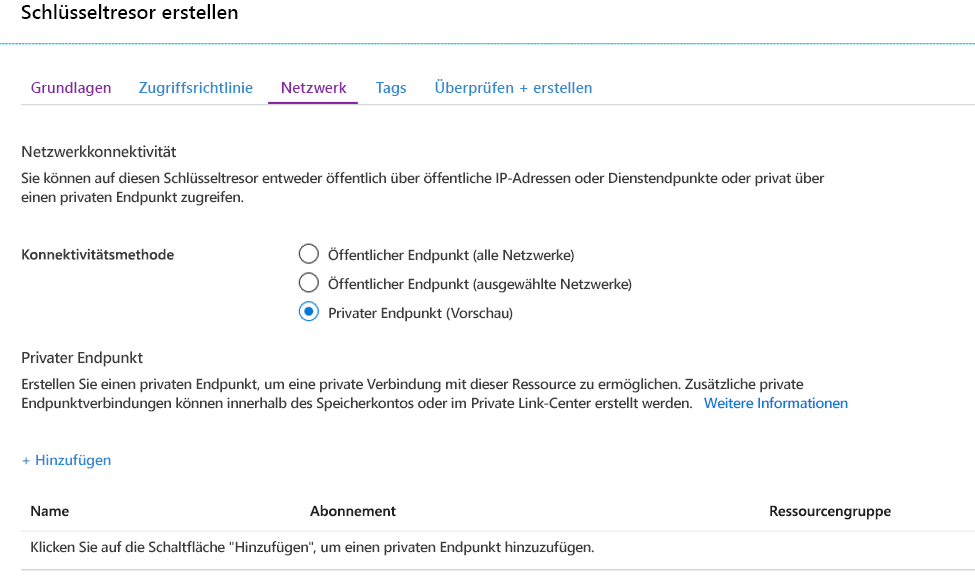
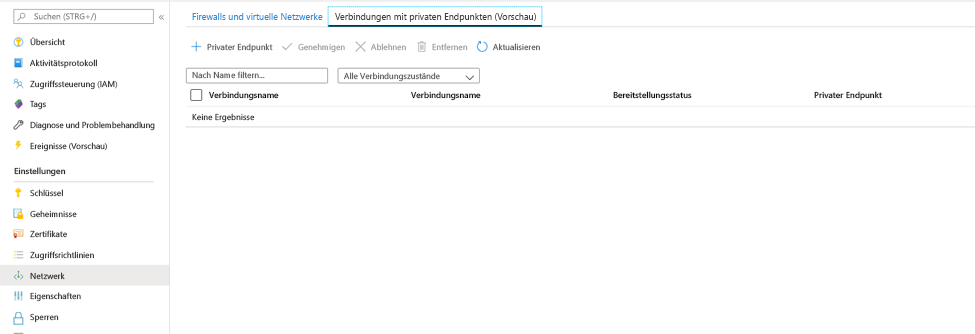
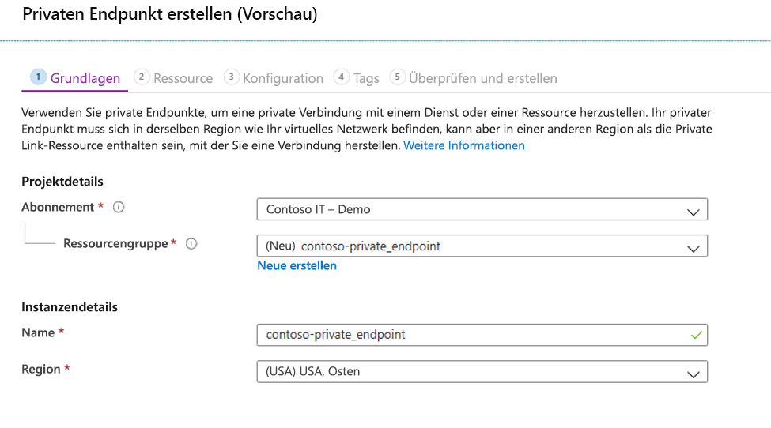
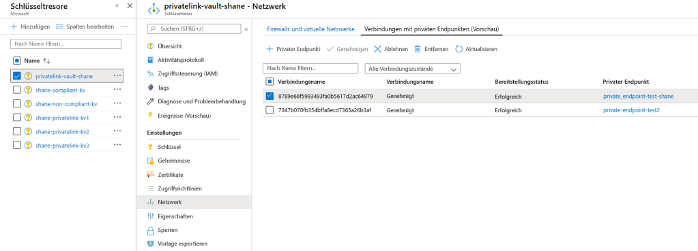

# <a name="integrate-key-vault-with-azure-private-link"></a>Integrieren von Key Vault in Azure Private Link

Mit dem Azure Private Link-Dienst können Sie über einen privaten Endpunkt in Ihrem virtuellen Netzwerk auf Azure-Dienste wie Azure Key Vault, Azure Storage und Azure Cosmos DB sowie auf in Azure gehostete Kunden-/Partnerdienste zugreifen.

Ein privater Endpunkt in Azure ist eine Netzwerkschnittstelle, die Sie privat und sicher mit einem von Azure Private Link betriebenen Dienst verbindet. Der private Endpunkt verwendet eine private IP-Adresse aus Ihrem VNET und bindet den Dienst dadurch in Ihr VNET ein. Der gesamte für den Dienst bestimmte Datenverkehr kann über den privaten Endpunkt geleitet werden. Es sind also keine Gateways, NAT-Geräte, ExpressRoute-/VPN-Verbindungen oder öffentlichen IP-Adressen erforderlich. Der Datenverkehr zwischen Ihrem virtuellen Netzwerk und dem Dienst wird über das Microsoft-Backbone-Netzwerk übertragen und dadurch vom öffentlichen Internet isoliert. Sie können eine Verbindung mit einer Instanz einer Azure-Ressource herstellen, was ein Höchstmaß an Granularität bei der Zugriffssteuerung ermöglicht.

Weitere Informationen finden Sie unter [Was ist Azure Private Link?](../../private-link/private-link-overview.md).

## <a name="prerequisites"></a>Voraussetzungen

Wenn Sie einen Schlüsseltresor in Azure Private Link integrieren möchten, benötigen Sie Folgendes:

- Einen Schlüsseltresor.
- Ein virtuelles Azure-Netzwerk
- Ein Subnetz in dem virtuellen Netzwerk
- Berechtigungen vom Typ „Besitzer“ oder „Mitwirkender“ für den Schlüsseltresor und für das virtuelle Netzwerk

Der private Endpunkt und das virtuelle Netzwerk müssen sich in der gleichen Region befinden. Wenn Sie über das Portal eine Region für den privaten Endpunkt auswählen, wird automatisch nach virtuellen Netzwerken in dieser Region gefiltert. Der Schlüsseltresor kann sich in einer anderen Region befinden.

Der private Endpunkt verwendet eine private IP-Adresse in Ihrem virtuellen Netzwerk.

## <a name="establish-a-private-link-connection-to-key-vault-using-the-azure-portal"></a>Einrichten einer Private Link-Verbindung mit dem Schlüsseltresor über das Azure-Portal 

Erstellen Sie zunächst ein virtuelles Netzwerk. Eine entsprechende Anleitung finden Sie unter [Schnellstart: Erstellen eines virtuellen Netzwerks im Azure-Portal](../../virtual-network/quick-create-portal.md).

Anschließend können Sie entweder einen neuen Schlüsseltresor erstellen oder eine Private Link-Verbindung mit einem bereits vorhandenen Schlüsseltresor einrichten.

### <a name="create-a-new-key-vault-and-establish-a-private-link-connection"></a>Erstellen eines neuen Schlüsseltresors und Einrichten einer Private Link-Verbindung

Eine Anleitung für die Erstellung eines neuen Schlüsseltresors finden Sie unter [Schnellstart: Festlegen eines Geheimnisses und Abrufen des Geheimnisses aus Azure Key Vault mithilfe des Azure-Portals](../secrets/quick-create-portal.md).

Wählen Sie nach dem Konfigurieren der Grundeinstellungen des Schlüsseltresors die Registerkarte „Netzwerk“ aus, und gehen Sie wie folgt vor:

1. Wählen Sie auf der Registerkarte „Netzwerk“ das Optionsfeld „Privater Endpunkt“ aus.
1. Klicken Sie auf die Schaltfläche "+ Hinzufügen", um einen privaten Endpunkt hinzuzufügen.

    
 
1. Wählen Sie auf dem Blatt „Privaten Endpunkt erstellen“ im Feld „Standort“ die Region aus, in der sich Ihr virtuelles Netzwerk befindet. 
1. Geben Sie im Feld „Name“ einen aussagekräftigen Namen an, um den privaten Endpunkt problemlos identifizieren zu können. 
1. Wählen Sie im Dropdownmenü das virtuelle Netzwerk und das Subnetz aus, in denen dieser private Endpunkt erstellt werden soll. 
1. Lassen Sie die Option „In private DNS-Zone integrieren“ unverändert.  
1. Klicken Sie auf „OK“.

    
 
Der konfigurierte private Endpunkt wird nun angezeigt. Sie haben nun die Möglichkeit, diesen privaten Endpunkt zu löschen oder zu bearbeiten. Wählen Sie die Schaltfläche „Bewerten + erstellen“ aus, und erstellen Sie den Schlüsseltresor. Der Bereitstellungsvorgang dauert fünf bis zehn Minuten. 

### <a name="establish-a-private-link-connection-to-an-existing-key-vault"></a>Einrichten einer Private Link-Verbindung mit einem bereits vorhandenen Schlüsseltresor

Wenn Sie bereits über einen Schlüsseltresor verfügen, können Sie wie folgt eine Private Link-Verbindung erstellen:

1. Melden Sie sich beim Azure-Portal an. 
1. Geben Sie auf der Suchleiste den Suchbegriff „Schlüsseltresore“ ein.
1. Wählen Sie in der Liste den Schlüsseltresor aus, dem Sie einen privaten Endpunkt hinzufügen möchten.
1. Wählen Sie unter „Einstellungen“ die Registerkarte „Netzwerk“ aus.
1. Wählen Sie im oberen Seitenbereich die Registerkarte „Private Endpunktverbindungen“ aus.
1. Wählen Sie im oberen Seitenbereich die Schaltfläche „+ Privater Endpunkt“ aus.

    
    

Auf diesem Blatt können Sie einen privaten Endpunkt für eine beliebige Azure-Ressource erstellen. Sie können die Dropdownmenüs verwenden, um einen Ressourcentyp und eine Ressource in Ihrem Verzeichnis auszuwählen. Alternativ können Sie unter Verwendung einer Ressourcen-ID eine Verbindung mit einer beliebigen Azure-Ressource herstellen. Lassen Sie die Option „In private DNS-Zone integrieren“ unverändert.  

## <a name="establish-a-private-link-connection-to-key-vault-using-cli"></a>Einrichten einer Private Link-Verbindung mit dem Schlüsseltresor über die Befehlszeilenschnittstelle

### <a name="login-to-azure-cli"></a>Anmelden bei der Azure CLI
```console
az login 
```
### <a name="select-your-azure-subscription"></a>Auswählen Ihres Azure-Abonnements 
```console
az account set --subscription {AZURE SUBSCRIPTION ID}
```
### <a name="create-a-new-resource-group"></a>Erstellen einer neuen Ressourcengruppe 
```console
az group create -n {RG} -l {AZURE REGION}
```
### <a name="register-microsoftkeyvault-as-a-provider"></a>Registrieren von „Microsoft.KeyVault“ als Anbieter 
```console
az provider register -n Microsoft.KeyVault
```
### <a name="create-a-new-key-vault"></a>Erstellen eines neuen Schlüsseltresors
```console
az keyvault create --name {KEY VAULT NAME} --resource-group {RG} --location {AZURE REGION}
```
### <a name="turn-on-key-vault-firewall"></a>Aktivieren der Key Vault-Firewall
```console
az keyvault update --name {KEY VAULT NAME} --resource-group {RG} --default-action deny
```
### <a name="create-a-virtual-network"></a>Erstellen eines virtuellen Netzwerks
```console
az network vnet create --resource-group {RG} --name {vNet NAME} --location {AZURE REGION}
```
### <a name="add-a-subnet"></a>Hinzufügen eines Subnetzes
```console
az network vnet subnet create --resource-group {RG} --vnet-name {vNet NAME} --name {subnet NAME} --address-prefixes {addressPrefix}
```
### <a name="disable-virtual-network-policies"></a>Deaktivieren der Richtlinien für virtuelle Netzwerke 
```console
az network vnet subnet update --name {subnet NAME} --resource-group {RG} --vnet-name {vNet NAME} --disable-private-endpoint-network-policies true
```
### <a name="add-a-private-dns-zone"></a>Hinzufügen einer privaten DNS-Zone 
```console
az network private-dns zone create --resource-group {RG} --name privatelink.vaultcore.azure.net
```
### <a name="link-private-dns-zone-to-virtual-network"></a>Verknüpfen einer privaten DNS-Zone mit dem virtuellen Netzwerk 
```console
az network private-dns link vnet create --resource-group {RG} --virtual-network {vNet NAME} --zone-name privatelink.vaultcore.azure.net --name {dnsZoneLinkName} --registration-enabled true
```
### <a name="add-private-dns-records"></a>Hinzufügen privater DNS-Datensätze
```console
# https://docs.microsoft.com/en-us/azure/dns/private-dns-getstarted-cli#create-an-additional-dns-record
az network private-dns zone list -g $rg_name
az network private-dns record-set a add-record -g $rg_name -z "privatelink.vaultcore.azure.net" -n $vault_name -a $kv_network_interface_private_ip
az network private-dns record-set list -g $rg_name -z "privatelink.vaultcore.azure.net"

# From home/public network, you wil get a public IP. If inside a vnet with private zone, nslookup will resolve to the private ip.
nslookup $vault_name.vault.azure.net
nslookup $vault_name.privatelink.vaultcore.azure.net
```
### <a name="create-a-private-endpoint-automatically-approve"></a>Erstellen eines privaten Endpunkts (automatische Genehmigung) 
```console
az network private-endpoint create --resource-group {RG} --vnet-name {vNet NAME} --subnet {subnet NAME} --name {Private Endpoint Name}  --private-connection-resource-id "/subscriptions/{AZURE SUBSCRIPTION ID}/resourceGroups/{RG}/providers/Microsoft.KeyVault/vaults/ {KEY VAULT NAME}" --group-ids vault --connection-name {Private Link Connection Name} --location {AZURE REGION}
```
### <a name="create-a-private-endpoint-manually-request-approval"></a>Erstellen eines privaten Endpunkts (manuelle Anforderung der Genehmigung) 
```console
az network private-endpoint create --resource-group {RG} --vnet-name {vNet NAME} --subnet {subnet NAME} --name {Private Endpoint Name}  --private-connection-resource-id "/subscriptions/{AZURE SUBSCRIPTION ID}/resourceGroups/{RG}/providers/Microsoft.KeyVault/vaults/ {KEY VAULT NAME}" --group-ids vault --connection-name {Private Link Connection Name} --location {AZURE REGION} --manual-request
```
### <a name="show-connection-status"></a>Anzeigen des Verbindungsstatus 
```console
az network private-endpoint show --resource-group {RG} --name {Private Endpoint Name}
```
## <a name="manage-private-link-connection"></a>Verwalten der Private Link-Verbindung

Wenn Sie einen privaten Endpunkt erstellen, muss die Verbindung genehmigt werden. Wenn sich die Ressource, für die Sie einen privaten Endpunkt erstellen, in Ihrem Verzeichnis befindet, können Sie die Verbindungsanforderung selbst genehmigen (vorausgesetzt, Sie verfügen über entsprechende Berechtigungen). Wenn Sie eine Verbindung mit einer Azure-Ressource in einem anderen Verzeichnis herstellen, müssen Sie warten, bis der Besitzer dieser Ressource Ihre Verbindungsanforderung genehmigt hat.

Es gibt vier Möglichkeiten für den Bereitstellungsstatus:

| Aktion des Dienstanbieters | Zustand des privaten Endpunkts des Dienstconsumers | BESCHREIBUNG |
|--|--|--|
| Keine | Ausstehend | Die Verbindung wurde manuell erstellt, und die Genehmigung des Besitzers der Private Link-Ressource steht aus. |
| Genehmigen | Genehmigt | Die Verbindung wurde automatisch oder manuell genehmigt und ist zur Verwendung bereit. |
| Reject | Rejected (Abgelehnt) | Die Verbindung wurde vom Besitzer der Private Link-Ressource abgelehnt. |
| Remove (Entfernen) | Getrennt | Die Verbindung wurde vom Besitzer der Private Link-Ressource entfernt, der private Endpunkt wird informativ und sollte zur Bereinigung gelöscht werden. |
 
###  <a name="how-to-manage-a-private-endpoint-connection-to-key-vault-using-the-azure-portal"></a>Verwalten einer privaten Endpunktverbindung mit einem Schlüsseltresor über das Azure-Portal 

1. Melden Sie sich beim Azure-Portal an.
1. Geben Sie auf der Suchleiste den Suchbegriff „Schlüsseltresore“ ein.
1. Wählen Sie den Schlüsseltresor aus, den Sie verwalten möchten.
1. Wählen Sie die Registerkarte „Netzwerk“ aus.
1. Sollten ausstehende Verbindungen vorhanden sein, wird in der Liste eine Verbindung mit dem Bereitstellungsstatus „Ausstehend“ angezeigt. 
1. Wählen Sie den privaten Endpunkt aus, den Sie genehmigen möchten.
1. Wählen Sie die Schaltfläche „Genehmigen“ aus.
1. Falls Sie eine Verbindung mit einem privaten Endpunkt ablehnen möchten, wählen Sie die Verbindung aus, und klicken Sie auf die Schaltfläche „Ablehnen“. Dies funktioniert sowohl für ausstehende Anforderungen als auch für bereits vorhandene Verbindungen.

    

##  <a name="how-to-manage-a-private-endpoint-connection-to-key-vault-using-azure-cli"></a>Verwalten einer privaten Endpunktverbindung mit einem Schlüsseltresor über die Azure-Befehlszeilenschnittstelle

### <a name="approve-a-private-link-connection-request"></a>Genehmigen einer Anforderung für eine Private Link-Verbindung
```console
az keyvault private-endpoint-connection approve --approval-description {"OPTIONAL DESCRIPTION"} --resource-group {RG} --vault-name {KEY VAULT NAME} –name {PRIVATE LINK CONNECTION NAME}
```

### <a name="deny-a-private-link-connection-request"></a>Ablehnen einer Anforderung für eine Private Link-Verbindung
```console
az keyvault private-endpoint-connection reject --rejection-description {"OPTIONAL DESCRIPTION"} --resource-group {RG} --vault-name {KEY VAULT NAME} –name {PRIVATE LINK CONNECTION NAME}
```

### <a name="delete-a-private-link-connection-request"></a>Löschen einer Anforderung für eine Private Link-Verbindung
```console
az keyvault private-endpoint-connection delete --resource-group {RG} --vault-name {KEY VAULT NAME} --name {PRIVATE LINK CONNECTION NAME}
```

## <a name="validate-that-the-private-link-connection-works"></a>Überprüfen, ob die Private Link-Verbindung funktioniert

Vergewissern Sie sich, dass die Ressourcen innerhalb des Subnetzes, in dem sich auch die private Endpunktressource befindet, mit Ihrem Schlüsseltresor eine Verbindung über eine private IP-Adresse herstellen, und dass die Integration in die private DNS-Zone korrekt ist.

Erstellen Sie zunächst einen virtuellen Computer. Eine entsprechende Anleitung finden Sie unter [Schnellstart: Erstellen eines virtuellen Windows-Computers im Azure-Portal](../../virtual-machines/windows/quick-create-portal.md).

Gehen Sie auf der Registerkarte „Netzwerk“ wie folgt vor:

1. Geben Sie ein virtuelles Netzwerk und ein Subnetz an. Sie können ein neues virtuelles Netzwerk erstellen oder ein bereits vorhandenes virtuelles Netzwerk auswählen. Vergewissern Sie sich bei Verwendung eines bereits vorhandenen Netzwerks, dass die Region übereinstimmt.
1. Geben Sie eine öffentliche IP-Ressource an.
1. Wählen Sie für „NIC-Netzwerksicherheitsgruppe“ die Option „Keine“ aus.
1. Wählen Sie für den Lastenausgleich „Nein“ aus.

Öffnen Sie die Befehlszeile, und führen Sie den folgenden Befehl aus:

```console
nslookup <your-key-vault-name>.vault.azure.net
```

Wenn Sie den Befehl „ns lookup“ ausführen, um die IP-Adresse eines Schlüsseltresors über einen öffentlichen Endpunkt aufzulösen, sieht das Ergebnis wie folgt aus:

```console
c:\ >nslookup <your-key-vault-name>.vault.azure.net

Non-authoritative answer:
Name:    
Address:  (public IP address)
Aliases:  <your-key-vault-name>.vault.azure.net
```

Wenn Sie den Befehl „ns lookup“ ausführen, um die IP-Adresse eines Schlüsseltresors über einen privaten Endpunkt aufzulösen, sieht das Ergebnis wie folgt aus:

```console
c:\ >nslookup your_vault_name.vault.azure.net

Non-authoritative answer:
Name:    
Address:  10.1.0.5 (private IP address)
Aliases:  <your-key-vault-name>.vault.azure.net
          <your-key-vault-name>.privatelink.vaultcore.azure.net
```

## <a name="troubleshooting-guide"></a>Handbuch zur Problembehandlung

* Stellen Sie sicher, dass sich der private Endpunkt im Zustand „Genehmigt“ befindet. 
    1. Dies kann im Azure-Portal überprüft und behoben werden. Öffnen Sie die Key Vault-Ressource, und klicken Sie auf die Option „Netzwerk“. 
    2. Wählen Sie die Registerkarte „Private Endpunktverbindungen“ aus. 
    3. Vergewissern Sie sich, dass der Verbindungsstatus „Genehmigt“ und der Bereitstellungsstatus „Erfolgreich“ lautet. 
    4. Sie können auch zur privaten Endpunktressource navigieren. Dort können Sie die gleichen Eigenschaften überprüfen und sich vergewissern, dass das virtuelle Netzwerk dem von Ihnen verwendeten Netzwerk entspricht.

* Vergewissern Sie sich, dass Sie über eine Ressource vom Typ „Private DNS-Zone“ verfügen. 
    1. Sie müssen über eine Ressource vom Typ „Private DNS-Zone“ mit exakt dem folgenden Namen verfügen: privatelink.vaultcore.azure.net. 
    2. Entsprechende Einrichtungsinformationen finden Sie unter folgendem Link: [Was ist eine private Azure DNS-Zone?](https://docs.microsoft.com/azure/dns/private-dns-privatednszone)
    
* Vergewissern Sie sich, dass die private DNS-Zone nicht mit dem virtuellen Netzwerk verknüpft ist. Dieses Problem kann vorliegen, wenn weiterhin die öffentliche IP-Adresse zurückgegeben wird. 
    1. Ist die private DNS-Zone nicht mit dem virtuellen Netzwerk verknüpft, wird bei der DNS-Abfrage aus dem virtuellen Netzwerk die öffentliche IP-Adresse des Schlüsseltresors zurückgegeben. 
    2. Navigieren Sie im Azure-Portal zur Ressource „Private DNS-Zone“, und klicken Sie auf die Option „Verknüpfungen virtueller Netzwerke“. 
    4. Das virtuelle Netzwerk, von dem Aufrufe an den Schlüsseltresor gesendet werden, muss aufgeführt werden. 
    5. Ist dies nicht der Fall, fügen Sie es hinzu. 
    6. Eine ausführliche Anleitung finden Sie unter [Verknüpfen des virtuellen Networks](https://docs.microsoft.com/azure/dns/private-dns-getstarted-portal#link-the-virtual-network).

* Vergewissern Sie sich, dass in der privaten DNS-Zone kein A-Eintrag für den Schlüsseltresor fehlt. 
    1. Navigieren Sie zur Seite „Private DNS-Zone“. 
    2. Klicken Sie auf „Übersicht“, und vergewissern Sie sich, dass ein A-Eintrag mit dem einfachen Namen Ihres Schlüsseltresors (fabrikam) vorhanden ist. Geben Sie kein Suffix an.
    3. Überprüfen Sie die Schreibweise, und erstellen oder korrigieren Sie den A-Eintrag. Die Gültigkeitsdauer kann auf „3600“ (eine Stunde) festgelegt werden. 
    4. Achten Sie darauf, die richtige private IP-Adresse anzugeben. 
    
* Vergewissern Sie sich, dass der A-Eintrag über die richtige IP-Adresse verfügt. 
    1. Zur Bestätigung der IP-Adresse können Sie im Azure-Portal die private Endpunktressource öffnen. 
    2. Navigieren Sie im Azure-Portal zur Ressource „Microsoft.Network/privateEndpoints“ (nicht zur Key Vault-Ressource).
    3. Suchen Sie auf der Übersichtsseite nach „Netzwerkschnittstelle“, und klicken Sie auf den entsprechenden Link. 
    4. Daraufhin wird die Übersicht über die NIC-Ressource mit der Eigenschaft „Private IP-Adresse“ angezeigt. 
    5. Vergewissern Sie sich, dass es sich bei der IP-Adresse um die richtige Adresse aus dem A-Eintrag handelt.

## <a name="limitations-and-design-considerations"></a>Einschränkungen und Entwurfsaspekte

> [!NOTE]
> Die Anzahl der Schlüsseltresore mit den pro Abonnement aktivierten privaten Endpunkten ist ein anpassbarer Grenzwert. Der gezeigte Grenzwert ist der Standardwert. Wenn Sie eine Erhöhung des Grenzwerts für Ihren Dienst beantragen möchten, senden Sie eine E-Mail an akv-privatelink@microsoft.com. Wir genehmigen diese Anträge je nach Fall.

**Preise:** Preisinformationen finden Sie unter [Azure Private Link – Preise](https://azure.microsoft.com/pricing/details/private-link/).

**Einschränkungen:**  Der private Endpunkt für Azure Key Vault ist nur in öffentlichen Azure-Regionen verfügbar.

**Maximal zulässige Anzahl privater Endpunkte pro Schlüsseltresor:** 64.

**Standardanzahl von Schlüsseltresoren mit privaten Endpunkten pro Abonnement:** 400.

Weitere Informationen finden Sie unter [Was ist der Azure Private Link-Dienst? – Einschränkungen](../../private-link/private-link-service-overview.md#limitations).

## <a name="next-steps"></a>Nächste Schritte

- Weitere Informationen zu [Azure Private Link](../../private-link/private-link-service-overview.md).
- Weitere Informationen zu [Azure Key Vault](overview.md)
