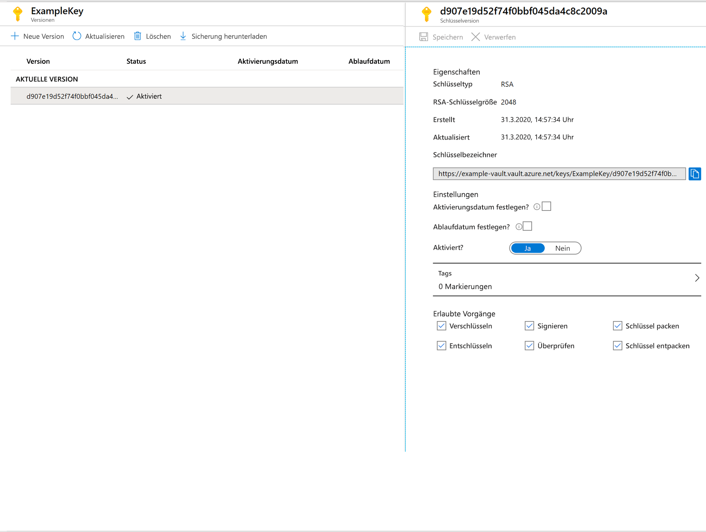

# Schnellstart: Festlegen eines Schlüssels und Abrufen des Schlüssels aus Azure Key Vault mit dem Azure-Portal

Azure Key Vault ist ein Clouddienst, der als sicherer Geheimnisspeicher fungiert. Dadurch können Schlüssel, Kennwörter, Zertifikate und andere Geheimnisse sicher gespeichert werden. Azure Key Vault-Instanzen können über das Azure-Portal erstellt und verwaltet werden. In dieser Schnellstartanleitung erstellen Sie einen Schlüsseltresor und verwenden diesen dann, um einen Schlüssel zu speichern. Weitere Informationen zu Key Vault finden Sie in der [Übersicht](../general/overview.md).

Wenn Sie kein Azure-Abonnement besitzen, können Sie ein [kostenloses Konto](https://azure.microsoft.com/free/?WT.mc_id=A261C142F) erstellen, bevor Sie beginnen.

## Anmelden bei Azure

Melden Sie sich unter https://portal.azure.com beim Azure-Portal an.

## Erstellen eines Tresors

1. Wählen Sie im Menü des Azure-Portals oder auf der **Startseite** die Option **Ressource erstellen** aus.
2. Geben Sie **Key Vault** in das Suchfeld ein.
3. Wählen Sie in der Ergebnisliste **Key Vault** aus.
4. Klicken Sie im Abschnitt „Key Vault“ auf **Erstellen**.
5. Geben Sie im Abschnitt **Schlüsseltresor erstellen** folgende Informationen ein:
    - **Name**: Es ist ein eindeutiger Name erforderlich. Für diese Schnellstartanleitung verwenden wir **Example-Vault**. 
    - **Abonnement**: Wählen Sie ein Abonnement aus.
    - Klicken Sie unter **Ressourcengruppe** auf **Neu erstellen**, und geben Sie einen Ressourcengruppennamen ein.
    - Wählen Sie im Pulldownmenü **Speicherort** einen Speicherort aus.
    - Behalten Sie bei den anderen Optionen die Standardeinstellungen bei.
6. Klicken Sie nach der Angabe der obigen Informationen auf **Erstellen**.

Beachten Sie die beiden folgenden Eigenschaften:

* **Tresorname**: In diesem Beispiel ist das **Example-Vault**. Dieser Name wird noch für andere Schritte benötigt.
* **Tresor-URI**: In diesem Beispiel https://example-vault.vault.azure.net/. Anwendungen, die Ihren Tresor über die zugehörige REST-API nutzen, müssen diesen URI verwenden.

An diesem Punkt ist nur Ihr Azure-Konto zum Ausführen von Vorgängen für den neuen Tresor autorisiert.

## Hinzufügen eines Schlüssels zu Key Vault

Ein Schlüssel kann dem Tresor mit einigen wenigen Zusatzschritten hinzugefügt werden. In diesem Fall fügen wir einen Schlüssel hinzu, der von einer Anwendung verwendet werden kann. Der Schlüssel heißt **ExampleKey**.

1. Wählen Sie auf den Key Vault-Eigenschaftenseiten die Option **Schlüssel** aus.
2. Klicken Sie auf **Generieren/Importieren**.
3. Wählen Sie auf dem Bildschirm **Schlüssel erstellen** die folgenden Werte aus:
    - **Optionen:** Generieren
    - **Name**: ExampleKey
    - Behalten Sie bei den anderen Optionen die Standardwerte bei. Klicken Sie auf **Erstellen**.

Nachdem Sie die Meldung erhalten haben, dass der Schlüssel erfolgreich erstellt wurde, können Sie in der Liste auf den Schlüssel klicken. Daraufhin werden einige der Eigenschaften angezeigt. Wenn Sie auf die aktuelle Version klicken, sehen Sie den Wert, den Sie im vorherigen Schritt angegeben haben.

## Bereinigen von Ressourcen

Andere Schnellstartanleitungen und Tutorials für Key Vault bauen auf dieser Schnellstartanleitung auf. Falls Sie mit weiteren Schnellstartanleitungen und Tutorials fortfahren möchten, sollten Sie die Ressourcen nicht bereinigen.
Wenn Sie die Ressourcen nicht mehr benötigen, löschen Sie die Ressourcengruppe. Dadurch werden die Key Vault-Instanz und die dazugehörigen Ressourcen gelöscht. So löschen Sie die Ressourcengruppe über das Portal:

1. Geben Sie den Namen Ihrer Ressourcengruppe in das Suchfeld am oberen Rand des Portals ein. Klicken Sie in den Suchergebnissen auf die Ressourcengruppe aus dieser Schnellstartanleitung.
2. Wählen Sie die Option **Ressourcengruppe löschen**.
3. Geben Sie im Feld **GEBEN SIE DEN RESSOURCENGRUPPENNAMEN EIN:** den Namen der Ressourcengruppe ein, und klicken Sie anschließend auf **Löschen**.

## Nächste Schritte

In dieser Schnellstartanleitung haben Sie eine Key Vault-Instanz erstellt und einen Schlüssel darin gespeichert. Weitere Informationen zu Key Vault und zur Integration in Ihre Anwendungen finden Sie in den folgenden Artikeln:

- [Was ist der Azure-Schlüsseltresor?](../general/overview.md)
- [Entwicklerhandbuch zu Azure-Schlüsseltresor](../general/developers-guide.md)
- [Azure Key Vault-Sicherheitsübersicht](../general/security-overview.md)