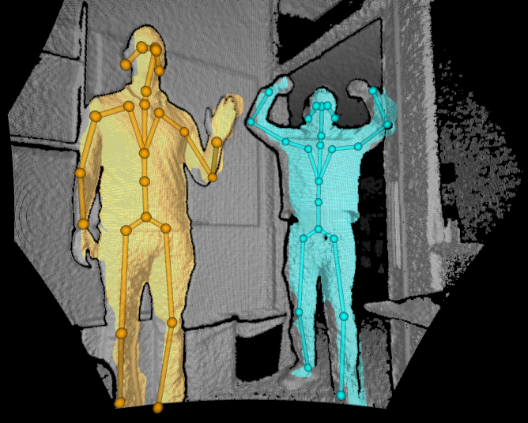

# Schnellstart: Einrichten von Azure Kinect Body Tracking

Diese Schnellstartanleitung führt Sie durch das Einrichten von Body Tracking in Ihrem Azure Kinect DK.

## Systemanforderungen

Für das Body Tracking SDK muss auf dem Host-PC eine NVIDIA-GPU installiert sein. Die empfohlenen Anforderungen an den Host-PC für Body Tracking sind auf der Seite [Systemanforderungen](system-requirements.md) beschrieben.

## Installieren von Software

### [Installieren des neuesten NVIDIA-Treibers](https://www.nvidia.com/Download/index.aspx?lang=en-us)

Laden Sie den neuesten NVIDIA-Treiber für Ihre Grafikkarte herunter, und installieren Sie ihn. Ältere Treiber sind möglicherweise nicht mit den CUDA-Binarys kompatibel, die mit dem Body Tracking SDK geliefert werden.

### [Visual C++ Redistributable für Visual Studio 2015](https://www.microsoft.com/en-us/download/details.aspx?id=48145)

Laden Sie das Visual C++ Redistributable für Visual Studio 2015 herunter, und installieren Sie es. 

## Einrichten der Hardware

### [Schnellstart: Einrichten Ihres Azure Kinect DK-Geräts](set-up-azure-kinect-dk.md)

Starten Sie den [Azure Kinect Viewer](azure-kinect-viewer.md), um zu überprüfen, ob Ihr Azure Kinect DK ordnungsgemäß eingerichtet ist.

## Herunterladen des Body Tracking-SDK
 
1. Wählen Sie den Link zum [Herunterladen des Body Tracking SDK](body-sdk-download.md) aus
2. Installieren Sie das Body Tracking SDK auf Ihrem PC.

## Überprüfen des Body Tracking

Starten Sie den **Azure Kinect Body Tracking Viewer**, um zu überprüfen, ob das Body Tracking SDK ordnungsgemäß eingerichtet ist. Der Viewer wird mit dem MSI-Installationsprogramm des SDK installiert. Sie finden ihn im Startmenü oder unter `<SDK Installation Path>\tools\k4abt_simple_3d_viewer.exe`.

Wenn Sie nicht über eine ausreichend leistungsstarke GPU verfügen, das Ergebnis aber trotzdem testen möchten, können Sie den **Azure Kinect Body Tracking Viewer** mithilfe des folgenden Befehls an der Befehlszeile starten: `<SDK Installation Path>\tools\k4abt_simple_3d_viewer.exe CPU`

Wenn alles ordnungsgemäß eingerichtet ist, sollte ein Fenster mit einer 3D-Punktwolke und nachverfolgten Körpern angezeigt werden.

## Beispiele

[Hier](https://github.com/microsoft/Azure-Kinect-Samples/tree/master/body-tracking-samples) finden Sie Beispiele zur Verwendung des Body Tracking SDK.

## Nächste Schritte

> [!div class="nextstepaction"]
>[Erstellen Ihrer ersten Body Tracking-Anwendung](build-first-body-app.md)

