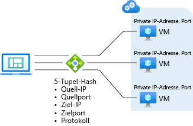

# Azure Load Balancer-Algorithmus

Load Balancer verfügt über mehrere Funktionen für UDP- und TCP-Anwendungen.

## Lastenausgleichsalgorithmus

Sie können eine Lastenausgleichsregel erstellen, um die Verteilung des Datenverkehrs vom Front-End zu einem Back-End-Pool durchzuführen. Azure Load Balancer nutzt einen Hashalgorithmus für die Verteilung von eingehenden Datenflüssen (nicht von Bytes). Load Balancer schreibt die Header von Datenflüssen für Instanzen des Back-End-Pools um. Wenn der Integritätstest einen fehlerfreien Back-End-Endpunkt angibt, ist ein Server verfügbar, der neue Flows empfangen kann.

Standardmäßig wird für Load Balancer ein Fünf-Tupel-Hash verwendet.

Der Hash umfasst Folgendes:

- **Quell-IP-Adresse**
- **Quellport**
- **Ziel-IP-Adresse**
- **Zielport**
- **IP-Protokollnummer zum Zuordnen von Flows zu verfügbaren Servern**

Die Affinität zu einer IP-Quelladresse wird hergestellt, indem ein Zwei- oder Drei-Tupel-Hash verwendet wird. Pakete desselben Datenflusses treffen bei derselben Instanz hinter dem Front-End mit Lastenausgleich ein.

Der Quellport ändert sich, wenn ein Client einen neuen Datenfluss über dieselbe IP-Quelladresse initiiert. Dies kann dazu führen, dass der Datenverkehr aufgrund des Fünf-Tupel-Hashs an einen anderen Back-End-Endpunkt gesendet wird.
Weitere Informationen finden Sie unter [Konfigurieren des Verteilungsmodus für Azure Load Balancer](./load-balancer-distribution-mode.md).

In der folgenden Abbildung wird die hashbasierte Verteilung angezeigt:

*Abbildung: Hashbasierte Verteilung*

## Anwendungsunabhängigkeit und -transparenz

Load Balancer interagiert nicht direkt mit TCP oder UDP oder der Anwendungsschicht. Alle TCP- oder UDP-Anwendungsszenarien können unterstützt werden. Von Load Balancer werden keine Datenflüsse geschlossen oder initiiert, und es erfolgt keine Interaktion mit der Nutzlast des Datenflusses. Load Balancer verfügt nicht über Gatewayfunktionen auf der Anwendungsschicht. Protokollhandshakes werden immer direkt zwischen dem Client und der Back-End-Poolinstanz durchgeführt. Bei einer Antwort auf einen eingehenden Flow handelt es sich immer um die Antwort eines virtuellen Computers. Wenn der Flow auf dem virtuellen Computer eingeht, wird auch die IP-Adresse der ursprünglichen Quelle gespeichert.

- Jeder Endpunkt erhält über eine VM eine Antwort. Zum Beispiel wird ein TCP-Handshake zwischen dem Client und der ausgewählten Back-End-VM durchgeführt. Eine Antwort auf eine Anforderung, die an ein Front-End gesendet wird, wird von einer Back-End-VM generiert. Wenn Sie eine erfolgreiche Überprüfung der Konnektivität für ein Front-End durchführen, bedeutet dies, dass Sie den Konnektivitätsdurchsatz für mindestens eine Back-End-VM überprüfen.
- Anwendungsnutzlasten sind für das Lastenausgleichsmodul transparent. Alle UDP- oder TCP-Anwendungen können unterstützt werden.
- Da das Lastenausgleichsmodul nicht mit der TCP-Nutzlast interagiert und keine TLS-Abladung bereitstellt, können Sie umfassende verschlüsselte Szenarien erstellen. Die Verwendung eines Lastenausgleichsmoduls ermöglicht ein hohes Maß an Aufskalierung für TLS-Anwendungen, indem die TLS-Verbindung auf dem virtuellen Computer selbst beendet wird. Beispielsweise ist die TLS-Funktion zum erstellen von Sitzungsschlüsseln vom Typ und der Nummer der VMs beschränkt, die Sie zum Back-End-Pool hinzufügen.

## Nächste Schritte

- Erfahren Sie mehr über die [Komponenten](components.md), aus denen Azure Load Balancer besteht.
- Informationen zu den ersten Schritten mit einer Load Balancer-Instanz finden Sie unter [Schnellstart: Erstellen eines Load Balancers im Tarif „Standard“ für den Lastenausgleich virtueller Computer über das Azure-Portal](quickstart-load-balancer-standard-public-portal.md). Dort erfahren Sie, wie Sie eine Load Balancer-Instanz und virtuelle Computer mit einer installierten benutzerdefinierten IIS-Erweiterung erstellen und den Lastenausgleich für die Web-App zwischen den virtuellen Computern vornehmen.
- Informieren Sie sich über [Azure Load Balancer – Ausgehende Verbindungen](load-balancer-outbound-connections.md).
- Weitere Informationen zu [Azure Load Balancer](load-balancer-overview.md).
- Informationen zu [Integritätstests](load-balancer-custom-probe-overview.md)
- Weitere Informationen zu [Diagnosen für Standard Load Balancer](load-balancer-standard-diagnostics.md).
- Weitere Informationen zu [Netzwerksicherheitsgruppen](../virtual-network/network-security-groups-overview.md).