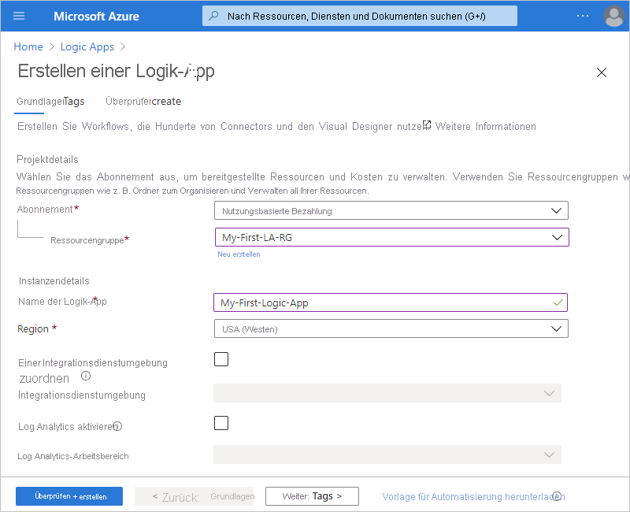
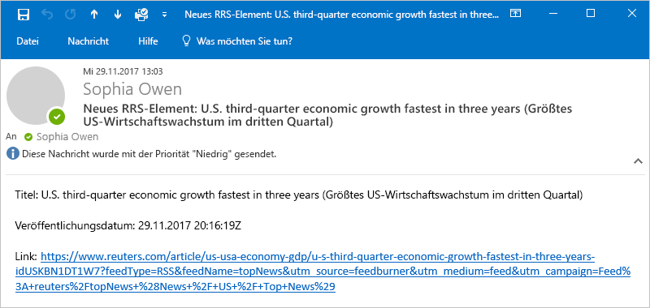
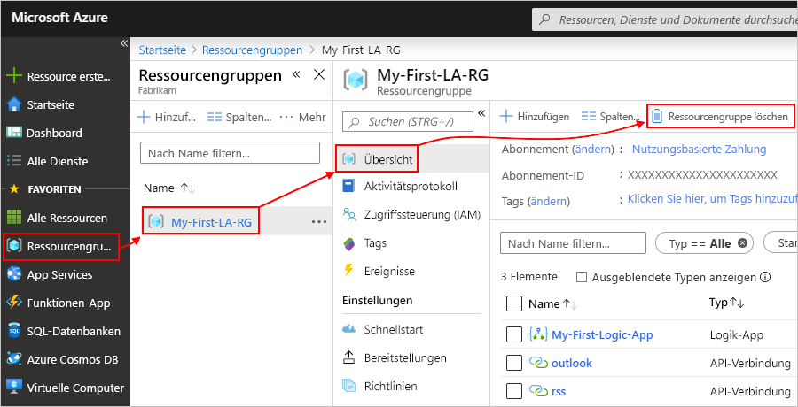

# Schnellstart: Erstellen Ihres ersten Logic Apps-Workflows – Azure-Portal

In dieser Schnellstartanleitung wird beschrieben, wie Sie über das [Azure-Portal](https://portal.azure.com) Ihren ersten Workflow in [Azure Logic Apps](logic-apps-overview.md) erstellen. In diesem Einführungsleitfaden werden auch grundlegende Konzepte des Logic Apps-Diensts beschrieben, z. B. das Erstellen einer neuen Logik-App, Hinzufügen eines Triggers und einer Aktion zu Ihrer Logik-App und Testen Ihrer Logik-App. Befolgen Sie diese Schnellstartanleitung, um eine Logik-App zu erstellen, mit der ein RSS-Feed regelmäßig überprüft und eine E-Mail-Benachrichtigung für neue Elemente gesendet wird. Im folgenden Screenshot ist der allgemeine Workflow dieser Beispiel-Logik-App dargestellt:

Verwenden Sie die folgenden weiteren Logic Apps-Schnellstartanleitungen, um zu erfahren, wie Sie Ihre erste Logik-App über andere Schnittstellen und Apps erstellen und verwalten: 

* [Erstellen und Verwalten von Logik-Apps mit der Azure-Befehlszeilenschnittstelle (Azure CLI)](quickstart-logic-apps-azure-cli.md)
* [Erstellen und Verwalten von Logik-Apps in Visual Studio Code](quickstart-create-logic-apps-visual-studio-code.md)
* [Erstellen und Verwalten von Logik-Apps in Visual Studio](quickstart-create-logic-apps-with-visual-studio.md)

## Voraussetzungen

* Ein Azure-Abonnement. Falls Sie noch nicht über einen solchen Schlüssel verfügen, können Sie sich [für ein kostenloses Azure-Konto registrieren](https://azure.microsoft.com/free/?WT.mc_id=A261C142F).
* Ein E-Mail-Konto eines von Logic Apps unterstützten Diensts (z. B. Office 365 Outlook oder Outlook.com). Informationen zu anderen unterstützten E-Mail-Anbietern finden Sie in der [Liste mit den Connectors](/connectors/).

    > [!IMPORTANT]
    > Beachten Sie bei Verwendung des [Gmail-Connectors](/connectors/gmail/), dass dieser in Logic Apps nur von G Suite-Konten ohne Einschränkung verwendet werden kann. Wenn Sie über ein Gmail-Consumerkonto verfügen, können Sie diesen Connector nur mit bestimmten von Google genehmigten Diensten verwenden, sofern Sie keine [Google-Client-App für die Authentifizierung mit Ihrem Gmail-Connector erstellen](/connectors/gmail/#authentication-and-bring-your-own-application). Weitere Informationen finden Sie unter [Datensicherheit und Datenschutzrichtlinien für Google-Connectors in Azure Logic Apps](../connectors/connectors-google-data-security-privacy-policy.md).

## Erstellen Ihrer Logik-App

1. Melden Sie sich mit den Anmeldeinformationen Ihres Azure-Kontos beim [Azure-Portal](https://portal.azure.com) an.

1. Geben Sie in das Suchfeld des Azure-Portals `logic apps` ein, und klicken Sie auf **Logic Apps**.

   

1. Wählen Sie auf der Seite **Logic Apps** die Option **Hinzufügen** aus.

   

1. Geben Sie im Bereich **Logik-App** die grundlegenden Details und Einstellungen für Ihre Logik-App an. Erstellen Sie eine neue [Ressourcengruppe](../azure-resource-manager/management/overview.md#terminology) für diese Beispiel-Logik-App.
    
   | Eigenschaft | Wert | Beschreibung |
   |----------|-------|-------------|
   | **Name** | <*logic-app-name*> | Der Name Ihrer Logik-App, der regionsübergreifend eindeutig sein muss. Der Name darf nur Buchstaben, Ziffern, Bindestriche (`-`), Unterstriche (`_`), Klammern (`(`, `)`) und Punkte (`.`) enthalten. In diesem Beispiel wird „My-First-Logic-App“ verwendet. |
   | **Abonnement** | <*Name des Azure-Abonnements*> | Der Name Ihres Azure-Abonnements. |
   | **Ressourcengruppe** | <*Name der Azure-Ressourcengruppe*> | Der Name der [Azure-Ressourcengruppe](../azure-resource-manager/management/overview.md#terminology), in der Sie die Logik-App erstellen. Der Name der Ressourcengruppe muss regionsübergreifend eindeutig sein. In diesem Beispiel wird „My-First-LA-RG“ verwendet. |
   | **Location** | <*Azure-Region*> | Die Azure-Region, in der die Informationen zu Ihrer Logik-App gespeichert werden sollen. In diesem Beispiel wird „USA, Westen“ verwendet. |
   | **Log Analytics** | Aus | Die Einstellung für die Diagnoseprotokollierung (Standardeinstellung: **Aus** ). Behalten Sie für dieses Beispiel die Einstellung **Aus** bei. |
   ||||

   

1. Wählen Sie, wenn Sie bereit sind, **Überprüfen + erstellen** aus. Bestätigen Sie die von Ihnen angegebenen Details, und wählen Sie **Erstellen** aus.

1. Nachdem Azure Ihre App erfolgreich bereitgestellt hat, wählen Sie **Zu Ressource wechseln** aus. Sie können zum Suchen und Auswählen Ihrer Logik-App auch den Namen in das Suchfeld eingeben.

   

   Der Logik-App-Designer wird geöffnet, und es wird eine Seite mit einem Einführungsvideo und häufig verwendeten Triggern angezeigt. Wählen Sie unter **Vorlagen** die Option **Leere Logik-App**.

   

[Fügen Sie als Nächstes einen Trigger für Ihre Logik-App hinzu](#add-rss-trigger).

## Hinzufügen des RSS-Triggers

Jede Logik-App muss mit einem [Trigger](../logic-apps/logic-apps-overview.md#how-do-logic-apps-work) beginnen, der ausgelöst wird, wenn ein bestimmtes Ereignis eintritt oder eine bestimmte Bedingung erfüllt wird. Jedes Mal, wenn für den Trigger neue Elemente gefunden werden, wird er ausgelöst. Die Logic Apps-Engine erstellt dann eine Logik-App-Instanz, mit der Ihr Workflow gestartet und ausgeführt wird. Wenn der Trigger keine neuen Elemente findet, wird er nicht ausgelöst. Bei dieser Überprüfung wird dann keine Instanz erstellt, und der Workflow wird nicht ausgeführt.

Im Beispiel dieser Schnellstartanleitung fügen Sie nach dem [Erstellen einer Logik-App](#create-your-logic-app) einen Trigger hinzu, mit dem eine Überprüfung auf neue Elemente in einem RSS-Feed durchgeführt und der ausgelöst wird, wenn neue Elemente vorhanden sind. Sie können auch Logik-Apps mit unterschiedlichen Arten von Triggern erstellen, z. B. im Tutorial zur [Erstellung von automatischen genehmigungsbasierten Workflows](tutorial-process-mailing-list-subscriptions-workflow.md).

1. Wählen Sie im **Logik-App-Designer** unterhalb des Suchfelds die Option **Alle** aus.

1. Um den RSS-Connector zu suchen, geben Sie `rss` in das Suchfeld ein. Wählen Sie in der Liste **Trigger** den RSS-Trigger **Beim Veröffentlichen eines Feedelements** aus.

   

1. Geben Sie die RSS-Feed-URL für Ihren Trigger an. Definieren Sie anschließend den Zeitplan Ihres Triggers, indem Sie das Intervall und die Häufigkeit festlegen.

   | Eigenschaft | Wert | BESCHREIBUNG |
   | -------- | ----- | ----------- |
   | **Die URL des RSS-Feeds** | <*RSS-feed-URL*> | Die URL des RSS-Feeds, den Sie überwachen möchten. In diesem Beispiel wird der RSS-Feed des Wall Street Journal unter `https://feeds.a.dj.com/rss/RSSMarketsMain.xml` verwendet. Sie können für dieses Beispiel aber beliebige RSS-Feeds nutzen, für die keine HTTP-Autorisierung erforderlich ist. Wählen Sie einen RSS-Feed mit häufigen Veröffentlichungen aus, um das spätere Testen Ihrer Logik-App zu erleichtern. |
   | **Intervall** | 1 | Die Anzahl von Warteintervallen zwischen Überprüfungen des RSS-Feeds. In diesem Beispiel haben die Intervalle eine Dauer von 1 Minute. |
   | **Frequency** | Minute | Die Zeiteinheit für die Intervalle zwischen den Überprüfungen des RSS-Feeds. In diesem Beispiel haben die Intervalle eine Dauer von 1 Minute. |
   ||||

   

1. Reduzieren Sie die Detailanzeige des Triggers vorerst, indem Sie in seine Titelleiste klicken.

   

1. Speichern Sie Ihre Logik-App, indem Sie in der Designer-Symbolleiste die Option **Speichern** auswählen.

Ihre Logik-App befindet sich jetzt im Livemodus, aber vorerst wird nur der RSS-Feed überprüft. [Fügen Sie als Nächstes eine Aktion hinzu](#add-email-action), um zu definieren, was beim Auslösen Ihres Triggers passiert.

## Hinzufügen der Aktion „E-Mail senden“

Nachdem Sie [einen Trigger für Ihre Logik-App hinzugefügt haben](#add-rss-trigger), müssen Sie eine [Aktion](../logic-apps/logic-apps-overview.md#logic-app-concepts) hinzufügen. Mit dieser Aktion wird bestimmt, welche Reaktion erfolgt, wenn der RSS-Feed von Ihrer Logik-App überprüft und ein neues Element angezeigt wird. Sie können auch Logik-Apps mit deutlich komplexeren Aktionen erstellen, z. B. im Tutorial für die [Verarbeitung von E-Mails mit Logic Apps, Azure Functions und Azure Storage](/azure/logic-apps/tutorial-process-email-attachments-workflow).

> [!NOTE]
> In diesem Beispiel wird Office 365 Outlook als E-Mail-Dienst verwendet. Wenn Sie einen anderen unterstützten E-Mail-Dienst in Ihrer Logik-App verwenden, sieht die Benutzeroberfläche ggf. anders aus. Die grundlegenden Konzepte für das Herstellen einer Verbindung mit einem anderen E-Mail-Dienst bleiben aber unverändert.

1. Wählen Sie unterhalb des Triggers **Beim Veröffentlichen eines Feedelements** die Option **+ Neuer Schritt** aus.

   

1. Wählen Sie unterhalb von **Aktion auswählen** und unterhalb des Suchfelds die Option **Alle** aus.

1. Geben Sie im Suchfeld `send an email` ein, um Connectors zu finden, die diese Aktion anbieten. Um die Liste der Aktionen nach einer bestimmten App oder einem Dienst zu filtern, können Sie zuerst die App oder den Dienst auswählen.

   Wenn Sie z. B. ein Geschäfts-, Schul- oder Unikonto von Microsoft verwenden und Office 365 Outlook verwenden möchten, wählen Sie **Office 365 Outlook** aus. Oder wenn Sie ein persönliches Microsoft-Konto verwenden, können Sie „Outlook.com“ auswählen. Dieses Beispiel fährt mit Office 365 Outlook fort:

   

   Sie können die gewünschte zu verwendende Aktion jetzt leichter finden und auswählen, z. B. `send an email`:

   

1. Wenn für den ausgewählten E-Mail-Connector eine Aufforderung zur Authentifizierung Ihrer Identität angezeigt wird, sollten Sie diesen Schritt jetzt ausführen. Sie müssen eine Verbindung zwischen Ihrer Logik-App und Ihrem E-Mail-Dienst herstellen, damit dieses Beispiel funktioniert. 

    > [!NOTE]
    > In diesem Beispiel wird die manuelle Authentifizierung für den Office 365 Outlook-Connector veranschaulicht. Es kann sein, dass andere Connectors andere Authentifizierungsarten unterstützen.
    > Je nach Ihrem Anwendungsfall können Sie die Authentifizierung für Ihre Logik-Apps auch auf andere Weise verarbeiten. Wenn Sie beispielsweise Azure Resource Manager-Vorlagen für die Bereitstellung verwenden, können Sie eine Parametrisierung durchführen, um die Sicherheit für sich häufig ändernde Eingaben (z. B. von Verbindungsdetails) zu erhöhen. Weitere Informationen finden Sie in den folgenden Themen:
   > * [Vorlagenparameter für die Bereitstellung](../logic-apps/logic-apps-azure-resource-manager-templates-overview.md#template-parameters)
   > * [Autorisieren von OAuth-Verbindungen](../logic-apps/logic-apps-deploy-azure-resource-manager-templates.md#authorize-oauth-connections)
   > * [Authentifizieren des Zugriffs mit verwalteten Identitäten](../logic-apps/create-managed-service-identity.md)
   > * [Authentifizieren von Verbindungen für die Logik-App-Bereitstellung](../logic-apps/logic-apps-azure-resource-manager-templates-overview.md#authenticate-connections)

1. Geben Sie in der Aktion **E-Mail senden** an, welche Informationen in die E-Mail-Benachrichtigung aufgenommen werden sollen.

   1. Geben Sie im Feld **An** die E-Mail-Adresse des Empfängers ein. Verwenden Sie für dieses Beispiel Ihre E-Mail-Adresse.

        > [!NOTE]
        > Die Liste **Dynamischen Inhalt hinzufügen** wird angezeigt, wenn Sie in das Feld **An** und einige andere Eingabefelder im Logik-App-Designer klicken. In diesem Beispiel werden in einem späteren Schritt dynamische Inhalte verwendet. In der Liste **Dynamischen Inhalt hinzufügen** werden alle verfügbaren Ausgaben aus dem vorherigen Schritt angezeigt, die Sie als Eingaben für die aktuelle Aktion verwenden können.

   1. Geben Sie im Feld **Betreff** den Betreff für Ihre E-Mail-Benachrichtigung ein. Geben Sie für dieses Beispiel den folgenden Text mit einem nachgestellten Leerzeichen ein: `New RSS item: `

      

   1. Wählen Sie in der Liste **Dynamischen Inhalt hinzufügen** die Option **Feedtitel** aus. Dies ist die Ausgabe des Triggers **Beim Veröffentlichen eines Feedelements**. In Ihrer E-Mail-Benachrichtigung wird diese Ausgabe zum Abrufen des Titels des RSS-Elements verwendet.

      

      > [!TIP]
      > Wählen Sie in der Liste mit den dynamischen Inhalten neben der Kopfzeile der Aktion die Option **Mehr anzeigen** aus, wenn keine Ausgaben des Triggers **Beim Veröffentlichen eines Feedelements** angezeigt werden.
      > 
      > 

      Wenn der Vorgang abgeschlossen ist, sieht der Betreff der E-Mail wie in diesem Beispiel aus:

      

      Wenn im Designer eine „For each“-Schleife angezeigt wird, haben Sie ein Token für ein Array ausgewählt, z. B. das Token **categories-Item**. Für diese Art von Token fügt der Designer automatisch diese Schleife für die Aktion hinzu, die auf das Token verweist. Auf diese Weise führt Ihre Logik-App die gleiche Aktion für jedes Arrayelement durch. Wählen Sie zum Entfernen der Schleife auf der Titelleiste der Schleife die **Auslassungspunkte** ( **...** ) und dann **Löschen** aus.

   1. Geben Sie im Feld **Body** (Text) Inhalt für den E-Mail-Text ein. In diesem Beispiel umfasst der Inhalt drei Eigenschaften jeweils mit beschreibendem Text: `Title:` (Eigenschaft **Feedtitel** ), `Date published:` (Eigenschaft **Feed veröffentlicht am** ) und `Link:` (Eigenschaft **Link zum primären Feed** ). Drücken Sie UMSCHALT+EINGABETASTE, um in einem Bearbeitungsfeld leere Zeilen hinzuzufügen.

      | Eigenschaft | BESCHREIBUNG |
      |----------|-------------|
      | **Feedtitel** | Der Titel des Elements |
      | **Feed veröffentlicht am** | Datum und Uhrzeit der Elementveröffentlichung |
      | **Link zum primären Feed** | Die URL für das Element |
      |||

      

1. Speichern Sie Ihre Logik-App. Wählen Sie im Designer-Menü die Option **Speichern** aus.

[Testen Sie als Nächstes, ob Ihre Logik-App funktioniert](#test-logic-app).

## Ausführen Ihrer Logik-App

Vergewissern Sie sich nach der Erstellung Ihrer Beispiel-Logik-App, ob Ihr Workflow richtig konfiguriert ist. Sie können warten, bis die Logik-App Ihren RSS-Feed basierend auf dem angegebenen Zeitplan überprüft hat. Alternativ können Sie Ihre Logik-App auch manuell ausführen, indem Sie in der Symbolleiste im Logik-App-Designer die Option **Ausführen** auswählen. Dies ist im folgenden Screenshot dargestellt. 

Falls der RSS-Feed über neue Elemente verfügt, sendet Ihre Logik-App für jedes neue Element eine E-Mail. Andernfalls wartet Ihre Logik-App bis zum nächsten Intervallzeitpunkt, bevor der RSS-Feed erneut überprüft wird. 

Der folgende Screenshot enthält ein Beispiel für eine E-Mail-Benachrichtigung aus dieser Beispiel-Logik-App. Die E-Mail enthält die Details zu jedem RSS-Feedelement, das im Designer ausgewählt wird, sowie den jeweils hinzugefügten beschreibenden Text.

Gehen Sie wie folgt vor, falls Sie E-Mail-Benachrichtigungen von der Logik-App nicht wie erwartet erhalten:

* Überprüfen Sie den Junk- bzw. Spam-Ordner Ihres E-Mail-Kontos, um sicherzustellen, dass die Nachricht nicht fälschlicherweise herausgefiltert wurde.
* Vergewissern Sie sich, dass für den von Ihnen verwendeten RSS-Feed seit der letzten geplanten oder manuellen Überprüfung Elemente veröffentlicht wurden.

## Bereinigen von Ressourcen

Führen Sie nach Abschluss der Testvorgänge für diese Beispiel-Logik-App die Bereinigung für die App und alle zugehörigen Ressourcen durch, indem Sie die Ressourcengruppe löschen, die Sie für dieses Beispiel erstellt haben.

> [!NOTE]
> Wenn Sie eine [Logik-App löschen](manage-logic-apps-with-azure-portal.md#delete-logic-apps), werden keine neuen Ausführungen instanziiert. Alle in Bearbeitung befindlichen und ausstehenden Ausführungen werden abgebrochen. Bei Tausenden von Ausführungen kann der Abbruch möglicherweise erhebliche Zeit in Anspruch nehmen.

1. Geben Sie in das Azure-Suchfeld `resource groups` ein, und wählen Sie dann **Ressourcengruppen** aus.

   

1. Suchen Sie die Ressourcengruppe Ihrer Logik-App, und wählen Sie sie aus. Wählen Sie im Bereich **Übersicht** die Option **Ressourcengruppe löschen** aus.

   

1. Wenn der Bestätigungsbereich angezeigt wird, geben Sie den Ressourcengruppennamen ein, und wählen Sie **Löschen** aus.

   

## Nächste Schritte

In dieser Schnellstartanleitung haben Sie Ihre erste Logik-App im Azure-Portal erstellt, mit der ein RSS-Feed nach einem Zeitplan auf Updates überprüft und eine E-Mail-Benachrichtigung zu jedem neuen Feedelement gesendet wird. 

Informationen zum Erstellen von anspruchsvolleren zeitplanbasierten Workflows in Logic Apps finden Sie im folgenden Tutorial:

> [!div class="nextstepaction"]
> [Überprüfen der Verkehrslage mit einer planerbasierten Logik-App](../logic-apps/tutorial-build-schedule-recurring-logic-app-workflow.md)
