# <a name="quickstart-create-and-manage-logic-app-workflow-definitions-by-using-visual-studio-code"></a>Schnellstart: Erstellen und Verwalten von Logik-App-Workflowdefinitionen mit Visual Studio Code

Mit [Azure Logic Apps](../logic-apps/logic-apps-overview.md) und Visual Studio Code lassen sich Logik-Apps erstellen und verwalten, mit denen Sie Aufgaben, Workflows und Prozessen zum Integrieren von Apps, Daten, Systemen und Diensten in Unternehmen und Organisationen automatisieren können. In dieser Schnellstartanleitung erfahren Sie, wie Sie die zugrunde liegenden Workflowdefinitionen in JavaScript Object Notation (JSON) für Logik-Apps in einer codebasierten Umgebung erstellen und bearbeiten. Sie können auch vorhandene Logik-Apps bearbeiten, die bereits in Azure bereitgestellt wurden.

Obwohl Sie dieselben Aufgaben im [Azure-Portal](https://portal.azure.com) und in Visual Studio ausführen können, können Sie in Visual Studio Code schneller starten, wenn Sie bereits mit Logik-App-Definitionen vertraut sind und direkt im Code arbeiten möchten. Beispielsweise können Sie bereits erstellte Logik-Apps deaktivieren, aktivieren, löschen und aktualisieren. Sie können zudem auf jeder Entwicklungsplattform, auf der Visual Studio Code ausgeführt wird – z.B. Linux, Windows und Mach, an Logik-Apps und Integrationskonten arbeiten.

Für diesen Artikel können Sie die Logik-App aus [dieser Schnellstartanleitung](../logic-apps/quickstart-create-first-logic-app-workflow.md) erstellen, die sich eher mit den grundlegenden Konzepten befasst. In Visual Studio Code sieht die Logik-App wie in diesem Beispiel aus:


Stellen Sie zunächst sicher, dass Sie über die folgenden Elemente verfügen:

* Wenn Sie nicht über ein Azure-Konto und ein Abonnement verfügen, können Sie sich [für ein kostenloses Azure-Konto registrieren](https://azure.microsoft.com/free/).

* Sie benötigen Grundkenntnisse über die [Workflowdefinitionen von Logik-Apps](../logic-apps/logic-apps-workflow-definition-language.md) und deren JSON-basierte Struktur.

  Wenn Sie noch nicht mit Logik-Apps vertraut sind, probieren Sie [diese Schnellstartanleitung](../logic-apps/quickstart-create-first-logic-app-workflow.md) aus, in der Sie Ihre erste Logik-App im Azure-Portal erstellen und die sich eher mit den grundlegenden Konzepten befasst.

* Sie benötigen Zugriff auf das Web zum Anmelden bei Azure und in Ihrem Azure-Abonnement.

* Laden Sie diese Tools herunter, und installieren Sie sie, falls sie noch nicht vorhanden sind:

  * [Visual Studio Code, Version 1.25.1 oder höher](https://code.visualstudio.com/) (kostenlos)

  * Visual Studio Code-Erweiterung für Azure Logic Apps

    Sie können diese Erweiterung im [Visual Studio Marketplace](https://marketplace.visualstudio.com/items?itemName=ms-azuretools.vscode-logicapps) oder direkt in Visual Studio Code herunterladen und installieren. Laden Sie Visual Studio Code nach der Installation unbedingt neu.

    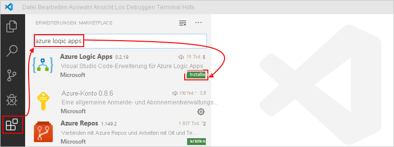

    Wählen Sie das Azure-Symbol auf der Visual Studio Code-Symbolleiste aus, um zu überprüfen, ob die Erweiterung ordnungsgemäß installiert wurde.

    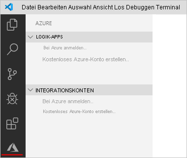

    Weitere Informationen finden Sie im [Marketplace für Erweiterungen](https://code.visualstudio.com/docs/editor/extension-gallery). Unter [Azure Logic Apps-Erweiterung für Visual Studio Code auf GitHub](https://github.com/Microsoft/vscode-azurelogicapps) können Sie Beiträge zur Open-Source-Version dieser Erweiterung einreichen.

<a name="access-azure"></a>

## <a name="access-azure-from-visual-studio"></a>Zugreifen auf Azure aus Visual Studio

1. Öffnen Sie Visual Studio Code. Wählen Sie in der Visual Studio Code-Symbolleiste das Azure-Symbol aus.

   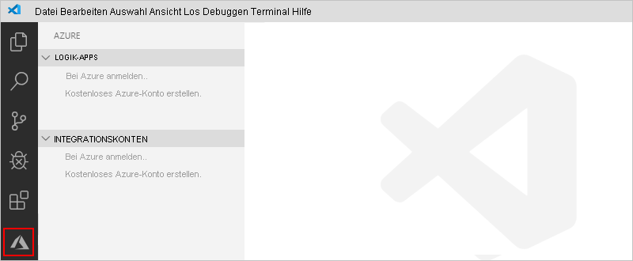

1. Wählen Sie im Azure-Fenster unter **Logik-Apps** die Option **Bei Azure anmelden** aus. Wenn Sie von der Microsoft-Anmeldeseite dazu aufgefordert werden, melden Sie sich mit Ihrem Azure-Konto an.

   

   1. Wenn die Anmeldung länger als üblich dauert, werden Sie von Visual Studio Code aufgefordert, sich über eine Microsoft-Authentifizierungswebsite anzumelden, indem Sie einen Gerätecode angeben. Wählen Sie **Gerätecode verwenden** aus, um sich stattdessen mit dem Code anzumelden.

      

   1. Um den Code zu kopieren, wählen Sie **Kopieren und öffnen** aus.

      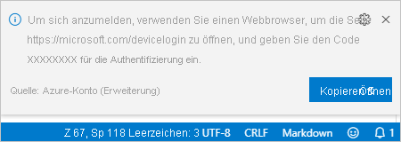

   1. Um ein neues Browserfenster zu öffnen und auf der Authentifizierungswebsite fortzufahren, wählen Sie **Link öffnen** aus.

      

   1. Geben Sie auf der Seite **Bei Ihrem Konto anmelden** Ihren Authentifizierungscode ein, und wählen Sie **Weiter** aus.

      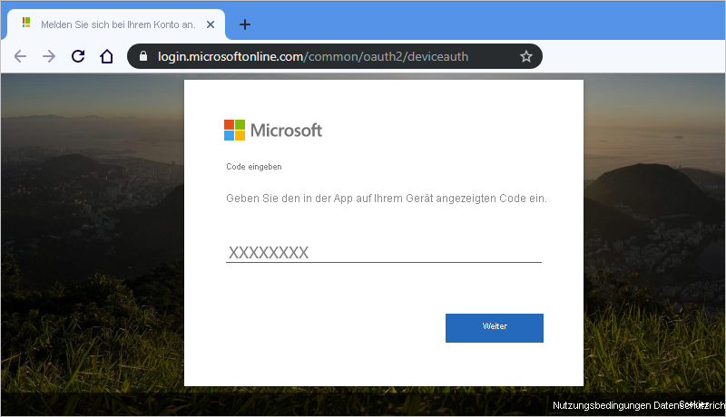

1. Wählen Sie Ihr Azure-Konto aus. Nach dem Anmelden können Sie den Browser schließen und zu Visual Studio Code zurückkehren.

   Im Azure-Bereich werden in den Abschnitten **Logik-Apps** und **Integrationskonten** nun die mit Ihrem Konto verknüpften Azure-Abonnements angezeigt. Wenn die erwarteten Abonnements jedoch nicht angezeigt werden, oder wenn in den Abschnitten zu viele Abonnements angezeigt werden, führen Sie die folgenden Schritte aus:

   1. Bewegen Sie den Mauszeiger über die Bezeichnung **Logik-Apps**. Wenn die Symbolleiste angezeigt wird, wählen Sie **Abonnements auswählen** (Filtersymbol) aus.

      

   1. Wählen Sie in der angezeigten Liste die Abonnements aus, die angezeigt werden sollen.

1. Wählen Sie unter **Logik-Apps** das gewünschte Abonnement aus. Der Abonnementknoten wird erweitert und zeigt alle Logik-Apps an, die in diesem Abonnement vorhanden sind.

   

   > [!TIP]
   > Unter **Integrationskonten** werden bei der Auswahl Ihres Abonnements alle Integrationskonten angezeigt, die in diesem Abonnement vorhanden sind.

<a name="create-logic-app"></a>

## <a name="create-new-logic-app"></a>Erstellen einer neuen Logik-App

1. Wenn Sie sich noch nicht über Visual Studio Code bei Ihrem Azure-Konto und -Abonnement angemeldet haben, befolgen Sie die [vorherigen Schritte, um sich jetzt anzumelden](#access-azure).

1. Öffnen Sie in Visual Studio Code unter **Logik-Apps** das Kontextmenü Ihres Abonnements, und wählen Sie **Logik-App erstellen** aus.

   

   Eine Liste wird angezeigt, in der alle Azure-Ressourcengruppen in Ihrem Abonnement angezeigt werden.

1. Wählen Sie in der Ressourcengruppenliste entweder **Neue Ressourcengruppe erstellen** oder eine vorhandene Ressourcengruppe aus. Erstellen Sie für dieses Beispiel eine neue Ressourcengruppe.

   

1. Geben Sie einen Namen für Ihre Azure-Ressourcengruppe ein, und drücken Sie die EINGABETASTE.

   

1. Wählen Sie die Azure-Region aus, in der Sie die Metadaten Ihrer Logik-App speichern möchten.

   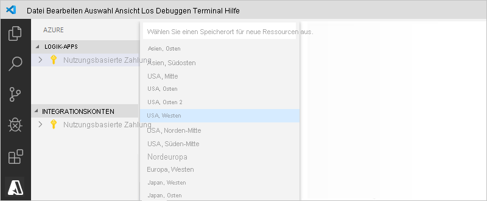

1. Geben Sie einen Namen für Ihre Logik-App ein, und drücken Sie die EINGABETASTE.

   

   Ihre neue und leere Logik-App wird nun im Azure-Fenster unter Ihrem Azure-Abonnement angezeigt. Visual Studio Code öffnet auch eine JSON-Datei (.logicapp.json), die eine Skelettworkflowdefinition für Ihre Logik-App enthält. Nun können Sie die Erstellung der Workflowdefinition ihrer Logik-App in dieser JSON-Datei manuell starten. Eine technische Referenz zu Struktur und Syntax einer Workflowdefinition finden Sie im [Schemareferenzleitfaden für die Workflowdefinitionssprache in Azure Logic Apps](../logic-apps/logic-apps-workflow-definition-language.md).

   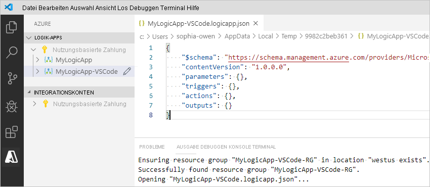

   Im Folgenden sehen Sie eine Beispieldefinition für einen Logik-App-Workflow, der mit einem RSS-Trigger und einer Office 365 Outlook-Aktion beginnt. JSON-Elemente werden in der Regel alphabetisch in jedem Abschnitt angezeigt. In diesem Beispiel werden diese Elemente jedoch ungefähr in der Reihenfolge angezeigt, in dem die Schritte der Logik-App im Designer aufgeführt sind.

   > [!IMPORTANT]
   > Wenn Sie dieses Beispiel einer Logik-App-Definition wiederverwenden möchten, benötigen Sie ein Organisationskonto, z. B. @fabrikam.com. Stellen Sie sicher, dass Sie die fiktive E-Mail-Adresse durch Ihre eigene E-Mail-Adresse ersetzen. Um einen anderen E-Mail-Connector wie z. B. Outlook.com oder Gmail zu verwenden, ersetzen Sie die `Send_an_email_action`-Aktion durch eine ähnliche Aktion, die bei einem [von Azure Logic Apps unterstützten E-Mail-Connector](../connectors/apis-list.md) verfügbar ist.
   >
   > Wenn Sie den Gmail-Connector verwenden möchten, können nur G-Suite-Geschäftskonten diesen Connector ohne Einschränkung in Logik-Apps verwenden. 
   > Wenn Sie über ein Gmail-Consumerkonto verfügen, können Sie diesen Connector nur mit bestimmten von Google genehmigten Diensten verwenden, oder Sie können [eine Google-Client-App erstellen, die für die Authentifizierung mit Ihrem Gmail-Connector verwendet werden soll](/connectors/gmail/#authentication-and-bring-your-own-application). 
   > Weitere Informationen finden Sie unter [Datensicherheit und Datenschutzrichtlinien für Google-Connectors in Azure Logic Apps](../connectors/connectors-google-data-security-privacy-policy.md).

   ```json
   {
      "$schema": "https://schema.management.azure.com/providers/Microsoft.Logic/schemas/2016-06-01/workflowdefinition.json#",
      "contentVersion": "1.0.0.0",
      "parameters": {
         "$connections": {
            "defaultValue": {},
            "type": "Object"
         }
      },
      "triggers": {
         "When_a_feed_item_is_published": {
            "recurrence": {
               "frequency": "Minute",
               "interval": 1
            },
            "splitOn": "@triggerBody()?['value']",
            "type": "ApiConnection",
            "inputs": {
               "host": {
                  "connection": {
                     "name": "@parameters('$connections')['rss']['connectionId']"
                  }
               },
               "method": "get",
               "path": "/OnNewFeed",
               "queries": {
                  "feedUrl": "http://feeds.reuters.com/reuters/topNews"
               }
            }
         }
      },
      "actions": {
         "Send_an_email_(V2)": {
            "runAfter": {},
            "type": "ApiConnection",
            "inputs": {
               "body": {
                  "Body": "<p>Title: @{triggerBody()?['title']}<br>\n<br>\nDate published: @{triggerBody()?['updatedOn']}<br>\n<br>\nLink: @{triggerBody()?['primaryLink']}</p>",
                  "Subject": "RSS item: @{triggerBody()?['title']}",
                  "To": "sophia-owen@fabrikam.com"
               },
               "host": {
                  "connection": {
                     "name": "@parameters('$connections')['office365']['connectionId']"
                  }
               },
               "method": "post",
               "path": "/v2/Mail"
            }
         }
      },
      "outputs": {}
   }
   ```

1. Wenn Sie fertig sind, speichern Sie die Workflowdefinition Ihrer Logik-App. (Menü „Datei“ > „Speichern“, oder drücken Sie STRG+S)

1. Wenn Sie zum Hochladen Ihrer Logik-App in Ihr Azure-Abonnement aufgefordert werden, wählen Sie **Hochladen** aus.

   In diesem Schritt wird Ihre Logik-App im [Azure-Portal](https://portal.azure.com) veröffentlicht, sodass sie in Azure in Betrieb geht.

   

## <a name="view-logic-app-in-designer"></a>Anzeigen der Logik-App im Designer

In Visual Studio Code können Sie Ihre Logik-App in der schreibgeschützten Entwurfsansicht öffnen. Obwohl Sie Ihre Logik-App im Designer nicht bearbeiten können, können Sie den Workflow ihrer Logik-App mithilfe der Designeransicht visuell überprüfen.

Öffnen Sie im Azure-Fenster unter **Logik-Apps** das Kontextmenü ihrer Logik-App, und wählen Sie **Im Designer öffnen** aus.

Der schreibgeschützte Designer wird in einem separaten Fenster geöffnet und zeigt den Workflow ihrer Logik-App an, z. B.:


## <a name="view-in-azure-portal"></a>Ansicht im Azure-Portal

Führen Sie die folgenden Schritte aus, um Ihre Logik-App im Azure-Portal zu überprüfen:

1. Melden Sie sich mit demselben Azure-Konto und -Abonnement, die Ihrer Logik-App zugeordnet sind, beim [Azure-Portal](https://portal.azure.com) an.

1. Geben Sie im Suchfeld des Azure-Portals den Namen Ihrer Logik-App ein. Wählen Sie in der Ergebnisliste ihre Logik-App aus.

   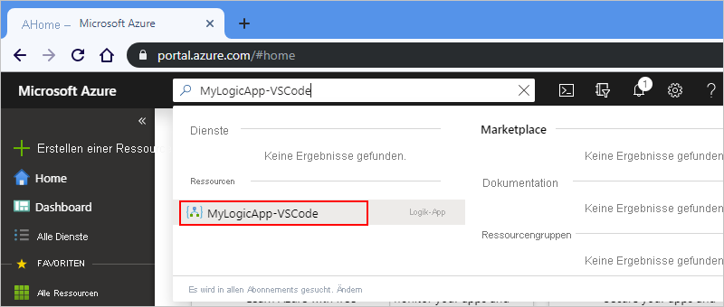

<a name="disable-enable-logic-app"></a>

## <a name="disable-or-enable-logic-app"></a>Deaktivieren oder Aktivieren der Logik-App

Wenn Sie in Visual Studio Code eine veröffentlichte Logik-App bearbeiten und die Änderungen speichern, *überschreiben* Sie Ihre bereits bereitgestellte App. Um zu vermeiden, Ihre in der Produktionsumgebung befindliche Logik-App zu beschädigen, und um die Unterbrechung zu minimieren, deaktivieren Sie Ihre Logik-App zunächst. Anschließend können Sie Ihre Logik-App reaktivieren, nachdem Sie sich vergewissert haben, dass sie weiterhin funktioniert.

1. Wenn Sie sich noch nicht über Visual Studio Code bei Ihrem Azure-Konto und -Abonnement angemeldet haben, befolgen Sie die [vorherigen Schritte, um sich jetzt anzumelden](#access-azure).

1. Erweitern Sie im Azure-Fenster unter **Logik-Apps** Ihr Azure-Abonnement, sodass Sie alle Logik-Apps in diesem Abonnement sehen können.

   1. Um die gewünschte Logik-App zu deaktivieren, öffnen Sie das Menü der Logik-App, und wählen Sie **Deaktivieren** aus.

      

   1. Wenn Sie bereit sind, Ihre Logik-App zu reaktivieren, öffnen Sie das Menü der Logik-App, und wählen Sie **Aktivieren** aus.

      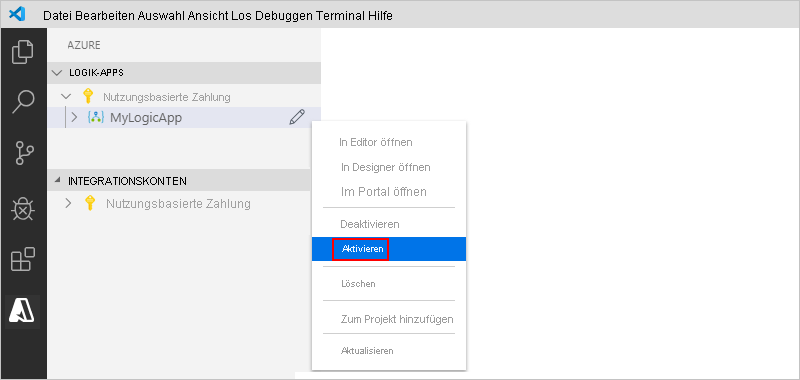

<a name="edit-logic-app"></a>

## <a name="edit-deployed-logic-app"></a>Bearbeiten der bereitgestellten Logik-App

In Visual Studio Code können Sie die Workflowdefinition für eine bereits in Azure bereitgestellte Logik-App öffnen und bearbeiten.

> [!IMPORTANT] 
> Bevor Sie eine aktive, in der Produktionsumgebung ausgeführte Logik-App bearbeiten, vermeiden Sie das Risiko, diese Logik-App zu beschädigen, und minimieren Sie die Unterbrechung, indem Sie [Ihre Logik-App deaktivieren](#disable-enable-logic-app).

1. Wenn Sie sich noch nicht über Visual Studio Code bei Ihrem Azure-Konto und -Abonnement angemeldet haben, befolgen Sie die [vorherigen Schritte, um sich jetzt anzumelden](#access-azure).

1. Erweitern Sie im Azure-Fenster unter **Logik-Apps** Ihr Azure-Abonnement, und wählen Sie die gewünschte Logik-App aus.

1. Öffnen Sie das Menü der Logik-App, und wählen Sie **In Editor öffnen** aus. Alternativ können Sie neben dem Namen Ihrer Logik-App das Bearbeitungssymbol auswählen.

   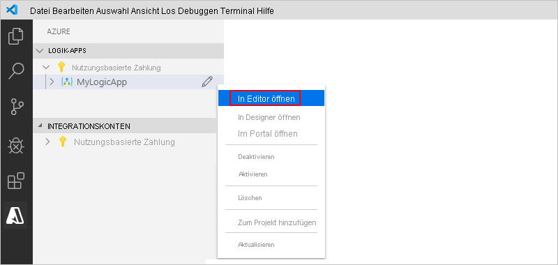

   Visual Studio Code öffnet die .logicapp.json-Datei in Ihrem lokalen temporären Ordner, damit Sie die Workflowdefinition Ihrer Logik-App anzeigen können.

   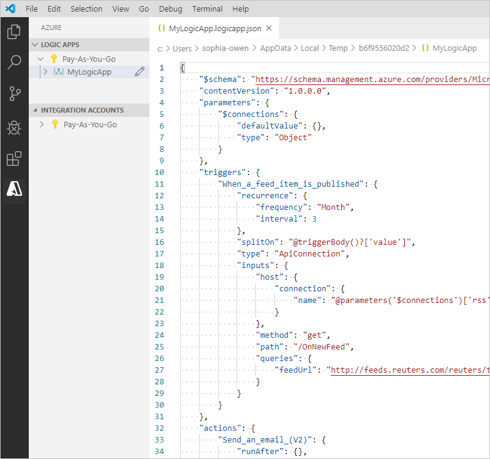

1. Nehmen Sie die gewünschten Änderungen an der Workflowdefinition Ihrer Logik-App vor.

1. Speichern Sie Ihre Änderungen, wenn Sie fertig sind. (Menü „Datei“ > „Speichern“, oder drücken Sie STRG+S)

1. Wenn Sie aufgefordert werden, die Änderungen hochzuladen und Ihre vorhandene Logik-App im Azure-Portal zu *überschreiben*, wählen Sie **Hochladen** aus.

   In diesem Schritt werden Ihre Updates der Logik-App im [Azure-Portal](https://portal.azure.com) veröffentlicht.

   

## <a name="view-or-promote-other-versions"></a>Anzeigen oder Höherstufen anderer Versionen

In Visual Studio Code können Sie die früheren Versionen der Logik-App öffnen und überprüfen. Sie können auch eine frühere Version auf die aktuelle Version höher stufen.

> [!IMPORTANT] 
> Bevor Sie eine aktive, in der Produktionsumgebung ausgeführte Logik-App ändern, vermeiden Sie das Risiko, diese Logik-App zu beschädigen, und minimieren Sie die Unterbrechung, indem Sie [Ihre Logik-App deaktivieren](#disable-enable-logic-app).

1. Erweitern Sie im Azure-Fenster unter **Logik-Apps** Ihr Azure-Abonnement, sodass Sie alle Logik-Apps in diesem Abonnement sehen können.

1. Erweitern Sie Ihre Logik-App in Ihrem Abonnement, und erweitern Sie **Versionen**.

   In der Liste **Versionen** werden – sofern vorhanden – die früheren Versionen ihrer Logik-App angezeigt.

   

1. Um eine frühere Version anzuzeigen, wählen Sie einen der folgenden Schritte aus:

   * Um die JSON-Definition anzuzeigen, wählen Sie unter **Versionen** die Versionsnummer für diese Definition aus. Öffnen Sie alternativ das Kontextmenü der Version, und wählen Sie **Im Editor öffnen** aus.

     Auf dem lokalen Computer wird eine neue Datei geöffnet und die JSON-Definition dieser Version angezeigt.

   * Um die Version in der schreibgeschützten Designeransicht anzuzeigen, öffnen Sie das Kontextmenü dieser Version, und wählen Sie **Im Designer öffnen** aus.

1. Um eine frühere Version auf die aktuelle Version höherzustufen, führen Sie diese Schritte aus:

   1. Öffnen Sie unter **Versionen** das Kontextmenü der früheren Version, und wählen Sie **Höher stufen** aus.

      

   1. Um fortzufahren, nachdem Visual Studio Code Sie zur Bestätigung aufgefordert hat, wählen Sie **Ja** aus.

      

      Visual Studio Code stuft die ausgewählte Version auf die aktuelle Version herauf und weist der höher gestuften Version eine neue Nummer zu. Die zuvor aktuelle Version wird jetzt unter der höher gestuften Version angezeigt.

## <a name="next-steps"></a>Nächste Schritte

> [!div class="nextstepaction"]
> [Erstellen zustandsbehafteter oder zustandsloser Logik-Apps in Visual Studio Code (Vorschau)](../logic-apps/create-stateful-stateless-workflows-visual-studio-code.md)
