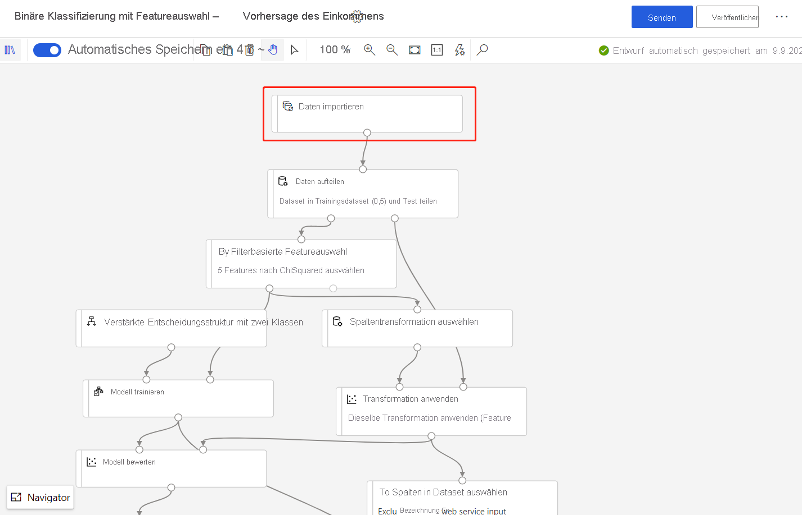

# Verwenden von Pipelineparametern zum erneuten Trainieren von Modellen im Designer

In dieser Anleitung erfahren Sie, wie Sie Azure Machine Learning-Designer zum erneuten Trainieren eines Machine Learning-Modells mithilfe von Pipelineparametern verwenden. Sie werden veröffentlichte Pipelines verwenden, um Ihren Workflow zu automatisieren und Parameter festzulegen, um Ihr Modell anhand neuer Daten zu trainieren. Mithilfe von Pipelineparametern können Sie vorhandene Pipelines für verschiedene Aufträge wiederverwenden.  

In diesem Artikel werden folgende Vorgehensweisen behandelt:

> [!div class="checklist"]
> * Trainieren eines Machine Learning-Modells
> * Erstellen eines Pipelineparameters
> * Veröffentlichen Ihrer Trainingspipeline
> * Trainieren Sie Ihr Modell mit neuen Parametern erneut.

## Voraussetzungen

* Ein Azure Machine Learning-Arbeitsbereich
* Schließen Sie den ersten Teil dieser Anleitungsreihe [Transformieren von Daten im Designer](how-to-designer-transform-data.md) ab.

[!INCLUDE [machine-learning-missing-ui](../../includes/machine-learning-missing-ui.md)]

In diesem Artikel wird auch davon ausgegangen, dass Sie Kenntnisse zur Erstellung einer einfachen Pipeline im Designer haben. Als Einführung können Sie das [Tutorial](tutorial-designer-automobile-price-train-score.md) durchführen. 

### Beispiel-Pipeline

Die in diesem Artikel verwendete Pipeline ist eine geänderte Version einer [Einkommensvorhersage](samples-designer.md#classification) einer Beispielpipeline auf der Designer-Homepage. Die Pipeline verwendet das Modul [Import Data](algorithm-module-reference/import-data.md) (Daten importieren) anstelle des Beispieldatasets, um Ihnen zu zeigen, wie Sie Modelle mit Ihren eigenen Daten trainieren können.

## Erstellen eines Pipelineparameters

Pipelineparameter dienen zum Erstellen vielseitiger Pipelines, die später mit variierenden Parameterwerten erneut übermittelt werden können. Einige typische Szenarien sind die Aktualisierung von Datasets oder einiger Hyperparameter für das erneute Training. Erstellen Sie Pipelineparameter, um Variablen zur Laufzeit dynamisch festzulegen. 

Pipelineparameter können in einer Pipeline Datenquellen- oder Modulparametern hinzugefügt werden. Wenn die Pipeline erneut übermittelt wird, können die Werte dieser Parameter angegeben werden.

In diesem Beispiel werden Sie den Trainingsdatenpfad von einem festen Wert in einen Parameter ändern, sodass Sie Ihr Modell anhand anderer Daten neu trainieren können. Sie können auch je nach Anwendungsfall weitere Modulparameter als Pipelineparameter hinzufügen.

1. Wählen Sie das Modul **Import Data** (Daten importieren) aus.

    > [!NOTE]
    > In diesem Beispiel wird das Modul „Import Data“ (Daten importieren) verwendet, um auf Daten in einem registrierten Datenspeicher zuzugreifen. Sie können jedoch ähnliche Schritte durchführen, wenn Sie alternative Datenzugriffsmuster verwenden.

1. Wählen Sie im Moduldetailbereich rechts neben der Canvas Ihre Datenquelle aus.

1. Geben Sie den Pfad zu Ihren Daten ein. Sie können auch **Pfad durchsuchen** auswählen, um durch Ihre Dateistruktur zu navigieren. 

1. Bewegen Sie den Mauszeiger über das Feld **Pfad**, und wählen Sie die Auslassungspunkte über dem Feld **Pfad** aus, die angezeigt werden.

1. Wählen Sie **Zu Pipelineparameter hinzufügen** aus.

1. Geben Sie einen Parameternamen und einen Standardwert an.

   

1. Wählen Sie **Speichern** aus.

   > [!NOTE]
   > Sie können auch im Bereich mit den Moduldetails (vergleichbar mit dem Hinzufügen von Pipelineparametern) einen Modulparameter von einem Pipelineparameter trennen.
   >
   > Über das Zahnradsymbol **Einstellungen** neben dem Titel Ihres Pipelineentwurfs können Sie die Pipelineparameter überprüfen und bearbeiten. 
   >    - Nach dem Trennen können Sie den Pipelineparameter im Bereich **Einstellungen** löschen.
   >    - Sie können auch einen Pipelineparameter im Bereich **Einstellungen** hinzufügen und ihn dann auf einen Modulparameter anwenden.

1. Übermitteln Sie die Pipelineausführung.

## Veröffentlichen einer Trainingspipeline

Veröffentlichen Sie eine Pipeline an einem Pipelineendpunkt, um Ihre Pipelines in Zukunft einfach wiederverwenden zu können. Ein Pipelineendpunkt erstellt einen REST-Endpunkt, um die Pipeline zukünftig aufzurufen. In diesem Beispiel können Sie mit Ihrem Pipelineendpunkt Ihre Pipeline wiederverwenden, um ein Modell anhand anderer Daten neu zu trainieren.

1. Wählen Sie **Veröffentlichen** über der Designer-Canvas aus.
1. Wählen Sie einen Pipelineendpunkt aus, oder erstellen Sie ihn.

   > [!NOTE]
   > Sie können mehrere Pipelines für einen einzelnen Endpunkt veröffentlichen. Jede Pipeline in einem bestimmten Endpunkt erhält eine Versionsnummer, die Sie beim Aufruf des Pipelineendpunkts angeben können.

1. Wählen Sie **Veröffentlichen**.

## Erneutes Trainieren Ihres Modells

Nachdem Sie nun eine Trainingspipeline veröffentlicht haben, können Sie diese verwenden, um Ihr Modell anhand neuer Daten neu zu trainieren. Sie können Ausführungen von einem Pipelineendpunkt aus dem Studio-Arbeitsbereich oder programmgesteuert übermitteln.

### Übermitteln von Ausführungen mit dem Studio-Portal

Verwenden Sie die folgenden Schritte, um die Ausführung eines parametrisierten Pipelineendpunkts über das Studio-Portal zu übermitteln:

1. Rufen Sie die Seite **Endpunkte** in Ihrem Studio-Arbeitsbereich auf.
1. Wählen Sie die Registerkarte **Pipelineendpunkte** aus. Wählen Sie dann Ihren Pipelineendpunkt aus.
1. Wählen Sie die Registerkarte **Veröffentlichte Pipelines** aus. Wählen Sie dann die Pipelineversion aus, die Sie ausführen möchten.
1. Klicken Sie auf **Submit** (Senden).
1. Im Dialogfeld für die Einrichtung können Sie die Parameterwerte für die Ausführung angeben. Aktualisieren Sie in diesem Beispiel den Dateipfad, um das Modell mit einem Nicht-US-Dataset zu trainieren.

### Übermitteln von Ausführungen durch Code

Den REST-Endpunkt einer veröffentlichten Pipeline finden Sie im Übersichtsbereich. Durch den Aufruf des Endpunkts können Sie die veröffentlichte Pipeline neu trainieren.

Sie benötigen einen OAuth 2.0-Authentifizierungsheader vom Typ Bearer, um einen REST-Aufruf auszuführen. Informationen zum Einrichten der Authentifizierung für Ihren Arbeitsbereich und zum Ausführen eines parametrisierten REST-Aufrufs finden Sie unter [Erstellen einer Azure Machine Learning-Pipeline für die Batchbewertung](tutorial-pipeline-batch-scoring-classification.md#publish-and-run-from-a-rest-endpoint).

## Nächste Schritte

In diesem Artikel haben Sie erfahren, wie Sie mit dem Designer einen parametrisierten Trainingspipelineendpunkt erstellen können.

Eine vollständige exemplarische Vorgehensweise, wie Sie ein Modell bereitstellen können, um Vorhersagen zu treffen, finden Sie im [Designer-Tutorial](tutorial-designer-automobile-price-train-score.md) zum Trainieren und Bereitstellen eines Regressionsmodells.

Informationen zum Veröffentlichen und übermitteln eines Run-to-Pipeline-Endpunkts mithilfe des SDK finden Sie in [diesem Artikel](how-to-deploy-pipelines.md).
