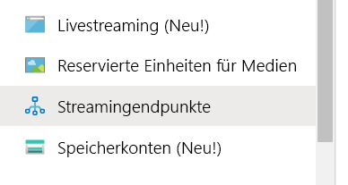
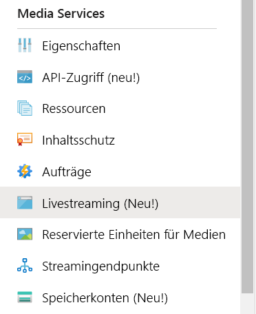
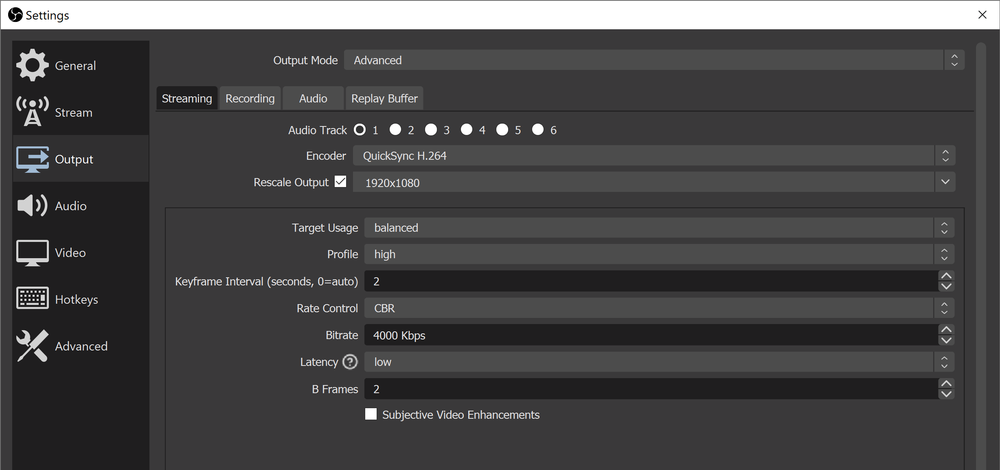
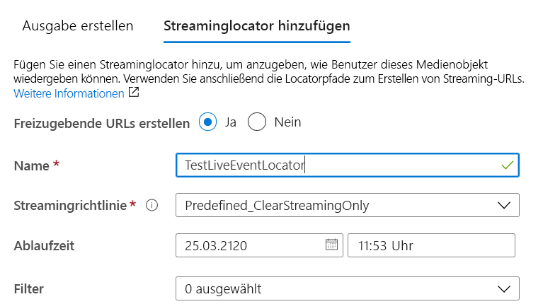

# Erstellen eines Azure Media Services-Livestreams mit OBS

[!INCLUDE [media services api v3 logo](./includes/v3-hr.md)]

In dieser Schnellstartanleitung erfahren Sie, wie Sie über das Azure-Portal ein Media Services-Liveereignis erstellen und mithilfe von Open Broadcasting Studio (OBS) übertragen. Hierbei wird vorausgesetzt, dass Sie über ein Azure-Abonnement verfügen und ein Media Services-Konto erstellt haben.

In dieser Schnellstartanleitung wird Folgendes behandelt:

- Einrichten eines lokalen Encoders mit OBS
- Einrichten eines Livestreams
- Einrichten von Livestreamausgaben
- Ausführen eines Standard-Streamingendpunkts
- Anzeigen des Livestreams und der On-Demand-Ausgabe in Azure Media Player

## Voraussetzungen

Wenn Sie kein Azure-Abonnement besitzen, können Sie ein [kostenloses Konto](https://azure.microsoft.com/free/) erstellen, bevor Sie beginnen.

## Melden Sie sich auf dem Azure-Portal an.

Öffnen Sie Ihren Webbrowser, und navigieren Sie zum [Microsoft Azure-Portal](https://portal.azure.com/). Geben Sie Ihre Anmeldeinformationen ein, um sich beim Portal anzumelden. Die Standardansicht ist Ihr Dienstdashboard.

## Einrichten eines lokalen Encoders mithilfe von OBS

1. Laden Sie OBS für Ihr Betriebssystem von der [Open Broadcaster Software-Website](https://obsproject.com/) herunter, und installieren Sie es.
1. Starten Sie die Anwendung, und lassen Sie sie geöffnet.

## Ausführen des Standard-Streamingendpunkts

1. Wählen Sie in der Media Services-Liste die Option **Streamingendpunkte** aus.

   
1. Wählen Sie den Standard-Streamingendpunkt aus, wenn sein Status „Beendet“ lautet. Mit diesem Schritt gelangen Sie auf die Seite des Endpunkts.
1. Wählen Sie **Starten** aus.

   

## Einrichten eines Azure Media Services-Livestreams

1. Greifen Sie im Portal auf das Azure Media Services-Konto zu, und wählen Sie anschließend in der Liste **Media Services** die Option **Livestreaming** aus.

   
1. Wählen Sie **Liveereignis hinzufügen** aus, um ein neues Livestreamingereignis zu erstellen.

   
1. Geben Sie im Feld **Name des Liveereignisses** einen Namen für Ihr neues Ereignis ein (z. B. *TestLiveEvent*).

   
1. Geben Sie im Feld **Beschreibung** eine optionale Beschreibung des Ereignisses ein.
1. Aktivieren Sie die Option **Passthrough – keine Cloudcodierung**.

   
1. Wählen Sie die Option **RTMP** aus.
1. Vergewissern Sie sich, dass für **Liveereignis starten** die Option **Nein** ausgewählt ist. So vermeiden Sie, dass für das Liveereignis Kosten anfallen, bevor es bereit ist. (Die Abrechnung beginnt, nachdem das Liveereignis gestartet wurde.)

   
1. Wählen Sie die Schaltfläche **Bewerten + erstellen** aus, um die Einstellungen zu überprüfen.
1. Wählen Sie die Schaltfläche **Erstellen** aus, um das Liveereignis zu erstellen. Nun wird wieder die Liste mit den Liveereignissen angezeigt.
1. Wählen Sie den Link zum von Ihnen erstellten Liveereignis aus. Beachten Sie, dass Ihr Ereignis beendet ist.
1. Lassen Sie diese Seite in Ihrem Browser geöffnet. Wir werden später darauf zurückkommen.

## Einrichten eines Livestreams mit OBS Studio

OBS wird mit einer Standardszene aber ohne ausgewählte Eingaben gestartet.

   

### Videoquelle hinzufügen

1. Wählen Sie im Bereich **Quellen** das Symbol **Hinzufügen** aus, um ein neues Quellgerät auszuwählen. Das Menü **Quellen** wird geöffnet.

1. Wählen Sie im Quellgerätmenü die Option **Videoaufnahmegerät** aus. Das Menü **Quelle erstellen/auswählen** wird geöffnet.

   

1. Wählen Sie das Optionsfeld **Vorhandene hinzufügen** und anschließend **OK** aus. Das Menü mit **Eigenschaften für Videogeräte** wird geöffnet.

   

1. Wählen Sie in der Dropdownliste **Geräte** die Videoeingabe aus, die Sie für die Übertragung verwenden möchten. Lassen Sie die restlichen Einstellungen vorerst unverändert, und wählen Sie **OK** aus. Die Eingabequelle wird dem Bereich **Quellen** hinzugefügt, und die Videoeingabeansicht wird im Bereich **Vorschau** angezeigt.

   

### Audioquelle hinzufügen

1. Wählen Sie im Bereich **Quellen** das Symbol **Hinzufügen** aus, um ein neues Quellgerät auszuwählen. Das Menü „Quellgerät“ wird geöffnet.

1. Wählen Sie im Quellgerätmenü die Option **Audioaufnahmegerät** aus. Das Menü **Quelle erstellen/auswählen** wird geöffnet.

   

1. Wählen Sie das Optionsfeld **Vorhandene hinzufügen** und anschließend **OK** aus. Das Menü mit **Eigenschaften für die Erfassung von Audioeingaben** wird geöffnet.

   

1. Wählen Sie in der Dropdownliste **Geräte** das Audioaufnahmegerät aus, das Sie für die Übertragung verwenden möchten. Lassen Sie die restlichen Einstellungen vorerst unverändert, und wählen Sie „OK“ aus. Das Audioaufnahmegerät wird dem Audiomixerbereich hinzugefügt.

   

### Einrichten von Streaming und erweiterten Codierungseinstellungen in OBS

In den nächsten Schritten kehren Sie zu Azure Media Services in Ihrem Browser zurück, um die Eingabe-URL zu kopieren, damit Sie sie in die Ausgabeeinstellungen eingeben können:

1. Wählen Sie im Portal auf der Seite „Azure Media Services“ die Option **Starten** aus, um das Livestreamereignis zu starten. (Die Abrechnung beginnt.)

   
1. Stellen Sie den **RTMP**-Umschalter auf **RTMPS** ein.
1. Kopieren Sie die URL aus dem Feld **Eingabe-URL** in die Zwischenablage.

   

1. Wechseln Sie zur OBS-Anwendung.

1. Wählen Sie im Bereich **Steuerelemente** die Schaltfläche **Einstellungen** aus. Die Einstellungsoptionen werden geöffnet.

   

1. Wählen Sie im Menü **Einstellungen** die Option **Stream** aus.

1. Wählen Sie in der Dropdownliste **Dienst** die Option „Alle anzeigen“ aus, und wählen Sie dann **Benutzerdefiniert…** aus.

1. Fügen Sie im Feld **Server** die RTMPS-URL aus der Zwischenablage ein.

1. Geben Sie einen Wert in das Feld **Streamschlüssel** ein.  Der Wert spielt keine Rolle, muss aber vorhanden sein.

    

1. Wählen Sie im Menü **Einstellungen** die Option **Ausgabe** aus.

1. Klicken Sie im oberen Bereich der Seite auf die Dropdownliste **Ausgabemodus**, und wählen Sie **Erweitert** aus, um auf alle verfügbaren Encodereinstellungen zuzugreifen.

1. Wählen Sie die Registerkarte **Streaming** aus, um den Encoder einzurichten.

1. Wählen Sie den passenden Encoder für Ihr System aus.  Falls Ihre Hardware GPU-Beschleunigung unterstützt, wählen Sie **NVENC** (H.264) von NVIDIA oder **QuickSync** (H.264) von Intel aus. Verfügt Ihr System über keine unterstützte GPU, wählen Sie die Softwareencoderoption **X264** aus.

#### Einstellungen für den X264-Encoder

1. Aktivieren Sie bei Verwendung der Codierungsoption **X264** das Kontrollkästchen **Rescale Output** (Ausgabe neu skalieren). Wählen Sie „1920x1080“ für ein Premium-Liveereignis in Media Services oder „1280x720“ für ein Standard-Liveereignis (720p) aus.  Bei Verwendung eines Passthrough-Liveereignisses können Sie eine beliebige verfügbare Auflösung auswählen.

1. Legen Sie die **Bitrate** auf einen Wert zwischen 1.500 KBit/s und 4.000 KBit/s fest. Für ein Liveereignis mit Standardcodierung (720p) werden 2.500 KBit/s empfohlen. Für ein Premium-Liveereignis (1080p) werden 4.000 KBit/s empfohlen. Bei Bedarf können Sie die Bitrate auf der Grundlage der verfügbaren CPU-Funktionen und der Bandbreite im Netzwerk anpassen, um die gewünschte Qualitätseinstellung zu erhalten.

1. Geben Sie *2* in das Feld **Keyframe-Intervall** ein. Dieser Wert entspricht einem Keyframe-Intervall von zwei Sekunden. Dadurch wird die endgültige Größe der Fragmente gesteuert, die von Media Services über HLS oder DASH übermittelt werden. Legen Sie das Keyframe-Intervall nie auf mehr als vier Sekunden fest.  Falls es bei der Übertragung zu langen Wartezeiten kommt, sollten Sie immer diesen Wert überprüfen bzw. Ihre Anwendungsbenutzer bitten, den Wert auf zwei Sekunden festzulegen. Für eine Liveübertragung mit geringerer Wartezeit können Sie diesen Wert auf bis zu eine Sekunde herabsetzen.

1. OPTIONAL: Legen Sie die Voreinstellung für die CPU-Auslastung auf **veryfast** (sehr schnell) fest, und führen Sie einige Experimente durch, um zu testen, ob Ihre lokale CPU mit der Kombination aus Bitrate und Voreinstellung zurechtkommt und genügend Reserven zur Verfügung stehen. Vermeiden Sie Einstellungen, die eine durchschnittliche CPU-Auslastung von mehr als 80 Prozent zur Folge haben, um Probleme beim Livestreaming zu vermeiden. Zur Verbesserung der Qualität können Sie die Voreinstellungen **faster** (schneller) und **fast** (schnell) testen, bis Sie die Grenzen Ihrer CPU erreichen.

   

1. Lassen Sie die restlichen Einstellungen unverändert, und wählen Sie **OK** aus.

#### Einstellungen für den Encoder „NVIDIA NVENC“

1. Wenn Sie die GPU-Codierungsoption **NVENC** ausgewählt haben, aktivieren Sie das Kontrollkästchen **Rescale Output** (Ausgabe neu skalieren), und wählen Sie „1920x1080“ für ein Premium-Liveereignis in Media Services oder „1280x720“ für ein Standard-Liveereignis (720p) aus. Bei Verwendung eines Passthrough-Liveereignisses können Sie eine beliebige verfügbare Auflösung auswählen.

1. Legen Sie die Ratensteuerung (**Rate Control**) auf „CBR“ (Constant Bit Rate, konstante Bitrate) fest.

1. Legen Sie die **Bitrate** auf einen Wert zwischen 1.500 KBit/s und 4.000 KBit/s fest. Für ein Liveereignis mit Standardcodierung (720p) werden 2.500 KBit/s empfohlen. Für ein Premium-Liveereignis (1080p) werden 4.000 KBit/s empfohlen. Bei Bedarf können Sie diesen Wert auf der Grundlage der verfügbaren CPU-Funktionen und der Bandbreite im Netzwerk anpassen, um die gewünschte Qualitätseinstellung zu erhalten.

1. Legen Sie das **Keyframe-Intervall** wie weiter oben in den X264-Optionen angegeben auf zwei Sekunden fest. Verwenden Sie keinen Wert über vier Sekunden, da sich dies erheblich auf die Wartezeit Ihrer Liveübertragung auswirken kann.

1. Legen Sie die **Voreinstellung** abhängig von der CPU-Geschwindigkeit Ihres lokalen Computers auf „Low-Latency“ (Geringe Wartezeit), „Low-Latency Performance“ (Geringe Wartezeit: Leistung) oder „Low-Latency Quality“ (Geringe Wartezeit: Qualität) fest. Experimentieren Sie mit diesen Einstellungen, um mit Ihrer eigenen Hardware ein optimales Gleichgewicht zwischen Qualität und CPU-Auslastung zu erzielen.

1. Legen Sie das **Profil** bei Verwendung einer leistungsfähigeren Hardwarekonfiguration auf „main“ (Haupt) oder „high“ (Hoch) fest.

1. Lassen Sie das Kontrollkästchen **Lookahead** deaktiviert. Falls Sie über einen besonders leistungsfähigen Computer verfügen, können Sie dieses Kontrollkästchen aktivieren.

1. Lassen Sie das Kontrollkästchen **Psycho Visual Tuning** (Psychovisuelle Optimierung) deaktiviert. Falls Sie über einen besonders leistungsfähigen Computer verfügen, können Sie dieses Kontrollkästchen aktivieren.

1. Legen Sie die **GPU** auf „0“ fest, um die GPU-Zuordnung zu automatisieren. Falls gewünscht, können Sie die GPU-Nutzung einschränken.

1. Legen Sie die Einstellung **Max B-frames** (Maximale B-Frames) auf „2“ fest.

   

#### Einstellungen für den QuickSync-Encoder von Intel

1. Wenn Sie die GPU-Codierungsoption **QuickSync** von Intel ausgewählt haben, aktivieren Sie das Kontrollkästchen **Rescale Output** (Ausgabe neu skalieren), und wählen Sie „1920x1080“ für ein Premium-Liveereignis in Media Services oder „1280x720“ für ein Standard-Liveereignis (720p) aus. Bei Verwendung eines Passthrough-Liveereignisses können Sie eine beliebige verfügbare Auflösung auswählen.

1. Legen Sie die Zielauslastung (**Target Usage**) auf „balanced“ (Ausgewogen) fest, oder passen Sie sie basierend auf Ihrer kombinierten CPU- und GPU-Auslastung an. Experimentieren Sie mit dieser Einstellung, um eine durchschnittliche maximale CPU-Auslastung von 80 Prozent mit der Qualität zu erzielen, die von Ihrer Hardware erzeugt werden kann. Versuchen Sie es im Falle von weniger leistungsfähiger Hardware sowie bei Leistungsproblemen mit „fast“ (schnell) oder „very fast“ (sehr schnell).

1. Legen Sie das **Profil** bei Verwendung einer leistungsfähigeren Hardwarekonfiguration auf „main“ (Haupt) oder „high“ (Hoch) fest.

1. Legen Sie das **Keyframe-Intervall** wie weiter oben in den X264-Optionen angegeben auf zwei Sekunden fest. Verwenden Sie keinen Wert über vier Sekunden, da sich dies erheblich auf die Wartezeit Ihrer Liveübertragung auswirken kann.

1. Legen Sie die Ratensteuerung (**Rate Control**) auf „CBR“ (Constant Bit Rate, konstante Bitrate) fest.

1. Legen Sie die **Bitrate** auf einen Wert zwischen 1.500 KBit/s und 4.000 KBit/s fest.  Für ein Liveereignis mit Standardcodierung (720p) werden 2.500 KBit/s empfohlen. Für ein Premium-Liveereignis (1080p) werden 4.000 KBit/s empfohlen. Bei Bedarf können Sie diesen Wert auf der Grundlage der verfügbaren CPU-Funktionen und der Bandbreite im Netzwerk anpassen, um die gewünschte Qualitätseinstellung zu erhalten.

1. Legen Sie die **Wartezeit** auf „Niedrig“ fest.

1. Legen Sie **B-Frames** auf „2“ fest.

1. Lassen Sie das Kontrollkästchen **Subjective Video Enhancements** (Subjektive Videoverbesserungen) deaktiviert.

   

### Festlegen der Audioeinstellungen

In diesem Abschnitt werden die Einstellungen für die Audiocodierung angepasst.

1. Wählen Sie in den Einstellungen unter „Ausgabe“ die Registerkarte „Audio“ aus.

1. Legen Sie die **Audiobitrate** für die Spur 1 auf 128 KBit/s fest.

   

1. Wählen Sie in den Einstellungen die Registerkarte „Audio“ aus.

1. Legen Sie die **Abtastrate** auf 44,1 kHz fest.

   

### Streaming starten

1. Klicken Sie im Bereich **Steuerelemente** auf **Streaming starten**.

    

2. Wechseln Sie in Ihrem Browser zum Liveereignis-Bildschirm von Azure Media Services, und klicken Sie auf den Link **Player neu laden**. Der Stream sollte jetzt im Vorschauplayer angezeigt werden.

## Einrichten von Ausgaben

In diesem Teil werden Ihre Ausgaben und eine Möglichkeit zum Aufzeichnen Ihres Livestreams eingerichtet.  

> [!NOTE]
> Zum Streamen dieser Ausgabe muss der Streamingendpunkt aktiv sein. Weitere Informationen finden Sie unten im Abschnitt [Ausführen des Standard-Streamingendpunkts](#run-the-default-streaming-endpoint).

1. Wählen Sie unter der Videoansicht **Ausgaben** den Link **Ausgaben erstellen** aus.
1. Der Name der Ausgabe kann im Feld **Name** auf Wunsch in einen benutzerfreundlicheren Wert geändert werden, damit die Ausgabe später leichter zu finden ist.

   
1. Lassen Sie alle anderen Felder vorerst unverändert.
1. Wählen Sie **Weiter** aus, um einen Streaminglocator hinzuzufügen.
1. Ändern Sie den Namen des Locators ggf. in einen benutzerfreundlicheren Namen.

   
1. Lassen Sie alle anderen Angaben unverändert.
1. Klicken Sie auf **Erstellen**.

## Wiedergeben der Ausgabeübertragung mit Azure Media Player

1. Kopieren Sie die Streaming-URL unter dem Videoplayer für die **Ausgabe**.
1. Öffnen Sie in einem Webbrowser die [Demoversion für Azure Media Player](https://ampdemo.azureedge.net/azuremediaplayer.html).
1. Fügen Sie die Streaming-URL in das Feld **URL** von Azure Media Player ein.
1. Wählen Sie die Schaltfläche **Player aktualisieren** aus.
1. Wählen Sie für das Video das Symbol **Wiedergeben** aus, um Ihren Livestream anzuzeigen.

## Beenden der Übertragung

Beenden Sie die Übertragung, wenn Sie genügend Inhalt gestreamt haben.

1. Wählen Sie im Portal die Option **Beenden** aus.

1. Wählen Sie in OBS im Bereich **Steuerelemente** die Schaltfläche **Streaming beenden** aus. Hiermit wird die Übertragung aus OBS beendet.

## Wiedergeben der On-Demand-Ausgabe mit Azure Media Player

Die von Ihnen erstellte Ausgabe steht nun für On-Demand-Streaming zur Verfügung, solange Ihr Streamingendpunkt aktiv ist.

1. Navigieren Sie zur Media Services-Liste, und wählen Sie **Medienobjekte** aus.
1. Suchen Sie nach der von Ihnen erstellten Ereignisausgabe, und wählen Sie den Link zum Medienobjekt aus. Die Seite für die Medienobjektausgabe wird geöffnet.
1. Kopieren Sie die Streaming-URL unter dem Videoplayer für das Medienobjekt.
1. Wechseln Sie zurück zu Azure Media Player im Browser, und fügen Sie die Streaming-URL in das Feld „URL“ ein.
1. Wählen Sie **Player aktualisieren**.
1. Wählen Sie im Video das Symbol **Wiedergeben** aus, um das On-Demand-Medienobjekt anzuzeigen.

## Bereinigen von Ressourcen

> [!IMPORTANT]
> Beenden Sie die Dienste. Nach Abschluss der Schritte in dieser Schnellstartanleitung sollten Sie das Liveereignis und den Streamingendpunkt unbedingt beenden, da Ihnen ansonsten die weitere Ausführungszeit in Rechnung gestellt wird. Informationen zum Beenden des Liveereignisses finden Sie unter [Beenden der Übertragung](#stop-the-broadcast) (Schritt 2 und 3).

Beenden Sie den Streamingendpunkt wie folgt:

1. Wählen Sie in der Media Services-Liste die Option **Streamingendpunkte** aus.
2. Wählen Sie den Standard-Streamingendpunkt aus, den Sie weiter oben gestartet haben. Durch diesen Schritt wird die Seite des Endpunkts geöffnet.
3. Wählen Sie **Stop** (Beenden) aus.

> [!TIP]
> Wenn Sie die Medienobjekte dieses Ereignisses nicht mehr benötigen, sollten Sie sie löschen, damit keine Kosten für die Speicherung mehr anfallen.

## Nächste Schritte

> [!div class="nextstepaction"]
> [Liveereignisse und Liveausgaben in Media Services](./live-event-outputs-concept.md)
