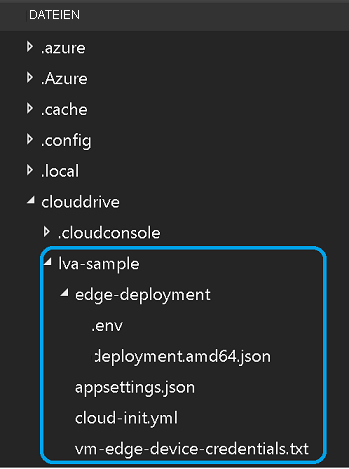

Für dieses Tutorial werden die folgenden Azure-Ressourcen benötigt:

* IoT Hub
* Speicherkonto
* Azure Media Services-Konto
* Virtueller Linux-Computer in Azure mit installierter [IoT Edge-Runtime](../../../../../iot-edge/how-to-install-iot-edge.md)

Für diese Schnellstartanleitung wird die Verwendung des [Setupskripts für Live Video Analytics-Ressourcen](https://github.com/Azure/live-video-analytics/tree/master/edge/setup) zum Bereitstellen der erforderlichen Ressourcen in Ihrem Azure-Abonnement empfohlen. Gehen Sie dazu folgendermaßen vor:

1. Öffnen Sie [Azure Cloud Shell](https://ms.portal.azure.com/#cloudshell/).
    > [!div class="mx-imgBorder"]
    > :::image type="content" source="../../../media/quickstarts/cloud-shell.png" alt-text="Cloud Shell":::
1. Wenn Sie Cloud Shell zum ersten Mal verwenden, werden Sie aufgefordert, ein Abonnement auszuwählen, um ein Speicherkonto und eine Microsoft Azure Files-Freigabe zu erstellen. Wählen Sie **Speicher erstellen** aus, um ein Speicherkonto für die Cloud Shell-Sitzungsinformationen zu erstellen. Dieses Speicherkonto ist von dem Konto getrennt, das vom Skript für die Verwendung mit Ihrem Azure Media Services-Konto erstellt wird.
1. Wählen Sie auf der linken Seite des Cloud Shell-Fensters im Dropdownmenü **Bash** als Option für die Umgebung aus.

    
1. Führen Sie den folgenden Befehl aus.

    ```
    bash -c "$(curl -sL https://aka.ms/lva-edge/setup-resources-for-samples)"
    ```
    
    Nach der erfolgreichen Ausführung des Skripts sollten alle erforderlichen Ressourcen Ihres Abonnements angezeigt werden. Vom Skript werden insgesamt zwölf Ressourcen eingerichtet:
    1. **Streamingendpunkt**: Dient als Hilfe beim Wiedergeben des aufgezeichneten AMS-Objekts.
    1. **Virtueller Computer**: Ein virtueller Computer, der als Ihr Edgegerät fungiert.
    1. **Datenträger**: Ein Speicherdatenträger, der für die Speicherung von Medien und Artefakten an den virtuellen Computer angefügt ist.
    1. **Netzwerksicherheitsgruppe**: Wird verwendet, um Netzwerkdatenverkehr von und zu Azure-Ressourcen in einem virtuellen Azure-Netzwerk zu filtern.
    1. **Netzwerkschnittstelle**: Ermöglicht einem virtuellen Azure-Computer die Kommunikation mit dem Internet, Azure und anderen Ressourcen.
    1. **Bastion-Verbindung**: Ermöglicht Ihnen das Herstellen einer Verbindung mit Ihrem virtuellen Computer über Ihren Browser und das Azure-Portal.
    1. **Öffentliche IP-Adresse**: Ermöglicht es Azure-Ressourcen, mit dem Internet und öffentlichen Azure-Diensten zu kommunizieren.
    1. **Virtuelles Netzwerk**: Ermöglicht es vielen Arten von Azure-Ressourcen (z. B. Ihrem virtuellen Computer), sicher untereinander sowie mit dem Internet und mit lokalen Netzwerken zu kommunizieren. Informieren Sie sich eingehender über [virtuelle Netzwerke](https://docs.microsoft.com/azure/virtual-network/virtual-networks-overview).
    1. **IoT Hub**: Dient als zentraler Nachrichtenhub für die bidirektionale Kommunikation zwischen Ihrer IoT-Anwendung, IoT Edge-Modulen und den verwalteten Geräten.
    1. **Media Services-Konto**: Dient als Hilfe beim Verwalten und Streamen von Medieninhalten in Azure.
    1. **Speicherkonto**: Sie müssen über ein primäres Speicherkonto verfügen. Darüber hinaus können Sie beliebig viele sekundäre Speicherkonten an Ihr Media Services-Konto anfügen. Weitere Informationen finden Sie unter [Azure Storage-Konten mit Azure Media Services-Konten](https://docs.microsoft.com/azure/media-services/latest/storage-account-concept).
    1. **Containerregistrierung**: Dient zum Speichern und Verwalten Ihrer privaten Docker-Containerimages und der zugehörigen Artefakte.
1. Wählen Sie nach Abschluss des Skripts die geschweiften Klammern aus, um die Ordnerstruktur verfügbar zu machen. Im Verzeichnis *~/clouddrive/lva-sample* werden einige Dateien angezeigt. Folgende Dateien sind für diese Schnellstartanleitung von Interesse:

     * ***~/clouddrive/lva-sample/edge-deployment/.env***: Diese Datei enthält Eigenschaften, die von Visual Studio Code zum Bereitstellen von Modulen auf einem Edgegerät verwendet werden.
     * ***~/clouddrive/lva-sample/appsetting.json***: Diese Datei wird von Visual Studio Code verwendet, um den Beispielcode auszuführen.
     
    Sie benötigen diese Dateien, wenn Sie im nächsten Abschnitt Ihre Entwicklungsumgebung in Visual Studio Code einrichten. Sie können sie bei Bedarf vorerst in eine lokale Datei kopieren.
    
    

> [!TIP]
> Falls für erstellte Azure-Ressourcen Probleme auftreten, helfen Ihnen die Informationen zum Beheben von häufigen Problemen im **[Leitfaden für die Problembehandlung](../../../troubleshoot-how-to.md#common-error-resolutions)** weiter.