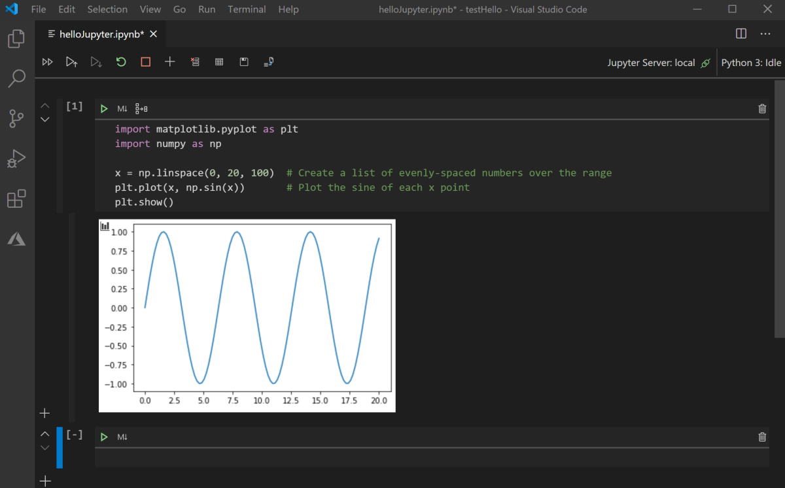

# Verwenden einer Jupyter Notebook-Instanz mit Microsoft-Angeboten

[!INCLUDE [notebooks-status](../../includes/notebooks-status.md)]

In dieser Schnellstartanleitung erfahren Sie, wie Sie eine Jupyter Notebook-Instanz zur Verwendung in verschiedenen Microsoft-Angeboten importieren. 

Wenn Sie über vorhandene Jupyter Notebook-Instanzen verfügen oder ein neues Projekt beginnen möchten, können Sie sie mit zahlreichen Microsoft-Angeboten verwenden. Einige der in den folgenden Abschnitten beschriebenen Optionen umfassen Folgendes: 
- [Visual Studio Code](#use-notebooks-in-visual-studio-code)
- [GitHub Codespaces](#use-notebooks-in-github-codespaces)
- [Azure Machine Learning](#use-notebooks-with-azure-machine-learning)
- [Azure Lab Services](#use-azure-lab-services)
- [GitHub](#use-github)

## Erstellen einer Umgebung für Notebooks

Wenn Sie eine Umgebung erstellen möchten, die der Umgebung der ausgemusterten Azure Notebooks-Vorschauversion entspricht, können Sie die auf GitHub bereitgestellte Skriptdatei verwenden.

1. Navigieren Sie zum [GitHub-Repository](https://github.com/microsoft/AzureNotebooks) von Azure Notebooks, oder [greifen Sie direkt auf den Umgebungsordner zu](https://aka.ms/aznbrequirementstxt).
1. Navigieren Sie an einer Eingabeaufforderung zu dem Verzeichnis, das Sie für Ihre Projekte verwenden möchten.
1. Laden Sie den Inhalt des Umgebungsordners herunter, und befolgen Sie die Anleitung in der Infodatei, um die Azure Notebooks-Paketabhängigkeiten zu installieren.

## Verwenden von Notebooks in Visual Studio Code

[VS Code](https://code.visualstudio.com/) ist ein kostenloser Code-Editor, den Sie lokal oder über eine Remote-Computeumgebung nutzen können. In Kombination mit der Python-Erweiterung ergibt sich eine vollständige Umgebung für die Python-Entwicklung, einschließlich einer umfassenden nativen Benutzeroberfläche für die Verwendung von Jupyter Notebook-Instanzen. 

Wenn Sie über vorhandene Projektdateien verfügen oder eine neue Notebook-Instanz erstellen möchten, können Sie VS Code verwenden. Eine Anleitung zur Nutzung von VS Code mit Jupyter Notebook-Instanzen finden Sie in den Tutorials unter [Verwenden von Jupyter Notebooks in Visual Studio Code](https://code.visualstudio.com/docs/python/jupyter-support) und [Data Science in Visual Studio Code](https://code.visualstudio.com/docs/python/data-science-tutorial).

Sie können auch das [Azure Notebooks-Umgebungsskript](#create-an-environment-for-notebooks) mit Visual Studio Code verwenden, um eine Umgebung zu erstellen, die Azure Notebooks (Vorschauversion) entspricht.

## Verwenden von Notebooks in GitHub Codespaces

GitHub Codespaces verfügt über in der Cloud gehostete Umgebungen, in denen Sie Ihre Notebooks mit Visual Studio Code oder Ihrem Webbrowser bearbeiten können. Sie erhalten die gleiche leistungsfähige Jupyter-Umgebung wie in VS Code, ohne dass Sie Installationen auf Ihrem Gerät durchführen müssen. Wenn Sie keine lokale Umgebung einrichten möchten und eine cloudbasierte Lösung bevorzugen, ist die Erstellung eines Codespace eine gute Option. Erste Schritte:
1. (Optional) Sammeln Sie alle Projektdateien, die Sie mit GitHub-Codespaces verwenden möchten.
1. [Erstellen Sie ein GitHub-Repository](https://help.github.com/github/getting-started-with-github/create-a-repo) zum Speichern Ihrer Notebooks.   
1. [Fügen Sie Ihre Dateien dem Repository hinzu](https://help.github.com/github/managing-files-in-a-repository/adding-a-file-to-a-repository).
1. [Beantragen Sie Zugriff auf die Vorschauversion von GitHub Codespaces.](https://github.com/features/codespaces)

## Verwenden von Notebooks mit Azure Machine Learning

Azure Machine Learning verfügt über eine End-to-End-Plattform für maschinelles Lernen, die es Benutzern ermöglicht, Modelle in Azure schneller zu erstellen und bereitzustellen. Azure ML ermöglicht die Ausführung von Jupyter Notebooks auf einer VM oder in einer Computingumgebung mit freigegebenem Cluster. Falls Sie für Ihre ML-Workload eine cloudbasierte Lösung mit Experimentnachverfolgung, Datasetverwaltung und weiteren Features benötigen, empfehlen wir Ihnen Azure Machine Learning. Erste Schritte mit Azure ML:

1. (Optional) Sammeln Sie alle Projektdateien, die Sie mit Azure ML verwenden möchten.
1. [Erstellen Sie im Azure-Portal einen Arbeitsbereich](../machine-learning/how-to-manage-workspace.md).

   
 
1. Öffnen Sie [Azure Studio (Vorschauversion)](https://ml.azure.com/).
1. Wählen Sie in der linken Navigationsleiste die Option **Notebooks** aus.
1. Klicken Sie auf die Schaltfläche **Dateien hochladen**, und laden Sie die Projektdateien hoch.

Weitere Informationen zu Azure ML und zum Ausführen von Jupyter Notebooks finden Sie in der [Dokumentation](../machine-learning/how-to-run-jupyter-notebooks.md). Sie können auch das Modul [Einführung in Azure Machine Learning](/learn/modules/intro-to-azure-machine-learning-service/) bei Microsoft Learn verwenden.

## Verwenden von Azure Lab Services

Mit [Azure Lab Services](https://azure.microsoft.com/services/lab-services/) können Lehrkräfte den bedarfsgesteuerten Zugriff auf vorkonfigurierte VMs für eine ganze Klasse leicht einrichten und bereitstellen. Wenn Sie nach einer Möglichkeit suchen, Jupyter Notebooks und Cloud Computing in einer maßgeschneiderten Klassenumgebung zu nutzen, ist Lab Services eine gute Option.

Wenn Sie über vorhandene Projektdateien verfügen oder eine neue Notebook-Instanz erstellen möchten, können Sie Azure Lab Services verwenden. Eine Anleitung zum Einrichten eines Labs finden Sie unter [Einrichten eines Labs zum Vermitteln von Data Science mit Python und Jupyter Notebooks](../lab-services/class-type-jupyter-notebook.md).

## Verwenden von GitHub

Mit GitHub können Sie kostenlos und mit Quellcodeverwaltung Notebooks (und andere Dateien) speichern, für andere Benutzer freigeben und zusammen bearbeiten. Wenn Sie nach einer Möglichkeit suchen, Ihre Projekte gemeinsam zu nutzen und mit anderen Benutzern zusammenzuarbeiten, ist GitHub eine gute Option, die mit [GitHub Codespaces](#use-notebooks-in-github-codespaces) kombiniert werden kann, um eine leistungsfähige Entwicklungsumgebung zu schaffen. Erste Schritte mit GitHub

1. (Optional) Sammeln Sie alle Projektdateien, die Sie mit GitHub verwenden möchten.
1. [Erstellen Sie ein GitHub-Repository](https://help.github.com/github/getting-started-with-github/create-a-repo) zum Speichern Ihrer Notebooks. 
1. [Fügen Sie Ihre Dateien dem Repository hinzu](https://help.github.com/github/managing-files-in-a-repository/adding-a-file-to-a-repository).

## Nächste Schritte

- [Python in Visual Studio Code](https://code.visualstudio.com/docs/python/python-tutorial)
- [Azure Machine Learning und Jupyter Notebooks](../machine-learning/how-to-run-jupyter-notebooks.md)
- [Weitere Informationen zu GitHub Codespaces](https://github.com/features/codespaces)
- [Azure Lab Services](https://azure.microsoft.com/services/lab-services/)
- [GitHub](https://help.github.com/github/getting-started-with-github/)
