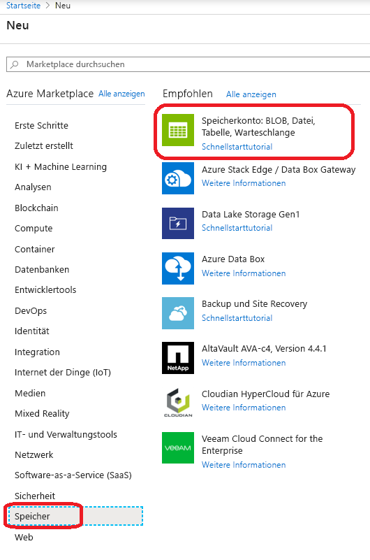
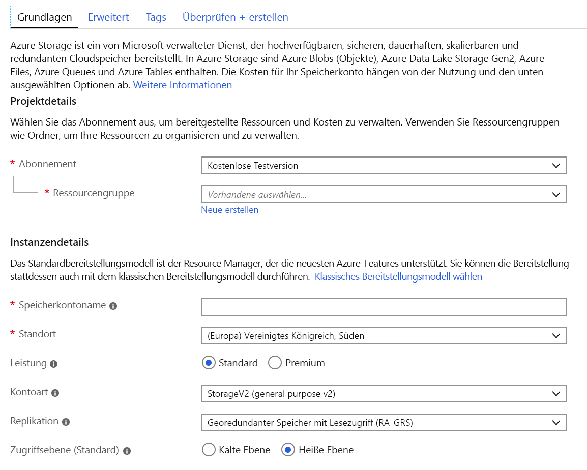
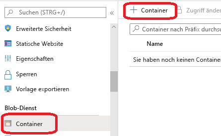
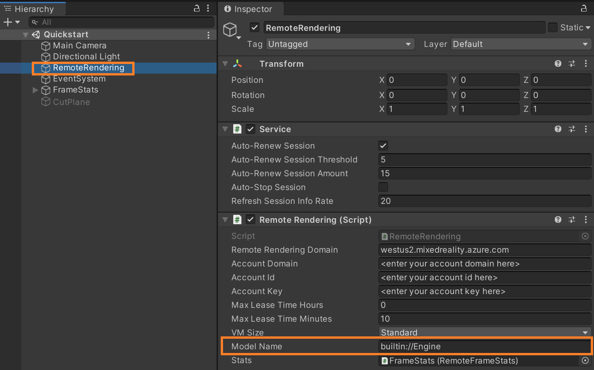
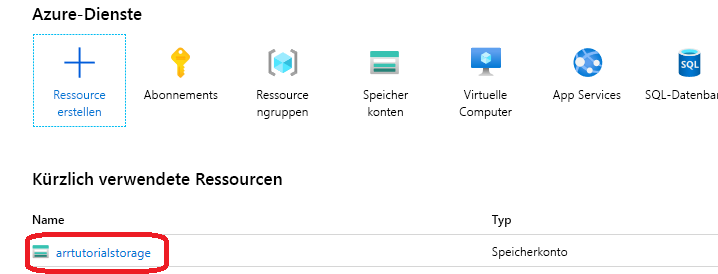

# <a name="quickstart-convert-a-model-for-rendering"></a>Schnellstart: Konvertieren eines Modells für das Rendering

In [Schnellstart: Rendern eines Modells mit Unity](render-model.md) wurde beschrieben, wie Sie das Unity-Beispielprojekt zum Rendern eines integrierten Modells verwenden. In dieser Anleitung wird veranschaulicht, wie Sie Ihre eigenen Modelle konvertieren.

Sie lernen Folgendes:

> [!div class="checklist"]
>
> * Einrichten eines Azure Blob Storage-Kontos für die Ein- und Ausgabe
> * Hochladen und Konvertieren eines 3D-Modells zur Verwendung mit Azure Remote Rendering
> * Einbinden des konvertierten 3D-Modells in eine Anwendung für das Rendering

## <a name="prerequisites"></a>Voraussetzungen

* [Quickstart: Rendern eines Modells mit Unity](render-model.md) durch.
* Für die Konvertierung mithilfe des PowerShell-Skripts: Installieren Sie Azure PowerShell ([Dokumentation](/powershell/azure/)).
  * Öffnen Sie eine PowerShell-Instanz mit Administratorrechten.
  * Führen Sie `Install-Module -Name Az -AllowClobber` aus.

## <a name="overview"></a>Übersicht

Der Renderer auf dem Server kann nicht direkt mit Quellmodellformaten wie FBX oder GLTF arbeiten. Stattdessen muss das Modell in einem proprietären Binärformat vorliegen.
Der Konvertierungsdienst nutzt Modelle aus dem Azure-Blobspeicher und schreibt konvertierte Modelle zurück in einen angegebenen Azure-Blobspeichercontainer.

Erforderlich:

* Ein Azure-Abonnement
* Konto „StorageV2“ unter Ihrem Abonnement
* Ein Blobspeichercontainer für Ihr Eingabemodell
* Ein Blobspeichercontainer für Ihre Ausgabedaten
* Unter [Beispielmodelle](../samples/sample-model.md) finden Sie ein Modell, das konvertiert werden kann.
  * Sehen Sie sich die Liste mit den [unterstützten Quellformaten](../how-tos/conversion/model-conversion.md#supported-source-formats) an.
  * Bereiten Sie zur Nutzung des Beispielskripts für die Konvertierung einen Eingabeordner vor, in dem das Modell und alle externen Abhängigkeiten (z. B. externe Texturen oder Geometrie) enthalten sind.

## <a name="azure-setup"></a>Azure-Einrichtung

Gehen Sie wie folgt vor, falls Sie noch kein Konto haben: Greifen Sie auf [https://azure.microsoft.com/get-started/](https://azure.microsoft.com/get-started/) zu, klicken Sie auf die Option „Kostenloses Konto“, und befolgen Sie die Anleitung.

Navigieren Sie nach dem Erstellen des Azure-Kontos zu [https://ms.portal.azure.com/#home](https://ms.portal.azure.com/#home).

### <a name="storage-account-creation"></a>Speicherkontoerstellung

Zum Erstellen eines Blobspeichers benötigen Sie zunächst ein Speicherkonto.
Klicken Sie auf die Schaltfläche „Ressource erstellen“, um ein Konto zu erstellen:


Wählen Sie auf der linken Seite die Option **Speicher** und in der nächsten Spalte dann **Speicherkonto: Blob, Datei, Tabelle, Warteschlange** aus:



Wenn Sie auf diese Schaltfläche klicken, wird der folgende Bildschirm angezeigt, auf dem Sie Eigenschaften des Speichers angeben:



Füllen Sie das Formular wie folgt aus:

* Erstellen Sie über den Link unter dem Dropdownfeld eine neue Ressourcengruppe, und geben Sie ihr den Namen **ARR_Tutorial** .
* Geben Sie unter **Speicherkontoname** einen eindeutigen Namen ein. Dieser **Name muss global eindeutig sein** . Andernfalls wird eine Meldung mit dem Hinweis angezeigt, dass der Name bereits verwendet wird. In dieser Schnellstartanleitung nutzen wir den Namen **arrtutorialstorage** . Sie müssen den Namen für diese Schnellstartanleitung also jeweils durch Ihren eigenen Speicherkontonamen ersetzen.
* Wählen Sie einen **Standort** in Ihrer Nähe aus. Verwenden Sie idealerweise denselben Standort wie beim Einrichten des Renderings in der anderen Schnellstartanleitung.
* **Leistung** ist auf „Standard“ festgelegt.
* **Kontoart** ist auf „StorageV2 (universell v2)“ festgelegt.
* **Replikation** ist auf „Georedundanter Speicher mit Lesezugriff (RA-GRS)“ festgelegt.
* **Zugriffsebene** ist auf „Heiß“ festgelegt.

Die Eigenschaften auf den anderen Registerkarten müssen nicht geändert werden. Sie können fortfahren, indem Sie die Option **Bewerten + erstellen** auswählen und dann die Schritte zum Abschließen der Einrichtung ausführen.

Auf der Website wird der Status Ihrer Bereitstellung angezeigt, und zuletzt erfolgt die Meldung „Ihre Bereitstellung wurde abgeschlossen“. Klicken Sie auf die Schaltfläche **Zu Ressource wechseln** , um die nächsten Schritte auszuführen:


### <a name="blob-storage-creation"></a>Erstellung des Blobspeichers

Als Nächstes benötigen wir zwei Blobcontainer: einen für die Eingabe und einen für die Ausgabe.

Über die obige Schaltfläche **Zu Ressource wechseln** gelangen Sie auf eine Seite, die links einen Bereich mit einem Listenmenü enthält. Klicken Sie in dieser Liste unter der Kategorie **Blob-Dienst** auf die Schaltfläche **Container** :



Wählen Sie die Schaltfläche **+ Container** aus, um den Blobspeichercontainer **input** zu erstellen.
Verwenden Sie beim Erstellen die folgenden Einstellungen:
  
* Name: arrinput
* Öffentliche Zugriffsebene: Privat

Klicken Sie nach der Erstellung des Containers erneut auf **+ Container** , und geben Sie die Einstellungen entsprechend für den Container **output** ein:

* Name: arroutput
* Öffentliche Zugriffsebene: Privat

Sie verfügen nun über zwei Blobspeichercontainer:


## <a name="run-the-conversion"></a>Durchführen der Konvertierung

Es gibt drei verschiedene Möglichkeiten, eine Modellkonvertierung auszulösen:

### <a name="1-conversion-via-the-arrt-tool"></a>1. Konvertierung über das ARRT-Tool

Es gibt ein [UI-basiertes Tool namens ARRT](./../samples/azure-remote-rendering-asset-tool.md), um Konvertierungen zu starten und mit dem gerenderten Ergebnis zu interagieren.


### <a name="2-conversion-via-a-powershell-script"></a>2. Konvertierung über ein PowerShell-Skript

Wir haben für Sie ein Hilfsprogrammskript bereitgestellt, um Ihnen das Aufrufen des Diensts für die Ressourcenkonvertierung zu erleichtern. Es befindet sich im Ordner *Scripts* und hat den Namen **Conversion.ps1** .

Dieses Skript bewirkt Folgendes:

1. Hochladen aller Dateien aus einem bestimmten Verzeichnis des lokalen Datenträgers in den Eingabespeichercontainer
1. Aufrufen der [REST-API für die Ressourcenkonvertierung](../how-tos/conversion/conversion-rest-api.md), um die Daten aus dem Eingabespeichercontainer abzurufen und eine Konvertierung mit Rückgabe einer Konvertierungs-ID zu starten
1. Abfragen der Konvertierungsstatus-API mit der abgerufenen Konvertierungs-ID, bis der Konvertierungsprozess mit „Erfolg“ oder „Fehler“ beendet wird
1. Abrufen eines Links zur konvertierten Ressource im Ausgabespeicher

Für dieses Skript wird die Konfiguration aus der Datei *Scripts\arrconfig.json* ausgelesen. Öffnen Sie die JSON-Datei in einem Text-Editor.

```json
{
    "accountSettings": {
        "arrAccountId": "8*******-****-****-****-*********d7e",
        "arrAccountKey": "R***************************************l04=",
        "region": "<your-region>"
    },
    "renderingSessionSettings": {
        "vmSize": "standard",
        "maxLeaseTime": "1:00:00"
    },
    "assetConversionSettings": {
        "localAssetDirectoryPath": "D:\\tmp\\robot",
        "resourceGroup": "ARR_Tutorial",
        "storageAccountName": "arrexamplestorage",
        "blobInputContainerName": "arrinput",
        "inputFolderPath": "robotConversion",
        "inputAssetPath": "robot.fbx",
        "blobOutputContainerName": "arroutput",
        "outputFolderPath":"converted/robot",
        "outputAssetFileName": "robot.arrAsset"
    }
}
```

Die Konfigurationsangaben in der Gruppe **accountSettings** (Konto-ID und -schlüssel) sollten analog zu den Anmeldeinformationen eingegeben werden, die unter [Schnellstart: Rendern eines Modells mit Unity](render-model.md) verwendet wurden.

Ändern Sie in der Gruppe **assetConversionSettings** die Einstellungen für **resourceGroup** , **blobInputContainerName** und **blobOutputContainerName** wie oben angegeben.
Beachten Sie, dass der Wert **arrtutorialstorage** durch den eindeutigen Namen ersetzt werden muss, den Sie beim Erstellen des Speicherkontos gewählt haben.

Ändern Sie **localAssetDirectoryPath** so, dass auf das Verzeichnis auf Ihrem Datenträger verwiesen wird, in dem das zu konvertierende Modell enthalten ist. Achten Sie darauf, dass Sie für im Pfad enthaltene umgekehrte Schrägstriche („\\“) doppelte umgekehrte Schrägstriche („\\\\“) als Escapezeichen verwenden.

Alle Daten unter dem Pfad **localAssetDirectoryPath** werden in den Blobcontainer **blobInputContainerName** hochgeladen, der sich unter dem Unterpfad in **inputFolderPath** befindet. In der obigen Beispielkonfiguration wird also der Inhalt des Verzeichnisses „D:\\tmp\\robot“ in den Blobcontainer „arrinput“ des Speicherkontos „arrtutorialstorage“ unter dem Pfad „robotConversion“ hochgeladen. Bereits vorhandene Dateien werden überschrieben.

Ändern Sie **inputAssetPath** in den Pfad des zu konvertierenden Modells, der relativ zu „localAssetDirectoryPath“ ist. Verwenden Sie „/“ anstelle von „\\“ als Pfadtrennzeichen. Für die Datei „robot.fbx“, die sich direkt unter „D:\\tmp\\robot“ befindet, verwenden Sie also „robot.fbx“.

Nachdem das Modell konvertiert wurde, wird es in den Speichercontainer zurückgeschrieben, der unter **blobOutputContainerName** angegeben ist. Sie können einen Unterpfad angeben, indem Sie optional einen Wert für **outputFolderPath** einfügen. Im obigen Beispiel wird das sich ergebende Element „robot.arrAsset“ in den Ausgabeblobcontainer unter „converted/robot“ kopiert.

Mit der Konfigurationseinstellung **outputAssetFileName** wird der Name der konvertierten Ressource ermittelt. Der Parameter ist optional, und wenn er nicht vorhanden ist, wird der Ausgabedateiname vom Eingabedateinamen abgeleitet.

Öffnen Sie eine PowerShell-Instanz, und vergewissern Sie sich, dass Sie *Azure PowerShell* gemäß den [Voraussetzungen](#prerequisites) installiert haben. Melden Sie sich dann mit dem folgenden Befehl bei Ihrem Abonnement an, und befolgen Sie die Anweisungen auf dem Bildschirm:

```PowerShell
Connect-AzAccount
```

> [!NOTE]
> Falls Ihre Organisation über mehrere Abonnements verfügt, müssen Sie ggf. die Argumente für die Abonnement-ID und den Mandanten angeben. Weitere Informationen finden Sie in der [Dokumentation zu „Connect-AzAccount“](/powershell/module/az.accounts/connect-azaccount).

Wechseln Sie zum Verzeichnis `azure-remote-rendering\Scripts`, und führen Sie das Konvertierungsskript aus:

```PowerShell
.\Conversion.ps1 -UseContainerSas
```

Die Ausgabe sollte folgendermaßen aussehen: 

### <a name="3-conversion-via-api-calls"></a>3. Konvertierung über API-Aufrufe

Die C#- und die C++-API stellen beide einen Einstiegspunkt für die Interaktion mit dem Dienst bereit:
* [C# AzureFrontend.StartAssetConversionAsync()](/dotnet/api/microsoft.azure.remoterendering.azurefrontend.startassetconversionasync)
* [C++ AzureFrontend::StartAssetConversionAsync()](/cpp/api/remote-rendering/azurefrontend#startassetconversionasync)


## <a name="insert-new-model-into-quickstart-sample-app"></a>Einfügen eines neuen Modells in die Schnellstart-Beispiel-App

Das Konvertierungsskript generiert einen *SAS* -URI (Shared Access Signature) für das konvertierte Modell. Sie können diesen URI jetzt als **Modellnamen** in die Beispiel-App der Schnellstartanleitung kopieren (siehe [Schnellstart: Rendern eines Modells mit Unity](render-model.md)).



 Für das Beispiel sollte nun das benutzerdefinierte Modell geladen und gerendert werden.

## <a name="optional-re-creating-a-sas-uri"></a>Optional: Erneutes Erstellen eines SAS-URI

Der vom Konvertierungsskript erstellte SAS-URI ist nur 24 Stunden lang gültig. Nach Ablauf des Gültigkeitszeitraums müssen Sie Ihr Modell aber nicht noch einmal konvertieren. Stattdessen können Sie im Portal eine neue SAS erstellen, indem Sie wie hier beschrieben vorgehen:

1. [Navigieren Sie zum Azure-Portal](https://www.portal.azure.com).
1. Klicken Sie auf Ihr **Speicherkonto** : 
1. Klicken Sie auf dem folgenden Bildschirm links auf **Storage-Explorer** , und greifen Sie im Blobspeichercontainer *arroutput* auf Ihr Ausgabemodell ( *.arrAsset* -Datei) zu. Klicken Sie mit der rechten Maustaste auf die Datei, und wählen Sie im Kontextmenü die Option **Shared Access Signature abrufen** aus: 
1. Ein neuer Bildschirm wird geöffnet, in dem Sie ein Ablaufdatum auswählen können. Wählen Sie **Erstellen** aus, und kopieren Sie den URI, der im nächsten Dialogfeld angezeigt wird. Dieser neue URI ersetzt den temporären URI, der vom Skript erstellt wurde.

## <a name="next-steps"></a>Nächste Schritte

Nachdem Sie sich nun mit den Grundlagen vertraut gemacht haben, können Sie mit den Tutorials fortfahren, um ausführlichere Informationen zu erhalten.

Details zur Modellkonvertierung finden Sie im Artikel zur [REST-API für die Modellkonvertierung](../how-tos/conversion/conversion-rest-api.md).

> [!div class="nextstepaction"]
> [Tutorial: Anzeigen eines remote gerenderten Modells](../tutorials/unity/view-remote-models/view-remote-models.md)