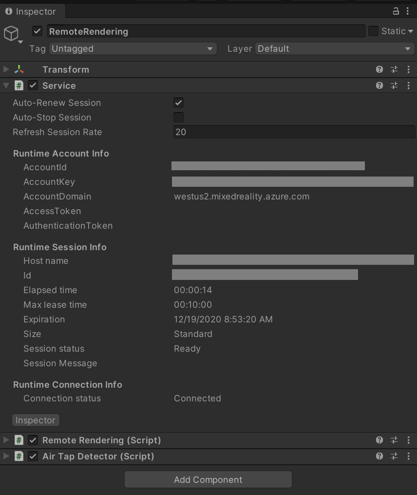

# <a name="quickstart-render-a-model-with-unity"></a>Schnellstart: Rendern eines Modells mit Unity

In dieser Schnellstartanleitung wird die Ausführung eines Unity-Beispiels beschrieben, bei dem ein integriertes Modell mit dem Dienst „Azure Remote Rendering“ (ARR) per Remotezugriff gerendert wird.

Die ARR-API selbst und die Einrichtung eines neuen Unity-Projekts werden hier nicht ausführlicher beschrieben. Eine Beschreibung dieser Themen finden Sie unter [Tutorial: Anzeigen eines remote gerenderten Modells](../tutorials/unity/view-remote-models/view-remote-models.md).

In dieser Schnellstartanleitung wird Folgendes vermittelt:
> [!div class="checklist"]
>
>* Einrichten Ihrer lokalen Entwicklungsumgebung
>* Abrufen und Erstellen der ARR-Beispiel-App „Quickstart“ für Unity
>* Rendern eines Modells in der ARR-Beispiel-App „Quickstart“

## <a name="prerequisites"></a>Voraussetzungen

Sie müssen zunächst ein [Konto erstellen](../how-tos/create-an-account.md), um Zugriff auf Azure Remote Rendering zu erhalten.

Die folgende Software muss installiert werden:

* Windows SDK 10.0.18362.0 [(Download)](https://developer.microsoft.com/windows/downloads/windows-10-sdk)
* Aktuelle Version von Visual Studio 2019 [(herunterladen)](https://visualstudio.microsoft.com/vs/older-downloads/)
* [Visual Studio-Tools für Mixed Reality](/windows/mixed-reality/install-the-tools). Insbesondere sind die folgenden *Workloadinstallationen* obligatorisch:
  * **Desktopentwicklung mit C++**
  * **Entwicklung für die universelle Windows-Plattform (UWP)**
* Git [(herunterladen)](https://git-scm.com/downloads)
* Unity (Informationen zu den unterstützten Versionen finden Sie unter [Systemanforderungen](../overview/system-requirements.md#unity).)

## <a name="clone-the-sample-app"></a>Klonen der Beispiel-App

Öffnen Sie eine Eingabeaufforderung (`cmd` im Windows-Startmenü), und wechseln Sie in ein Verzeichnis, in dem Sie das ARR-Beispielprojekt speichern möchten.

Führen Sie die folgenden Befehle aus:

```cmd
mkdir ARR
cd ARR
git clone https://github.com/Azure/azure-remote-rendering
powershell azure-remote-rendering\Scripts\DownloadUnityPackages.ps1
```

Mit dem letzten Befehl wird ein Unterverzeichnis im ARR-Verzeichnis erstellt, das die unterschiedlichen Beispielprojekte für Azure Remote Rendering enthält.

Die Beispiel-App „Quickstart“ für Unity befindet sich im Unterverzeichnis *Unity/Quickstart*.

## <a name="rendering-a-model-with-the-unity-sample-project"></a>Rendern eines Modells mit dem Unity-Beispielprojekt

Öffnen Sie Unity Hub, und fügen Sie das Beispielprojekt hinzu (Ordner *ARR\azure-remote-rendering\Unity\Quickstart*).
Öffnen Sie das Projekt. Lassen Sie es in Unity bei Bedarf zu, dass für das Projekt das Upgrade auf Ihre installierte Version durchgeführt wird.

Das von uns gerenderte Standardmodell ist ein [integriertes Beispielmodell](../samples/sample-model.md). Die Konvertierung eines benutzerdefinierten Modells basierend auf dem ARR-Konvertierungsdienst wird in der [nächsten Schnellstartanleitung](convert-model.md) beschrieben.

### <a name="enter-your-account-info"></a>Eingeben Ihrer Kontoinformationen

1. Navigieren Sie im Unity-Ressourcenbrowser zum Ordner *Scenes* (Szenen), und öffnen Sie die Szene **Quickstart**.
1. Wählen Sie unter *Hierarchy* (Hierarchie) das Spielobjekt **RemoteRendering** aus.
1. Geben Sie unter *Inspector* Ihre [Kontoanmeldeinformationen](../how-tos/create-an-account.md) ein. Wenn Sie noch kein Konto besitzen, [erstellen Sie eines](../how-tos/create-an-account.md).


> [!IMPORTANT]
> Legen Sie **RemoteRenderingDomain** auf `<region>.mixedreality.azure.com` fest, wobei `<region>` für [eine der verfügbaren Regionen in Ihrer Nähe](../reference/regions.md) steht.\
> Legen Sie **AccountDomain** gemäß der Anzeige im Azure-Portal auf die [Kontodomäne](../how-tos/create-an-account.md#retrieve-the-account-information) fest.

Wir möchten dieses Projekt später für ein HoloLens-Gerät bereitstellen und dafür eine Verbindung mit dem Remote Rendering-Dienst herstellen. Da es keine einfache Möglichkeit zum Eingeben der Anmeldeinformationen auf dem Gerät gibt, werden die **Anmeldeinformationen in der Unity-Szene gespeichert**.

> [!WARNING]
> Achten Sie darauf, dass Sie das Projekt mit Ihren gespeicherten Anmeldeinformationen nicht in ein Repository einchecken, wo diese vertraulichen Informationen dann öffentlich zugänglich sind!

### <a name="create-a-session-and-view-the-default-model"></a>Erstellen einer Sitzung und Anzeigen des Standardmodells

Wählen Sie in Unity die Schaltfläche für die **Wiedergabe** aus, um die Sitzung zu starten. Unten im Viewport im Bereich *Game* sollte eine Überlagerung mit Statustext angezeigt werden. Die Sitzung durchläuft einige Statusübergänge. Im Status **Starting** (Wird gestartet) wird der Server gestartet. Dieser Vorgang dauert einige Minuten. Wenn der Vorgang erfolgreich ist, erfolgt der Wechsel in den Status **Ready** (Bereit). Als Nächstes folgt für die Sitzung der Status **Connecting** (Wird verbunden), in dem versucht wird, die Renderinglaufzeit auf dem Server zu erreichen. Bei erfolgreicher Ausführung wird für das Beispiel in den Status **Connected** (Verbunden) gewechselt. An diesem Punkt wird mit dem Herunterladen des Modells für das Rendern begonnen. Aufgrund der Größe des Modells kann der Download einige Minuten länger dauern. Nach Abschluss des Vorgangs wird das per Remotezugriff gerenderte Modell angezeigt.


Glückwunsch! Nun wird ein per Remotezugriff gerendertes Modell angezeigt.

## <a name="inspecting-the-scene"></a>Überprüfen der Szene

Nachdem die Verbindung für das Rendern per Remotezugriff hergestellt wurde, werden im Inspector-Bereich weitere Statusinformationen angezeigt: 

Sie können den Szenengraphen erkunden, indem Sie den neuen Knoten auswählen und im Inspector auf **Show children** (Untergeordnete Elemente anzeigen) klicken.


Die Szene enthält ein Objekt vom Typ [Schnittebene](../overview/features/cut-planes.md) (Cut Plane). Versuchen Sie, sie in den Eigenschaften zu aktivieren und zu verschieben:


Klicken Sie zum Synchronisieren von Transformationen entweder auf **Sync now** (Jetzt synchronisieren), oder aktivieren Sie die Option **Sync every frame** (Jeden Frame synchronisieren). Für Komponenteneigenschaften reicht das einfache Ändern aus.

## <a name="next-steps"></a>Nächste Schritte

In der nächsten Schnellstartanleitung stellen wir das Beispiel für ein HoloLens-Gerät bereit, um das per Remotezugriff gerenderte Modell in der ursprünglichen Größe anzuzeigen.

> [!div class="nextstepaction"]
> [Schnellstart: Bereitstellen des Unity-Beispiels für HoloLens](deploy-to-hololens.md)

Alternativ kann das Beispiel auch auf einem Desktop-PC bereitgestellt werden.

> [!div class="nextstepaction"]
> [Schnellstart: Bereitstellen des Unity-Beispiels für den Desktop](deploy-to-desktop.md)