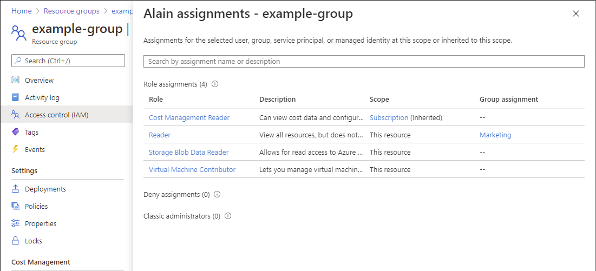

# Schnellstart: Überprüfen des Zugriffs auf Azure-Ressourcen für einen Benutzer

Manchmal müssen Sie überprüfen, welchen Zugriff ein Benutzer auf einen Satz von Azure-Ressourcen besitzt. Sie überprüfen seinen Zugriff, indem Sie seine Zuweisungen auflisten. Eine schnelle Möglichkeit, den Zugriff für einen einzelnen Benutzer zu überprüfen, ist die Verwendung des Features **Zugriff überprüfen** auf der Seite **Zugriffssteuerung (IAM)** .

## Schritt 1: Öffnen von Azure-Ressourcen

Um den Zugriff für einen Benutzer zu überprüfen, müssen Sie zunächst die Azure-Ressourcen öffnen, für die Sie den Zugriff überprüfen möchten. Azure-Ressourcen werden in Ebenen organisiert, die in der Regel als *Bereich* bezeichnet werden. In Azure können Sie einen Bereich auf vier Ebenen von weit bis eng angeben: Verwaltungsgruppe, Abonnement, Ressourcengruppe und Ressource.

Führen Sie die folgenden Schritte aus, um den Satz der Azure-Ressourcen zu öffnen, für die Sie den Zugriff überprüfen möchten.

1. Öffnen Sie das [Azure-Portal](https://portal.azure.com).

1. Öffnen Sie den Satz von Azure-Ressourcen, z. B. **Verwaltungsgruppen**, **Abonnements**, **Ressourcengruppen** oder eine bestimmte Ressource.

1. Klicken Sie auf die gewünschte Ressource in diesem Bereich.

    Nachfolgend sehen Sie ein Beispiel für eine Ressourcengruppe.

    

## Schritt 2: Überprüfen des Zugriffs für einen Benutzer

Führen Sie die folgenden Schritte aus, um den Zugriff für einen einzelnen Benutzer, eine Gruppe, einen Dienstprinzipal oder eine verwaltete Identität auf die zuvor ausgewählten Azure-Ressourcen zu überprüfen.

1. Klicken Sie auf **Zugriffssteuerung (IAM)**.

    Die folgende Abbildung zeigt ein Beispiel der Seite „Zugriffssteuerung (IAM)“ für eine Ressourcengruppe.

    

1. Wählen Sie auf der Registerkarte **Zugriff überprüfen** in der Liste **Suchen** Benutzer, Gruppen, Dienstprinzipale oder verwaltete Identitäten aus, für die Sie den Zugriff überprüfen möchten.

1. Geben Sie in das Suchfeld eine Zeichenfolge ein, nach der das Verzeichnis durchsucht werden soll. Sie können nach Anzeigenamen, E-Mail-Adressen oder Objektbezeichnern suchen.

    

1. Klicken Sie auf den Sicherheitsprinzipal, um den Bereich **Zuweisungen** zu öffnen.

    Hier können Sie den in diesem Bereich zugewiesenen und geerbten Zugriff für den ausgewählten Sicherheitsprinzipal sehen. Zuweisungen in untergeordneten Bereichen sind nicht aufgeführt. Folgende Zuweisungen werden angezeigt:

    - Mit Azure RBAC hinzugefügte Rollenzuweisungen.
    - Mithilfe von Azure Blueprints oder verwalteten Azure-Apps hinzugefügte Zuweisungen werden abgelehnt.
    - Klassische Dienstadministrator- oder Co-Administratorzuweisungen für klassische Bereitstellungen. 

    

## Schritt 3: Überprüfen des Zugriffs

Führen Sie die folgenden Schritte aus, um den Zugriff auf die zuvor ausgewählten Azure-Ressourcen zu überprüfen.

1. Klicken Sie auf **Zugriffssteuerung (IAM)**.

1. Klicken Sie auf der Registerkarte **Zugriff überprüfen** auf die Schaltfläche **Eigenen Zugriff anzeigen**.

    Ein Zuweisungsbereich wird angezeigt, der Ihren Zugriff in diesem Bereich auflistet sowie den an diesen Bereich vererbten Zugriff. Zuweisungen in untergeordneten Bereichen werden nicht aufgeführt.

    

## Nächste Schritte

> [!div class="nextstepaction"]
> [Auflisten von Azure-Rollenzuweisungen über das Azure-Portal](role-assignments-list-portal.md)
