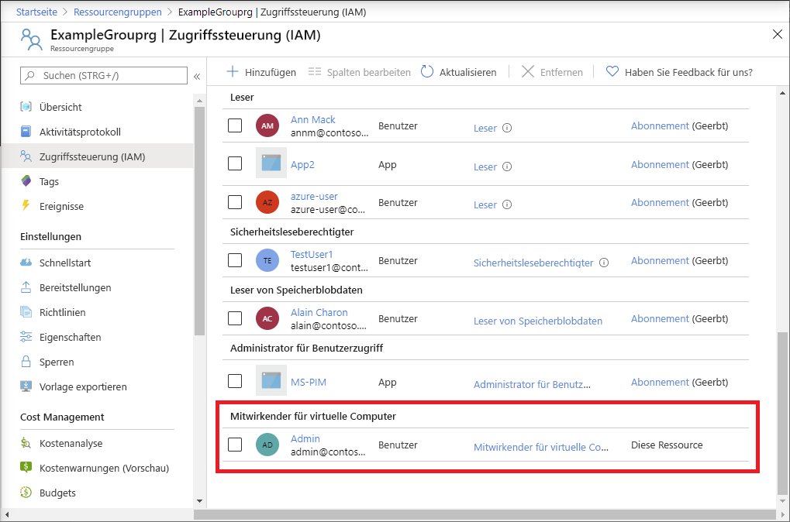

# <a name="quickstart-assign-an-azure-role-using-an-arm-template"></a>Schnellstart: Zuweisen einer Azure-Rolle mithilfe einer ARM-Vorlage

Der Zugriff auf Azure-Ressourcen wird mithilfe der [rollenbasierten Zugriffssteuerung in Azure (Azure RBAC)](overview.md) verwaltet. In diesem Schnellstart erstellen Sie eine Ressourcengruppe und gewähren einem Benutzer Zugriff, um virtuelle Computer in dieser Ressourcengruppe zu erstellen und zu verwalten. In dieser Schnellstartanleitung wird eine Azure Resource Manager-Vorlage (ARM-Vorlage) zum Gewähren des Zugriffs verwendet.

[!INCLUDE [About Azure Resource Manager](../../includes/resource-manager-quickstart-introduction.md)]

Wenn Ihre Umgebung die Voraussetzungen erfüllt und Sie mit der Verwendung von ARM-Vorlagen vertraut sind, klicken Sie auf die Schaltfläche **In Azure bereitstellen**. Die Vorlage wird im Azure-Portal geöffnet.

[](https://portal.azure.com/#create/Microsoft.Template/uri/https%3A%2F%2Fraw.githubusercontent.com%2FAzure%2Fazure-quickstart-templates%2Fmaster%2Fquickstarts%2Fmicrosoft.authorization%2Frbac-builtinrole-resourcegroup%2Fazuredeploy.json)

## <a name="prerequisites"></a>Voraussetzungen

Sie benötigen Folgendes, um Azure-Rollen zuzuweisen und Rollenzuweisungen zu entfernen:

- Wenn Sie kein Azure-Abonnement besitzen, können Sie ein [kostenloses Konto](https://azure.microsoft.com/free/?WT.mc_id=A261C142F) erstellen, bevor Sie beginnen.
- `Microsoft.Authorization/roleAssignments/write`- und `Microsoft.Authorization/roleAssignments/delete`-Berechtigungen, wie z.B. [Benutzerzugriffsadministrator](built-in-roles.md#user-access-administrator) oder [Besitzer](built-in-roles.md#owner)
- Sie müssen drei Elemente angeben, um eine Rolle zuzuweisen: Sicherheitsprinzipal, Rollendefinition und Bereich. Für diesen Schnellstart sind Sie oder ein anderer Benutzer in Ihrem Verzeichnis der Sicherheitsprinzipal, die Rollendefinition lautet [Mitwirkender von virtuellen Computern](built-in-roles.md#virtual-machine-contributor), und der Bereich ist eine von Ihnen angegebene Ressourcengruppe.

## <a name="review-the-template"></a>Überprüfen der Vorlage

Die in dieser Schnellstartanleitung verwendete Vorlage stammt von der Seite mit den [Azure-Schnellstartvorlagen](https://azure.microsoft.com/resources/templates/rbac-builtinrole-resourcegroup/). Die Vorlage hat drei Parameter und einen Ressourcenabschnitt. Beachten Sie im Abschnitt „Ressourcen“, dass er die drei Elemente einer Rollenzuweisung enthält: Sicherheitsprinzipal, Rollendefinition und Bereich.

:::code language="json" source="~/quickstart-templates/quickstarts/microsoft.authorization/rbac-builtinrole-resourcegroup/azuredeploy.json":::

In der Vorlage ist die folgende Ressource definiert:

- [Microsoft.Authorization/roleAssignments](/azure/templates/Microsoft.Authorization/roleAssignments)

## <a name="deploy-the-template"></a>Bereitstellen der Vorlage

1. Melden Sie sich beim [Azure-Portal](https://portal.azure.com) an.

1. Ermitteln Sie Ihre E-Mail-Adresse, die Ihrem Azure-Abonnement zugeordnet ist. Oder ermitteln Sie die E-Mail-Adresse eines anderen Benutzers in Ihrem Verzeichnis.

1. Öffnen Sie Azure Cloud Shell für PowerShell.

1. Kopieren Sie das folgende Skript, und fügen Sie es in Cloud Shell ein.

    ```azurepowershell
    $resourceGroupName = Read-Host -Prompt "Enter a resource group name (i.e. ExampleGrouprg)"
    $emailAddress = Read-Host -Prompt "Enter an email address for a user in your directory"
    $location = Read-Host -Prompt "Enter a location (i.e. centralus)"

    $roleAssignmentName = New-Guid
    $principalId = (Get-AzAdUser -Mail $emailAddress).id
    $roleDefinitionId = (Get-AzRoleDefinition -name "Virtual Machine Contributor").id
    $templateUri = "https://raw.githubusercontent.com/Azure/azure-quickstart-templates/master/quickstarts/microsoft.authorization/rbac-builtinrole-resourcegroup/azuredeploy.json"

    New-AzResourceGroup -Name $resourceGroupName -Location $location
    New-AzResourceGroupDeployment -ResourceGroupName $resourceGroupName -TemplateUri $templateUri -roleAssignmentName $roleAssignmentName -roleDefinitionID $roleDefinitionId -principalId $principalId
    ```

1. Geben Sie einen Ressourcengruppennamen wie „ExampleGrouprg“ ein.

1. Geben Sie eine E-Mail-Adresse für sich selbst oder einen anderen Benutzer in Ihrem Verzeichnis ein.

1. Geben Sie einen Ort für die Ressourcengruppe ein (z. B. „centralus“).

1. Drücken Sie ggf. die EINGABETASTE, um den Befehl „New-AzResourceGroupDeployment“ auszuführen.

    Der Befehl [New-AzResourceGroup](/powershell/module/az.resources/new-azresourcegroup) erstellt eine neue Ressourcengruppe und der Befehl [New-AzResourceGroupDeployment](/powershell/module/az.resources/new-azresourcegroupdeployment) stellt die Vorlage bereit, um die Rollenzuweisung hinzuzufügen.

    Die Ausgabe sollte etwa folgendermaßen aussehen:

    ```azurepowershell
    PS> New-AzResourceGroupDeployment -ResourceGroupName $resourceGroupName -TemplateUri $templateUri -roleAssignmentName $roleAssignmentName -roleDefinitionID $roleDefinitionId -principalId $principalId

    DeploymentName          : azuredeploy
    ResourceGroupName       : ExampleGrouprg
    ProvisioningState       : Succeeded
    Timestamp               : 5/22/2020 9:01:30 PM
    Mode                    : Incremental
    TemplateLink            :
                              Uri            : https://raw.githubusercontent.com/Azure/azure-quickstart-templates/master/quickstarts/microsoft.authorization/rbac-builtinrole-resourcegroup/azuredeploy.json
                              ContentVersion : 1.0.0.0

    Parameters              :
                              Name                  Type                       Value
                              ====================  =========================  ==========
                              roleAssignmentName    String                     {roleAssignmentName}
                              roleDefinitionID      String                     9980e02c-c2be-4d73-94e8-173b1dc7cf3c
                              principalId           String                     {principalId}

    Outputs                 :
    DeploymentDebugLogLevel :
    ```

## <a name="review-deployed-resources"></a>Überprüfen der bereitgestellten Ressourcen

1. Öffnen Sie im Azure-Portal die von Ihnen erstellte Ressourcengruppe.

1. Klicken Sie im linken Menü auf **Zugriffssteuerung (IAM)** .

1. Klicken Sie auf die Registerkarte **Rollenzuweisungen**.

1. Überprüfen Sie, ob die Rolle **Mitwirkender von virtuellen Computern** dem von Ihnen angegebenen Benutzer zugewiesen ist.

   

## <a name="clean-up-resources"></a>Bereinigen von Ressourcen

Gehen Sie folgendermaßen vor, um die von Ihnen erstellte Rollenzuweisung und Ressourcengruppe zu entfernen.

1. Kopieren Sie das folgende Skript, und fügen Sie es in Cloud Shell ein.

    ```azurepowershell
    $emailAddress = Read-Host -Prompt "Enter the email address of the user with the role assignment to remove"
    $resourceGroupName = Read-Host -Prompt "Enter the resource group name to remove (i.e. ExampleGrouprg)"

    $principalId = (Get-AzAdUser -Mail $emailAddress).id

    Remove-AzRoleAssignment -ObjectId $principalId -RoleDefinitionName "Virtual Machine Contributor" -ResourceGroupName $resourceGroupName
    Remove-AzResourceGroup -Name $resourceGroupName
    ```

1. Geben Sie die E-Mail-Adresse des Benutzers mit der zu entfernenden Rollenzuweisung ein.

1. Geben Sie den Namen der zu entfernenden Ressourcengruppe ein, z. B. „ExampleGrouprg“.

1. Drücken Sie ggf. die EINGABETASTE, um den Befehl „Remove-AzResourceGroup“ auszuführen.

1. Geben Sie **J** ein, um zu bestätigen, dass Sie die Ressourcengruppe entfernen möchten.

## <a name="next-steps"></a>Nächste Schritte

> [!div class="nextstepaction"]
> [Tutorial: Gewähren des Zugriffs auf Azure-Ressourcen für einen Benutzer mithilfe von Azure PowerShell](tutorial-role-assignments-user-powershell.md)
