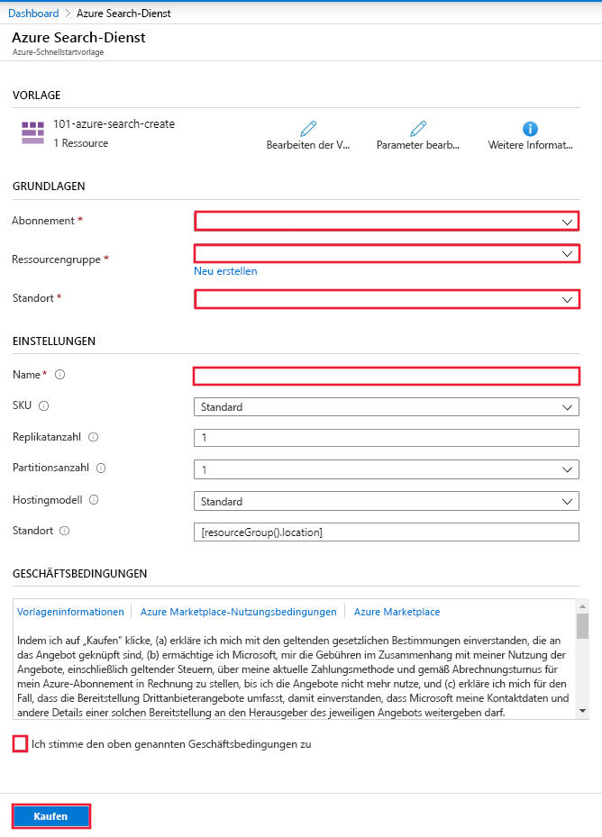

# Schnellstart: Bereitstellen von Cognitive Search mithilfe einer ARM-Vorlage

In diesem Artikel erfahren Sie Schritt für Schritt, wie Sie mithilfe einer Azure Resource Manager-Vorlage (ARM-Vorlage) eine Azure Cognitive Search-Ressource im Azure-Portal bereitstellen.

[!INCLUDE [About Azure Resource Manager](../../includes/resource-manager-quickstart-introduction.md)]

Wenn Ihre Umgebung die Voraussetzungen erfüllt und Sie mit der Verwendung von ARM-Vorlagen vertraut sind, klicken Sie auf die Schaltfläche **In Azure bereitstellen**. Die Vorlage wird im Azure-Portal geöffnet.

## Voraussetzungen

Wenn Sie kein Azure-Abonnement besitzen, können Sie ein [kostenloses Konto](https://azure.microsoft.com/free/?WT.mc_id=A261C142F) erstellen, bevor Sie beginnen.

## Überprüfen der Vorlage

Die in dieser Schnellstartanleitung verwendete Vorlage stammt von der Seite mit den [Azure-Schnellstartvorlagen](https://azure.microsoft.com/resources/templates/101-azure-search-create/).

:::code language="json" source="~/quickstart-templates/quickstarts/microsoft.search/azure-search-create/azuredeploy.json":::

In dieser Vorlage definierte Azure-Ressource:

- [Microsoft.Search/searchServices](/azure/templates/Microsoft.Search/searchServices) zum Erstellen eines Azure Cognitive Search-Diensts

## Bereitstellen der Vorlage

Klicken Sie auf das folgende Bild, um sich bei Azure anzumelden und eine Vorlage zu öffnen. Die Vorlage dient zum Erstellen einer Azure Cognitive Search-Ressource.

Im Portal wird ein Formular angezeigt, über das Sie ganz einfach Parameterwerte angeben können. Einige Parameter wurden bereits vorab mit den Standardwerten aus der Vorlage ausgefüllt. Geben Sie Ihr Abonnement, die Ressourcengruppe, den Standort und den Dienstnamen an. Wenn Sie Cognitive Services in einer [KI-Anreicherungspipeline](cognitive-search-concept-intro.md) verwenden möchten, um beispielsweise binäre Bilddateien auf Text zu analysieren, wählen Sie einen Standort aus, an dem sowohl Cognitive Search als auch Cognitive Services zur Verfügung stehen. Für KI-Anreicherungsworkloads müssen sich beide Dienste in der gleichen Region befinden. Nachdem Sie das Formular ausgefüllt haben, müssen Sie den Nutzungsbedingungen zustimmen und anschließend die Schaltfläche „Kaufen“ auswählen, um die Bereitstellung abzuschließen.

> [!div class="mx-imgBorder"]
> 

## Überprüfen der bereitgestellten Ressourcen

Nach Abschluss der Bereitstellung können Sie im Portal auf Ihre neue Ressourcengruppe und auf den neuen Suchdienst zugreifen.

## Bereinigen von Ressourcen

Andere Schnellstartanleitungen und Tutorials für Cognitive Search bauen auf dieser Schnellstartanleitung auf. Falls Sie mit weiteren Schnellstartanleitungen und Tutorials fortfahren möchten, empfiehlt es sich gegebenenfalls, diese Ressource nicht zu bereinigen. Wenn Sie die Ressourcen nicht mehr benötigen, können Sie die Ressourcengruppe löschen. Dadurch werden der Cognitive Search-Dienst und die zugehörigen Ressourcen gelöscht.

## Nächste Schritte

In dieser Schnellstartanleitung haben Sie mithilfe einer ARM-Vorlage einen Cognitive Search-Dienst erstellt und die Bereitstellung überprüft. Weitere Informationen zu Cognitive Search und Azure Resource Manager finden Sie in den folgenden Artikeln:

- Lesen Sie die [Übersicht über Azure Cognitive Search](search-what-is-azure-search.md).
- [Erstellen eines Index](search-get-started-portal.md) für Ihren Suchdienst.
- [Erstellen einer Demo-App](search-create-app-portal.md) mithilfe des Portal-Assistenten.
- [Erstellen eines Skillsets](cognitive-search-quickstart-blob.md) zum Extrahieren von Informationen aus Ihren Daten.
