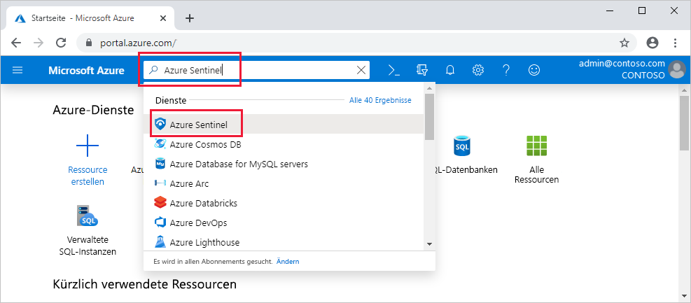

# Schnellstart: Ausführen des Onboardings für Azure Sentinel

In diesem Schnellstart erfahren Sie, wie Sie mit Azure Sentinel loslegen können. 

Wenn Sie Azure Sentinel integrieren wollen, müssen Sie Azure Sentinel zuerst aktivieren und dann eine Verbindung mit Ihren Datenquellen herstellen. Azure Sentinel enthält eine Reihe von Connectors für Microsoft-Lösungen, die vorkonfiguriert verfügbar sind und Echtzeitintegration bieten, u. a. für Microsoft 365 Defender-Lösungen (ehemals Microsoft Threat Protection), Microsoft 365-Quellen (einschließlich Office 365), Azure AD, Microsoft Defender for Identity (ehemals Azure ATP), Microsoft Cloud App Security und Azure Defender-Warnungen vom Azure Security Center. Außerdem stehen integrierte Connectors für Sicherheitslösungen von anderen Anbietern als Microsoft zur Verfügung. Sie können auch Common Event Format (CEF), Syslog oder eine REST-API verwenden, um Ihre Datenquellen mit Azure Sentinel zu verbinden. 

Nachdem Sie die Datenquellen verbunden haben, steht Ihnen ein Katalog von professionell erstellten Arbeitsmappen zur Anzeige der Erkenntnisse, die Sie aus Ihren Daten gewinnen, zur Auswahl. Diese Arbeitsmappen können einfach an Ihre Anforderungen angepasst werden.

>[!IMPORTANT] 
> Informationen zu den Gebühren im Zusammenhang mit Azure Sentinel finden Sie unter [Azure Sentinel – Preise](https://azure.microsoft.com/pricing/details/azure-sentinel/).
  

## Globale Voraussetzungen

- Aktives Azure-Abonnement: Wenn Sie über keines verfügen, können Sie ein [kostenloses Konto](https://azure.microsoft.com/free/?WT.mc_id=A261C142F) erstellen, bevor Sie beginnen.

- Log Analytics-Arbeitsbereich. Informationen zum Erstellen eines Log Analytics-Arbeitsbereichs finden Sie [hier](../log-analytics/log-analytics-quick-create-workspace.md). Weitere Informationen zu Log Analytics-Arbeitsbereichen finden Sie unter [Entwerfen Ihrer Azure Monitor-Protokollbereitstellung](../azure-monitor/platform/design-logs-deployment.md).

- Für das Abonnement, in dem sich der Azure Sentinel-Arbeitsbereich befindet, benötigen Sie Berechtigungen für Mitwirkende, um Azure Sentinel zu aktivieren. 
- Für die Ressourcengruppe, zu der der Arbeitsbereich gehört, benötigen Sie entweder Berechtigungen für Mitwirkende oder für Leser, um Azure Sentinel zu verwenden.
- Möglicherweise sind für die Verbindung mit bestimmten Datenquellen zusätzliche Berechtigungen erforderlich.
- Azure Sentinel ist ein kostenpflichtiger Dienst. Preisinformationen finden Sie in den [Informationen zu Azure Sentinel](https://go.microsoft.com/fwlink/?linkid=2104058).
 
## Aktivieren von Azure Sentinel 

1. Melden Sie sich beim Azure-Portal an. Achten Sie darauf, dass das Abonnement ausgewählt ist, in dem Azure Sentinel erstellt wird.

1. Suchen Sie nach **Azure Sentinel**, und wählen Sie diese Lösung aus.

   

1. Wählen Sie **Hinzufügen**.

1. Wählen Sie den Arbeitsbereich aus, den Sie verwenden möchten, oder erstellen Sie einen neuen. Sie können Azure Sentinel in mehr als einem Arbeitsbereich ausführen. Die Daten sind aber für einen einzelnen Arbeitsbereich isoliert.

   

   >[!NOTE] 
   > - Standardarbeitsbereiche, die vom Azure Security Center erstellt wurden, werden in der Liste nicht angezeigt. Für diese kann Azure Sentinel nicht installiert werden.
   > - Azure Sentinel kann für Arbeitsbereiche in einer beliebigen [GA-Region von Log Analytics](https://azure.microsoft.com/global-infrastructure/services/?products=monitor) mit Ausnahme der Regionen China und Deutschland (Sovereign) ausgeführt werden. Die von Azure Sentinel generierten Daten (z. B. Vorfälle, Lesezeichen und Warnungsregeln, die möglicherweise einige aus diesen Arbeitsbereichen stammende Kundendaten enthalten) werden entweder in „Europa“ (für Arbeitsbereiche in Europa), in „Australien“ (für Arbeitsbereiche in Australien) oder in „USA, Osten“ (für Arbeitsbereiche in allen anderen Regionen) gespeichert.

   >[!IMPORTANT]
   >
   > - Nach der Bereitstellung in einem Arbeitsbereich bietet Azure Sentinel **derzeit keine Unterstützung** für das Verschieben dieses Arbeitsbereichs in andere Ressourcengruppen oder Abonnements. 
   >
   >   Haben Sie den Arbeitsbereich bereits verschoben, deaktivieren Sie alle aktiven Regeln unter **Analytics**, und aktivieren Sie sie nach fünf Minuten wieder. Dieser Vorgang sollte in den meisten Fällen wirksam sein. Für die Iteration wird er jedoch nicht unterstützt und auf eigenes Risiko ausgeführt.

1. Wählen Sie **Azure Sentinel hinzufügen** aus.

## Herstellen einer Verbindung mit Datenquellen

Azure Sentinel stellt eine Verbindung zu Diensten und Apps her, indem eine Verbindung mit dem Dienst hergestellt wird, und die Ereignisse und Protokolle an Azure Sentinel weitergeleitet werden. Für Computer und virtuelle Computer können Sie den Azure Sentinel-Agenten installieren, der die Protokolle sammelt und sie an Azure Sentinel weiterleitet. Für Firewalls und Proxys verwendet Azure Sentinel einen Linux-Syslog-Server. Darauf wird der Agent installiert, und von diesem sammelt der Agent die Protokolldateien und leitet sie an Azure Sentinel weiter. 
 
1. Klicken Sie auf **Datenconnectors**.
1. Es gibt eine Kachel für jede Datenquelle, die Sie verbinden können. 
Klicken Sie z. B. auf **Azure Active Directory**. Wenn Sie diese Datenquelle verbinden, werden alle Protokolle von Azure AD an Azure Sentinel gestreamt. Sie können auswählen, welche Arten von Protokollen Sie erhalten möchten: Anmeldeprotokolle und/oder Überwachungsprotokolle.  
Unten stellt Azure Sentinel Empfehlungen zur Verfügung, welche Arbeitsmappen Sie für die einzelnen Connectors installieren sollten, damit Sie sofort interessante Einblicke aus allen Ihren Daten gewinnen können.   Führen Sie die Installationsanweisungen aus oder [lesen Sie sich den entsprechenden Verbindungsleitfaden durch](connect-data-sources.md), um weitere Informationen zu erhalten. Weite Informationen zu Datenconnectors finden Sie unter [Herstellen einer Verbindung mit Datenquellen](connect-data-sources.md).

Sobald Ihre Datenquellen verbunden wurden, beginnt das Streaming Ihrer Daten zu Azure Sentinel. Sie können dann mit der Arbeit mit Ihren Daten loslegen. Die Protokolle können Sie sich in den [integrierten Dashboards](quickstart-get-visibility.md) ansehen, und mit der Erstellung von Abfragen in Log Analytics beginnen, um [die Daten zu untersuchen](tutorial-investigate-cases.md).

## Nächste Schritte
In diesem Dokumentationsartikel haben Sie Informationen zur Verbindung von Datenquellen mit Azure Sentinel erhalten. Weitere Informationen zu Azure Sentinel finden Sie in den folgenden Artikeln:
- Erfahren Sie, wie Sie [Einblick in Ihre Daten und potenzielle Bedrohungen erhalten](quickstart-get-visibility.md).
- Beginnen Sie mit der [Erkennung von Bedrohungen mithilfe von Azure Sentinel](tutorial-detect-threats-built-in.md).
- Streamen Sie Daten aus [CEF-Appliances (Common Event Format)](connect-common-event-format.md) an Azure Sentinel.
