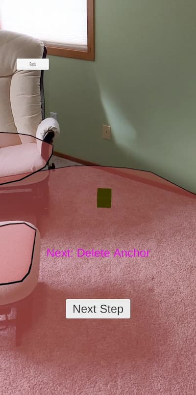

# Schnellstart: Erstellen einer Unity Android-App mit Azure Spatial Anchors

In dieser Schnellstartanleitung wird beschrieben, wie Sie mit [Azure Spatial Anchors](../overview.md) eine Unity Android-App erstellen. Azure Spatial Anchors ist ein plattformübergreifender Entwicklerdienst, mit dem Sie Mixed Reality-Umgebungen mit Objekten erstellen können, die ihre Position im Zeitverlauf geräteübergreifend beibehalten. Nach Abschluss des Vorgangs verfügen Sie über eine mit Unity erstellte ARCore-Android-App, mit der ein räumlicher Anker gespeichert und abgerufen werden kann.

Sie lernen Folgendes:

> [!div class="checklist"]
> * Erstellen eines Spatial Anchors-Kontos
> * Vorbereiten von Unity-Buildeinstellungen
> * Konfigurieren des Bezeichners und Kontoschlüssels für das Spatial Anchors-Konto
> * Exportieren des Android Studio-Projekts
> * Bereitstellen und Ausführen auf einem Android-Gerät

[!INCLUDE [quickstarts-free-trial-note](../../../includes/quickstarts-free-trial-note.md)]

## Voraussetzungen

Stellen Sie für diese Schnellstartanleitung sicher, dass Sie über Folgendes verfügen:

- Einen Windows- oder macOS-Computer mit <a href="https://unity3d.com/get-unity/download" target="_blank">Unity 2019.4 (LTS)</a>, einschließlich der **Android-Buildunterstützung** mit den Modulen **Android SDK- und NDK-Tools** sowie **OpenJDK**.
  - Unter Windows benötigen Sie auch <a href="https://git-scm.com/download/win" target="_blank">Git für Windows</a> und <a href="https://git-lfs.github.com/">Git LFS</a>.
  - Unter macOS muss Git über Homebrew installiert werden. Geben Sie den folgenden Befehl in einer einzelnen Zeile am Terminal ein: `/usr/bin/ruby -e "$(curl -fsSL https://raw.githubusercontent.com/Homebrew/install/master/install)"`. Führen Sie dann `brew install git` und `brew install git-lfs` aus.
- Ein <a href="https://developer.android.com/studio/debug/dev-options" target="_blank">für Entwickler geeignetes</a> und <a href="https://developers.google.com/ar/discover/supported-devices" target="_blank">ARCore-fähiges</a> Android-Gerät.
  - Möglicherweise sind zusätzliche Gerätetreiber erforderlich, damit Ihr Computer mit Ihrem Android-Gerät kommunizieren kann. Weitere Informationen und Anweisungen finden Sie [hier](https://developer.android.com/studio/run/device.html).

[!INCLUDE [Create Spatial Anchors resource](../../../includes/spatial-anchors-get-started-create-resource.md)]

## Herunterladen und Öffnen des Unity-Beispielprojekts

[!INCLUDE [Clone Sample Repo](../../../includes/spatial-anchors-clone-sample-repository.md)]

[!INCLUDE [Open Unity Project](../../../includes/spatial-anchors-open-unity-project.md)]

[!INCLUDE [Android Unity Build Settings](../../../includes/spatial-anchors-unity-android-build-settings.md)]

[!INCLUDE [Configure Unity Scene](../../../includes/spatial-anchors-unity-configure-scene.md)]

## Exportieren des Android Studio-Projekts

[!INCLUDE [Export Unity Project](../../../includes/spatial-anchors-unity-export-project-snip.md)]

Wählen Sie unter **Run Device** (Gerät ausführen) Ihr Gerät und dann **Build And Run** (Erstellen und ausführen) aus. Sie werden zum Speichern einer Datei vom Typ `.apk` aufgefordert und können einen beliebigen Namen dafür wählen.

Wählen Sie in der App mithilfe der Pfeile **BasicDemo** aus, und klicken Sie dann auf die Schaltfläche **Los**, um die Demo auszuführen. Befolgen Sie die Anleitung zum Anordnen und Abrufen eines Ankers.

Befolgen Sie in der App die Anleitung zum Anordnen und Abrufen eines Ankers.

## Problembehandlung

### Probleme beim Rendern

Falls beim Ausführen der App die Kamera nicht als Hintergrund angezeigt wird (sondern stattdessen beispielsweise ein leerer blauer Bereich oder eine andere Textur), müssen Sie die Ressourcen wahrscheinlich erneut in Unity importieren. Beenden Sie die App. Wählen Sie in Unity im Menü am oberen Rand die Option **Assets > Re-import all** (Ressourcen > Alle erneut importieren). Führen Sie die App dann erneut aus.

[!INCLUDE [Clean-up section](../../../includes/clean-up-section-portal.md)]

[!INCLUDE [Next steps](../../../includes/spatial-anchors-quickstarts-nextsteps.md)]

> [!div class="nextstepaction"]
> [Tutorial: Freigeben für Sitzungen und Geräte mit Azure Spatial Anchors](../tutorials/tutorial-share-anchors-across-devices.md)

> [!div class="nextstepaction"]
> [Vorgehensweise: Konfigurieren von Azure Spatial Anchors in einem Unity-Projekt](../how-tos/setup-unity-project.md)
