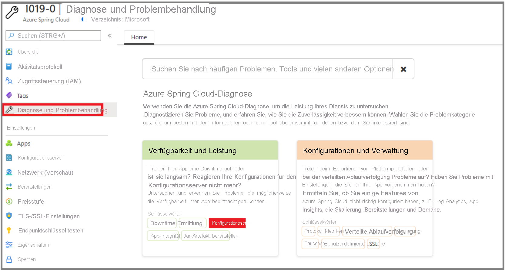
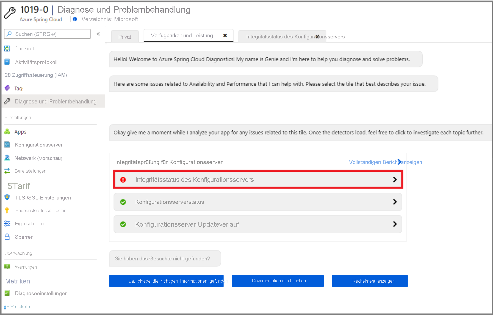

# <a name="quickstart-set-up-azure-spring-cloud-configuration-server"></a>Schnellstart: Einrichten des Azure Spring Cloud-Konfigurationsservers

Der Azure Spring Cloud-Konfigurationsserver ist ein zentralisierter Konfigurationsdienst für verteilte Systeme. Er nutzt eine austauschbare Repositoryebene, die derzeit lokalen Speicher, Git und Subversion unterstützt. In dieser Schnellstartanleitung richten Sie den Konfigurationsserver zum Abrufen von Daten aus einem Git-Repository ein.

::: zone pivot="programming-language-csharp"

## <a name="prerequisites"></a>Voraussetzungen

* Absolvieren Sie den vorherigen Schnellstart in dieser Serie: [Bereitstellen des Azure Spring Cloud-Diensts](./quickstart-provision-service-instance.md)

## <a name="azure-spring-cloud-config-server-procedures"></a>Verfahren für den Azure Spring Cloud-Konfigurationsserver

Richten Sie den Konfigurationsserver mit dem Speicherort des Git-Repositorys für das Projekt ein, indem Sie den folgenden Befehl ausführen. Ersetzen Sie `<service instance name>` durch den Namen des Diensts, den Sie zuvor erstellt haben. Der Standardwert für den Dienstinstanznamen, den Sie in der vorherigen Schnellstartanleitung festgelegt haben, funktioniert nicht mit diesem Befehl.

```azurecli
az spring-cloud config-server git set -n <service instance name> --uri https://github.com/Azure-Samples/Azure-Spring-Cloud-Samples --search-paths steeltoe-sample/config
```

Dieser Befehl weist den Konfigurationsserver an, die Konfigurationsdaten im Ordner [steeltoe-sample/config](https://github.com/Azure-Samples/Azure-Spring-Cloud-Samples/tree/master/steeltoe-sample/config) des Beispiel-App-Repositorys zu suchen. Da der Name der App, die die Konfigurationsdaten abruft, `planet-weather-provider` lautet, heißt die verwendete Datei [planet-weather-provider.yml](https://github.com/Azure-Samples/Azure-Spring-Cloud-Samples/blob/master/steeltoe-sample/config/planet-weather-provider.yml).

::: zone-end

::: zone pivot="programming-language-java"
Der Azure Spring Cloud-Konfigurationsserver ist ein zentralisierter Konfigurationsdienst für verteilte Systeme. Er nutzt eine austauschbare Repositoryebene, die derzeit lokalen Speicher, Git und Subversion unterstützt.  Richten Sie den Konfigurationsserver für die Bereitstellung von Microservice-Apps in Azure Spring Cloud ein.

## <a name="prerequisites"></a>Voraussetzungen

* [Installation von JDK 8](/java/azure/jdk/)
* [Registrierung für ein Azure-Abonnement](https://azure.microsoft.com/free/)
* (Optional) [Installation der Azure CLI, Version 2.0.67 oder höher](/cli/azure/install-azure-cli) und Installation der Azure Spring Cloud-Erweiterung mit dem Befehl `az extension add --name spring-cloud`
* (Optional) [Installation des Azure-Toolkits für IntelliJ](https://plugins.jetbrains.com/plugin/8053-azure-toolkit-for-intellij/) und [Anmeldung](/azure/developer/java/toolkit-for-intellij/create-hello-world-web-app#installation-and-sign-in)

## <a name="azure-spring-cloud-config-server-procedures"></a>Verfahren für den Azure Spring Cloud-Konfigurationsserver

#### <a name="portal"></a>[Portal](#tab/Azure-portal)

Im folgenden Verfahren wird der Konfigurationsserver mithilfe des Azure-Portals zum Bereitstellen des [PetClinic-Beispiels](https://github.com/azure-samples/spring-petclinic-microservices) eingerichtet.

1. Navigieren Sie zur Seite **Übersicht**, und wählen Sie **Konfigurationsserver** aus.

2. Geben Sie im Abschnitt **Standardrepository** für **URI** den Wert „https://github.com/azure-samples/spring-petclinic-microservices-config“ ein.

3. Klicken Sie auf **Überprüfen**.

    

4. Klicken Sie nach Abschluss der Überprüfung auf **Anwenden**, um die Änderungen zu speichern.

    

5. Die Aktualisierung der Konfiguration kann einige Minuten dauern.
 
     

6. Sie sollten eine Benachrichtigung erhalten, wenn die Konfiguration abgeschlossen ist.

#### <a name="cli"></a>[BEFEHLSZEILENSCHNITTSTELLE (CLI)](#tab/Azure-CLI)


Im folgenden Verfahren wird die Azure CLI zum Einrichten des Konfigurationsservers und zum Bereitstellen des [PetClinic-Beispiels](https://github.com/azure-samples/spring-petclinic-microservices) eingerichtet.

Führen Sie den folgenden Befehl aus, um das Standardrepository festzulegen:

```azurecli

az spring-cloud config-server git set -n <service instance name> --uri https://github.com/azure-samples/spring-petclinic-microservices-config
::: zone-end

> [!TIP]
> If you are using a private repository for config server, please refer to our [tutorial on setting up authentication](./how-to-config-server.md).

## Troubleshooting of Azure Spring Cloud config server

The following procedure explains how to troubleshoot config server settings.

1. In the Azure portal, go to the service **Overview** page and select **Logs**. 
1. Select **Queries** and **Show the application logs that contain the "error" or "exception" terms"**. 
1. Click **Run**. 
1. If you find the error **java.lang.illegalStateException** in logs, this indicates that spring cloud service cannot locate properties from config server.

    [  ](media/spring-cloud-quickstart-setup-config-server/setup-config-server-query.png)

1. Go to the service **Overview** page.
1. Select **Diagnose and solve problems**. 
1. Select **Config Server** detector.

    [  ](media/spring-cloud-quickstart-setup-config-server/setup-config-server-diagnose.png)

3. Click **Config Server Health Check**.

    [  ](media/spring-cloud-quickstart-setup-config-server/setup-config-server-genie.png)

4. Click **Config Server Status** to see more details from the detector.

    [  ](media/spring-cloud-quickstart-setup-config-server/setup-config-server-health-status.png)

## Next steps

In this quickstart, you created Azure resources that will continue to accrue charges if they remain in your subscription. If you don't intend to continue on to the next quickstart, see [Clean up resources](./quickstart-logs-metrics-tracing.md#clean-up-resources). Otherwise, advance to the next quickstart:

> [!div class="nextstepaction"]
> [Build and deploy apps](./quickstart-deploy-apps.md)
