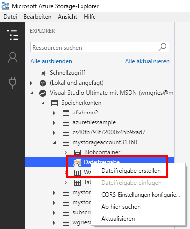
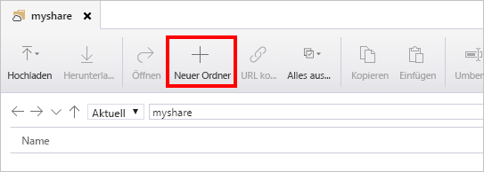

# Schnellstart: Erstellen und Verwalten von Azure-Dateifreigaben mit dem Azure Storage-Explorer
In dieser Anleitung werden Schritt für Schritt die Grundlagen der Verwendung von [Azure-Dateifreigaben](storage-files-introduction.md) mit dem Azure Storage-Explorer beschrieben. Azure-Dateifreigaben sind genau wie andere Dateifreigaben, werden jedoch in der Cloud gespeichert und von der Azure-Plattform unterstützt. Azure-Dateifreigaben unterstützen das SMB-Protokoll nach Industriestandard und ermöglichen es, Dateien für mehrere Computer, Anwendungen und Instanzen freizugeben. 

Der Azure Storage-Explorer ist ein beliebtes Clienttool, das für Windows, macOS und Linux verfügbar ist. Sie können Storage-Explorer zum Verwalten von Azure-Dateifreigaben und anderen Speicherressourcen verwenden.

Wenn Sie kein Azure-Abonnement besitzen, erstellen Sie ein [kostenloses Konto](https://azure.microsoft.com/free/?WT.mc_id=A261C142F), bevor Sie beginnen.

## Voraussetzungen
Für diese Schnellstartanleitung muss Storage-Explorer installiert sein. Sie können die Anwendung unter [Azure Storage-Explorer](https://azure.microsoft.com/features/storage-explorer/) herunterladen und dann installieren.

## Speicherkonto erstellen
Sie können Storage-Explorer nicht verwenden, um neue Ressourcen zu erstellen. Erstellen Sie das Speicherkonto für diese Demo über das [Azure-Portal](https://portal.azure.com/). 

[!INCLUDE [storage-files-create-storage-account-portal](../../../includes/storage-files-create-storage-account-portal.md)]

## Herstellen einer Verbindung von Storage-Explorer mit Azure-Ressourcen
Nach dem erstmaligen Starten von Storage-Explorer wird das Fenster **Microsoft Azure Storage-Explorer – Verbinden** angezeigt. Es gibt verschiedene Möglichkeiten, wie Sie den Storage-Explorer mit Speicherkonten verbinden können: 

- **Anmelden mit Ihrem Azure-Konto**: Sie können sich anmelden, indem Sie die Benutzeranmeldeinformationen für Ihre Organisation oder Ihr Microsoft-Konto verwenden. 
- **Herstellen einer Verbindung mit einem bestimmten Speicherkonto per Verbindungszeichenfolge oder SAS-Token**: Eine Verbindungszeichenfolge ist eine spezielle Zeichenfolge, die einen Speicherkontonamen und -schlüssel bzw. ein SAS-Token enthält. Mit dem Token greift Storage-Explorer direkt auf das Speicherkonto zu (anstelle der Anzeige aller Speicherkonten eines Azure-Kontos). Weitere Informationen zu Verbindungszeichenfolgen finden Sie unter [Konfigurieren von Azure Storage-Verbindungszeichenfolgen](../common/storage-configure-connection-string.md?toc=%2fazure%2fstorage%2ffiles%2ftoc.json).
- **Herstellen einer Verbindung mit einem bestimmten Speicherkonto über einen Speicherkontonamen und -schlüssel**: Verwenden Sie den Speicherkontonamen und -schlüssel, um für Ihr Speicherkonto eine Verbindung mit Azure-Speicher herzustellen.

Melden Sie sich für diese Schnellstartanleitung mit Ihrem Azure-Konto an. Wählen Sie **Azure-Konto hinzufügen** und dann **Anmelden**. Folgen Sie den Aufforderungen auf dem Bildschirm, um sich an Ihrem Azure-Konto anzumelden.

### Erstellen einer Dateifreigabe
Gehen Sie wie folgt vor, um Ihre erste Azure-Dateifreigabe unter dem Speicherkonto `storageacct<random number>` zu erstellen:

1. Erweitern Sie das Speicherkonto, das Sie erstellt haben.
2. Klicken Sie mit der rechten Maustaste auf **Dateifreigaben**, und wählen Sie anschließend **Dateifreigabe erstellen**.  
    

3. Geben Sie für die Dateifreigabe *myshare* ein, und drücken Sie die EINGABETASTE.

Freigabenamen dürfen nur Kleinbuchstaben, Zahlen und einzelne Bindestriche enthalten (ein Bindestrich am Anfang ist nicht zulässig). Ausführliche Informationen zur Benennung von Dateifreigaben und Dateien finden Sie unter [Benennen und Referenzieren von Freigaben, Verzeichnissen, Dateien und Metadaten](https://docs.microsoft.com/rest/api/storageservices/Naming-and-Referencing-Shares--Directories--Files--and-Metadata).

Nachdem die Dateifreigabe erstellt wurde, wird im rechten Bereich eine Registerkarte für Ihre Dateifreigabe geöffnet. 

## Verwenden Ihrer Azure-Dateifreigabe
Nachdem Sie nun eine Azure-Dateifreigabe erstellt haben, können Sie die Dateifreigabe mit SMB unter [Windows](storage-how-to-use-files-windows.md), [Linux](storage-how-to-use-files-linux.md) oder [macOS](storage-how-to-use-files-mac.md) bereitstellen. Alternativ können Sie für die Arbeit mit Ihrer Azure-Dateifreigabe auch den Azure Storage-Explorer verwenden. Die Nutzung des Azure Storage-Explorers hat gegenüber der Einbindung der Dateifreigabe per SMB den Vorteil, dass für alle Anforderungen, die per Azure Storage-Explorer gesendet werden, die Datei-REST-API verwendet wird. Sie können die Datei-REST-API zum Erstellen, Ändern und Löschen von Dateien und Verzeichnissen auf Clients verwenden, die nicht über SMB-Zugriff verfügen.

### Erstellen eines Verzeichnisses
Mit dem Hinzufügen eines Verzeichnisses wird eine hierarchische Struktur zum Verwalten Ihrer Dateifreigabe bereitgestellt. Sie können in Ihrem Verzeichnis mehrere Ebenen erstellen. Allerdings müssen Sie sicherstellen, dass übergeordnete Verzeichnisse vorhanden sind, bevor Sie Unterverzeichnisse erstellen können. Für den Pfad „myDirectory/mySubDirectory“ müssen Sie beispielsweise zuerst das Verzeichnis *myDirectory* erstellen. Erstellen Sie anschließend *mySubDirectory*. 

1. Wählen Sie auf der Registerkarte für die Dateifreigabe im obersten Menü die Schaltfläche **Neuer Ordner**. Der Bereich **Neues Verzeichnis erstellen** wird geöffnet.
    

2. Geben Sie als Name für das Verzeichnis *myDirectory* ein, und wählen Sie anschließend **OK**. 

Das Verzeichnis *myDirectory* wird auf der Registerkarte für die Dateifreigabe *myshare* aufgeführt.

### Hochladen einer Datei 
Sie können eine Datei von Ihrem lokalen Computer in das neue Verzeichnis Ihrer Dateifreigabe hochladen. Sie können einen gesamten Ordner oder eine einzelne Datei hochladen.

1. Wählen Sie im obersten Menü die Option **Hochladen**. Sie haben dann die Möglichkeit, einen Ordner oder eine Datei hochzuladen.
2. Wählen Sie **Datei hochladen** und dann eine Datei zum Hochladen von Ihrem lokalen Computer aus.
3. Geben Sie unter **Upload to a directory** (In ein Verzeichnis hochladen) den Namen *myDirectory* ein, und wählen Sie anschließend die Option **Hochladen**. 

Wenn Sie dies durchgeführt haben, wird die Datei im Bereich *myDirectory* in der Liste angezeigt.

### Herunterladen einer Datei
Klicken Sie zum Herunterladen der Kopie einer Datei Ihrer Dateifreigabe mit der rechten Maustaste auf die Datei, und wählen Sie anschließend die Option **Herunterladen**. Geben Sie an, wo Sie die Datei auf Ihrem lokalen Computer ablegen möchten, und wählen Sie anschließend **Speichern**.

Der Status des Downloads wird unten im Fenster im Bereich **Aktivitäten** angezeigt.

## Bereinigen von Ressourcen
Sie können Storage-Explorer nicht nutzen, um Ressourcen zu entfernen. Sie können das [Azure-Portal](https://portal.azure.com/) verwenden, um die Bereinigung für diese Schnellstartanleitung durchzuführen. 

[!INCLUDE [storage-files-clean-up-portal](../../../includes/storage-files-clean-up-portal.md)]

## Nächste Schritte

> [!div class="nextstepaction"]
> [Was ist Azure Files?](storage-files-introduction.md)
