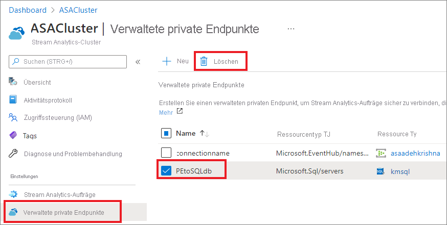

# Erstellen und Löschen verwalteter privater Endpunkte in einem Azure Stream Analytics-Cluster

Sie können Ihre Azure Stream Analytics-Aufträge in einem Cluster mit Eingabe- und Ausgaberessourcen hinter einer Firewall oder einer Azure Virtual Network-Instanz (VNET) verbinden. Erstellen Sie zunächst einen verwalteten privaten Endpunkt für eine Ressource (z. B. Azure Event Hub oder Azure SQL-Datenbank) in Ihrem Stream Analytics-Cluster. Genehmigen Sie dann die Verbindung mit einem privaten Endpunkt von Ihrer Eingabe- oder Ausgaberessource.

Nachdem Sie die Verbindung genehmigt haben, kann jeder Auftrag, der in Ihrem Stream Analytics-Cluster ausgeführt wird, über den privaten Endpunkt auf die Ressource zugreifen. In diesem Artikel wird gezeigt, wie private Endpunkte in einem Stream Analytics-Cluster erstellt und gelöscht werden. Sie können private Endpunkte für Azure SQL-Datenbank, Azure Storage, Azure Data Lake Storage Gen2, Azure Event Hub und Azure Service Bus erstellen. Private Endpunkte für andere Dienste werden in Kürze hinzugefügt. 

## Erstellen eines verwalteten privaten Endpunkts in einem Stream Analytics-Cluster

In diesem Abschnitt erfahren Sie, wie Sie einen privaten Endpunkt in einem Stream Analytics-Cluster erstellen.

1. Wählen Sie im Azure-Portal Ihren Stream Analytics-Cluster aus.

1. Wählen Sie unter **Einstellungen** die Option **Verwaltete private Endpunkte** aus.

1. Wählen Sie **Neu** aus, und geben Sie die folgenden Informationen ein, um die Ressource auszuwählen, auf die sicher über einen privaten Endpunkt zugegriffen werden soll.

   |Einstellung|Wert|
   |---|---|
   |Name|Geben Sie einen beliebigen Namen für Ihren privaten Endpunkt ein. Wenn dieser Name vergeben ist, erstellen Sie einen eindeutigen Namen.|
   |Verbindungsmethode|Wählen Sie **Hiermit wird eine Verbindung mit einer Azure-Ressource im eigenen Verzeichnis hergestellt** aus.  Sie können eine Ihrer eigenen Ressourcen auswählen, auf die sicher über den privaten Endpunkt zugegriffen werden soll, oder eine Verbindung mit der Ressource eines anderen Benutzers herstellen. In diesem Fall verwenden Sie eine Ressourcen-ID oder einen Alias, die bzw. der bereits mit Ihnen geteilt wurde.|
   |Subscription|Wählen Sie Ihr Abonnement aus.|
   |Ressourcentyp|Wählen Sie den [Ressourcentyp aus, der Ihrer Ressource zugeordnet ist](../private-link/private-endpoint-overview.md#private-link-resource).|
   |Ressource|Wählen Sie die Ressource aus, mit der eine Verbindung über den privaten Endpunkt hergestellt werden soll.|
   |Unterressource des Ziels|Der Typ der Unterressource für die oben ausgewählte Ressource, auf die Ihr privater Endpunkt zugreifen kann.|

   

1. Genehmigen Sie die Verbindung von der Zielressource. Wenn Sie im vorherigen Schritt z. B. einen privaten Endpunkt für eine Azure SQL-Datenbankinstanz erstellt haben, sollte für diese SQL-Datenbankinstanz nun eine ausstehende Verbindung angezeigt werden, die genehmigt werden muss. Es kann einige Minuten dauern, bis die Verbindungsanforderung angezeigt wird.

    

1. Sie können erneut zu Ihrem Stream Analytics-Cluster wechseln, um zu sehen, wie sich der Status innerhalb weniger Minuten von **Kundengenehmigung ausstehend** in **DNS-Einrichtung ausstehend** und **Einrichtung abgeschlossen** ändert.

## Löschen eines verwalteten privaten Endpunkts in einem Stream Analytics-Cluster

1. Wählen Sie im Azure-Portal Ihren Stream Analytics-Cluster aus.

1. Wählen Sie unter **Einstellungen** die Option **Verwaltete private Endpunkte** aus.

1. Wählen Sie den privaten Endpunkt aus, den Sie löschen möchten, und wählen Sie dann **Löschen** aus.

   

## Nächste Schritte

In diesem Artikel haben Sie erfahren, wie Sie private Endpunkte in einem Azure Stream Analytics-Cluster verwalten. Erfahren Sie nun, wie Sie Ihre Cluster skalieren und Aufträge in Ihrem Cluster ausführen:

* [Skalieren eines Azure Stream Analytics-Clusters](scale-cluster.md)
* [Verwalten von Stream Analytics-Aufträgen in einem Stream Analytics-Cluster](manage-jobs-cluster.md)
